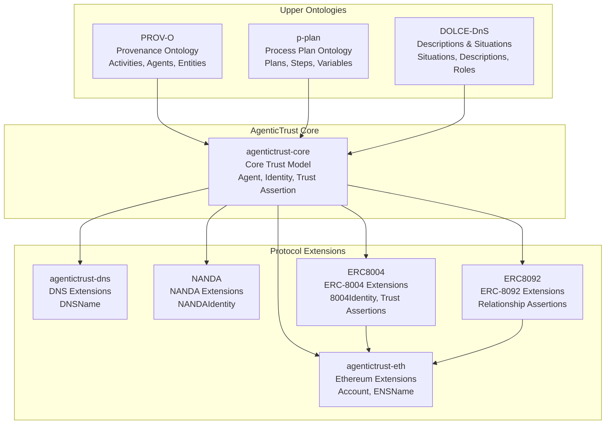

# Agentic Trust Information Architecture

## Introduction

Agentic Trust requires a robust information architecture to model, discover, and reason about AI agents, their capabilities, relationships, and trust assertions across decentralized networks. This architecture combines **ontologies** (formal knowledge models), **taxonomies** (classification systems like OASF), **categories** (domain-specific groupings), and **knowledge bases** (structured data repositories) into a cohesive system.

### Why Ontology Matters for Agentic Trust

Ontologies provide the **formal semantic foundation** for agentic trust by:

1. **Enabling Semantic Interoperability**: Different systems can understand and exchange agent metadata using shared vocabulary and relationships
2. **Supporting Automated Reasoning**: OWL/RDFS axioms allow reasoners to infer relationships, validate constraints, and discover implicit connections
3. **Providing Conceptual Clarity**: Explicit modeling of concepts (Agent, Identity, Trust Assertion, Situation) clarifies what we mean and how things relate
4. **Enabling Trust Verification**: Formal models allow verification of trust claims, validation of relationships, and detection of inconsistencies
5. **Facilitating Discovery**: Structured knowledge enables sophisticated queries to find agents by capabilities, relationships, or trust characteristics

### Information Architecture Components

The Agentic Trust information architecture integrates four complementary layers:

#### 1. **Ontology** (Formal Knowledge Model)
- **Purpose**: Defines classes, properties, and logical relationships with formal semantics
- **Technology**: OWL 2, RDFS, SPARQL
- **Example**: `agentictrust:TrustAssertion` is a class with properties `assertsRelationship`, `aboutSubject`, `generatedAssertion`
- **Characteristics**: Machine-interpretable, supports reasoning, enables inference

#### 2. **Taxonomy** (Classification System)
- **Purpose**: Hierarchical classification of concepts for organization and discovery
- **Technology**: OASF (Open Agentic Schema Framework) domains and skills
- **Example**: OASF skills taxonomy (`validation_attestation`, `reputation_feedback`) organized by domains (`finance`, `healthcare`)
- **Characteristics**: Human-readable, standardized, supports filtering and categorization

#### 3. **Categories** (Domain-Specific Groupings)
- **Purpose**: Flexible, context-dependent groupings for discovery and organization
- **Technology**: Tags, labels, metadata fields
- **Example**: Agent categories (`personal-assistant`, `trading-bot`), trust model categories (`feedback`, `validation`)
- **Characteristics**: Extensible, user-defined, supports ad-hoc organization

#### 4. **Knowledge Base** (Structured Data Repository)
- **Purpose**: Stores concrete instances and facts derived from on-chain events, agent cards, and protocol interactions
- **Technology**: RDF triplestore, SQL database, graph database
- **Example**: RDF data in `agents.ttl` containing actual agent instances, relationships, and trust assertions
- **Characteristics**: Instance-level data, queryable, supports real-world facts

### How They Fit Together

```
┌─────────────────────────────────────────────────────────────┐
│                    Knowledge Base                           │
│  (Concrete instances: agents, relationships, assertions)      │
│  Example: agents.ttl RDF data                               │
└─────────────────────────────────────────────────────────────┘
                            ↑
                            │ populated by
                            │
┌─────────────────────────────────────────────────────────────┐
│                    Ontology                                 │
│  (Formal model: classes, properties, axioms)                │
│  Example: agentictrust-core.owl                            │
└─────────────────────────────────────────────────────────────┘
                            ↑
                            │ organizes
                            │
┌─────────────────────────────────────────────────────────────┐
│                    Taxonomy (OASF)                          │
│  (Standardized classification: domains, skills)               │
│  Example: OASF skills taxonomy                              │
└─────────────────────────────────────────────────────────────┘
                            ↑
                            │ categorized by
                            │
┌─────────────────────────────────────────────────────────────┐
│                    Categories                               │
│  (Flexible groupings: tags, labels, metadata)               │
│  Example: agent categories, trust model types              │
└─────────────────────────────────────────────────────────────┘
```

**Integration Flow**:
1. **Ontology** defines the formal structure (what is an Agent? what is a Trust Assertion?)
2. **Taxonomy** (OASF) provides standardized classification (which skills exist? which domains?)
3. **Categories** add flexible organization (how do users want to group things?)
4. **Knowledge Base** stores concrete instances following the ontology, using taxonomy classifications, and organized by categories

## Ontology Hierarchy

The AgenticTrust ontology is built on foundational upper ontologies that provide proven patterns for modeling agents, activities, situations, and social constructs:



### Upper Ontologies

#### PROV-O (Provenance Ontology)
- **Purpose**: Models what happened—completed activities, their outcomes, and attribution
- **Key Concepts**: `prov:Agent`, `prov:Activity`, `prov:Entity`, `prov:wasGeneratedBy`, `prov:wasAttributedTo`
- **Use in AgenticTrust**: Grounds agent activities, trust assertion generation, and relationship provenance

#### p-plan (Process Plan Ontology)
- **Purpose**: Models plans, steps, and variables in multi-agent workflows
- **Key Concepts**: `p-plan:Plan`, `p-plan:Step`, `p-plan:Variable`, `p-plan:Role`
- **Use in AgenticTrust**: Models relationship participants, roles, and qualified participation

#### DOLCE-DnS (Descriptions & Situations)
- **Purpose**: Models what is happening—ongoing situations, roles, intentions, and conceptual frames
- **Key Concepts**: `dolce:Situation`, `dolce:Description`, roles, goals, plans, intentions
- **Use in AgenticTrust**: Models trust situations, intent types, and social constructs

### Why DOLCE-DnS is Critical for Agentic Trust

DOLCE-DnS introduces **epistemic constructs**—knowledge, belief, and the justification of truth—that are essential for modeling trust in multi-agent systems.

#### Epistemic vs. Ontic Distinction

**"Epistemic"** refers to knowledge, belief, and the justification of truth—not the thing itself, but what is known, claimed, inferred, or judged about the thing at a given moment.

This leads to a core distinction:

- **PROV-O** is concerned with capturing **what happened**—completed activities, their outcomes, and their attribution
- **DOLCE-DnS** is concerned with **what is happening**—ongoing situations, roles, intentions, and the conceptual frames through which those situations are understood

#### DOLCE-DnS Social Constructs

DOLCE-DnS introduces constructs essential for agentic trust:

1. **Situations** – Configurations of entities at a moment in time
   - Example: A `VerificationSituation` where an agent is being validated
   - Captures the ongoing state, not just the completed activity

2. **Descriptions** – Conceptual or normative frames applied to situations
   - Example: An `IntentType` that describes what kind of intent a situation satisfies
   - Provides the conceptual lens through which situations are understood

3. **Roles** – Context-dependent modes of participation
   - Example: A `Role` in a `Relationship` (initiator, approver, validator)
   - Captures how agents participate in social constructs

4. **Goals, Plans, and Intentions** – Future-oriented constructs
   - Example: An `IntentType` that targets a `Skill` and is satisfied by a `Situation`
   - Models what agents intend to do, not just what they did

#### Agent-Situation Relationship

The **Agent-Situation** relationship is fundamental to trust modeling:

- Agents participate in **Situations** (trust situations, verification situations, relationship situations)
- Situations are understood through **Descriptions** (intent types, trust models, relationship types)
- Agents play **Roles** in situations (validator, subject, initiator, approver)
- Situations satisfy **Intentions** (what the agent intended to achieve)

This allows modeling:
- **Ongoing trust processes** (not just completed transactions)
- **Context-dependent trust** (trust in a specific situation, role, or relationship)
- **Intent-driven trust** (trust based on what agents intend to do, not just what they did)
- **Social constructs** (relationships, roles, participation patterns)

## AgenticTrust Ontology Overview

The AgenticTrust ontology provides a comprehensive model for:

- **Agents**: AI agents, software agents, accounts, and their relationships
- **Identity**: Multiple identity layers (Identity, Identifier, Name) with protocol-specific realizations
- **Trust Assertions**: Verification, reputation, and relationship assertions
- **Discovery**: Skills, domains, intents, and capabilities
- **Provenance**: Activity tracking and attribution
- **Situations**: Ongoing trust situations and their satisfaction of intents

## Documentation Structure

### Visual Diagrams

Generated ontology-wide diagrams live in [`./images/`](./images/README.md):

- AgenticTrust core: `./images/agentictrust.png` (also `agentictrust.svg`)
- ERC8004: `./images/ERC8004.png` (also `ERC8004.svg`)
- ERC8092: `./images/ERC8092.png` (also `ERC8092.svg`)

### Core Documentation

AgenticTrust core (`agentictrust-core.owl`)

- [`agentictrust-overview.md`](./agentictrust-overview.md): navigation + full diagram
- [`agent.md`](./agent.md): Agent class hierarchy (Person, Organization, SoftwareAgent, AIAgent, Account) and relationships to Identity, Identifier, Name, and Descriptors
- [`description.md`](./description.md): TrustDescription + metadata (DnS "Description")
- [`situation.md`](./situation.md): TrustSituation + activities (DnS "Situation")
- [`provenance.md`](./provenance.md): PROV-O grounding + how we use provenance patterns
- [`discovery.md`](./discovery.md): Skills, intents, tasks, execution traces, and OASF alignment (merged from skills.md, skills-intents-tasks.md, and oasf.md)
- [`intent.md`](./intent.md): IntentType and IntentSituation model - wraps OASF skills, aligned with DOLCE-DnS, explains why skills are invoked
- [`trust-graph.md`](./trust-graph.md): trust building overlay + mapping to ERC-8004/8092 registries

### Protocol-Specific Documentation

ERC ontologies

- [`erc8004.md`](./erc8004.md): ERC-8004 registration metadata + validation + feedback (with diagram)
- [`erc8092.md`](./erc8092.md): ERC-8092 relationships/assertions/accounts (with diagram)
- [`relationshipassertion.md`](./relationshipassertion.md): focused pattern: relationship assertion → account → controlling agent
- [`relationships-roles-participation.md`](./relationships-roles-participation.md): relationship model with participants, roles, and qualified participation (core, eth, and ERC-8092 levels)
- [`verificationassertion.md`](./verificationassertion.md): VerificationAssertion class hierarchy and property relationships
- [`reputationassertion.md`](./reputationassertion.md): ReputationAssertion class hierarchy and property relationships
- [`identifiers.md`](./identifiers.md): Complete agent identity model: Agent relationships to identifiers (Account, ENSName, 8004Identity), DIDs, and Descriptors
- [`sparql-queries.md`](./sparql-queries.md): SPARQL queries for querying agents and related data

## Ontology Source Files

Ontology sources live in `apps/badge-admin/public/ontology/`:

- `agentictrust-core.owl`: Core trust model (DnS + PROV-O + P-PLAN) + common agent/intent/task/skill vocabulary
- `agentictrust-eth.owl`: Ethereum-specific extensions (Account, ENSName)
- `agentictrust-dns.owl`: DNS-specific extensions (DNSName)
- `NANDA.owl`: NANDA-specific extensions (NANDAIdentity)
- `ERC8004.owl`: ERC-8004 registration + validation + feedback layers
- `ERC8092.owl`: ERC-8092 relationship assertions layer

## Protégé Note

If Protégé can't resolve imports offline, use the XML catalog:

- `apps/badge-admin/public/ontology/catalog-v001.xml`
