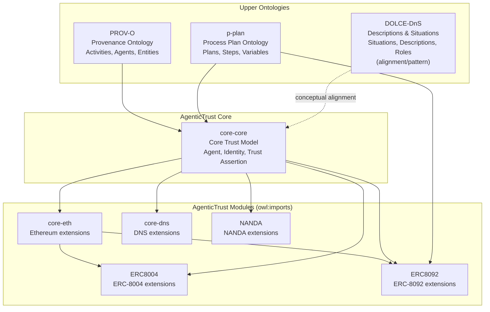

# Agentic Trust Information Architecture

## Quick Navigation

- **[Ontology Overview](./agentictrust-overview.md)**: Design patterns, core classes, and key relationships
- **[Philosophy](./philosophy.md)**: Modeling principles and alignment with ERC-8004/8092, DnS, PROV-O, p-plan, DIDs, OASF
- **[Sync analytics jobs (GraphDB)](./sync-analytics-jobs.md)**: What `sync:assertion-summaries`, `sync:trust-index`, and `sync:trust-ledger` write to the KB and how GraphQL reads it
- **[ERC-8004 event-driven sync](./erc8004-event-driven-sync.md)**: Near real-time watcher (`sync:erc8004-events`) and how it composes targeted sync steps
- **[Trust scoring + ranking strategy](./trust-scoring-ranking-strategy.md)**: How Trust Ledger (badges/points) and ATI (trust index) combine to drive `bestRank` in GraphQL
- **[Use Cases](#use-cases)**: Concrete end-to-end examples (intent → plan → tasks → skills → actions)
- **[Documentation Index](#documentation-structure)**: Complete list of documentation files
- **[Ontology Source Files](#ontology-source-files)**: Location of TTL files

## Introduction

Agentic Trust requires a robust information architecture to model, discover, and reason about AI agents, their capabilities, relationships, and trust assertions across decentralized networks. This architecture combines **ontologies** (formal knowledge models), **taxonomies** (classification systems like OASF), **categories** (domain-specific groupings), and **knowledge bases** (structured data repositories) into a cohesive system.

**Key Concepts**:
- **Agents**: AI agents, software agents, accounts, and their relationships
- **Identity**: Multiple identity layers (Identity, Identifier, Name) with protocol-specific realizations
- **Trust Assertions**: Verification, reputation, and relationship assertions
- **Situations**: Ongoing trust situations and their satisfaction of intents (DOLCE-DnS pattern)
- **Discovery**: Skills, domains, intents, and capabilities (OASF alignment)

See also: [`philosophy.md`](./philosophy.md) (modeling principles and how we align ERC-8004/8092, DnS, PROV-O, p-plan, DIDs, OASF, and discovery).

### Why Ontology Matters for Agentic Trust

Ontologies provide the **formal semantic foundation** for agentic trust by:

1. **Enabling Semantic Interoperability**: Different systems can understand and exchange agent metadata using shared vocabulary and relationships
2. **Supporting Automated Reasoning**: OWL/RDFS axioms allow reasoners to infer relationships, validate constraints, and discover implicit connections
3. **Providing Conceptual Clarity**: Explicit modeling of concepts (Agent, Identity, Trust Assertion, Situation) clarifies what we mean and how things relate
4. **Enabling Trust Verification**: Formal models allow verification of trust claims, validation of relationships, and detection of inconsistencies
5. **Facilitating Discovery**: Structured knowledge enables sophisticated queries to find agents by capabilities, relationships, or trust characteristics

### Information Architecture Components

The Agentic Trust information architecture integrates four complementary layers:

#### 1. **Ontology** (Formal Knowledge Model)
- **Purpose**: Defines classes, properties, and logical relationships with formal semantics
- **Technology**: OWL 2, RDFS, SPARQL
- **Example**: `core:TrustAssertion` is a class with properties `assertsRelationship`, `aboutSubject`, `generatedSituation`
- **Characteristics**: Machine-interpretable, supports reasoning, enables inference

#### 2. **Taxonomy** (Classification System)
- **Purpose**: Hierarchical classification of concepts for organization and discovery
- **Technology**: OASF (Open Agentic Schema Framework) domains and skills
- **Example**: OASF skills taxonomy (`validation_attestation`, `reputation_feedback`) organized by domains (`finance`, `healthcare`)
- **Characteristics**: Human-readable, standardized, supports filtering and categorization

#### 3. **Categories** (Domain-Specific Groupings)
- **Purpose**: Flexible, context-dependent groupings for discovery and organization
- **Technology**: Tags, labels, metadata fields
- **Example**: Agent categories (`personal-assistant`, `trading-bot`), trust model categories (`execution-integrity`, `reputation`, `crypto-economic`, ...)
- **Characteristics**: Extensible, user-defined, supports ad-hoc organization

#### 4. **Knowledge Base** (Structured Data Repository)
- **Purpose**: Stores concrete instances and facts derived from on-chain events, agent cards, and protocol interactions
- **Technology**: RDF triplestore, SQL database, graph database
- **Example**: RDF data in `agents.ttl` containing actual agent instances, relationships, and trust assertions
- **Characteristics**: Instance-level data, queryable, supports real-world facts

### How They Fit Together

```
┌─────────────────────────────────────────────────────────────┐
│                    Ontology (schema)                        │
│  (Formal semantics: classes, properties, axioms)             │
│  Example: apps/ontology/ontology/core.ttl                              │
└─────────────────────────────────────────────────────────────┘
                            ↓ defines meaning for
┌─────────────────────────────────────────────────────────────┐
│          Vocabularies / Knowledge Artifacts (data)           │
│  - Taxonomies (e.g., OASF domains + skills)                  │
│  - Categories (tags/labels; may be controlled vocab)         │
│  - KB-style curated concept sets (optional)                  │
└─────────────────────────────────────────────────────────────┘
                            ↓ used to annotate / classify
┌─────────────────────────────────────────────────────────────┐
│                    Knowledge Base (instances)                │
│  (Concrete facts: agents, identities, situations, assertions)│
│  Example: agents.ttl RDF data                                │
└─────────────────────────────────────────────────────────────┘
```

**Integration Flow**:
- **Ontology**: the most abstract layer; defines *what exists* and *how it relates* (e.g., Agent ↔ Situation ↔ Assertion).
- **Taxonomies / categories / KB-like concept sets**: *knowledge artifacts* (data) that you can reference from instance data for classification and discovery (e.g., OASF Skill/Domain, trust-model labels, UI categories).
- **Knowledge base**: concrete instances that conform to the ontology and can be annotated using those vocabularies (e.g., `agents.ttl` + SQL tables).

### Identifiers and DIDs

- **Identifier** (`core:Identifier` / `core:UniversalIdentifier`): the stable *identity anchor* you use in graphs and assertions (e.g., account identifier, ERC-8004 identifier, ENS name identifier).
- **DID** (`core:DID`): a particular identifier format with an associated **DID method** (`did:...`) and resolution rules. DIDs are useful because different registries/ecosystems can standardize on different methods while still mapping into a shared ontology model.

Examples of DID anchoring by ecosystem/registry:
- **Ethereum accounts**: commonly anchored in `did:ethr` (stored as `core:protocolIdentifier` on an `eth:AccountIdentifier`).
- **ERC-8004 identities**: anchored in `did:8004:<chainId>:<id>` (stored as `core:protocolIdentifier` on an `erc8004:IdentityIdentifier8004` and linked from the ERC‑8004 identity via `core:hasIdentifier`).
- **DNS / web-based identities**: commonly anchored in `did:web` (and other web/DNS-adjacent DID methods), aligning with name resolution and web PKI.

Key idea: **Identifier** is the abstract model; **DID** is one concrete identifier family whose methods let you align different agent registries with different resolution/verification assumptions, without changing the core trust graph semantics.

## Use Cases

- **[Screen Writers Guild (WGA) membership](./use-cases/screen-writers-guild.md)**: regulated outcome modeled as intent → plan → tasks → skills → actions
- **[Validator agent joins validation collection](./use-cases/validator-joins-validation-collection.md)**: a validator agent applies to join a curated validator collection
- **[Request a validator (name/account/app)](./use-cases/request-validator.md)**: a client agent requests a validator agent to validate identity claims

## Ontology Hierarchy

The AgenticTrust ontologies are layered, and the actual module dependencies are captured by `owl:imports`. Conceptually we also align with DOLCE-DnS (Descriptions & Situations) as a modeling *pattern* (not necessarily a hard import dependency).



### Upper Ontologies

#### PROV-O (Provenance Ontology)
- **Purpose**: Models what happened—completed activities, their outcomes, and attribution
- **Key Concepts**: `prov:Agent`, `prov:Activity`, `prov:Entity`, `prov:wasGeneratedBy`, `prov:wasAttributedTo`
- **Use in AgenticTrust**: Grounds agent activities, trust assertion generation, and relationship provenance

#### p-plan (Process Plan Ontology)
- **Purpose**: Models plans, steps, and variables in multi-agent workflows
- **Key Concepts**: `p-plan:Plan`, `p-plan:Step`, `p-plan:Variable`, `p-plan:Role`
- **Use in AgenticTrust**: Models relationship participants, roles, and qualified participation

#### DOLCE-DnS (Descriptions & Situations)
- **Purpose**: Models what is happening—ongoing situations, roles, intentions, and conceptual frames
- **Key Concepts**: `dolce:Situation`, `dolce:Description`, roles, goals, plans, intentions
- **Use in AgenticTrust**: Models trust situations, intent types, and social constructs

### Why DOLCE-DnS is Critical for Agentic Trust

DOLCE-DnS introduces **epistemic constructs**—knowledge, belief, and the justification of truth—that are essential for modeling trust in multi-agent systems.

#### Epistemic vs. Ontic Distinction

**"Epistemic"** refers to knowledge, belief, and the justification of truth—not the thing itself, but what is known, claimed, inferred, or judged about the thing at a given moment.

This leads to a core distinction:

- **PROV-O** is concerned with capturing **what happened**—completed activities, their outcomes, and their attribution
- **DOLCE-DnS** is concerned with **what is happening**—ongoing situations, roles, intentions, and the conceptual frames through which those situations are understood

#### DOLCE-DnS Social Constructs

DOLCE-DnS introduces constructs essential for agentic trust:

1. **Situations** – Configurations of entities at a moment in time
   - Example: A `VerificationTrustSituation` where an agent is being validated
   - Captures the ongoing state, not just the completed activity

2. **Descriptions** – Conceptual or normative frames applied to situations
   - Example: An `IntentType` that describes what kind of intent a situation satisfies
   - Provides the conceptual lens through which situations are understood

3. **Roles** – Context-dependent modes of participation
   - Example: A `Role` in a `Relationship` (initiator, approver, validator)
   - Captures how agents participate in social constructs

4. **Goals, Plans, and Intentions** – Future-oriented constructs
   - Example: An `IntentType` that targets a `Skill` and is satisfied by a `Situation`
   - Models what agents intend to do, not just what they did

#### Agent-Situation Relationship

The **Agent-Situation** relationship is fundamental to trust modeling:

- Agents participate in **Situations** (trust situations, verification situations, relationship situations)
- Situations are understood through **Descriptions** (intent types, trust models, relationship types)
- Agents play **Roles** in situations (validator, subject, initiator, approver)
- Situations satisfy **Intentions** (what the agent intended to achieve)

This allows modeling:
- **Ongoing trust processes** (not just completed transactions)
- **Context-dependent trust** (trust in a specific situation, role, or relationship)
- **Intent-driven trust** (trust based on what agents intend to do, not just what they did)
- **Social constructs** (relationships, roles, participation patterns)

## AgenticTrust Ontology Overview

> **Detailed Overview**: See [`agentictrust-overview.md`](./agentictrust-overview.md) for design patterns, class diagrams, and core relationships.

The AgenticTrust ontology provides a comprehensive model for:

- **Agents**: AI agents, software agents, accounts, and their relationships
- **Identity**: Multiple identity layers (Identity, Identifier, Name) with protocol-specific realizations
- **Trust Assertions**: Verification, reputation, and relationship assertions
- **Discovery**: Skills, domains, intents, and capabilities
- **Provenance**: Activity tracking and attribution
- **Situations**: Ongoing trust situations and their satisfaction of intents

## Documentation Structure

### Visual Diagrams

Generated ontology-wide diagrams live in [`./images/`](./images/README.md):

- AgenticTrust core: `./images/agentictrust.png` (also `agentictrust.svg`)
- ERC8004: `./images/ERC8004.png` (also `ERC8004.svg`)
- ERC8092: `./images/ERC8092.png` (also `ERC8092.svg`)

### Core Documentation

AgenticTrust core (`apps/ontology/ontology/core.ttl`)

- [`agentictrust-overview.md`](./agentictrust-overview.md): navigation + full diagram
- [`agent.md`](./agent.md): Agent class hierarchy (Person, Organization, SoftwareAgent, AIAgent, Account) and relationships to Identity, Identifier, Name, and Descriptors
- [`agent-identity.md`](./agent-identity.md): Agent vs AgentIdentity (registry-scoped) vs Identifier (the thing vs the reference)
- [`descriptor.md`](./descriptor.md): Descriptor pattern and metadata assembly
- [`attested-assertion.md`](./attested-assertion.md): Assertion vs Attestation (PROV-O) and AttestedAssertion pattern + SPARQL
- [`oidc-a.md`](./oidc-a.md): OpenID Connect for Agents (OIDC-A) vocabulary mapping and suggestions for AgenticTrust alignment
- [`agent-application.md`](./agent-application.md): Agent (discoverable) vs AgentDeployment (executor), Provider responsibility, model/version, protocol endpoints
- [`amazon-agentcore.md`](./amazon-agentcore.md): Amazon Bedrock AgentCore mapping (endpoint-centric agent application platform) to AgenticTrust (identity, semantic tool selection, intent/task context, inbound/outbound auth)
- [`agent-orchestration.md`](./agent-orchestration.md): Agent orchestration: semantic tool discovery + execution gateways; intent → task → action mapping across many registries and tool universes
- [`agent-registry.md`](./agent-registry.md): AgentRegistry (registries are plural and market/vertical-shaped) and how registries relate to agents, identities, and portfolios
- [`agent-portfolio.md`](./agent-portfolio.md): AgentPortfolio (fleet/portfolio of specialized agents), governance + orchestration, and why registries must not be singleton
- [`google-agentspace.md`](./google-agentspace.md): Portfolio of specialized agents; govern and orchestrate a fleet of agents (mapped to AgenticTrust patterns)
- [`cheqd-trustgraph.md`](./cheqd-trustgraph.md): cheqd Trust Graph (Trust Registry → Trust Graph) mapping to AgenticTrust (identity, permissions/delegation, reputation)
- [`delegation.md`](./delegation.md): Delegation as a TrustSituation (permissions, caveats) and how it is asserted as trust evidence
- [`attested-delegation-assertion.md`](./attested-delegation-assertion.md): Attested delegation assertions + authorization provenance (reputation/verification authorized by delegation)
- [`protocols-endpoints.md`](./protocols-endpoints.md): Protocol endpoints (A2A, MCP) and why skills/domains are primarily protocol-defined
- [`description.md`](./description.md): Plans (PROV-O + P-PLAN) and SituationDescription / TrustDescription
- [`situation.md`](./situation.md): TrustSituation + activities (DnS "Situation")
- [`provenance.md`](./provenance.md): PROV-O grounding + how we use provenance patterns
- [`discovery.md`](./discovery.md): Skills, intents, tasks, execution traces, and OASF alignment (merged from skills.md, skills-intents-tasks.md, and oasf.md)
- [`intent.md`](./intent.md): IntentType and IntentSituation model - wraps OASF skills, aligned with DOLCE-DnS, explains why skills are invoked
- Trust building overlay: see the **Trust graph overlay** section in [`situation.md`](./situation.md)
- Trust graph overview (PROV grounding): see [`trust-graph.md`](./trust-graph.md)

### Protocol-Specific Documentation

ERC ontologies

- [`erc8004.md`](./erc8004.md): ERC-8004 registration metadata + validation + feedback (with diagram)
- [`erc8004-feedback.md`](./erc8004-feedback.md): KB query patterns (GraphQL + SPARQL) + ontology mapping for ERC-8004 feedback
- [`erc8004-validation.md`](./erc8004-validation.md): KB query patterns (GraphQL + SPARQL) + ontology mapping for ERC-8004 validation responses
- [`erc8092.md`](./erc8092.md): ERC-8092 relationships/assertions/accounts (with diagram)
- [`hol.md`](./hol.md): HOL ontology (`apps/ontology/ontology/hol.ttl`) documentation (AgentIdentityHOL, IdentityDescriptorHOL, AgentProfileHOL)
- [`relationshipassertion.md`](./relationshipassertion.md): focused pattern: relationship assertion → account → controlling agent
- [`relationships-roles-participation.md`](./relationships-roles-participation.md): relationship model with participants, roles, and qualified participation (core, eth, and ERC-8092 levels)
- [`verificationassertion.md`](./verificationassertion.md): VerificationAssertion class hierarchy and property relationships
- [`reputationassertion.md`](./reputationassertion.md): ReputationAssertion class hierarchy and property relationships
- [`identifiers.md`](./identifiers.md): Complete agent identity model: Agent relationships to identifiers (Account, NameENS, Identity8004), DIDs, and Descriptors
- [`sparql-queries.md`](./sparql-queries.md): SPARQL queries for querying agents and related data

## Ontology Source Files

Ontology sources live in `apps/ontology/ontology/` (Turtle; composed via `owl:imports`):

- `core.ttl`: upper ontology (cross-domain primitives)
- `trust.ttl`: trust model (situations, assertions, delegation, relationships)
- `identifier.ttl`: identifiers + DID/VC primitives + routing metadata
- `identity.ttl`: identities + registries + names
- `descriptors.ttl`: descriptor model (agent/identity/protocol metadata)
- `discovery.ttl`: intent/task taxonomy + intent→task→skill mappings
- `eth.ttl`, `erc8004.ttl`, `nanda.ttl`, `dns.ttl`, `erc8092.ttl`, `hol.ttl`: derived protocol/registry modules
- `oasf.ttl`: OASF ontology (skills/domains classes + properties)

## Protégé Note

If Protégé can't resolve imports offline, open the `.ttl` files directly (imports resolve best when the base IRIs are reachable).
