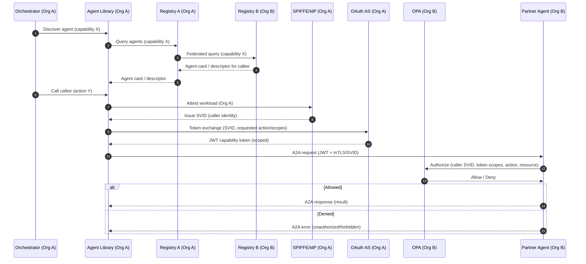

# Agent-to-Agent Authentication Flow (Registry + Zero-Trust)

This document captures a **registry-mediated, zero-trust A2A** authentication flow and how to represent it in the AgenticTrust ontology patterns (DnS/Situations + PROV + planning).

Key ingredients in the flow:

- **Federated discovery** across trusted registries (directory + federation)
- **Workload identity** (e.g., SPIFFE SVIDs) to bind runtime identity to a cryptographic principal
- **Capability-scoped tokens** (JWTs) to authorize a specific agent-to-agent action
- **Policy enforcement** (OPA) to decide allow/deny at call time

## Flow overview

Actors:

- **Caller**: an orchestrator + local agent runtime (Org A)
- **Registry A**: the caller’s trusted registry (can federate)
- **Registry B**: partner registry (Org B)
- **Callee**: partner agent (Org B)
- **Identity plane**: SPIFFE / SVID issuance and verification
- **Policy plane**: OPA policy engine for authorization decisions

### Sequence (conceptual)

## Ontology mapping (AgenticTrust patterns)

### Discovery is a Situation + provenance

- **DiscoverySituation** (a specialization of `core:TrustSituation`)
  - is a `prov:Activity` that **uses** registry artifacts and **generates** a Descriptor
- Registry artifacts (agent cards, registry records) are `prov:Entity`
- The resolved “best current view” is a `core:Descriptor` (often `AgentDescriptor`)

### Authentication and authorization are Epistemic + Role/Situation constructs

Treat the following as *situations about claims* (epistemic), not permanent facts:

- “Caller is workload X” (SVID identity claim)
- “Caller has capability token with scopes S” (JWT claim)
- “Policy allows action Y for caller→callee now” (policy evaluation claim)

These map naturally to:

- **VerificationTrustSituation** (identity proof verified)
- **RelationshipSituation** (caller/callee in a permitted interaction relationship)
- **AuthorizationSituation** (policy evaluation resulting in allow/deny)

### Token and policy artifacts are first-class entities

Model artifacts as `prov:Entity`:

- SVID / SPIFFE identity document (or its key material reference)
- Capability-scoped JWT (token)
- Policy bundle (OPA policy) and decision trace (optional)

And the evaluations as `prov:Activity` generating those artifacts or decisions.

### Practical minimum mapping

If you want a minimal, workable semantic footprint:

- **Agent card** → `core:AgentDescriptor` (plus provenance)
- **SVID** → Identifier/credential artifact (`prov:Entity`)
- **JWT capability token** → credential artifact (`prov:Entity`) with datatype props (audience, scopes, expiry)
- **OPA decision** → `core:TrustAssertion` (time-scoped) linked to the call situation

## Why this matters

This flow is “relationship-first”:

- Discovery yields *who to call* (descriptor)
- Authentication yields *who is calling* (identity claim)
- Authorization yields *is this relationship permitted for this action* (policy + scopes)

It is a good fit for AgenticTrust because:

- The model distinguishes **facts** from **claims**.
- It represents trust as **situations** with evidence and provenance.

