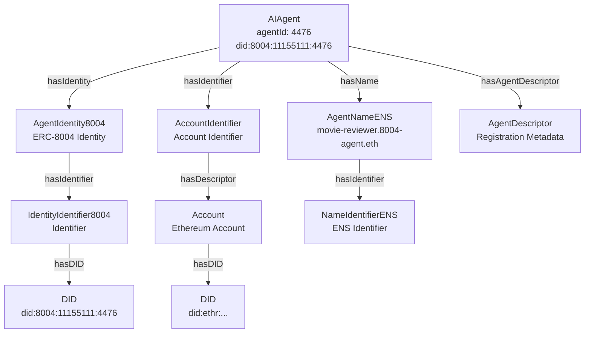
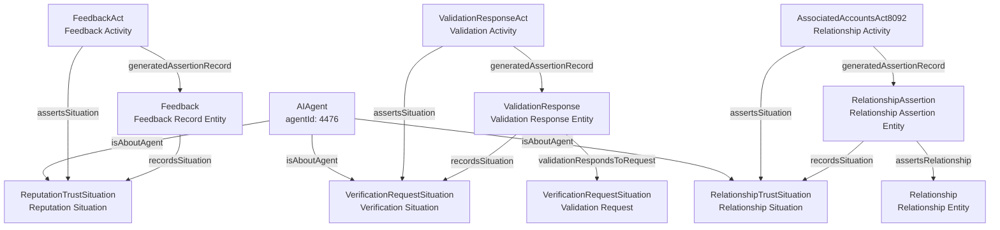
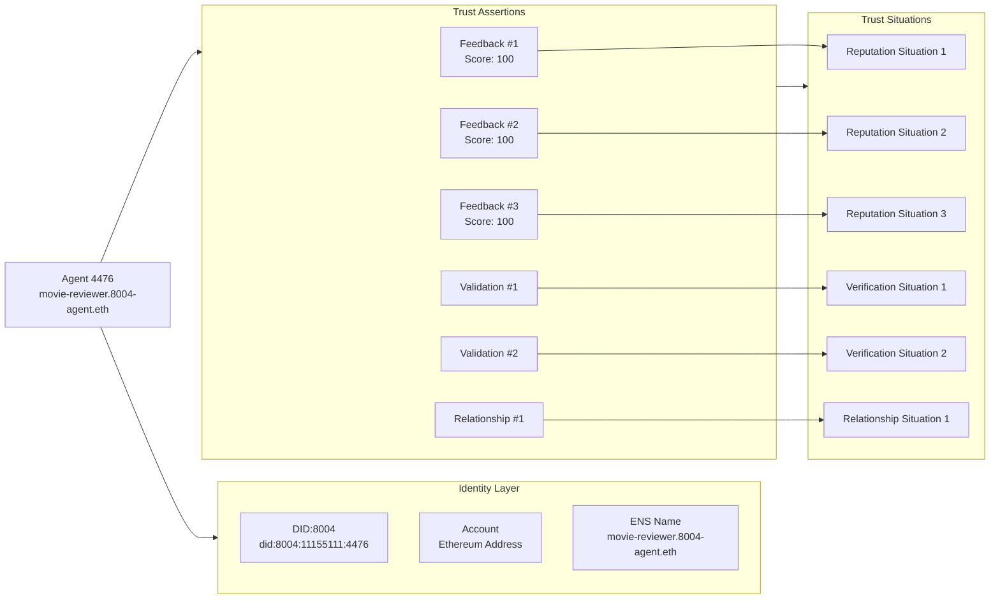

# Agent 4476: SPARQL Queries and Data Model

**Agent ID**: 4476  
**Chain ID**: 11155111  
**DID**: `did:8004:11155111:4476`  
**Agent Name**: `movie-reviewer.8004-agent.eth` / `movie-reviewer-v2.8004-agent.eth`

This document provides comprehensive SPARQL queries and diagrams for exploring agent 4476's data in the RDF knowledge base, including identity, identifiers, names, situations, and assertions.

## Prefixes

All queries use these standard prefixes:

```sparql
PREFIX rdf: <http://www.w3.org/1999/02/22-rdf-syntax-ns#>
PREFIX rdfs: <http://www.w3.org/2000/01/rdf-schema#>
PREFIX xsd: <http://www.w3.org/2001/XMLSchema#>
PREFIX prov: <http://www.w3.org/ns/prov#>
PREFIX agentictrust: <https://www.agentictrust.io/ontology/agentictrust-core#>
PREFIX agentictrustEth: <https://www.agentictrust.io/ontology/agentictrust-eth#>
PREFIX erc8004: <https://www.agentictrust.io/ontology/ERC8004#>
PREFIX erc8092: <https://www.agentictrust.io/ontology/ERC8092#>
```

## Agent Identity, Identifier, and Name

### Complete Identity Model

This query retrieves the agent's complete identity structure: Agent → Identity → Identifier → DID, plus any ENS names.

```sparql
PREFIX agentictrust: <https://www.agentictrust.io/ontology/agentictrust-core#>
PREFIX agentictrustEth: <https://www.agentictrust.io/ontology/agentictrust-eth#>
PREFIX erc8004: <https://www.agentictrust.io/ontology/ERC8004#>
PREFIX rdfs: <http://www.w3.org/2000/01/rdf-schema#>

SELECT DISTINCT 
  ?agent 
  ?agentId 
  ?agentName
  ?didIdentity
  ?identity
  ?identityType
  ?identifier
  ?identifierType
  ?identifierValue
  ?did
  ?ensName
  ?ensNameIri
WHERE {
  # Find agent by agentId
  ?agent a agentictrust:AIAgent .
  ?agent agentictrust:agentId ?agentId .
  FILTER (?agentId = "4476")
  
  OPTIONAL { ?agent agentictrust:agentName ?agentName . }
  OPTIONAL { ?agent agentictrust:didIdentity ?didIdentity . }
  
  # Identity (ERC-8004 Identity8004)
  OPTIONAL {
    ?agent agentictrust:hasIdentity ?identity .
    ?identity a ?identityType .
  }
  
  # Identifiers (via agent or via identity)
  OPTIONAL {
    {
      ?agent agentictrust:hasIdentifier ?identifier .
    }
    UNION
    {
      ?agent agentictrust:hasIdentity ?identity .
      ?identity agentictrust:hasIdentifier ?identifier .
    }
    ?identifier a ?identifierType .
    
    # Extract identifier value based on type
    {
      ?identifier a erc8004:IdentityIdentifier8004 .
      OPTIONAL {
        ?identifier agentictrust:hasDID ?didNode .
        BIND(REPLACE(REPLACE(STR(?didNode), "^.*/([^/]+)$", "$1"), "%3A", ":") AS ?identifierValue)
      }
    }
    UNION
    {
      ?identifier a agentictrustEth:AccountIdentifier .
      ?account agentictrustEth:hasIdentifier ?identifier .
      ?account agentictrustEth:accountAddress ?identifierValue .
    }
    UNION
    {
      ?identifier a agentictrustEth:NameIdentifierENS .
      ?identifier rdfs:label ?identifierValue .
    }
    
    # DID link
    OPTIONAL {
      ?identifier agentictrust:hasDID ?did .
    }
  }
  
  # ENS Name (if exists)
  OPTIONAL {
    ?agent agentictrust:hasName ?ensNameIri .
    ?ensNameIri a agentictrustEth:AgentNameENS .
    ?ensNameIri agentictrustEth:ensName ?ensName .
  }
}
ORDER BY ?identifierType
```

### Agent Basic Information

```sparql
PREFIX agentictrust: <https://www.agentictrust.io/ontology/agentictrust-core#>
PREFIX erc8004: <https://www.agentictrust.io/ontology/ERC8004#>

SELECT ?agent ?agentId ?agentName ?didIdentity ?agentAccount ?didAccount
WHERE {
  ?agent a agentictrust:AIAgent .
  ?agent agentictrust:agentId ?agentId .
  FILTER (?agentId = "4476")
  
  OPTIONAL { ?agent agentictrust:agentName ?agentName . }
  OPTIONAL { ?agent agentictrust:didIdentity ?didIdentity . }
  OPTIONAL { ?agent agentictrust:agentAccount ?agentAccount . }
  OPTIONAL { ?agent agentictrust:didAccount ?didAccount . }
}
```

### Agent with Account Identifier

```sparql
PREFIX agentictrust: <https://www.agentictrust.io/ontology/agentictrust-core#>
PREFIX agentictrustEth: <https://www.agentictrust.io/ontology/agentictrust-eth#>

SELECT ?agent ?agentId ?account ?accountAddress ?chainId ?accountType
WHERE {
  ?agent a agentictrust:AIAgent .
  ?agent agentictrust:agentId ?agentId .
  FILTER (?agentId = "4476")
  
  ?agent agentictrust:hasIdentifier ?accountIdentifier .
  ?accountIdentifier a agentictrustEth:AccountIdentifier .
  ?account agentictrustEth:hasIdentifier ?accountIdentifier .
  ?account agentictrustEth:accountAddress ?accountAddress .
  ?account agentictrustEth:accountChainId ?chainId .
  OPTIONAL { ?account agentictrustEth:accountType ?accountType . }
}
```

## ERC-8004 Situations and Assertions

### All Situations and Assertions

This query retrieves all situations (reputation, verification, relationship) and their associated assertions for agent 4476.

```sparql
PREFIX agentictrust: <https://www.agentictrust.io/ontology/agentictrust-core#>
PREFIX erc8004: <https://www.agentictrust.io/ontology/ERC8004#>
PREFIX erc8092: <https://www.agentictrust.io/ontology/ERC8092#>
PREFIX prov: <http://www.w3.org/ns/prov#>
PREFIX rdfs: <http://www.w3.org/2000/01/rdf-schema#>

SELECT DISTINCT 
  ?agent 
  ?agentId 
  ?agentName
  ?situation 
  ?situationType 
  ?assertion 
  ?assertionType
  ?assertionRecord
  ?situationDescription
WHERE {
  # Find agent by agentId
  ?agent a agentictrust:AIAgent .
  ?agent agentictrust:agentId ?agentId .
  FILTER (?agentId = "4476")
  
  OPTIONAL { ?agent rdfs:label ?agentName . }
  
  # Find all situations about this agent
  ?situation agentictrust:isAboutAgent ?agent .
  ?situation a ?situationType .
  
  # Get situation description if available
  OPTIONAL { ?situation rdfs:comment ?situationDescription . }
  
  # Find assertions that assert this situation
  OPTIONAL {
    ?assertion agentictrust:assertsSituation ?situation .
    ?assertion a ?assertionType .
    
    # Get the assertion record (Entity) generated by the assertion act (Activity)
    OPTIONAL {
      ?assertion agentictrust:generatedAssertionRecord ?assertionRecord .
    }
  }
  
  # Filter to only trust-related situation types
  FILTER (
    ?situationType = agentictrust:RelationshipTrustSituation ||
    ?situationType = agentictrust:RelationshipSituation ||
    ?situationType = agentictrust:ReputationTrustSituation ||
    ?situationType = agentictrust:VerificationRequestSituation ||
    ?situationType = agentictrust:VerificationTrustSituation ||
    ?situationType = agentictrust:TrustSituation
  )
}
ORDER BY ?situationType ?assertionType
```

### Reputation Situations and Feedback Assertions

```sparql
PREFIX agentictrust: <https://www.agentictrust.io/ontology/agentictrust-core#>
PREFIX erc8004: <https://www.agentictrust.io/ontology/ERC8004#>
PREFIX prov: <http://www.w3.org/ns/prov#>

SELECT DISTINCT
  ?agent
  ?agentId
  ?repSituation
  ?feedbackRecord
  ?feedbackAct
  ?feedbackIndex
  ?score
  ?ratingPct
  ?clientAddress
  ?isRevoked
  ?skill
WHERE {
  ?agent a agentictrust:AIAgent .
  ?agent agentictrust:agentId ?agentId .
  FILTER (?agentId = "4476")
  
  # Reputation situation
  ?repSituation a agentictrust:ReputationTrustSituation, agentictrust:TrustSituation, prov:Entity .
  ?repSituation agentictrust:isAboutAgent ?agent .
  
  # Feedback record (Entity)
  ?feedbackRecord a erc8004:Feedback, agentictrust:ReputationTrustAssertion, agentictrust:TrustAssertion, prov:Entity .
  ?feedbackRecord agentictrust:recordsSituation ?repSituation .
  ?feedbackRecord erc8004:feedbackIndex ?feedbackIndex .
  
  # Feedback act (Activity)
  ?feedbackAct a erc8004:FeedbackAct, agentictrust:ReputationTrustAssertionAct, agentictrust:TrustAssertionAct, prov:Activity .
  ?feedbackAct agentictrust:assertsSituation ?repSituation .
  ?feedbackAct agentictrust:generatedAssertionRecord ?feedbackRecord .
  
  OPTIONAL { ?feedbackRecord erc8004:feedbackScore ?score . }
  OPTIONAL { ?feedbackRecord erc8004:feedbackRatingPct ?ratingPct . }
  OPTIONAL { ?feedbackRecord erc8004:isRevoked ?isRevoked . }
  OPTIONAL { 
    ?feedbackRecord erc8004:feedbackClient ?clientAccount .
    ?clientAccount agentictrustEth:accountAddress ?clientAddress .
  }
  OPTIONAL { ?feedbackRecord erc8004:feedbackSkill ?skillIri . ?skillIri rdfs:label ?skill . }
}
ORDER BY ?feedbackIndex
```

### Verification Situations and Validation Assertions

```sparql
PREFIX agentictrust: <https://www.agentictrust.io/ontology/agentictrust-core#>
PREFIX erc8004: <https://www.agentictrust.io/ontology/ERC8004#>
PREFIX prov: <http://www.w3.org/ns/prov#>

SELECT DISTINCT
  ?agent
  ?agentId
  ?verificationSituation
  ?verificationRequest
  ?validationResponse
  ?validationAct
  ?requestHash
  ?responseHash
  ?responseValue
  ?validatorAddress
  ?tag
WHERE {
  ?agent a agentictrust:AIAgent .
  ?agent agentictrust:agentId ?agentId .
  FILTER (?agentId = "4476")
  
  # Verification request situation (Entity)
  ?verificationSituation a agentictrust:VerificationRequestSituation, agentictrust:VerificationTrustSituation, agentictrust:TrustSituation, prov:Entity .
  ?verificationSituation agentictrust:isAboutAgent ?agent .
  
  # Validation request (same as situation for requests)
  ?verificationRequest = ?verificationSituation .
  OPTIONAL { ?verificationRequest erc8004:requestHash ?requestHash . }
  
  # Validation response record (Entity)
  OPTIONAL {
    ?validationResponse a erc8004:ValidationResponse, agentictrust:VerificationTrustAssertion, agentictrust:TrustAssertion, prov:Entity .
    ?validationResponse erc8004:validationRespondsToRequest ?verificationRequest .
    ?validationResponse agentictrust:recordsSituation ?verificationSituation .
    ?validationResponse erc8004:validationResponseValue ?responseValue .
    OPTIONAL { ?validationResponse erc8004:responseHash ?responseHash . }
    OPTIONAL { ?validationResponse erc8004:validationTagCheck ?tagCheck . ?tagCheck rdfs:label ?tag . }
    OPTIONAL {
      ?validationResponse erc8004:validatorAddressForResponse ?validatorAddr .
      BIND(STR(?validatorAddr) AS ?validatorAddress)
    }
  }
  
  # Validation response act (Activity)
  OPTIONAL {
    ?validationAct a erc8004:ValidationResponseAct, agentictrust:VerificationTrustAssertionAct, agentictrust:TrustAssertionAct, prov:Activity .
    ?validationAct agentictrust:assertsSituation ?verificationSituation .
    ?validationAct agentictrust:generatedAssertionRecord ?validationResponse .
  }
}
ORDER BY ?requestHash
```

### Relationship Situations and Assertions

```sparql
PREFIX agentictrust: <https://www.agentictrust.io/ontology/agentictrust-core#>
PREFIX erc8092: <https://www.agentictrust.io/ontology/ERC8092#>
PREFIX prov: <http://www.w3.org/ns/prov#>

SELECT DISTINCT
  ?agent
  ?agentId
  ?relationshipSituation
  ?relationship
  ?relationshipAssertion
  ?assertionAct
  ?associationId
  ?initiator
  ?approver
  ?interfaceId
  ?validAt
  ?validUntil
WHERE {
  ?agent a agentictrust:AIAgent .
  ?agent agentictrust:agentId ?agentId .
  FILTER (?agentId = "4476")
  
  # Relationship situation
  ?relationshipSituation a agentictrust:RelationshipTrustSituation, agentictrust:RelationshipSituation, agentictrust:TrustSituation, prov:Entity .
  ?relationshipSituation agentictrust:isAboutAgent ?agent .
  
  # Relationship entity
  ?relationship a agentictrust:Relationship, prov:Entity .
  ?relationshipSituation agentictrust:isAboutRelationship ?relationship .
  
  # Relationship assertion record
  ?relationshipAssertion a erc8092:RelationshipAssertion, agentictrust:RelationshipTrustAssertion, agentictrust:TrustAssertion, prov:Entity .
  ?relationshipAssertion agentictrust:recordsSituation ?relationshipSituation .
  ?relationshipAssertion erc8092:assertsRelationship ?relationship .
  
  # Relationship assertion act
  ?assertionAct a erc8092:AssociatedAccountsAct8092, agentictrust:RelationshipTrustAssertionAct, agentictrust:TrustAssertionAct, prov:Activity .
  ?assertionAct agentictrust:assertsSituation ?relationshipSituation .
  ?assertionAct agentictrust:generatedAssertionRecord ?relationshipAssertion .
  
  # Relationship details
  ?relationshipAssertion erc8092:associationId ?associationId .
  OPTIONAL { ?relationshipAssertion erc8092:initiatorAccount ?initiatorAccount . ?initiatorAccount agentictrustEth:accountAddress ?initiator . }
  OPTIONAL { ?relationshipAssertion erc8092:approverAccount ?approverAccount . ?approverAccount agentictrustEth:accountAddress ?approver . }
  OPTIONAL { ?relationshipAssertion erc8092:interfaceId ?interfaceId . }
  OPTIONAL { ?relationshipAssertion erc8092:validAt ?validAt . }
  OPTIONAL { ?relationshipAssertion erc8092:validUntil ?validUntil . }
}
ORDER BY ?associationId
```

## Agent Descriptor and Metadata

### Agent Descriptor with Endpoints and Skills

```sparql
PREFIX agentictrust: <https://www.agentictrust.io/ontology/agentictrust-core#>
PREFIX erc8004: <https://www.agentictrust.io/ontology/ERC8004#>

SELECT DISTINCT
  ?agent
  ?agentId
  ?agentDescriptor
  ?endpoint
  ?endpointType
  ?endpointUrl
  ?agentSkill
  ?skill
  ?skillId
  ?skillName
WHERE {
  ?agent a agentictrust:AIAgent .
  ?agent agentictrust:agentId ?agentId .
  FILTER (?agentId = "4476")
  
  ?agent agentictrust:hasAgentDescriptor ?agentDescriptor .
  ?agentDescriptor a agentictrust:AgentDescriptor .
  
  # Endpoints
  OPTIONAL {
    ?agentDescriptor agentictrust:hasEndpoint ?endpoint .
    ?endpoint a agentictrust:Endpoint .
    OPTIONAL { ?endpoint agentictrust:endpointType ?endpointType . }
    OPTIONAL { ?endpoint agentictrust:serviceUrl ?endpointUrl . }
  }
  
  # Skills
  OPTIONAL {
    ?agentDescriptor agentictrust:hasSkill ?agentSkill .
    ?agentSkill a agentictrust:AgentSkill .
    OPTIONAL {
      ?agentSkill agentictrust:hasSkillClassification ?skill .
      OPTIONAL { ?skill agentictrust:oasfSkillId ?skillId . }
      OPTIONAL { ?skill rdfs:label ?skillName . }
    }
  }
}
ORDER BY ?endpointType ?skillId
```

### ERC-8004 Registration Metadata

```sparql
PREFIX agentictrust: <https://www.agentictrust.io/ontology/agentictrust-core#>
PREFIX erc8004: <https://www.agentictrust.io/ontology/ERC8004#>

SELECT DISTINCT
  ?agent
  ?agentId
  ?agentRegistration
  ?registrationJson
  ?trustModel
WHERE {
  ?agent a agentictrust:AIAgent .
  ?agent agentictrust:agentId ?agentId .
  FILTER (?agentId = "4476")
  
  ?agent erc8004:hasAgentRegistration8004 ?agentRegistration .
  ?agentRegistration a erc8004:AgentRegistration8004 .
  
  OPTIONAL { ?agentRegistration agentictrust:json ?registrationJson . }
  OPTIONAL { ?agentRegistration agentictrust:hasTrustModel ?trustModel . }
}
```

## Complete Agent Graph

### All Relationships for Agent 4476

This comprehensive query retrieves all relationships: identity, identifiers, names, situations, assertions, descriptors, and metadata.

```sparql
PREFIX agentictrust: <https://www.agentictrust.io/ontology/agentictrust-core#>
PREFIX agentictrustEth: <https://www.agentictrust.io/ontology/agentictrust-eth#>
PREFIX erc8004: <https://www.agentictrust.io/ontology/ERC8004#>
PREFIX erc8092: <https://www.agentictrust.io/ontology/ERC8092#>
PREFIX prov: <http://www.w3.org/ns/prov#>
PREFIX rdfs: <http://www.w3.org/2000/01/rdf-schema#>

SELECT DISTINCT ?subject ?predicate ?object ?objectType
WHERE {
  # Start with agent 4476
  ?agent a agentictrust:AIAgent .
  ?agent agentictrust:agentId "4476" .
  
  # Get all triples where agent is subject
  {
    ?agent ?predicate ?object .
    BIND(?agent AS ?subject)
    OPTIONAL { ?object a ?objectType . }
  }
  UNION
  # Get all triples where agent's identity/identifier/name is subject
  {
    {
      ?agent agentictrust:hasIdentity|agentictrust:hasIdentifier|agentictrust:hasName|agentictrust:hasAgentDescriptor ?related .
    }
    UNION
    {
      ?agent agentictrust:hasIdentity ?identity .
      ?identity agentictrust:hasIdentifier ?related .
    }
    ?related ?predicate ?object .
    BIND(?related AS ?subject)
    OPTIONAL { ?object a ?objectType . }
  }
  UNION
  # Get all triples where agent's situations are subject
  {
    ?situation agentictrust:isAboutAgent ?agent .
    ?situation ?predicate ?object .
    BIND(?situation AS ?subject)
    OPTIONAL { ?object a ?objectType . }
  }
  UNION
  # Get all triples where agent's assertions are subject
  {
    ?situation agentictrust:isAboutAgent ?agent .
    ?assertion agentictrust:assertsSituation ?situation .
    ?assertion ?predicate ?object .
    BIND(?assertion AS ?subject)
    OPTIONAL { ?object a ?objectType . }
  }
}
ORDER BY ?subject ?predicate
LIMIT 1000
```

## Data Model Diagrams

### Agent Identity and Identifier Structure



### Situations and Assertions Model



### Complete Trust Graph for Agent 4476



## Summary Statistics

### Count All Assertions by Type

```sparql
PREFIX agentictrust: <https://www.agentictrust.io/ontology/agentictrust-core#>
PREFIX erc8004: <https://www.agentictrust.io/ontology/ERC8004#>
PREFIX erc8092: <https://www.agentictrust.io/ontology/ERC8092#>

SELECT ?assertionType (COUNT(DISTINCT ?assertion) AS ?count)
WHERE {
  ?agent a agentictrust:AIAgent .
  ?agent agentictrust:agentId "4476" .
  
  {
    ?situation agentictrust:isAboutAgent ?agent .
    ?assertion agentictrust:assertsSituation ?situation .
    ?assertion a ?assertionType .
  }
  UNION
  {
    ?agent erc8004:hasFeedback|erc8004:hasValidation ?assertion .
    ?assertion a ?assertionType .
  }
  UNION
  {
    ?agent erc8092:hasRelationship ?relationship .
    ?assertion erc8092:assertsRelationship ?relationship .
    ?assertion a ?assertionType .
  }
}
GROUP BY ?assertionType
ORDER BY DESC(?count)
```

### Feedback Statistics

```sparql
PREFIX agentictrust: <https://www.agentictrust.io/ontology/agentictrust-core#>
PREFIX erc8004: <https://www.agentictrust.io/ontology/ERC8004#>

SELECT 
  (COUNT(DISTINCT ?feedback) AS ?totalFeedbacks)
  (AVG(?score) AS ?avgScore)
  (MIN(?score) AS ?minScore)
  (MAX(?score) AS ?maxScore)
  (COUNT(DISTINCT ?client) AS ?uniqueClients)
WHERE {
  ?agent a agentictrust:AIAgent .
  ?agent agentictrust:agentId "4476" .
  ?agent erc8004:hasFeedback ?feedback .
  ?feedback a erc8004:Feedback .
  ?feedback erc8004:feedbackScore ?score .
  OPTIONAL {
    ?feedback erc8004:feedbackClient ?clientAccount .
    ?clientAccount agentictrustEth:accountAddress ?client .
  }
}
```

## Notes

- Agent 4476 is registered on chain 11155111 (Sepolia testnet)
- The agent has multiple feedback records, validation requests/responses, and relationship assertions
- The agent uses the ERC-8004 identity system with DID `did:8004:11155111:4476`
- The agent has an ENS name: `movie-reviewer.8004-agent.eth`
- All queries filter by `agentId = "4476"` and can be adapted for other agents by changing this value

