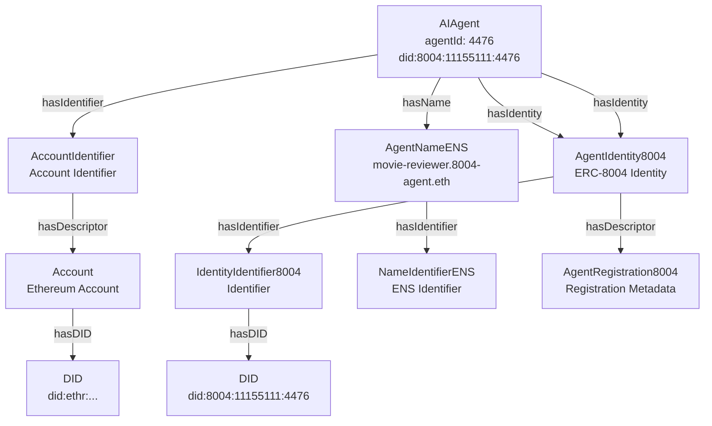
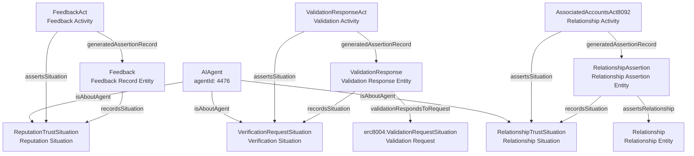
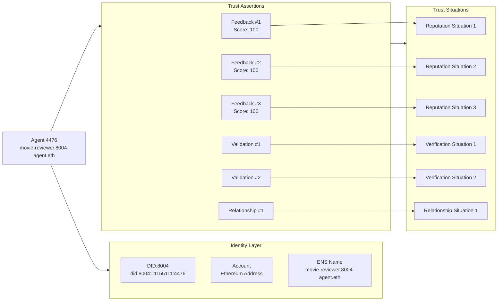

# Agent 4476: SPARQL Queries and Data Model

**Agent ID**: 4476  
**Chain ID**: 11155111  
**ERC-8004 identity DID (identity layer)**: `did:8004:11155111:4476`  
**Agent Name**: `movie-reviewer.8004-agent.eth` / `movie-reviewer-v2.8004-agent.eth`

This document provides comprehensive SPARQL queries and diagrams for exploring agent 4476's data in the RDF knowledge base, including identity, identifiers, names, situations, and assertions.

## Prefixes

All queries use these standard prefixes:

```sparql
PREFIX rdf: <http://www.w3.org/1999/02/22-rdf-syntax-ns#>
PREFIX rdfs: <http://www.w3.org/2000/01/rdf-schema#>
PREFIX xsd: <http://www.w3.org/2001/XMLSchema#>
PREFIX prov: <http://www.w3.org/ns/prov#>
PREFIX core: <https://agentictrust.io/ontology/core#>
PREFIX eth: <https://agentictrust.io/ontology/eth#>
PREFIX erc8004: <https://agentictrust.io/ontology/erc8004#>
PREFIX erc8092: <https://agentictrust.io/ontology/erc8092#>
```

## Agent Identity, Identifier, and Name

### Complete Identity Model

This query retrieves a **tight** identity slice (no wide UNION fanout): Agent(account-anchored) → Identity8004 → IdentityIdentifier8004, plus ENS.

```sparql
PREFIX core: <https://agentictrust.io/ontology/core#>
PREFIX eth: <https://agentictrust.io/ontology/eth#>
PREFIX erc8004: <https://agentictrust.io/ontology/erc8004#>
PREFIX rdfs: <http://www.w3.org/2000/01/rdf-schema#>

SELECT DISTINCT
  ?agent
  ?agentId
  ?chainId
  ?accountAddress
  ?didAccount
  ?agentName
  ?didIdentity
  ?identity
  ?identityIdentifier
  ?ensName
WHERE {
  VALUES (?agentId ?chainId) { ("4476" 11155111) }

  # Bind the agent node once (account-anchored AIAgent)
  {
    SELECT ?agent ?accountAddress ?didAccount
    WHERE {
      ?agent a core:AIAgent, eth:Account .
      ?agent core:agentId ?agentId .
      ?agent eth:accountChainId ?chainId .
      ?agent eth:accountAddress ?accountAddress .
      OPTIONAL { ?agent core:didAccount ?didAccount . }
    }
    LIMIT 1
  }

  OPTIONAL { ?agent core:agentName ?agentName . }
  OPTIONAL { ?agent core:didIdentity ?didIdentity . }

  # ERC-8004 identity (tight)
  OPTIONAL {
    ?agent core:hasIdentity ?identity .
    ?identity a erc8004:AgentIdentity8004 .
    ?identity core:hasIdentifier ?identityIdentifier .
    ?identityIdentifier a erc8004:IdentityIdentifier8004 .
  }

  # ENS Name (tight)
  OPTIONAL {
    ?agent core:hasName ?ensNameIri .
    ?ensNameIri a eth:AgentNameENS .
    ?ensNameIri eth:ensName ?ensName .
  }
}
LIMIT 50
```

### Agent Basic Information

```sparql
PREFIX core: <https://agentictrust.io/ontology/core#>
PREFIX erc8004: <https://agentictrust.io/ontology/erc8004#>

SELECT DISTINCT ?agent ?agentId ?chainId ?accountAddress ?agentName ?didIdentity ?didAccount
WHERE {
  VALUES (?agentId ?chainId) { ("4476" 11155111) }
  ?agent a core:AIAgent, eth:Account .
  ?agent core:agentId ?agentId .
  ?agent eth:accountChainId ?chainId .
  ?agent eth:accountAddress ?accountAddress .
  
  OPTIONAL { ?agent core:agentName ?agentName . }
  OPTIONAL { ?agent core:didIdentity ?didIdentity . }
  OPTIONAL { ?agent core:didAccount ?didAccount . }
}
LIMIT 1
```

### Agent with Account Identifier

```sparql
PREFIX core: <https://agentictrust.io/ontology/core#>
PREFIX eth: <https://agentictrust.io/ontology/eth#>

SELECT DISTINCT ?agent ?agentId ?accountAddress ?chainId ?accountType
WHERE {
  VALUES (?agentId ?chainId) { ("4476" 11155111) }
  ?agent a core:AIAgent, eth:Account .
  ?agent core:agentId ?agentId .
  ?agent eth:accountChainId ?chainId .
  ?agent eth:accountAddress ?accountAddress .
  OPTIONAL { ?agent eth:accountType ?accountType . }
}
LIMIT 1
```

## ERC-8004 Situations and Assertions

### Situations and assertion counts (small result set)

This query returns **one row per situation type** with counts, instead of exploding into many rows.

```sparql
PREFIX core: <https://agentictrust.io/ontology/core#>
PREFIX erc8004: <https://agentictrust.io/ontology/erc8004#>
PREFIX erc8092: <https://agentictrust.io/ontology/erc8092#>
PREFIX prov: <http://www.w3.org/ns/prov#>
PREFIX rdfs: <http://www.w3.org/2000/01/rdf-schema#>
PREFIX eth: <https://agentictrust.io/ontology/eth#>

SELECT
  ?bucket
  (COUNT(DISTINCT ?situation) AS ?situationCount)
  (COUNT(DISTINCT ?assertionAct) AS ?assertionActCount)
  (COUNT(DISTINCT ?assertionRecord) AS ?assertionRecordCount)
WHERE {
  VALUES (?agentId ?chainId) { ("4476" 11155111) }
  ?agent a core:AIAgent, eth:Account .
  ?agent core:agentId ?agentId .
  ?agent eth:accountChainId ?chainId .
  OPTIONAL { ?agent core:hasIdentity ?identity . }

  # Bucket by record type (avoids depending on ?situation rdf:type, which may vary)
  VALUES ?bucket { "reputation" "verification" "relationship" "delegation" }

  # Reputation: Feedback records
  {
    FILTER(?bucket = "reputation")
    ?assertionRecord a erc8004:Feedback .
    FILTER(
      EXISTS { ?agent erc8004:hasFeedback ?assertionRecord } ||
      EXISTS { ?identity erc8004:hasFeedback ?assertionRecord } ||
      EXISTS { ?assertionRecord core:aboutSubject ?identity }
    )
    OPTIONAL { ?assertionRecord core:recordsSituation ?situation . }
    OPTIONAL { ?assertionAct core:generatedAssertionRecord ?assertionRecord . }
  }
  UNION
  # Verification: ValidationResponse records
  {
    FILTER(?bucket = "verification")
    ?assertionRecord a erc8004:ValidationResponse .
    FILTER(
      EXISTS { ?agent erc8004:hasValidation ?assertionRecord } ||
      EXISTS { ?identity erc8004:hasValidation ?assertionRecord } ||
      EXISTS { ?assertionRecord core:aboutSubject ?identity }
    )
    OPTIONAL { ?assertionRecord core:recordsSituation ?situation . }
    OPTIONAL { ?assertionAct core:generatedAssertionRecord ?assertionRecord . }
  }
  UNION
  # Relationship: ERC-8092 relationship assertions
  {
    FILTER(?bucket = "relationship")
    # In our export, ERC-8092 association records are typed as erc8092:AssociatedAccounts8092
    # (plus core:TrustAssertion), and link to a RelationshipSituation via recordsSituation.
    ?assertionRecord a erc8092:AssociatedAccounts8092 .
    ?assertionRecord core:recordsSituation ?situation .
    ?situation core:isAboutAgent ?agent .
    OPTIONAL { ?assertionAct core:generatedAssertionRecord ?assertionRecord . }
  }
  UNION
  # Delegation: DelegationTrustAssertion (if present)
  {
    FILTER(?bucket = "delegation")
    ?assertionRecord a core:DelegationTrustAssertion .
    FILTER(
      EXISTS { ?assertionRecord core:aboutSubject ?identity } ||
      EXISTS { ?assertionRecord core:aboutSubject ?agent }
    )
    OPTIONAL { ?assertionRecord core:recordsSituation ?situation . }
    OPTIONAL { ?assertionAct core:generatedAssertionRecord ?assertionRecord . }
  }
}
GROUP BY ?bucket
ORDER BY ?bucket
```

### Reputation Situations and Feedback Assertions

```sparql
PREFIX core: <https://agentictrust.io/ontology/core#>
PREFIX erc8004: <https://agentictrust.io/ontology/erc8004#>
PREFIX prov: <http://www.w3.org/ns/prov#>
PREFIX eth: <https://agentictrust.io/ontology/eth#>

SELECT DISTINCT
  ?agent
  ?agentId
  ?repSituation
  ?feedbackRecord
  ?feedbackAct
  ?feedbackIndex
  ?score
  ?ratingPct
  ?clientAddress
  ?isRevoked
  ?skill
WHERE {
  VALUES (?agentId ?chainId) { ("4476" 11155111) }
  ?agent a core:AIAgent, eth:Account .
  ?agent core:agentId ?agentId .
  ?agent eth:accountChainId ?chainId .
  OPTIONAL { ?agent core:hasIdentity ?identity . }
  
  # Feedback record (Entity) anchored via agent or identity (or aboutSubject)
  ?feedbackRecord a erc8004:Feedback, core:ReputationTrustAssertion, core:TrustAssertion, prov:Entity .
  FILTER(
    EXISTS { ?agent erc8004:hasFeedback ?feedbackRecord } ||
    EXISTS { ?identity erc8004:hasFeedback ?feedbackRecord } ||
    EXISTS { ?feedbackRecord core:aboutSubject ?identity }
  )
  OPTIONAL { ?feedbackRecord core:recordsSituation ?repSituation . }
  ?feedbackRecord erc8004:feedbackIndex ?feedbackIndex .
  
  # Feedback act (Activity)
  ?feedbackAct a erc8004:FeedbackAct, core:ReputationTrustAssertionAct, core:TrustAssertionAct, core:Attestation, prov:Activity .
  ?feedbackAct core:assertsSituation ?repSituation .
  ?feedbackAct core:generatedAssertionRecord ?feedbackRecord .
  
  OPTIONAL { ?feedbackRecord erc8004:feedbackScore ?score . }
  OPTIONAL { ?feedbackRecord erc8004:feedbackRatingPct ?ratingPct . }
  OPTIONAL { ?feedbackRecord erc8004:isRevoked ?isRevoked . }
  OPTIONAL { 
    ?feedbackRecord erc8004:feedbackClient ?clientAccount .
    ?clientAccount eth:accountAddress ?clientAddress .
  }
  OPTIONAL { ?feedbackRecord erc8004:feedbackSkill ?skillIri . ?skillIri rdfs:label ?skill . }
}
ORDER BY ?feedbackIndex
LIMIT 50
```

### Verification Situations and Validation Assertions

```sparql
PREFIX core: <https://agentictrust.io/ontology/core#>
PREFIX erc8004: <https://agentictrust.io/ontology/erc8004#>
PREFIX prov: <http://www.w3.org/ns/prov#>
PREFIX eth: <https://agentictrust.io/ontology/eth#>

SELECT DISTINCT
  ?agent
  ?agentId
  ?verificationSituation
  ?verificationRequest
  ?validationResponse
  ?validationAct
  ?requestHash
  ?responseHash
  ?responseValue
  ?validatorAddress
  ?tag
WHERE {
  VALUES (?agentId ?chainId) { ("4476" 11155111) }
  ?agent a core:AIAgent, eth:Account .
  ?agent core:agentId ?agentId .
  ?agent eth:accountChainId ?chainId .
  OPTIONAL { ?agent core:hasIdentity ?identity . }
  
  # Validation response record (Entity) anchored via agent or identity (or aboutSubject)
  ?validationResponse a erc8004:ValidationResponse, core:VerificationTrustAssertion, core:TrustAssertion, prov:Entity .
  FILTER(
    EXISTS { ?agent erc8004:hasValidation ?validationResponse } ||
    EXISTS { ?identity erc8004:hasValidation ?validationResponse } ||
    EXISTS { ?validationResponse core:aboutSubject ?identity }
  )
  OPTIONAL { ?validationResponse core:recordsSituation ?verificationSituation . }
  OPTIONAL { ?validationResponse erc8004:validationRespondsToRequest ?verificationRequest . }
  OPTIONAL { ?verificationRequest erc8004:requestHash ?requestHash . }
  OPTIONAL { ?validationResponse erc8004:validationResponseValue ?responseValue . }
  OPTIONAL { ?validationResponse erc8004:responseHash ?responseHash . }
  OPTIONAL { ?validationResponse erc8004:validationTagCheck ?tagCheck . ?tagCheck rdfs:label ?tag . }
  OPTIONAL {
    ?validationResponse erc8004:validatorAddressForResponse ?validatorAddr .
    BIND(STR(?validatorAddr) AS ?validatorAddress)
  }
  
  # Validation response act (Activity)
  OPTIONAL {
    ?validationAct a erc8004:ValidationResponseAct, core:VerificationTrustAssertionAct, core:TrustAssertionAct, core:Attestation, prov:Activity .
    ?validationAct core:generatedAssertionRecord ?validationResponse .
  }
}
ORDER BY ?requestHash
LIMIT 50
```

### Relationship Situations and Assertions

```sparql
PREFIX core: <https://agentictrust.io/ontology/core#>
PREFIX erc8092: <https://agentictrust.io/ontology/erc8092#>
PREFIX prov: <http://www.w3.org/ns/prov#>

SELECT DISTINCT
  ?agent
  ?agentId
  ?relationshipSituation
  ?relationshipAssertion
  ?assertionAct
  ?associationId
  ?initiator
  ?approver
  ?interfaceId
  ?validAt
  ?validUntil
WHERE {
  VALUES (?agentId ?chainId) { ("4476" 11155111) }
  ?agent a core:AIAgent, eth:Account .
  ?agent core:agentId ?agentId .
  ?agent eth:accountChainId ?chainId .
  
  # Relationship situation
  ?relationshipSituation a core:RelationshipTrustSituation, core:RelationshipSituation, core:TrustSituation, prov:Entity .
  ?relationshipSituation core:isAboutAgent ?agent .

  # Relationship assertion record (ERC-8092 association row)
  ?relationshipAssertion a erc8092:AssociatedAccounts8092, core:TrustAssertion, prov:Entity .
  ?relationshipAssertion core:recordsSituation ?relationshipSituation .
  
  # Relationship assertion act
  ?assertionAct a erc8092:AssociatedAccountsAct8092, core:TrustAssertionAct, prov:Activity .
  ?assertionAct core:assertsSituation ?relationshipSituation .
  ?assertionAct core:generatedAssertionRecord ?relationshipAssertion .
  
  # Relationship details
  ?relationshipAssertion erc8092:associationId ?associationId .
  OPTIONAL { ?relationshipAssertion erc8092:initiator ?initiator . }
  OPTIONAL { ?relationshipAssertion erc8092:approver ?approver . }
  OPTIONAL { ?relationshipAssertion erc8092:interfaceId ?interfaceId . }
  OPTIONAL { ?relationshipAssertion erc8092:validAt ?validAt . }
  OPTIONAL { ?relationshipAssertion erc8092:validUntil ?validUntil . }
}
ORDER BY ?associationId
LIMIT 50
```

## Agent Descriptor and Metadata

### Agent Descriptor with Endpoints and Skills

```sparql
PREFIX core: <https://agentictrust.io/ontology/core#>
PREFIX erc8004: <https://agentictrust.io/ontology/erc8004#>

SELECT DISTINCT
  ?agent
  ?agentId
  ?agentRegistration
  ?endpoint
  ?endpointType
  ?endpointUrl
  ?agentSkill
  ?skillId
  ?skillName
WHERE {
  VALUES (?agentId ?chainId) { ("4476" 11155111) }
  ?agent a core:AIAgent, eth:Account .
  ?agent core:agentId ?agentId .
  ?agent eth:accountChainId ?chainId .

  # ERC-8004 registration descriptor (this is where endpoints/skills live for 8004 agents)
  ?agent core:hasIdentity ?identity .
  ?identity core:hasDescriptor ?agentRegistration .
  ?agentRegistration a erc8004:AgentRegistration8004 .
  
  # Endpoints
  OPTIONAL {
    ?agentRegistration core:hasEndpoint ?endpoint .
    ?endpoint a core:Endpoint .
    OPTIONAL { ?endpoint core:endpointType ?endpointType . }
    OPTIONAL { ?endpoint core:serviceUrl ?endpointUrl . }
  }
  
  # Skills
  OPTIONAL {
    ?agentRegistration core:hasSkill ?agentSkill .
    ?agentSkill a core:AgentSkill .
    OPTIONAL {
      ?agentSkill core:hasSkillClassification ?skill .
      OPTIONAL { ?skill core:oasfSkillId ?skillId . }
      OPTIONAL { ?skill rdfs:label ?skillName . }
    }
  }
}
ORDER BY ?endpointType ?skillId
LIMIT 100
```

### ERC-8004 Registration Metadata

```sparql
PREFIX core: <https://agentictrust.io/ontology/core#>
PREFIX erc8004: <https://agentictrust.io/ontology/erc8004#>

SELECT DISTINCT
  ?agent
  ?agentId
  ?agentRegistration
  ?registrationJson
  ?trustModel
WHERE {
  VALUES (?agentId ?chainId) { ("4476" 11155111) }
  ?agent a core:AIAgent, eth:Account .
  ?agent core:agentId ?agentId .
  ?agent eth:accountChainId ?chainId .
  
  ?agent core:hasIdentity ?identity .
  ?identity core:hasDescriptor ?agentRegistration .
  ?agentRegistration a erc8004:AgentRegistration8004 .
  
  OPTIONAL { ?agentRegistration core:json ?registrationJson . }
  OPTIONAL { ?agentRegistration core:hasTrustModel ?trustModel . }
}
LIMIT 50
```

## Complete Agent Graph

### All Relationships for Agent 4476

This comprehensive query retrieves all relationships: identity, identifiers, names, situations, assertions, descriptors, and metadata.

```sparql
PREFIX core: <https://agentictrust.io/ontology/core#>
PREFIX eth: <https://agentictrust.io/ontology/eth#>
PREFIX erc8004: <https://agentictrust.io/ontology/erc8004#>
PREFIX erc8092: <https://agentictrust.io/ontology/erc8092#>
PREFIX prov: <http://www.w3.org/ns/prov#>
PREFIX rdfs: <http://www.w3.org/2000/01/rdf-schema#>

SELECT DISTINCT ?subject ?predicate ?object ?objectType
WHERE {
  # Start with agent 4476
  ?agent a core:AIAgent .
  ?agent core:agentId "4476" .
  
  # Get all triples where agent is subject
  {
    ?agent ?predicate ?object .
    BIND(?agent AS ?subject)
    OPTIONAL { ?object a ?objectType . }
  }
  UNION
  # Get all triples where agent's identity/identifier/name is subject
  {
    {
      ?agent core:hasIdentity|core:hasIdentifier|core:hasName ?related .
    }
    UNION
    {
      ?agent core:hasIdentity ?identity .
      ?identity core:hasIdentifier ?related .
    }
    ?related ?predicate ?object .
    BIND(?related AS ?subject)
    OPTIONAL { ?object a ?objectType . }
  }
  UNION
  # Get all triples where agent's situations are subject
  {
    ?situation core:isAboutAgent ?agent .
    ?situation ?predicate ?object .
    BIND(?situation AS ?subject)
    OPTIONAL { ?object a ?objectType . }
  }
  UNION
  # Get all triples where agent's assertions are subject
  {
    ?situation core:isAboutAgent ?agent .
    ?assertion core:assertsSituation ?situation .
    ?assertion ?predicate ?object .
    BIND(?assertion AS ?subject)
    OPTIONAL { ?object a ?objectType . }
  }
}
ORDER BY ?subject ?predicate
LIMIT 1000
```

## Data Model Diagrams

### Agent Identity and Identifier Structure



### Situations and Assertions Model



### Complete Trust Graph for Agent 4476



## Summary Statistics

### Count All Assertions by Type

```sparql
PREFIX core: <https://agentictrust.io/ontology/core#>
PREFIX erc8004: <https://agentictrust.io/ontology/erc8004#>
PREFIX erc8092: <https://agentictrust.io/ontology/erc8092#>

SELECT ?assertionType (COUNT(DISTINCT ?assertion) AS ?count)
WHERE {
  VALUES (?agentId ?chainId) { ("4476" 11155111) }
  ?agent a core:AIAgent, eth:Account .
  ?agent core:agentId ?agentId .
  ?agent eth:accountChainId ?chainId .
  OPTIONAL { ?agent core:hasIdentity ?identity . }
  
  {
    ?situation core:isAboutAgent ?agent .
    ?assertion core:assertsSituation ?situation .
    ?assertion a ?assertionType .
  }
  UNION
  {
    { ?agent erc8004:hasFeedback|erc8004:hasValidation ?assertion . }
    UNION
    { ?identity erc8004:hasFeedback|erc8004:hasValidation ?assertion . }
    ?assertion a ?assertionType .
  }
  UNION
  {
    # ERC-8092 association assertions: count records linked to situations about this agent
    ?assertion core:recordsSituation ?relSituation .
    ?relSituation core:isAboutAgent ?agent .
    ?assertion a ?assertionType .
    FILTER EXISTS { ?assertion a erc8092:AssociatedAccounts8092 }
  }
}
GROUP BY ?assertionType
ORDER BY DESC(?count)
```

### Feedback Statistics

```sparql
PREFIX core: <https://agentictrust.io/ontology/core#>
PREFIX erc8004: <https://agentictrust.io/ontology/erc8004#>

SELECT 
  (COUNT(DISTINCT ?feedback) AS ?totalFeedbacks)
  (AVG(?score) AS ?avgScore)
  (MIN(?score) AS ?minScore)
  (MAX(?score) AS ?maxScore)
  (COUNT(DISTINCT ?client) AS ?uniqueClients)
WHERE {
  VALUES (?agentId ?chainId) { ("4476" 11155111) }
  ?agent a core:AIAgent, eth:Account .
  ?agent core:agentId ?agentId .
  ?agent eth:accountChainId ?chainId .
  OPTIONAL { ?agent core:hasIdentity ?identity . }

  {
    ?agent erc8004:hasFeedback ?feedback .
  }
  UNION
  {
    ?identity erc8004:hasFeedback ?feedback .
  }
  ?feedback a erc8004:Feedback .
  ?feedback erc8004:feedbackScore ?score .
  OPTIONAL {
    ?feedback erc8004:feedbackClient ?clientAccount .
    ?clientAccount eth:accountAddress ?client .
  }
}
```

## Notes

- Agent 4476 is registered on chain 11155111 (Sepolia testnet)
- The agent has multiple feedback records, validation requests/responses, and relationship assertions
- The agent uses the ERC-8004 identity system with DID `did:8004:11155111:4476`
- The agent has an ENS name: `movie-reviewer.8004-agent.eth`
- All queries filter by `agentId = "4476"` and can be adapted for other agents by changing this value

