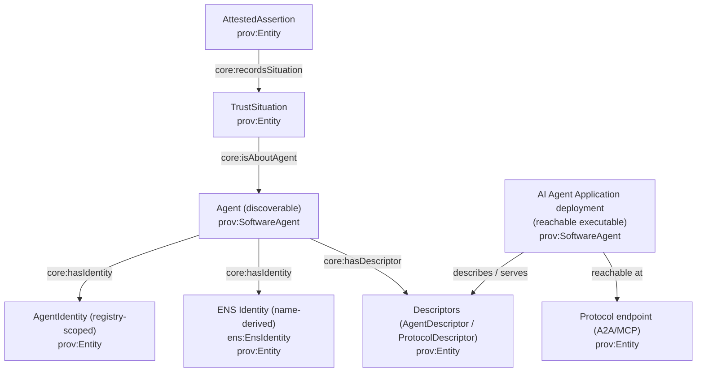
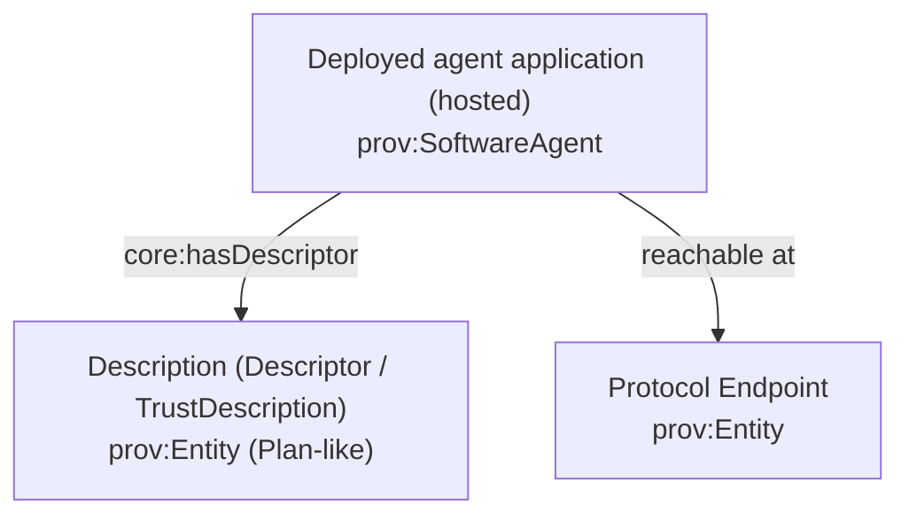
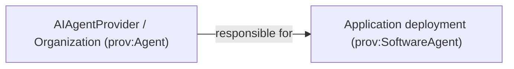

# AI Agent Application (Deployment), Provider, and Endpoints

This page explains how to talk about:

- the **discoverable Agent** (the stable node everything else points at: identity, names, trust graph, provenance)
- the **AI Agent Application deployment** (the thing reachable at endpoints that actually executes)
- the **Provider** responsible for that deployment

We’re intentionally not changing the OWL yet; this is a documentation-first reframing.

## Core idea: Agent (discoverable) vs Application deployment (executable at endpoint)

You have two “real things” that matter:

- **Agent (discoverable identity)**: the stable node that Identity/Name/Situations/AttestedAssertions/Descriptors attach to.
  - This is what you mean by “the agent” in the trust graph.
- **Application deployment (executable)**: the hosted service running at a protocol endpoint that accepts intents and produces outcomes.
  - This is what you mean by “the application”.

DnS **Descriptions** still matter (as schemas/metadata), but they are not the *primary* way to explain account/identity/application. Use DnS terms for intent/situation schemas; use PROV terms for actors/artifacts.

### How the pieces connect (conceptual)



### Ontology terms used on this page

- `core:AgentDeployment` (the endpoint-reachable executor)
- `core:deploymentOf` (Deployment → AIAgent)
- `core:agentProvider` (Deployment → Organization)
- `core:deploymentVersion` (Deployment → string)



## Provider responsibility

The provider is responsible for operating/hosting the **application deployment** (and typically for its policy surface: keys, attestations, SLAs).

- `core:Organization` ⊑ `prov:Agent`
- `core:AIAgentProvider` ⊑ `core:Organization`
- `core:agentProvider` (Application → Organization)



## Model and versioning
## Model and versioning

AgenticTrust supports both:

- **Descriptor-level fields** (easy ingestion from tokens/metadata):
  - `core:modelId` (AgentDescriptor)
  - `core:modelVersion` (AgentDescriptor)
  - `core:agentProviderValue` (AgentDescriptor)
- **Entity-level model nodes** (for reuse/graph reasoning):
  - `core:AgentModel` (prov:Entity) with `core:modelIdValue`, `core:modelVersionValue`
  - `core:usesModel` (Application → AgentModel)

Deployment versioning (distinct from model release when needed):

- `core:deploymentVersion` (AgentDeployment)

## Protocol endpoint references the application

The application deployment is **reachable** via protocol endpoints (e.g., A2A, MCP). In AgenticTrust:

- Protocol configuration lives on **ProtocolDescriptor** (`core:A2AProtocolDescriptor`, `core:MCPProtocolDescriptor`)
- Network addresses are modeled as **Endpoint** (`core:Endpoint`) linked from descriptors

The **A2A agent card** (agent-card.json / agent.json) is presented by the deployed application at an A2A endpoint. AgenticTrust represents:

- the endpoint URL on an Endpoint node (e.g., `core:endpointUrl`)
- the fetched A2A card JSON as `core:json` on a protocol descriptor (or a resolver-produced descriptor entity)

## Verification principles for Agent Applications (deployments)

“Verification” for the **application deployment** is usually about answering:

- **Who controls this endpoint?**
- **What code/service is actually running there (and with what version/model)?**
- **Who is accountable for operating it (provider/operator/authority)?**
- **How does this deployment relate to the discoverable Agent trust graph?**

AgenticTrust keeps these layers distinct:

- **Discoverable agent**: `core:AIAgent` (stable trust-graph anchor)
- **Executable application**: `core:AgentDeployment` (what you call / what executes)
- **Delegation and accountability**:
  - `prov:actedOnBehalfOf` (Deployment → Operator → Authority)
  - `core:agentProvider` (Deployment → Organization)
- **Epistemic evidence**: model verification results as **AttestedAssertions** generated by accountable acts (`core:Attestation` → `core:AttestedAssertion`)

### Common verification primitives (composable)

- **Transport integrity**: TLS / cert chains (often automated with ACME), plus request signing where supported.
- **Domain control**: DNS-based proofs (TXT records, CNAME indirection).
- **Web identity binding**: `did:web` (anchored in DNS + HTTPS).
- **Onchain binding**: smart-account ownership, contract metadata, registry membership.
- **Message-consensus registries**: topic-based publication/verification (e.g., Hedera/HCS registry patterns such as HCS-10).
  - Reference: [HCS-10 docs](https://hol.org/docs/standards/hcs-10/)

### HCS-11 / MCP profiles (application verification surface)

HCS-11 is commonly referenced as a **profile/document** pattern for describing/verifying an agent application (especially in the context of MCP-style tool servers), where the “profile” can be anchored via a registry substrate and/or DNS.

This maps cleanly to AgenticTrust:

- treat an HCS-11-style “profile” as a **Descriptor artifact** (a `ProtocolDescriptor` / `Descriptor` node)
- treat any publication/update as a provenance-bearing Activity (registration/fetch)
- treat verification outputs as AttestedAssertions about the Deployment and/or the AgentIdentity

(If you have the canonical HCS-11 spec link you want cited, paste it and we’ll wire it in.)

### AID via DNS TXT (`_agent.`) — a minimal verification + discovery anchor

This is a widely-used bootstrap pattern:

- a domain proves control over an agent/service by publishing a DNS TXT record

Typical pattern:

- `_agent.example.com TXT "did=did:web:example.com"`
- `_agent.example.com TXT "agent-id=ai.example.agent"`

What AID gives you:

- domain-based ownership proof
- web2-compatible verification
- registry-agnostic identity anchor
- easy bootstrap for agent discovery

What AID does not give you:

- runtime protocol semantics (how to call)
- tool invocation semantics
- trust/reputation logic
- capability execution traces

Key takeaway: **AID solves identity + discovery, not interaction.**

### Relationship between MCP and AID (orthogonal layers)

- **DNS/AID**: “who owns this agent/server endpoint?”
- **MCP**: “how do I interact with it (tools, schemas, invocation semantics)?”

Key insight:

- MCP assumes you already know who to talk to.
- AID helps you discover and verify who that is.

### Why TXT records keep showing up

TXT records appear repeatedly across ecosystems (AID patterns, registry discussions, `did:web`, ACME/TLS automation, ENS text records) because TXT is:

- universally deployable
- cheap
- chain-agnostic
- tool-agnostic
- human-verifiable

But: **DNS TXT usage ≠ an interaction protocol standard**. It’s a reusable verification primitive.

## SPARQL queries

### Find deployments and their provider (if modeled)

```sparql
PREFIX core: <https://agentictrust.io/ontology/core#>

SELECT ?app ?provider
WHERE {
  ?app a core:AgentDeployment .
  OPTIONAL { ?app core:agentProvider ?provider . }
}
LIMIT 200
```

### Find deployments and their model identifiers (descriptor-level)

```sparql
PREFIX core: <https://agentictrust.io/ontology/core#>

SELECT ?app ?descriptor ?modelId ?modelVersion ?providerValue
WHERE {
  ?app a core:AgentDeployment ;
       core:hasDescriptor ?descriptor .
  OPTIONAL { ?descriptor core:modelId ?modelId . }
  OPTIONAL { ?descriptor core:modelVersion ?modelVersion . }
  OPTIONAL { ?descriptor core:agentProviderValue ?providerValue . }
}
LIMIT 200
```

### Find deployments and the discoverable agent they implement

If you don’t want deployment identities, you can skip `AgentDeployment` nodes and attach descriptors/endpoints directly to the discoverable agent node. If you do want operational modeling (operators, provenance, delegation), keep deployments explicit.

```sparql
PREFIX prov: <http://www.w3.org/ns/prov#>
PREFIX core: <https://agentictrust.io/ontology/core#>

SELECT ?deployment ?agent
WHERE {
  ?deployment a core:AgentDeployment ;
              core:deploymentOf ?agent .
}
LIMIT 200
```


