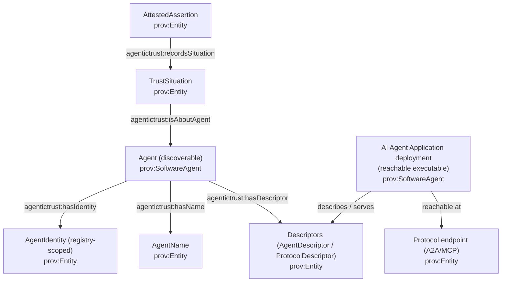
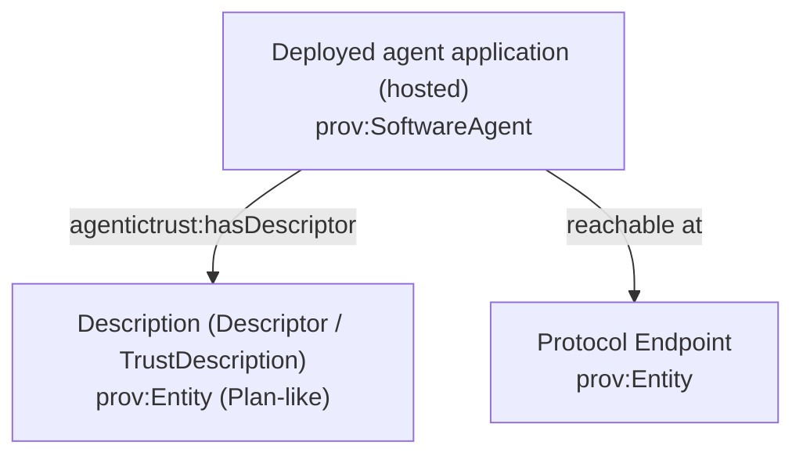
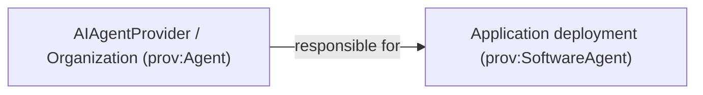

# AI Agent Application (Deployment), Provider, and Endpoints

This page explains how to talk about:

- the **discoverable Agent** (the stable node everything else points at: identity, names, trust graph, provenance)
- the **AI Agent Application deployment** (the thing reachable at endpoints that actually executes)
- the **Provider** responsible for that deployment

We’re intentionally not changing the OWL yet; this is a documentation-first reframing.

## Core idea: Agent (discoverable) vs Application deployment (executable at endpoint)

You have two “real things” that matter:

- **Agent (discoverable identity)**: the stable node that Identity/Name/Situations/AttestedAssertions/Descriptors attach to.
  - This is what you mean by “the agent” in the trust graph.
- **Application deployment (executable)**: the hosted service running at a protocol endpoint that accepts intents and produces outcomes.
  - This is what you mean by “the application”.

DnS **Descriptions** still matter (as schemas/metadata), but they are not the *primary* way to explain account/identity/application. Use DnS terms for intent/situation schemas; use PROV terms for actors/artifacts.

### How the pieces connect (conceptual)



### Current ontology note (no OWL changes here)

Right now the ontology includes:

- `agentictrust:AIAgentApplication` (modeled as a `prov:SoftwareAgent`)
- `agentictrust:AgentInstance` (modeled as a `prov:SoftwareAgent`, linked via `prov:specializationOf`)

If you want “application = deployment at endpoint”, you can interpret:

- **Deployment** ≈ `agentictrust:AgentInstance` (the executable at the endpoint)
- **Discoverable agent** ≈ `agentictrust:AIAgent` (what everything else references)

We can later adjust naming/classes so the OWL matches this language exactly.



## Provider responsibility (OIDC-A: agent_provider)

The provider is responsible for operating/hosting the **application deployment** (and typically for its policy surface: keys, attestations, SLAs).

- `agentictrust:Organization` ⊑ `prov:Agent`
- `agentictrust:AIAgentProvider` ⊑ `agentictrust:Organization`
- `agentictrust:agentProvider` (Application → Organization)



## Model and versioning (OIDC-A: agent_model, agent_version)

AgenticTrust supports both:

- **Descriptor-level fields** (easy ingestion from tokens/metadata):
  - `agentictrust:modelId` (AgentDescriptor)
  - `agentictrust:modelVersion` (AgentDescriptor)
  - `agentictrust:agentProviderValue` (AgentDescriptor)
- **Entity-level model nodes** (for reuse/graph reasoning):
  - `agentictrust:AgentModel` (prov:Entity) with `agentictrust:modelIdValue`, `agentictrust:modelVersionValue`
  - `agentictrust:usesModel` (Application → AgentModel)

Application versioning (distinct from model release when needed):

- `agentictrust:applicationVersion` (AIAgentApplication)

## Protocol endpoint references the application

The application deployment is **reachable** via protocol endpoints (e.g., A2A, MCP). In AgenticTrust:

- Protocol configuration lives on **ProtocolDescriptor** (`agentictrust:A2AProtocolDescriptor`, `agentictrust:MCPProtocolDescriptor`)
- Network addresses are modeled as **Endpoint** (`agentictrust:Endpoint`) linked from descriptors

The **A2A agent card** (agent-card.json / agent.json) is presented by the deployed application at an A2A endpoint. AgenticTrust represents:

- the endpoint URL on an Endpoint node (e.g., `agentictrust:endpointUrl`)
- the fetched A2A card JSON as `agentictrust:json` on a protocol descriptor (or a resolver-produced descriptor entity)

## SPARQL queries

### Find the application’s provider (if modeled)

```sparql
PREFIX agentictrust: <https://www.agentictrust.io/ontology/agentictrust-core#>

SELECT ?app ?provider
WHERE {
  ?app a agentictrust:AIAgentApplication .
  OPTIONAL { ?app agentictrust:agentProvider ?provider . }
}
LIMIT 200
```

### Find applications and their model identifiers (descriptor-level)

```sparql
PREFIX agentictrust: <https://www.agentictrust.io/ontology/agentictrust-core#>

SELECT ?app ?descriptor ?modelId ?modelVersion ?providerValue
WHERE {
  ?app a agentictrust:AIAgentApplication ;
       agentictrust:hasDescriptor ?descriptor .
  OPTIONAL { ?descriptor agentictrust:modelId ?modelId . }
  OPTIONAL { ?descriptor agentictrust:modelVersion ?modelVersion . }
  OPTIONAL { ?descriptor agentictrust:agentProviderValue ?providerValue . }
}
LIMIT 200
```

### Find deployments (instances) and the stable discoverable agent they correspond to

If you keep using `agentictrust:AgentInstance`, treat it as the **deployment identity** (the executable at endpoint). If you don’t want deployment identities, you can skip this and attach descriptors/endpoints to the discoverable agent node.

```sparql
PREFIX prov: <http://www.w3.org/ns/prov#>
PREFIX agentictrust: <https://www.agentictrust.io/ontology/agentictrust-core#>

SELECT ?instance ?instanceId ?application
WHERE {
  ?instance a agentictrust:AgentInstance ;
            prov:specializationOf ?application .
  OPTIONAL { ?instance agentictrust:agentInstanceId ?instanceId . }
}
LIMIT 200
```


