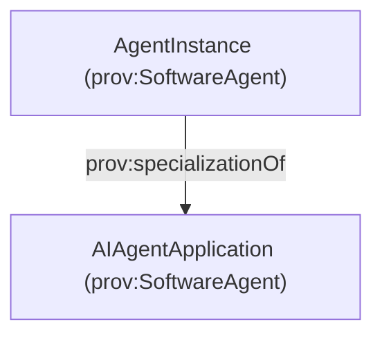
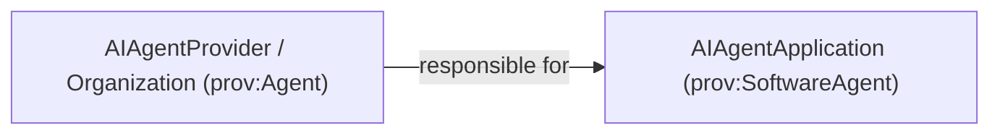

# AI Agent Application and Provider

This page centers on the **durable AI agent application** (software agent identity), its **provider**, and how protocols/endpoints relate to the deployed application.

## Core idea: durable application vs ephemeral instance

- **AI Agent Application**: the durable, versioned software agent identity that is deployed at one or more protocol endpoints.
  - Ontology: `agentictrust:AIAgentApplication` ⊑ `agentictrust:AIAgent` ⊑ `prov:SoftwareAgent`
- **AI Agent Instance**: an ephemeral runtime identity (session/execution), linked to the durable application.
  - Ontology: `agentictrust:AgentInstance` ⊑ `prov:SoftwareAgent`
  - Link: `prov:specializationOf` (Instance → Application)



## Provider responsibility (OIDC-A: agent_provider)

The provider is responsible for operating/hosting the **agent application** (and typically for its policy surface: keys, attestations, SLAs).

- `agentictrust:Organization` ⊑ `prov:Agent`
- `agentictrust:AIAgentProvider` ⊑ `agentictrust:Organization`
- `agentictrust:agentProvider` (Application → Organization)



## Model and versioning (OIDC-A: agent_model, agent_version)

AgenticTrust supports both:

- **Descriptor-level fields** (easy ingestion from tokens/metadata):
  - `agentictrust:modelId` (AgentDescriptor)
  - `agentictrust:modelVersion` (AgentDescriptor)
  - `agentictrust:agentProviderValue` (AgentDescriptor)
- **Entity-level model nodes** (for reuse/graph reasoning):
  - `agentictrust:AgentModel` (prov:Entity) with `agentictrust:modelIdValue`, `agentictrust:modelVersionValue`
  - `agentictrust:usesModel` (Application → AgentModel)

Application versioning (distinct from model release when needed):

- `agentictrust:applicationVersion` (AIAgentApplication)

## Protocol endpoint references the application

An AI Agent Application is **reachable** via protocol endpoints (e.g., A2A, MCP). In AgenticTrust:

- Protocol configuration lives on **ProtocolDescriptor** (`agentictrust:A2AProtocolDescriptor`, `agentictrust:MCPProtocolDescriptor`)
- Network addresses are modeled as **Endpoint** (`agentictrust:Endpoint`) linked from descriptors

The **A2A agent card** (agent-card.json / agent.json) is presented by the deployed application at an A2A endpoint. AgenticTrust represents:

- the endpoint URL on an Endpoint node (e.g., `agentictrust:endpointUrl`)
- the fetched A2A card JSON as `agentictrust:json` on a protocol descriptor (or a resolver-produced descriptor entity)

## SPARQL queries

### Find the application’s provider (if modeled)

```sparql
PREFIX agentictrust: <https://www.agentictrust.io/ontology/agentictrust-core#>

SELECT ?app ?provider
WHERE {
  ?app a agentictrust:AIAgentApplication .
  OPTIONAL { ?app agentictrust:agentProvider ?provider . }
}
LIMIT 200
```

### Find applications and their model identifiers (descriptor-level)

```sparql
PREFIX agentictrust: <https://www.agentictrust.io/ontology/agentictrust-core#>

SELECT ?app ?descriptor ?modelId ?modelVersion ?providerValue
WHERE {
  ?app a agentictrust:AIAgentApplication ;
       agentictrust:hasDescriptor ?descriptor .
  OPTIONAL { ?descriptor agentictrust:modelId ?modelId . }
  OPTIONAL { ?descriptor agentictrust:modelVersion ?modelVersion . }
  OPTIONAL { ?descriptor agentictrust:agentProviderValue ?providerValue . }
}
LIMIT 200
```

### Find instances and the durable application they specialize

```sparql
PREFIX prov: <http://www.w3.org/ns/prov#>
PREFIX agentictrust: <https://www.agentictrust.io/ontology/agentictrust-core#>

SELECT ?instance ?instanceId ?application
WHERE {
  ?instance a agentictrust:AgentInstance ;
            prov:specializationOf ?application .
  OPTIONAL { ?instance agentictrust:agentInstanceId ?instanceId . }
}
LIMIT 200
```


