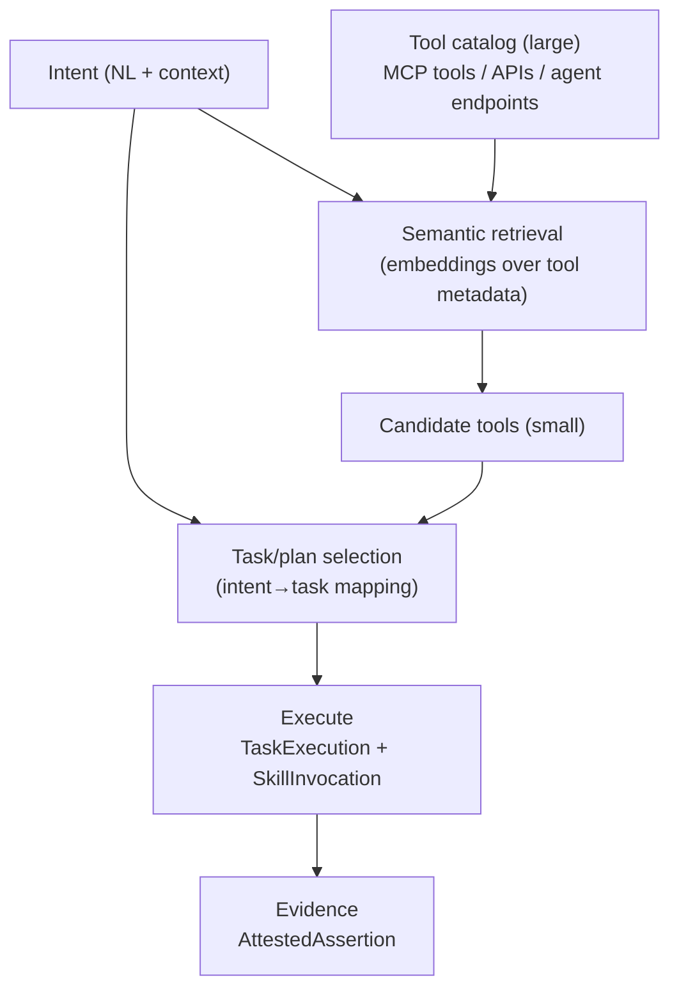

# Agent orchestration: semantic tool discovery + execution gateways (intent → task → action)

This page focuses on **client-agent orchestration** in a world where:

- multiple **agent registries** exist “out there”
- agents expose endpoints and tool surfaces (possibly many, possibly “all of them” via aggregation)
- a **client agent** must map **intents → tasks → actions** that invoke tools and/or other agents

The theme: **semantic tool discovery + governed execution** (auth, policy, auditability) as part of orchestration.

## Core orchestration problem

Given:

- an incoming **Intent** (natural language + context)
- a huge universe of potential **tools** (APIs, MCP tools, other agents’ endpoints)
- governance constraints (authN/authZ, policy, cost, risk, privacy)

How do we:

1) reduce the tool universe to a safe candidate set,  
2) map intent to a task plan, and  
3) execute actions with provenance + accountability?

## AgenticTrust vocabulary (what to use)

The ontology already has the right backbone for this:

- **Discovery inputs**
  - `agentictrust:AgentRegistry` (registry context)
  - `agentictrust:AgentIdentity` + Descriptor pattern (`agentictrust:hasDescriptor`)
  - protocol-derived tool catalogs (`agentictrust:ProtocolDescriptor`, especially `agentictrust:MCPProtocolDescriptor`)
  - skills/tools as `agentictrust:AgentSkillClassification` with `agentictrust:JsonSchema`
- **Intent and task mapping**
  - `agentictrust:IntentType` (why)
  - `agentictrust:targetsSkill` (intent → skill)
  - `agentictrust:TaskType` and `agentictrust:mapsToTaskType` (intent → task class)
- **Execution trace**
  - `agentictrust:TaskExecution` (prov:Activity)
  - `agentictrust:SkillInvocation` (prov:Activity) + `agentictrust:invokesSkill`
- **Governance + evidence**
  - delegation chain: `prov:actedOnBehalfOf` (+ `agentictrust:delegatedBy`)
  - accountable evidence: `agentictrust:Attestation` → `agentictrust:AttestedAssertion`

## Pattern: “semantic discovery → candidate set → execute” (generic)

Key idea: **semantic retrieval is a narrowing step**, not execution.

## Three major archetypes in the wild

### 1) Product-managed tool catalog + Tool-RAG gateway (Amazon AgentCore Gateway)

AgentCore is explicit about Gateway being the aggregation point for tools and integrations, and that it integrates with protocols like MCP and A2A ([Amazon Bedrock AgentCore overview](https://docs.aws.amazon.com/bedrock-agentcore/latest/devguide/what-is-bedrock-agentcore.html)).

In this archetype, semantic retrieval happens **over tool metadata**, inside the product boundary, producing a candidate tool set for invocation.

See: [`amazon-agentcore.md`](./amazon-agentcore.md).

### 2) Product-managed semantic routing (Google Agentspace)

Agentspace narratives emphasize semantic enterprise search as an entry point to downstream **task/workflow routing** and execution.

See:

- [Agentspace enables the agent-driven enterprise](https://cloud.google.com/blog/products/ai-machine-learning/google-agentspace-enables-the-agent-driven-enterprise)
- [Google Agentspace feed item](https://blog.google/feed/google-agentspace/)
- [`google-agentspace.md`](./google-agentspace.md)

In this archetype, routing is framed less as “search a tool catalog” and more as **intent → task class → workflow dispatch**.

### 3) Model-centric orchestration SDK (Anthropic Claude agent SDK patterns)

Claude SDK patterns strongly support:

- natural language → structured intent extraction
- tool/function invocation (developer-defined)
- iterative decision loops

But they do **not** ship a managed semantic tool catalog index; that layer is developer-built.

Key Anthropic references:

- [Claude SDK overview](https://console.anthropic.com/docs/sdk/overview)
- [Agent guide](https://console.anthropic.com/docs/guides/agents)
- [Function invocation](https://console.anthropic.com/docs/sdk/function-invocation)
- [Embeddings](https://console.anthropic.com/docs/sdk/embeddings)

## “Intent mapping” as a first-class topic (why this is hard)

Intent mapping is the bridge from “what the user wants” to “what can be safely executed”.

Practically, it decomposes into:

- **Intent normalization**: freeform text → structured representation
  - intent label / action verb
  - entities + parameters
  - confidence/clarity
- **Task classification**: choose a task class (search vs summarize vs transact vs notify vs delegate)
- **Tool selection**: pick candidate tools/skills that can satisfy the task (and are allowed by policy)
- **Plan and execution**: multi-step orchestration with retries, idempotency, and evidence generation

AgenticTrust contribution: make each layer **explicit and queryable** (descriptions vs traces vs evidence), instead of hiding it inside an opaque agent runtime.

## Registries “out there”: turning registry discovery into a tool universe

In an open agent web, the “tool universe” is assembled from registries and protocol descriptors:

- registry entries → `AgentIdentity` + Descriptor
- descriptors → protocol descriptors (MCP/A2A), endpoints, schemas
- protocol descriptors → a concrete tool catalog (skills/tools)

The orchestration question becomes:

> Which registry-scoped identities and deployments do I trust enough to include in my tool universe, and under what policy constraints?

This is where AgenticTrust sits “above” execution gateways.

## Execution gateways and auth (inbound + outbound)

An execution gateway is the boundary where:

- inbound caller identity is authenticated
- outbound tool calls are authorized and signed
- tool invocations are traced and auditable

AgenticTrust representation:

- inbound and outbound decisions become **evidence objects** (AttestedAssertions) and/or are encoded in provenance traces (TaskExecution/SkillInvocation).

## Similar solutions to an AgentCore-style gateway (taxonomy)

Below are real solutions/patterns that implement “semantic tool discovery → execute” to varying degrees:

- **LangChain (library) + LangSmith (platform)**
  - LangChain: [`langchain-ai/langchain`](https://github.com/langchain-ai/langchain)
  - LangSmith overview: [`langsmith`](https://www.langchain.com/langsmith/overview)
- **Microsoft Semantic Kernel (planner + orchestration)**
  - Overview: [Semantic Kernel overview](https://learn.microsoft.com/en-us/semantic-kernel/overview)
- **OpenAI building blocks (DIY tool-RAG)**
  - Function calling: [OpenAI function calling](https://platform.openai.com/docs/guides/function-calling)
  - Embeddings: [OpenAI embeddings](https://platform.openai.com/docs/guides/embeddings)
- **CrewAI (platform/tooling)**
  - [CrewAI](https://crewai.ai)
- **Backstage (developer portal + catalog; semantically searchable with add-ons)**
  - [Backstage](https://backstage.io)
- **A2A discovery layer (capability advertisement upstream of execution)**
  - [A2A](https://agent2agent.info)

## Where this connects in the docs

- [`intent.md`](./intent.md): IntentType and intent→skill binding (targetsSkill)
- [`protocols-endpoints.md`](./protocols-endpoints.md): protocol-derived skills/tools (MCP/A2A)
- [`amazon-agentcore.md`](./amazon-agentcore.md): Tool-RAG gateway model
- [`google-agentspace.md`](./google-agentspace.md): semantic routing model
- [`agent-registry.md`](./agent-registry.md): registries and registry-scoped identities

## Recommendations: ontology additions needed (do not implement yet)

This document describes real orchestration innovations (Tool‑RAG gateways, semantic routing, SDK-driven tool invocation). AgenticTrust already has the **spine** (IntentType/TaskExecution/SkillInvocation/ProtocolDescriptor), but to represent these systems *as data* (auditable, queryable, portable) we should add a small set of **explicit entities and relations**.

### 1) Tool catalogs as first-class entities (scope + isolation)

**Why**: AgentCore-style gateways make the “tool universe” explicit and *scoped* (per-gateway isolation). Today, we can infer catalogs from protocol descriptors, but we can’t represent catalog boundaries and lifecycle as a first-class object.

**Add**

- **Class**: `agentictrust:ToolCatalog` ⊑ `prov:Entity`
- **Property**: `agentictrust:catalogOf` (ToolCatalog → ProtocolDescriptor or Deployment)
- **Property**: `agentictrust:catalogHasTool` (ToolCatalog → AgentSkillClassification)
- **Property**: `agentictrust:catalogScope` (datatype or link to Registry/Organization/Deployment)
- **Property**: `agentictrust:catalogRevision` (datatype, optional)

### 2) Semantic retrieval over tool metadata (Tool‑RAG) as provenance

**Why**: Tool‑RAG is an **Activity** (“search tools”), producing an **Entity** (“candidate set”), and optionally recording scores/ranks. Without this, we can’t reconstruct *why* a tool was chosen.

**Add**

- **Class**: `agentictrust:ToolSearch` ⊑ `prov:Activity`
- **Class**: `agentictrust:ToolCandidateSet` ⊑ `prov:Entity`
- **Property**: `agentictrust:searchedCatalog` (ToolSearch → ToolCatalog)
- **Property**: `agentictrust:searchQuery` (datatype, string)
- **Property**: `agentictrust:generatedCandidateSet` (ToolSearch → ToolCandidateSet) (or use `prov:generated`)
- **Property**: `agentictrust:candidateTool` (ToolCandidateSet → AgentSkillClassification)
- **Property**: `agentictrust:candidateScore` / `agentictrust:candidateRank` (attach via a qualified node if we need per-tool scores)

This cleanly models AgentCore Gateway’s “semantic tool selection” behavior as **retrieval**, not “reasoning”.

### 3) Intent normalization and task classification outputs (explicit, portable)

**Why**: Agentspace-style semantic routing and Claude-style SDK loops both rely on producing structured intent/task outputs, but today we mostly treat that as “inside the LLM”.

**Add**

- **Class**: `agentictrust:IntentParse` ⊑ `prov:Activity`
- **Class**: `agentictrust:IntentParseResult` ⊑ `prov:Entity`
- **Property**: `agentictrust:parsedIntentType` (IntentParseResult → IntentType)
- **Property**: `agentictrust:parsedTaskType` (IntentParseResult → TaskType)
- **Property**: `agentictrust:parsedParametersJson` (datatype, JSON string)
- **Property**: `agentictrust:parseConfidence` (datatype, numeric)

This lets us represent “intent understanding → task class” without hardcoding a vendor ontology.

### 4) Execution gateway as an explicit boundary (inbound/outbound auth)

**Why**: The orchestration story consistently has a boundary that authenticates inbound requests and authorizes outbound tool calls. We need to represent that boundary and its decisions as evidence.

**Add**

- **Class**: `agentictrust:ExecutionGateway` ⊑ `prov:SoftwareAgent` (or `prov:Entity` if modeled as infrastructure artifact)
- **Property**: `agentictrust:gatewayForDeployment` (Gateway → AgentDeployment)
- **Property**: `agentictrust:gatewayCatalog` (Gateway → ToolCatalog)

AuthZ/AuthN as evidence:

- **Class**: `agentictrust:AuthorizationDecision` ⊑ `prov:Entity`
- **Class**: `agentictrust:AuthorizationAct` ⊑ `prov:Activity`
- **Property**: `agentictrust:decisionAppliesToInvocation` (Decision → SkillInvocation)
- **Property**: `agentictrust:decisionOutcome` (allow/deny)
- **Property**: `agentictrust:decisionReason` (string or json)

### 5) Tool adapter / wrapper semantics (API→tool, A2A→tool, MCP aggregation)

**Why**: Many gateways work by *adapting* things into tools (wrapping APIs/Lambda; aggregating MCP servers). We need minimal vocabulary for “this tool is derived from that API/endpoint”.

**Add**

- **Class**: `agentictrust:ToolAdapter` ⊑ `prov:SoftwareAgent` (optional)
- **Property**: `agentictrust:wrapsEndpoint` (ToolAdapter → Endpoint)
- **Property**: `agentictrust:exposesTool` (ToolAdapter → AgentSkillClassification)
- **Property**: `agentictrust:derivedFromDescriptor` (ToolAdapter or Tool → Descriptor)

### 6) Portfolio-level orchestration policy (tool universe governance)

**Why**: In the open agent web, “which tools are even admissible” is often governed at a portfolio/consortium level.

**Add**

- **Property**: `agentictrust:portfolioPolicy` (AgentPortfolio → TrustDescription/Plan-like entity)
- **Property**: `agentictrust:portfolioToolCatalog` (AgentPortfolio → ToolCatalog)
- **Property**: `agentictrust:admissionCriteria` (AgentRegistry/Portfolio → Descriptor/Policy artifact)

### 7) Minimum recommended integration points (where these attach)

To keep the ontology cohesive:

- Tool catalogs should hang off **protocol descriptors / deployments / gateways**.
- Retrieval/classification should be captured as **Activities** producing **Entities** (PROV-native).
- Invocations remain `SkillInvocation`; decisions/evidence link to invocations and/or tasks.

### Practical impact of the technologies in this doc

- **AgentCore-style gateways** push us to model **ToolCatalog + ToolSearch + CandidateSet** and **authorization decisions** as first-class auditable objects.
- **Agentspace-style routing** pushes us to model **IntentParseResult** and **TaskType** classification outputs explicitly.
- **Claude SDK / framework ecosystems** push us to model orchestration as **portable provenance**, so the same patterns can be represented regardless of vendor runtime.

