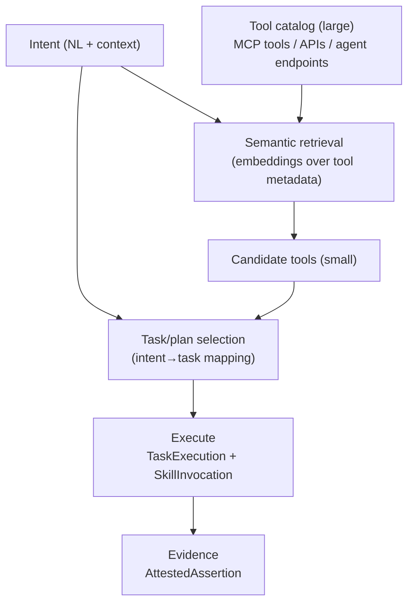

# Agent orchestration: semantic tool discovery + execution gateways (intent → task → action)

This page focuses on **client-agent orchestration** in a world where:

- multiple **agent registries** exist “out there”
- agents expose endpoints and tool surfaces (possibly many, possibly “all of them” via aggregation)
- a **client agent** must map **intents → tasks → actions** that invoke tools and/or other agents

The theme: **semantic tool discovery + governed execution** (auth, policy, auditability) as part of orchestration.

## Core orchestration problem

Given:

- an incoming **Intent** (natural language + context)
- a huge universe of potential **tools** (APIs, MCP tools, other agents’ endpoints)
- governance constraints (authN/authZ, policy, cost, risk, privacy)

How do we:

1) reduce the tool universe to a safe candidate set,  
2) map intent to a task plan, and  
3) execute actions with provenance + accountability?

## AgenticTrust vocabulary (what to use)

The ontology already has the right backbone for this:

- **Discovery inputs**
  - `agentictrust:AgentRegistry` (registry context)
  - `agentictrust:AgentIdentity` + Descriptor pattern (`agentictrust:hasDescriptor`)
  - protocol-derived tool catalogs (`agentictrust:ProtocolDescriptor`, especially `agentictrust:MCPProtocolDescriptor`)
  - skills/tools as `agentictrust:AgentSkillClassification` with `agentictrust:JsonSchema`
- **Intent and task mapping**
  - `agentictrust:IntentType` (why)
  - `agentictrust:targetsSkill` (intent → skill)
  - `agentictrust:TaskType` and `agentictrust:mapsToTaskType` (intent → task class)
- **Execution trace**
  - `agentictrust:TaskExecution` (prov:Activity)
  - `agentictrust:SkillInvocation` (prov:Activity) + `agentictrust:invokesSkill`
- **Governance + evidence**
  - delegation chain: `prov:actedOnBehalfOf` (+ `agentictrust:delegatedBy`)
  - accountable evidence: `agentictrust:Attestation` → `agentictrust:AttestedAssertion`

## Pattern: “semantic discovery → candidate set → execute” (generic)

Key idea: **semantic retrieval is a narrowing step**, not execution.

## Three major archetypes in the wild

### 1) Product-managed tool catalog + Tool-RAG gateway (Amazon AgentCore Gateway)

AgentCore is explicit about Gateway being the aggregation point for tools and integrations, and that it integrates with protocols like MCP and A2A ([Amazon Bedrock AgentCore overview](https://docs.aws.amazon.com/bedrock-agentcore/latest/devguide/what-is-bedrock-agentcore.html)).

In this archetype, semantic retrieval happens **over tool metadata**, inside the product boundary, producing a candidate tool set for invocation.

See: [`amazon-agentcore.md`](./amazon-agentcore.md).

### 2) Product-managed semantic routing (Google Agentspace)

Agentspace narratives emphasize semantic enterprise search as an entry point to downstream **task/workflow routing** and execution.

See:

- [Agentspace enables the agent-driven enterprise](https://cloud.google.com/blog/products/ai-machine-learning/google-agentspace-enables-the-agent-driven-enterprise)
- [Google Agentspace feed item](https://blog.google/feed/google-agentspace/)
- [`google-agentspace.md`](./google-agentspace.md)

In this archetype, routing is framed less as “search a tool catalog” and more as **intent → task class → workflow dispatch**.

### 3) Model-centric orchestration SDK (Anthropic Claude agent SDK patterns)

Claude SDK patterns strongly support:

- natural language → structured intent extraction
- tool/function invocation (developer-defined)
- iterative decision loops

But they do **not** ship a managed semantic tool catalog index; that layer is developer-built.

Key Anthropic references:

- [Claude SDK overview](https://console.anthropic.com/docs/sdk/overview)
- [Agent guide](https://console.anthropic.com/docs/guides/agents)
- [Function invocation](https://console.anthropic.com/docs/sdk/function-invocation)
- [Embeddings](https://console.anthropic.com/docs/sdk/embeddings)

## “Intent mapping” as a first-class topic (why this is hard)

Intent mapping is the bridge from “what the user wants” to “what can be safely executed”.

Practically, it decomposes into:

- **Intent normalization**: freeform text → structured representation
  - intent label / action verb
  - entities + parameters
  - confidence/clarity
- **Task classification**: choose a task class (search vs summarize vs transact vs notify vs delegate)
- **Tool selection**: pick candidate tools/skills that can satisfy the task (and are allowed by policy)
- **Plan and execution**: multi-step orchestration with retries, idempotency, and evidence generation

AgenticTrust contribution: make each layer **explicit and queryable** (descriptions vs traces vs evidence), instead of hiding it inside an opaque agent runtime.

## Registries “out there”: turning registry discovery into a tool universe

In an open agent web, the “tool universe” is assembled from registries and protocol descriptors:

- registry entries → `AgentIdentity` + Descriptor
- descriptors → protocol descriptors (MCP/A2A), endpoints, schemas
- protocol descriptors → a concrete tool catalog (skills/tools)

The orchestration question becomes:

> Which registry-scoped identities and deployments do I trust enough to include in my tool universe, and under what policy constraints?

This is where AgenticTrust sits “above” execution gateways.

## Execution gateways and auth (inbound + outbound)

An execution gateway is the boundary where:

- inbound caller identity is authenticated
- outbound tool calls are authorized and signed
- tool invocations are traced and auditable

AgenticTrust representation:

- inbound and outbound decisions become **evidence objects** (AttestedAssertions) and/or are encoded in provenance traces (TaskExecution/SkillInvocation).

## Similar solutions to an AgentCore-style gateway (taxonomy)

Below are real solutions/patterns that implement “semantic tool discovery → execute” to varying degrees:

- **LangChain (library) + LangSmith (platform)**
  - LangChain: [`langchain-ai/langchain`](https://github.com/langchain-ai/langchain)
  - LangSmith overview: [`langsmith`](https://www.langchain.com/langsmith/overview)
- **Microsoft Semantic Kernel (planner + orchestration)**
  - Overview: [Semantic Kernel overview](https://learn.microsoft.com/en-us/semantic-kernel/overview)
- **OpenAI building blocks (DIY tool-RAG)**
  - Function calling: [OpenAI function calling](https://platform.openai.com/docs/guides/function-calling)
  - Embeddings: [OpenAI embeddings](https://platform.openai.com/docs/guides/embeddings)
- **CrewAI (platform/tooling)**
  - [CrewAI](https://crewai.ai)
- **Backstage (developer portal + catalog; semantically searchable with add-ons)**
  - [Backstage](https://backstage.io)
- **A2A discovery layer (capability advertisement upstream of execution)**
  - [A2A](https://agent2agent.info)

## Where this connects in the docs

- [`intent.md`](./intent.md): IntentType and intent→skill binding (targetsSkill)
- [`protocols-endpoints.md`](./protocols-endpoints.md): protocol-derived skills/tools (MCP/A2A)
- [`amazon-agentcore.md`](./amazon-agentcore.md): Tool-RAG gateway model
- [`google-agentspace.md`](./google-agentspace.md): semantic routing model
- [`agent-registry.md`](./agent-registry.md): registries and registry-scoped identities

## Ontology design principles for semantic tool discovery & governed orchestration (execute these)

This section does **not** introduce new AgenticTrust classes. It sharpens the semantics of how existing classes relate, and establishes “load‑bearing beams” that keep AgenticTrust stable while implementations evolve (AgentCore, Agentspace, Claude SDK loops, etc.).

### 1) Separation of description vs execution (non‑negotiable)

**Principle**: Nothing executable should be required for discovery.

**Rule**: Discovery operates only over **descriptive Entities**, never over `prov:Activity` or runtime artifacts.

**Existing mapping (keep sacred)**:

- `AgentIdentity` is an Entity (registry-scoped representation), not execution
- `Descriptor` / `ProtocolDescriptor` are Entities, not invocations
- `AgentSkillClassification` is an Entity (“affordance”), not a call
- execution is `TaskExecution` / `SkillInvocation` (Activities)

### 2) Intent is epistemic, not operational

**Principle**: Intent expresses belief about a desired outcome, not a command.

**Rule**: Intent must never directly invoke a skill/tool.

**Existing mapping**:

- intent is modeled as `IntentType` (description / classification)
- execution is modeled separately as Activities (`TaskExecution`, `SkillInvocation`)

### 3) Semantic retrieval is classification, not planning

**Principle**: Semantic search narrows possibility space; it does not decide action.

**Rule**: Retrieval produces eligibility/candidate visibility; planning/execution are separate steps.

**Existing placement**:

- retrieval operates over Entities (`Descriptor`, `ProtocolDescriptor`, `AgentSkillClassification`, registry context)
- execution remains provenance (`TaskExecution` / `SkillInvocation`)

### 4) TaskType is the pivot concept (not tool, not intent)

**Principle**: `TaskType` is the semantic hinge between intent and execution.

**Why**:

- intent is subjective/epistemic
- tools are implementation-bound
- `TaskType` is the stable abstraction you can standardize, govern, and route on

**Existing relationships (do not weaken)**:

- `IntentType ─ mapsToTaskType → TaskType`
- `TaskType` anchors routing/policy hooks
- `AgentSkillClassification` is the concrete affordance that can satisfy tasks (implementation specific)

### 5) Registries are trust‑scoped world models

**Principle**: A registry is not merely a directory; it is a trust boundary that defines an admissible “world model”.

**Rule**: Registry context constrains what identities/descriptors/skills are admissible for discovery and governance.

**Existing mapping**:

- registry is explicit: `AgentRegistry`
- identity is scoped: `AgentIdentity` with `identityRegistry`
- this yields multiple overlapping trust universes (“registries out there”)

### 6) Execution gateways are accountability boundaries

**Principle**: Execution is where legal/moral responsibility attaches.

**Rule**: All side effects must cross a provenance boundary.

**Existing mapping**:

- side effects happen in Activities (`TaskExecution`, `SkillInvocation`)
- authority is represented via delegation (`prov:actedOnBehalfOf`)
- outcomes/decisions can be recorded as evidence artifacts (`AttestedAssertion`)

### 7) Evidence is about claims, not truth

**Principle**: Agents produce accountable claims; they do not “prove reality”.

**Rule**: Evidence artifacts attach to who acted, under what authority, with what inputs/intent, using which skill, at what time.

**Existing mapping**:

- accountable act: `Attestation` (Activity)
- durable record: `AttestedAssertion` (Entity)

### 8) Orchestration is a meta‑activity, not a skill

**Principle**: Orchestration governs Activities; it is not itself “a tool”.

**Rule**: Do not model orchestration as a skill/tool/task type.

**Existing placement**:

- orchestration shows up as a control structure across `IntentType` mapping + `TaskExecution` + `SkillInvocation` traces

### 9) Policy binds at transitions

**Principle**: Policy applies at semantic boundaries, not continuously.

**Choke points**:

- registry inclusion (what is visible/admissible)
- `IntentType → TaskType` mapping
- task → eligible skills/tools (pre-execution)
- execution authorization (tool invocation)
- evidence publication

**Rule**: Policy governs relationships (edges), not “agents in general”.

### 10) AgenticTrust’s unique contribution

**Principle**: AgenticTrust externalizes what other systems internalize.

Where others keep these layers inside a product/runtime, AgenticTrust keeps them:

- explicit
- queryable
- provenance-grounded
- registry-scoped
- portable across vendors

### Anti‑patterns (what not to model)

- collapse `Descriptor` into execution logs
- let an `IntentType` directly “invoke” a tool
- treat a registry as merely a directory (ignore scope/governance)
- treat Tool‑RAG retrieval as execution (it’s classification)
- encode orchestration “logic” as a skill/tool

