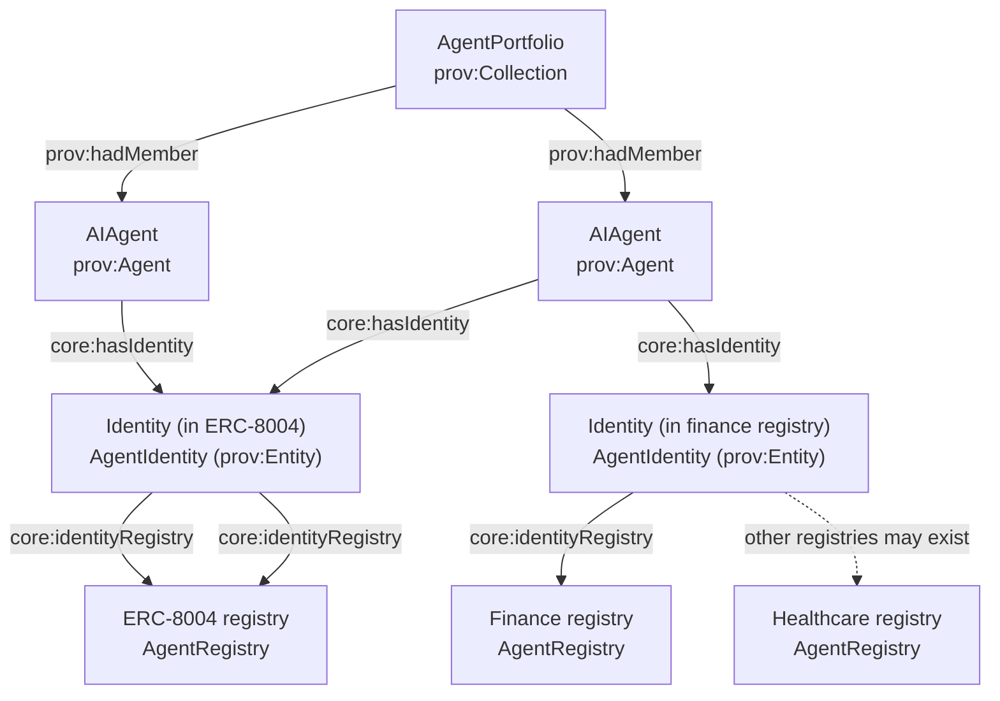

# Agent portfolios (fleet governance + orchestration)

This page defines the **AgentPortfolio** concept and why it matters for agent discovery, governance, and orchestration.

See also: [`agent-registry.md`](./agent-registry.md) (registries, identity issuance, and portfolio curation patterns).

## What a portfolio is (and is not)

- **AgentPortfolio**: a **grouping** (“portfolio”, “fleet”) of specialized agents used for routing, governance, access control, and reporting.
- **Orthogonal to registry**: a portfolio can be curated by many mechanisms, including a registry spun up specifically to define/maintain that portfolio.

Key distinction:

- **Registry** answers: “*Which identity representations exist, under what rules, and who asserts them?*”
- **Portfolio** answers: “*Which agents are in a governed/orchestrated set for a task/vertical/business domain (including consortium-governed portfolios)?*”

## Why portfolios matter

The phrase “govern and orchestrate a fleet of agents” implies:

- **Grouping**: you need a first-class “set of agents” to govern and query.
- **Routing**: intent types / skills can be matched at the portfolio level (“which agent in this portfolio can satisfy this intent?”).
- **Policy**: operators/providers can be authorized to operate *deployments for agents in a portfolio*.
- **Reporting**: portfolio-level rollups (coverage by skill/domain, trust posture, verification status).

## Ontology grounding (AgenticTrust)

`core:AgentPortfolio` is modeled as:

- `core:AgentPortfolio ⊑ prov:Collection`
- Membership uses **PROV**: `prov:hadMember` (Portfolio → `core:AIAgent`)

This choice keeps portfolios:

- composable with provenance and activity reporting
- compatible with existing PROV tooling
- independent from any single registry ecosystem

## ERC-8041 and portfolio membership onchain

If portfolio membership/governance is represented **onchain**, an ERC like **ERC‑8041** can act as an onchain anchor that defines and updates portfolio membership and policy surface.

- Reference: [`https://eips.ethereum.org/EIPS/eip-8041`](https://eips.ethereum.org/EIPS/eip-8041)

In AgenticTrust terms, this typically means:

- the **portfolio** is still `core:AgentPortfolio` (a `prov:Collection`)
- the onchain contract/registry is modeled as a **Registry/Descriptor source** that *curates* that portfolio (portfolio membership is derived from its events/state)

## Minimal Agent Registries (ERC-6909) as portfolio-curation infrastructure

A practical onchain way to “spin up a registry for a portfolio” is a **Minimal Agent Registry** built on **ERC‑6909** tokens with **ERC‑8048/8049** metadata, where each agent is represented as a token ID and the contract itself carries registry-level metadata.

- Spec (draft): [`erc-agent-registry.md`](https://github.com/nxt3d/ERCs/blob/agent-registry/ERCS/erc-agent-registry.md)

Why it matters for portfolios:

- **Portfolio-by-registry**: anyone can deploy a registry specialized to a curated portfolio (whitehat agents, DeFi strategy agents, enterprise-approved agents, etc.).
- **Market-shaped registries**: multiple registries can coexist (different governance, admission criteria, vertical standards) without forcing a singleton.
- **AgentPortfolio mapping**: index the registry and materialize:
  - the portfolio node as an `core:AgentPortfolio`
  - membership edges via `prov:hadMember` (derived from registry agent IDs / metadata such as `agent_account`)

### HCS-10 as a message-based portfolio curation substrate

Hedera provides a concrete, message-based pattern for registry + discovery:

- **HCS-10 (OpenConvAI)**: agents register and are discovered via consensus topics.
  - Reference: [HCS-10 docs](https://hol.org/docs/standards/hcs-10/)

Portfolio tie-in:

- a registry topic can act as the **curation mechanism** that defines a portfolio’s membership set
- an indexer can materialize those entries into `AgentPortfolio` membership edges (`prov:hadMember`)

## Diagram: portfolio + identity registries (plural, market-shaped)

This is the **anti-singleton** pattern: ERC-8004 is *one* registry; vertical/market registries can coexist.



## The “ERC-8004 registry singleton” issue (and how to avoid it)

If ERC-8004 becomes “the” singleton registry in your modeling, you lose:

- market-driven registry competition
- vertical/domain-specific identity standards
- multiple coexisting trust regimes (e.g., finance vs healthcare compliance)
- portability across ecosystems

AgenticTrust avoids that by modeling:

- **Agent** (`core:AIAgent`) as the durable trust-graph anchor
- **Identity** (`core:AgentIdentity`, `prov:Entity`) as **registry-scoped** representations
- **Registries** (`core:AgentRegistry`) as explicit entities (plural, not assumed singleton)

Portfolios then sit *orthogonally* to registries: a portfolio can include agents with identities in many registries.

## SPARQL patterns

### 1) List portfolios and their members

```sparql
PREFIX prov: <http://www.w3.org/ns/prov#>
PREFIX core: <https://agentictrust.io/ontology/core#>

SELECT ?portfolio (COUNT(DISTINCT ?agent) AS ?agentCount)
WHERE {
  ?portfolio a core:AgentPortfolio ;
             prov:hadMember ?agent .
  ?agent a core:AIAgent .
}
GROUP BY ?portfolio
ORDER BY DESC(?agentCount) ?portfolio
LIMIT 200
```

### 2) Portfolio members with their registries (show plural identity)

```sparql
PREFIX prov: <http://www.w3.org/ns/prov#>
PREFIX core: <https://agentictrust.io/ontology/core#>

SELECT DISTINCT ?agent ?identity ?registry
WHERE {
  VALUES (?portfolio) { (<PORTFOLIO_IRI>) }

  ?portfolio a core:AgentPortfolio ;
             prov:hadMember ?agent .
  ?agent a core:AIAgent .

  OPTIONAL {
    ?agent core:hasIdentity ?identity .
    OPTIONAL { ?identity core:identityRegistry ?registry . }
  }
}
ORDER BY ?agent ?identity ?registry
LIMIT 500
```

### 3) Portfolio “coverage”: which OASF skills exist across the portfolio

```sparql
PREFIX prov: <http://www.w3.org/ns/prov#>
PREFIX core: <https://agentictrust.io/ontology/core#>

SELECT DISTINCT ?skillId
WHERE {
  VALUES (?portfolio) { (<PORTFOLIO_IRI>) }
  ?portfolio a core:AgentPortfolio ;
             prov:hadMember ?agent .
  ?agent a core:AIAgent ;
         core:hasIdentity ?identity .
  ?identity core:hasDescriptor ?reg .

  ?reg core:hasSkill ?agentSkill .
  ?agentSkill core:hasSkillClassification ?skillNode .
  ?skillNode core:oasfSkillId ?skillId .
}
ORDER BY ?skillId
LIMIT 500
```

## Why “Google Agentspace” led to AgentPortfolio

Agentspace language (“portfolio of specialized agents”, “fleet of agents”) is explicitly about **governable sets** and **orchestration across multiple agents**.

In graph terms, that requires a first-class:

- **set node** (portfolio)
- **membership edges** (hadMember)

Without that node, you can’t easily express portfolio-level governance, reporting, or routing constraints as data.

See also: [`google-agentspace.md`](./google-agentspace.md).


