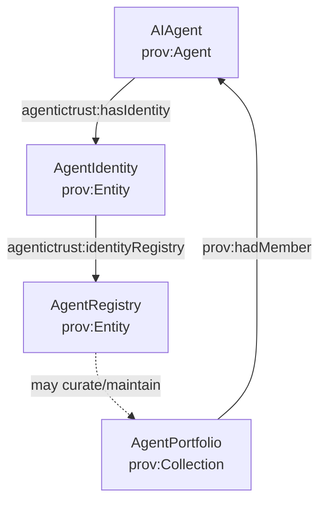

# Agent registries (AgentRegistry) and their relation to agents, portfolios, and identity

This page documents the **registry layer** in AgenticTrust: how **registries** relate to **Agents**, **AgentIdentity** (registry-scoped identity representations), **Identifiers**, and **AgentPortfolios**.

## Core idea: registries are plural and market-shaped

AgenticTrust does **not** assume a singleton “global registry”.

- ERC-8004 is **one** registry ecosystem.
- Vertical/market registries (finance, healthcare, enterprise procurement, safety/compliance) can coexist.
- Registries may be governed by a **single org** or a **consortium**.

This is why identity is modeled as **registry-scoped**: it preserves pluralism, competition, and domain-specific standards.

## Key entities and relations

- **Agent** (`agentictrust:AIAgent`, `prov:Agent`): the durable trust-graph anchor (“the thing that exists/acts”).
- **Registry** (`agentictrust:AgentRegistry`, `prov:Entity`): an entity representing a registry system (its policy surface, governance, scope).
- **Identity** (`agentictrust:AgentIdentity`, `prov:Entity`): a registry-scoped identity representation/record for an agent.
- **Identifier** (`agentictrust:Identifier`, `agentictrust:DID`, etc.): symbolic references used for lookup and linkage (DID/UAID/ENS/etc.).
- **Portfolio** (`agentictrust:AgentPortfolio`, `prov:Collection`): a grouping of agents (often curated/maintained by a registry, consortium, or marketplace).

### Canonical links (typical)

- `agentictrust:hasIdentity` (Agent → AgentIdentity)
- `agentictrust:identityRegistry` (AgentIdentity → AgentRegistry)
- `prov:identifier` (on Identity, Identifier artifacts, or both, depending on modeling choice)
- `prov:hadMember` (AgentPortfolio → Agent)

## Diagram: registry-scoped identity + portfolio curation



## Hedera / HCS registries (HCS-10) and registry addressing (HCS-14)

Hedera provides a concrete example of a **message-based** registry substrate:

- **HCS-10 (OpenConvAI)**: defines how agents can register, be discovered, and interact via Hedera Consensus Service topics.
  - Reference: [HCS-10 docs](https://hol.org/docs/standards/hcs-10/)

AgenticTrust mapping:

- An HCS-10 registry topic can be modeled as an `agentictrust:AgentRegistry` (a registry-as-an-entity).
- Registry entries become `agentictrust:AgentIdentity` entities, scoped to that registry via `agentictrust:identityRegistry`.

Separately, AgenticTrust already carries **HCS-14-inspired routing parameters** on `agentictrust:UniversalIdentifier` (registry/proto/nativeId/uid/domain) so a single identifier can encode “how to resolve” across multiple registry ecosystems.

### HCS-14 relationship to HCS-10 (and HCS-2)

- **HCS-10** is about *registry operations and messaging* (register/discover/operate via topics).
- **HCS-14** is about *identifier/routing structure* (stable handle + resolution parameters), so clients can route to the right registry/protocol without hard-coding ecosystem-specific string parsing.

If you treat **HCS-2** as a lower-level “registry substrate” primitive (topic-based publication/resolution), then:

- **HCS-10** can be seen as a higher-level agent registry protocol on top of that substrate, and
- **HCS-14** provides a uniform way to reference/route to the right registry/protocol instance.

(If you have the canonical HCS-2 spec link you want cited, share it and we’ll wire it in here.)

## Why “ERC-8004 registry as singleton” is a problem

If you treat ERC-8004 as “the registry”, you inadvertently bake in:

- a single governance regime
- one market structure
- one vertical’s requirements
- limited interoperability when other ecosystems want different rules

AgenticTrust instead treats registries as **first-class entities** and lets identities be **scoped to their registry**.

## Registry → identity vs registry → portfolio

Registries can relate to portfolios in different ways:

- **Portfolio-by-registry**: a registry is spun up specifically to define/maintain a portfolio (membership, governance rules, admission criteria).
- **Portfolio spans registries**: a portfolio includes agents whose identities live in multiple registries (cross-ecosystem portfolios).
- **Portfolio as market object**: a marketplace or consortium curates a portfolio and publishes membership + governance metadata.

This is why portfolios are **orthogonal** to registries: the same portfolio concept supports all of these patterns.

## SPARQL patterns

### 1) List registries and how many identities they issue

```sparql
PREFIX agentictrust: <https://www.agentictrust.io/ontology/agentictrust-core#>

SELECT ?registry (COUNT(DISTINCT ?identity) AS ?identityCount)
WHERE {
  ?identity a agentictrust:AgentIdentity ;
            agentictrust:identityRegistry ?registry .
}
GROUP BY ?registry
ORDER BY DESC(?identityCount) ?registry
LIMIT 200
```

### 2) Registry → Agents (via identities)

```sparql
PREFIX agentictrust: <https://www.agentictrust.io/ontology/agentictrust-core#>

SELECT DISTINCT ?registry ?agent ?identity
WHERE {
  ?identity a agentictrust:AgentIdentity ;
            agentictrust:identityRegistry ?registry .
  ?agent a agentictrust:AIAgent ;
         agentictrust:hasIdentity ?identity .
}
ORDER BY ?registry ?agent ?identity
LIMIT 500
```

### 3) Portfolios curated by a given registry (pattern query)

If you model a curation link (e.g., `agentictrust:curatesPortfolio` or encode curation in a Descriptor), use that here.
Today, this repo treats curation as a **pattern** (not a required OWL property).

```sparql
PREFIX agentictrust: <https://www.agentictrust.io/ontology/agentictrust-core#>
PREFIX prov: <http://www.w3.org/ns/prov#>

SELECT DISTINCT ?portfolio ?agent
WHERE {
  # Replace this with your chosen curation predicate if/when you add it.
  # ?registry agentictrust:curatesPortfolio ?portfolio .

  ?portfolio a agentictrust:AgentPortfolio ;
             prov:hadMember ?agent .
}
ORDER BY ?portfolio ?agent
LIMIT 500
```

## See also

- [`agent-identity.md`](./agent-identity.md): Agent vs AgentIdentity (registry-scoped) vs Identifier
- [`agent-portfolio.md`](./agent-portfolio.md): AgentPortfolio (fleet/portfolio grouping)

