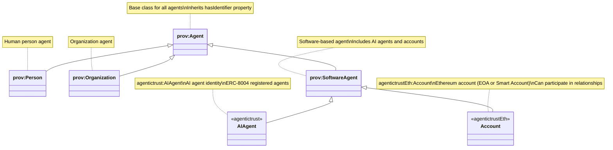
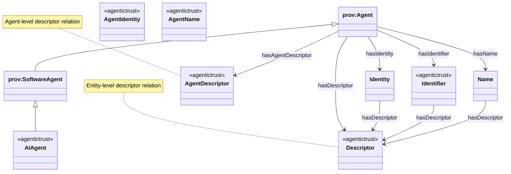

# Agent Classes and Identity Relationships

This document describes the Agent class hierarchy and how Agents relate to Identity, Identifier, and Name entities, all of which have Descriptors.

## AI Agents

In this ontology, an **AI agent** is an instance of `agentictrust:AIAgent` (a `prov:SoftwareAgent`).

### SPARQL: list all AI Agents

```sparql
PREFIX rdfs: <http://www.w3.org/2000/01/rdf-schema#>
PREFIX agentictrust: <https://www.agentictrust.io/ontology/agentictrust-core#>

SELECT DISTINCT ?agent ?agentType
WHERE {
  ?agent a ?agentType .
  ?agentType rdfs:subClassOf* agentictrust:AIAgent .
}
ORDER BY ?agentType ?agent
```

### SPARQL: AI Agents with Identity, Name, and Identifier

This returns each `agentictrust:AIAgent` along with (when present) its:
- ERC-8004 identity (`agentictrust:hasIdentity` → `erc8004:AgentIdentity8004`) and its identity identifier (`agentictrust:hasIdentifier` → `erc8004:IdentityIdentifier8004`)
- ENS name (`agentictrust:hasName` → `agentictrustEth:AgentNameENS`) and its ENS name identifier (`agentictrustEth:hasIdentifier` → `agentictrustEth:NameIdentifierENS`)
- Account identifier (`agentictrustEth:hasAccountIdentifier`) and its DID (`agentictrustEth:hasDID`)
- Any direct identifiers attached at the `prov:Agent` level (`agentictrust:hasIdentifier`)

```sparql
PREFIX agentictrust: <https://www.agentictrust.io/ontology/agentictrust-core#>
PREFIX agentictrustEth: <https://www.agentictrust.io/ontology/agentictrust-eth#>
PREFIX erc8004: <https://www.agentictrust.io/ontology/ERC8004#>

SELECT DISTINCT
  ?agent
  ?agentId
  ?directIdentifier
  ?accountIdentifier
  ?accountDid
  ?ensName
  ?ensNameValue
  ?ensNameIdentifier
  ?identity8004
  ?identity8004Identifier
WHERE {
  ?agent a agentictrust:AIAgent .

  OPTIONAL { ?agent agentictrust:agentId ?agentId . }
  OPTIONAL { ?agent agentictrust:hasIdentifier ?directIdentifier . }

  OPTIONAL {
    ?agent agentictrustEth:hasAccountIdentifier ?accountIdentifier .
    OPTIONAL { ?accountIdentifier agentictrustEth:hasDID ?accountDid . }
  }

  OPTIONAL {
    ?agent agentictrust:hasName ?ensName .
    OPTIONAL { ?ensName agentictrustEth:ensName ?ensNameValue . }
    OPTIONAL { ?ensName agentictrustEth:hasIdentifier ?ensNameIdentifier . }
  }

  OPTIONAL {
    ?agent agentictrust:hasIdentity ?identity8004 .
    OPTIONAL { ?identity8004 agentictrust:hasIdentifier ?identity8004Identifier . }
  }
}
ORDER BY ?agent
```

## Agent Class Hierarchy

The AgenticTrust ontology builds on PROV-O's Agent hierarchy:



## Agent to Identity, Identifier, and Name Relationships

Agents have relationships to three types of identity entities:

1. **Identity**: Protocol-specific identity (e.g., ERC-8004 identity)
2. **Identifier**: Stable identity anchors (AccountIdentifier, NameIdentifierENS, IdentityIdentifier8004)
3. **Name**: Human-readable names (AgentNameENS)

### Core Relationship Diagram (AgenticTrust core only)



### Complete Relationship Diagram (ERC-8004 + ENS)

```mermaid
classDiagram
    class provAgent["prov:Agent"]
    class provSoftwareAgent["prov:SoftwareAgent"]
    class AIAgent {
        <<agentictrust>>
    }
    class Account {
        <<agentictrustEth>>
    }
    class AgentIdentity {
        <<agentictrust>>
    }
    class AgentIdentity8004 {
        <<erc8004>>
    }
    class Identifier {
        <<abstract>>
    }
    class AccountIdentifier {
        <<agentictrustEth>>
    }
    class NameIdentifierENS {
        <<agentictrustEth>>
    }
    class IdentityIdentifier8004 {
        <<erc8004>>
    }
    class AgentName {
        <<agentictrust>>
    }
    class AgentNameENS {
        <<agentictrustEth>>
    }
    class AgentDescriptor {
        <<agentictrust>>
    }
    class IdentityDescriptor8004 {
        <<erc8004>>
    }
    class IdentifierDescriptor {
        <<agentictrust>>
    }
    class AccountDescriptor {
        <<agentictrustEth>>
    }
    class AgentNameENSDescriptor {
        <<agentictrustEth>>
    }
    
    provAgent <|-- provSoftwareAgent
    provSoftwareAgent <|-- AIAgent
    provSoftwareAgent <|-- Account
    
    provAgent --> Identifier : hasIdentifier
    provAgent --> AgentIdentity : hasIdentity
    provAgent --> AgentName : hasName

    AgentIdentity <|-- AgentIdentity8004
    AgentName <|-- AgentNameENS
    
    AgentIdentity8004 --> IdentityIdentifier8004 : hasIdentifier
    AgentNameENS --> NameIdentifierENS : hasIdentifier
    
    provAgent --> AgentDescriptor : hasAgentDescriptor
    AgentIdentity8004 --> IdentityDescriptor8004 : hasDescriptor
    Identifier --> IdentifierDescriptor : hasDescriptor
    AccountIdentifier --> AccountDescriptor : hasDescriptor
    AgentNameENS --> AgentNameENSDescriptor : hasDescriptor
    
    note for Identity8004 "erc8004:Identity8004\nERC-8004 on-chain identity"
    note for IdentityIdentifier8004 "erc8004:IdentityIdentifier8004\ndid:8004:chainId:agentId"
    note for AccountIdentifier "agentictrustEth:AccountIdentifier\nEthereum account identifier"
    note for NameIdentifierENS "agentictrustEth:NameIdentifierENS\nENS name identifier"
    note for NameENS "agentictrustEth:NameENS\nHuman-readable ENS name"
    note for AgentDescriptor "Agent→Descriptor uses hasAgentDescriptor\nEntity→Descriptor uses hasDescriptor"
```



## Agent Properties

### Core Agent Properties (inherited from prov:Agent)

- `agentictrust:hasIdentifier`: Links an Agent to its Identifier (inherited from `prov:Agent`, defined in `agentictrust-core.owl`)
  - Range: `agentictrust:Identifier`
  - Protocol-specific realizations: `AccountIdentifier`, `NameIdentifierENS`, `IdentityIdentifier8004`
- `agentictrust:hasIdentity`: Links an Agent to an AgentIdentity (e.g., `erc8004:AgentIdentity8004`)
  - Range: `agentictrust:AgentIdentity`
- `agentictrust:hasName`: Links an Agent to an AgentName (e.g., `agentictrustEth:AgentNameENS`)
  - Range: `agentictrust:AgentName`

### AIAgent-Specific Properties

- `agentictrust:hasIdentity`: Links an Agent to an Identity (e.g., `erc8004:Identity8004`)
  - Range: `agentictrust:Identity`
- `agentictrustEth:hasAccountIdentifier`: Links an AIAgent to its Ethereum AccountIdentifier
  - Range: `agentictrustEth:AccountIdentifier`
- `agentictrust:hasName`: Links an Agent to a Name (e.g., `agentictrustEth:NameENS`)
  - Range: `agentictrust:Name`
- `agentictrust:hasAgentDescriptor`: Links an Agent to its AgentDescriptor (subPropertyOf `agentictrust:hasDescriptor`)
  - Range: `agentictrust:AgentDescriptor`

### Account Properties (as SoftwareAgent)

- `agentictrust:hasIdentifier`: Links an Account to its AccountIdentifier (inherited from `prov:Agent`)
  - Range: `agentictrustEth:AccountIdentifier`
- `agentictrustEth:hasDID`: Links an AccountIdentifier to its DID
  - Range: `agentictrust:DID`

## Descriptor Relationships

All identity-related entities have Descriptors that provide resolved, normalized metadata:

- **Agent** → `hasDescriptor` → `AgentDescriptor`
- **Identity** (Identity8004) → `hasDescriptor` → `IdentityDescriptor8004`
- **Identifier** → `hasDescriptor` → `IdentifierDescriptor`
  - `AccountIdentifier` → `hasDescriptor` → `AccountDescriptor`
  - `NameIdentifierENS` → `hasDescriptor` → `NameDescriptorENS`

## SPARQL Queries

### Query: All Agent Types

```sparql
PREFIX prov: <http://www.w3.org/ns/prov#>
PREFIX agentictrust: <https://www.agentictrust.io/ontology/agentictrust-core#>
PREFIX agentictrustEth: <https://www.agentictrust.io/ontology/agentictrust-eth#>

SELECT ?agent ?agentType
WHERE {
  ?agent a ?agentType .
  ?agentType rdfs:subClassOf* prov:Agent .
}
ORDER BY ?agentType
```

### Query: AIAgent with Identity, Identifier, and Name

```sparql
PREFIX agentictrust: <https://www.agentictrust.io/ontology/agentictrust-core#>
PREFIX agentictrustEth: <https://www.agentictrust.io/ontology/agentictrust-eth#>
PREFIX erc8004: <https://www.agentictrust.io/ontology/ERC8004#>

SELECT ?agent ?agentId ?agentName 
       ?identity ?identityIdentifier
       ?accountIdentifier ?ensName ?ensNameIdentifier
WHERE {
  ?agent a agentictrust:AIAgent ;
    agentictrust:agentId ?agentId .
  
  OPTIONAL {
    ?agent agentictrust:agentName ?agentName .
  }
  
  # ERC-8004 Identity
  OPTIONAL {
    ?agent agentictrust:hasIdentity ?identity .
    ?identity agentictrust:hasIdentifier ?identityIdentifier .
    ?identityIdentifier a erc8004:IdentityIdentifier8004 .
  }
  
  # Account Identifier
  OPTIONAL {
    ?agent agentictrust:hasIdentifier ?accountIdentifier .
    ?accountIdentifier a agentictrustEth:AccountIdentifier .
  }
  
  # ENS Name
  OPTIONAL {
    ?agent agentictrust:hasName ?ensName .
    ?ensName agentictrustEth:hasIdentifier ?ensNameIdentifier .
    ?ensNameIdentifier a agentictrustEth:NameIdentifierENS .
  }
}
LIMIT 100
```

### Query: Agent with All Descriptors

```sparql
PREFIX agentictrust: <https://www.agentictrust.io/ontology/agentictrust-core#>
PREFIX agentictrustEth: <https://www.agentictrust.io/ontology/agentictrust-eth#>
PREFIX erc8004: <https://www.agentictrust.io/ontology/ERC8004#>

SELECT ?agent ?agentId 
       ?agentDescriptor ?identityDescriptor 
       ?accountDescriptor ?ensNameDescriptor
WHERE {
  ?agent a agentictrust:AIAgent ;
    agentictrust:agentId ?agentId .
  
  # Agent Descriptor
  OPTIONAL {
    ?agent agentictrust:hasAgentDescriptor ?agentDescriptor .
    ?agentDescriptor a agentictrust:AgentDescriptor .
  }
  
  # Identity Descriptor (via Identity8004)
  OPTIONAL {
    ?agent agentictrust:hasIdentity ?identity .
    ?identity agentictrust:hasDescriptor ?identityDescriptor .
    ?identityDescriptor a erc8004:IdentityDescriptor8004 .
  }
  
  # Account Descriptor (via AccountIdentifier)
  OPTIONAL {
    ?agent agentictrust:hasIdentifier ?accountIdentifier .
    ?accountIdentifier a agentictrustEth:AccountIdentifier .
    ?accountIdentifier agentictrust:hasDescriptor ?accountDescriptor .
    ?accountDescriptor a agentictrustEth:AccountDescriptor .
  }
  
  # ENS Name Descriptor (via NameENS)
  OPTIONAL {
    ?agent agentictrust:hasName ?ensName .
    ?ensName agentictrust:hasDescriptor ?ensNameDescriptor .
    ?ensNameDescriptor a agentictrustEth:AgentNameENSDescriptor .
  }
}
LIMIT 50
```

### Query: Account (SoftwareAgent) with Identifier and Descriptor

```sparql
PREFIX agentictrust: <https://www.agentictrust.io/ontology/agentictrust-core#>
PREFIX agentictrustEth: <https://www.agentictrust.io/ontology/agentictrust-eth#>
PREFIX prov: <http://www.w3.org/ns/prov#>

SELECT ?account ?accountAddress ?accountType
       ?accountIdentifier ?accountDescriptor ?did
WHERE {
  ?account a agentictrustEth:Account ;
    agentictrustEth:accountAddress ?accountAddress .
  
  OPTIONAL {
    ?account agentictrustEth:accountType ?accountType .
  }
  
  # Account Identifier (inherited from prov:Agent)
  OPTIONAL {
    ?account agentictrust:hasIdentifier ?accountIdentifier .
    ?accountIdentifier a agentictrustEth:AccountIdentifier .
  }
  
  # Account Descriptor
  OPTIONAL {
    ?accountIdentifier agentictrust:hasDescriptor ?accountDescriptor .
    ?accountDescriptor a agentictrustEth:AccountDescriptor .
  }
  
  # DID
  OPTIONAL {
    ?accountIdentifier agentictrustEth:hasDID ?did .
    ?did a agentictrust:DID .
  }
}
LIMIT 100
```

### Query: Agent Class Hierarchy (All Types)

```sparql
PREFIX prov: <http://www.w3.org/ns/prov#>
PREFIX agentictrust: <https://www.agentictrust.io/ontology/agentictrust-core#>
PREFIX agentictrustEth: <https://www.agentictrust.io/ontology/agentictrust-eth#>

SELECT ?agent ?agentType (COUNT(DISTINCT ?subclass) AS ?subclassCount)
WHERE {
  ?agent a ?agentType .
  ?agentType rdfs:subClassOf* prov:Agent .
  
  OPTIONAL {
    ?agentType rdfs:subClassOf ?subclass .
    ?subclass rdfs:subClassOf* prov:Agent .
  }
}
GROUP BY ?agent ?agentType
ORDER BY ?agentType
LIMIT 200
```

### Query: SoftwareAgent Subclasses (AIAgent and Account)

```sparql
PREFIX prov: <http://www.w3.org/ns/prov#>
PREFIX agentictrust: <https://www.agentictrust.io/ontology/agentictrust-core#>
PREFIX agentictrustEth: <https://www.agentictrust.io/ontology/agentictrust-eth#>

SELECT ?softwareAgent ?agentType ?identifier
WHERE {
  ?softwareAgent a prov:SoftwareAgent .
  
  {
    ?softwareAgent a agentictrust:AIAgent .
    BIND("AIAgent" AS ?agentType)
  }
  UNION
  {
    ?softwareAgent a agentictrustEth:Account .
    BIND("Account" AS ?agentType)
  }
  
  # Get identifier (inherited from prov:Agent)
  OPTIONAL {
    ?softwareAgent agentictrust:hasIdentifier ?identifier .
  }
}
LIMIT 100
```

### Query: Complete Agent Identity Chain

This query shows the complete chain from Agent through Identity/Identifier/Name to their Descriptors:

```sparql
PREFIX agentictrust: <https://www.agentictrust.io/ontology/agentictrust-core#>
PREFIX agentictrustEth: <https://www.agentictrust.io/ontology/agentictrust-eth#>
PREFIX erc8004: <https://www.agentictrust.io/ontology/ERC8004#>
PREFIX prov: <http://www.w3.org/ns/prov#>

SELECT ?agent ?agentId ?agentName
       ?identity ?identityDescriptor
       ?identifier ?identifierDescriptor
       ?name ?nameDescriptor
WHERE {
  ?agent a agentictrust:AIAgent ;
    agentictrust:agentId ?agentId .
  
  OPTIONAL {
    ?agent agentictrust:agentName ?agentName .
  }
  
  # Identity chain: Agent → Identity8004 → IdentityDescriptor8004
  OPTIONAL {
    ?agent agentictrust:hasIdentity ?identity .
    ?identity agentictrust:hasDescriptor ?identityDescriptor .
    ?identityDescriptor a erc8004:IdentityDescriptor8004 .
  }
  
  # Identifier chain: Agent → Identifier → IdentifierDescriptor
  OPTIONAL {
    ?agent agentictrust:hasIdentifier ?identifier .
    ?identifier a agentictrust:Identifier .
    ?identifier agentictrust:hasDescriptor ?identifierDescriptor .
    ?identifierDescriptor a agentictrust:IdentifierDescriptor .
  }
  
  # Name chain: Agent → Name → NameDescriptor
  OPTIONAL {
    ?agent agentictrust:hasName ?name .
    ?name a agentictrustEth:AgentNameENS .
    ?name agentictrust:hasDescriptor ?nameDescriptor .
    ?nameDescriptor a agentictrustEth:AgentNameENSDescriptor .
  }
}
LIMIT 50
```

### Query: Agent Descriptor with Skills and Endpoints

```sparql
PREFIX agentictrust: <https://www.agentictrust.io/ontology/agentictrust-core#>

SELECT ?agent ?agentId ?agentName ?descriptor ?agentSkill ?skill ?endpoint
WHERE {
  ?agent a agentictrust:AIAgent ;
    agentictrust:agentId ?agentId ;
    agentictrust:hasAgentDescriptor ?descriptor .
  
  OPTIONAL {
    ?agent agentictrust:agentName ?agentName .
  }
  
  OPTIONAL {
    ?descriptor agentictrust:hasSkill ?agentSkill .
    OPTIONAL { ?agentSkill agentictrust:hasSkillClassification ?skill . }
  }
  
  OPTIONAL {
    ?descriptor agentictrust:hasEndpoint ?endpoint .
  }
}
LIMIT 50
```

## Summary

The Agent model provides a layered identity approach:

1. **Agent Classes**: `prov:Agent` → `prov:SoftwareAgent` → `AIAgent` / `Account`
2. **Identity Layer**: Agent → `AgentIdentity8004` → `IdentityIdentifier8004`
3. **Identifier Layer**: Agent → `Identifier` (AccountIdentifier, NameIdentifierENS, IdentityIdentifier8004)
4. **Name Layer**: Agent → `AgentNameENS` → `NameIdentifierENS`
5. **Descriptor Layer**: Entities (Identity/Identifier/Name) → `hasDescriptor` → `Descriptor` (resolved metadata); Agents additionally use `hasAgentDescriptor`

All Agents inherit `hasIdentifier` from `prov:Agent`, enabling consistent identity management across all agent types.

## Hashgraph Online: UAID (HCS-14) and how it differs from AID

Hashgraph Online (HOL) uses the **Universal Agent ID (UAID)** concept (HCS-14) to represent a stable agent identifier across registries/protocols.

How UAID differs:

- **UAID is derived from a sovereign DID** — it is **not recomputed** from the six identity inputs every time.
- **UAID stays stable** unless the underlying DID changes.
- Implementations are encouraged to link previous vs successor identifiers using DID properties like `alsoKnownAs`, and optionally publish agent lifecycle history.

This means:

- **AID**: deterministic based on fixed fields
- **UAID**: stable, DID-backed identifier encapsulating an AID (or other identity) if present

### Example UAID string (informal)

```text
uaid:did:11155111:0x3AefD387b5BFC101936fF5B5d1A12E83A6C9a199;uid=agentic-trust-hcs-14-v2.8004-agent.eth;registry=agentic-trust;proto=a2a;nativeId=0x3aefd387b5bfc101936ff5b5d1a12e83a6c9a199
```

### Example canonical identity object (informal)

Here’s what the canonical data structure might look like **before hashing** to form an AID:

```json
{
  "registry": "hol:hcs2:registry:example",
  "name": "ChatAgentX",
  "version": "1.0.0",
  "protocol": ["xmpp", "http"],
  "nativeId": "did:pkh:eip155:1:0x1234...abcd",
  "skills": [
    "sendMessage",
    "receiveMessage",
    "queryStatus"
  ]
}
```

This canonical object is sorted and then the hashing/encoding rules produce the final deterministic ID string.

### How the six fields are used (AID)

Field → role in AID generation:

- `registry`: scopes the agent to a namespace/registry (e.g., an HCS-2 registry entry)
- `name`: human/organizational identity component
- `version`: ensures evolution/upgrades produce unique IDs
- `protocol`: indicates supported protocols or messaging stacks
- `nativeId`: ties to a native identifier (e.g., DID, wallet)
- `skills`: defines sorted capabilities & prevents ambiguity across builds

Together these establish a canonical identity fingerprint that is stable and repeatable.

See also: [`hashgraph-online.md`](./hashgraph-online.md).

