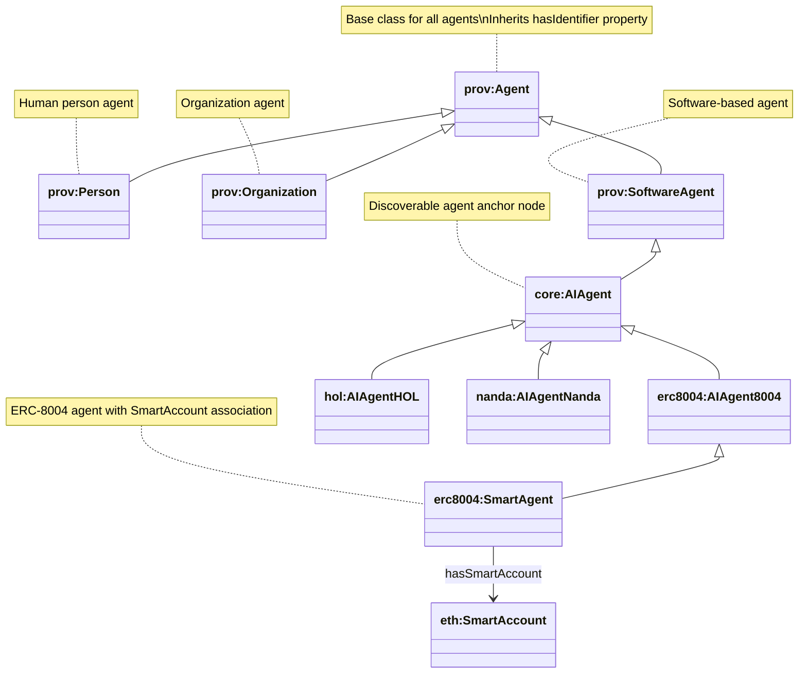
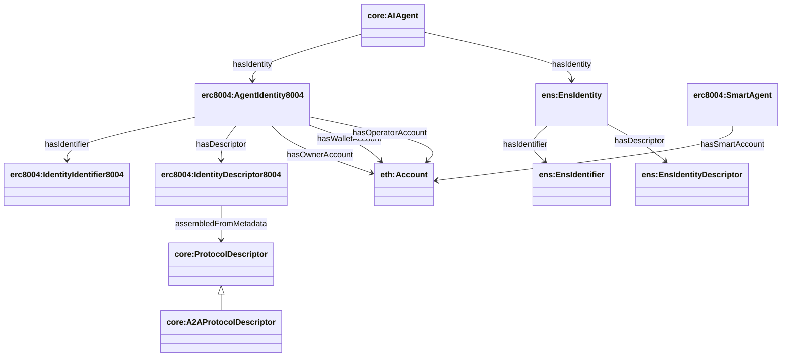

# Agent Classes and Identity Relationships

This document describes the Agent class hierarchy and how Agents relate to Identity, Identifier, and Name entities, all of which have Descriptors.

## AI Agents

In this ontology, an **AI agent** is an instance of `core:AIAgent` (a `prov:SoftwareAgent`).

### SPARQL: list all AI Agents

```sparql
PREFIX rdfs: <http://www.w3.org/2000/01/rdf-schema#>
PREFIX core: <https://agentictrust.io/ontology/core#>

SELECT DISTINCT ?agent ?agentType
WHERE {
  ?agent a ?agentType .
  ?agentType rdfs:subClassOf* core:AIAgent .
}
ORDER BY ?agentType ?agent
```

### SPARQL: AI Agents with Identity, Name, and Identifier

This returns each `core:AIAgent` along with (when present) its:
- **UAID** (`core:uaid`)
- **ERC-8004 DID** (`did:8004:<chainId>:<id>`) stored as `core:protocolIdentifier` on the ERC-8004 identity identifier
- **ERC-8004 identity** (`core:hasIdentity` → `erc8004:AgentIdentity8004`)
- **ENS identity** (`core:hasIdentity` → `ens:EnsIdentity`) and its DID (`did:ens:<name>`)
- **Smart account** (only for `erc8004:SmartAgent`): `erc8004:hasSmartAccount` → `eth:Account` (typed later as `eth:SmartAccount` vs `eth:EOAAccount`)

```sparql
PREFIX core: <https://agentictrust.io/ontology/core#>
PREFIX eth: <https://agentictrust.io/ontology/eth#>
PREFIX erc8004: <https://agentictrust.io/ontology/erc8004#>
PREFIX ens: <https://agentictrust.io/ontology/ens#>

SELECT
  ?agent
  (SAMPLE(?uaid) AS ?uaid)
  (SAMPLE(?did8004) AS ?did8004)
  (SAMPLE(?didAccount) AS ?didAccount)
  (SAMPLE(?identity8004) AS ?identity8004)
  (SAMPLE(?ensIdentity) AS ?ensIdentity)
  (SAMPLE(?didEns) AS ?didEns)
  (SAMPLE(?smartAccount) AS ?smartAccount)
WHERE {
  ?agent a core:AIAgent .

  OPTIONAL { ?agent core:uaid ?uaid . }

  OPTIONAL {
    ?agent core:hasIdentity ?identity8004 .
    ?identity8004 a erc8004:AgentIdentity8004 ;
                  core:hasIdentifier ?ident8004 .
    ?ident8004 core:protocolIdentifier ?did8004 .
  }

  OPTIONAL {
    ?agent core:hasIdentity ?ensIdentity .
    ?ensIdentity a ens:EnsIdentity ;
                 core:hasIdentifier ?ensIdentifier .
    ?ensIdentifier core:protocolIdentifier ?didEns .
  }

  OPTIONAL {
    ?agent a erc8004:SmartAgent ;
           erc8004:hasSmartAccount ?smartAccount .
  }

  # didAccount: prefer SmartAgent smartAccount DID, else wallet account DID
  OPTIONAL {
    ?smartAccount eth:hasAccountIdentifier ?saIdent .
    ?saIdent core:protocolIdentifier ?didAccount .
  }
  OPTIONAL {
    FILTER(!BOUND(?didAccount))
    ?identity8004 erc8004:hasWalletAccount ?wa .
    ?wa eth:hasAccountIdentifier ?waIdent .
    ?waIdent core:protocolIdentifier ?didAccount .
  }
}
GROUP BY ?agent
ORDER BY ?agent
```

## Agent Class Hierarchy

The AgenticTrust ontology builds on PROV-O's Agent hierarchy:



## Agent → Identity → Descriptor relationships (current sync model)

`apps/sync` emits a **standards-aligned** shape:

- **Agent → Identity**: `core:AIAgent core:hasIdentity core:AgentIdentity`
  - ERC‑8004 identity: `erc8004:AgentIdentity8004`
  - ENS identity: `ens:EnsIdentity`
- **Identity → Identifier**: `core:hasIdentifier core:UniversalIdentifier` with `core:protocolIdentifier` (literal DID string)
  - `did:8004:<chainId>:<id>`
  - `did:ens:<name>`
  - `did:ethr:<chainId>:<address>`
- **Identity → Descriptor**: `core:hasDescriptor core:Descriptor`
  - ERC‑8004 identity descriptor: `erc8004:IdentityDescriptor8004` (stores registration JSON as `core:json`)
  - ENS identity descriptor: `ens:EnsIdentityDescriptor`
- **Descriptor → ProtocolDescriptor**: `core:assembledFromMetadata`
  - A2A/MCP endpoints live on protocol descriptors (`core:serviceUrl`) and may store JSON (`core:json`)
- **Smart agent → smart account**: `erc8004:SmartAgent erc8004:hasSmartAccount eth:Account` (typed later as `eth:SmartAccount` vs `eth:EOAAccount`)
- **Owner/wallet/operator accounts** live on the **ERC‑8004 identity**:
  - `erc8004:hasOwnerAccount`, `erc8004:hasWalletAccount`, `erc8004:hasOperatorAccount`



## SPARQL Queries

### Query: All Agent Types

```sparql
PREFIX prov: <http://www.w3.org/ns/prov#>
PREFIX core: <https://agentictrust.io/ontology/core#>
PREFIX eth: <https://agentictrust.io/ontology/eth#>

SELECT ?agent ?agentType
WHERE {
  ?agent a ?agentType .
  ?agentType rdfs:subClassOf* prov:Agent .
}
ORDER BY ?agentType
```

### Query: AIAgent with Identity, Identifier, and Name

```sparql
PREFIX core: <https://agentictrust.io/ontology/core#>
PREFIX eth: <https://agentictrust.io/ontology/eth#>
PREFIX erc8004: <https://agentictrust.io/ontology/erc8004#>
PREFIX ens: <https://agentictrust.io/ontology/ens#>
PREFIX xsd: <http://www.w3.org/2001/XMLSchema#>

SELECT ?agent
       (SAMPLE(?uaid) AS ?uaid)
       (SAMPLE(?did8004) AS ?did8004)
       (SAMPLE(?agentId8004) AS ?agentId8004)
       (SAMPLE(?agentName) AS ?agentName)
       (SAMPLE(?identity8004) AS ?identity8004)
       (SAMPLE(?ownerAccount) AS ?ownerAccount)
       (SAMPLE(?operatorAccount) AS ?operatorAccount)
       (SAMPLE(?walletAccount) AS ?walletAccount)
       (SAMPLE(?smartAccount) AS ?smartAccount)
       (SAMPLE(?didAccount) AS ?didAccount)
       (SAMPLE(?ensIdentity) AS ?ensIdentity)
       (SAMPLE(?ensDid) AS ?ensDid)
WHERE {
  OPTIONAL {
    ?agent core:agentName ?agentName .
  }
  OPTIONAL { ?agent core:uaid ?uaid . }

  # ERC-8004 identity + DID8004
  OPTIONAL {
    ?agent core:hasIdentity ?identity8004 .
    ?identity8004 a erc8004:AgentIdentity8004 ;
                  core:hasIdentifier ?ident8004 .
    ?ident8004 core:protocolIdentifier ?did8004 .
    BIND(xsd:integer(REPLACE(STR(?did8004), "^did:8004:[0-9]+:", "")) AS ?agentId8004)

    OPTIONAL { ?identity8004 erc8004:hasOwnerAccount ?ownerAccount . }
    OPTIONAL { ?identity8004 erc8004:hasOperatorAccount ?operatorAccount . }
    OPTIONAL { ?identity8004 erc8004:hasWalletAccount ?walletAccount . }
  }

  # SmartAgent smart account
  OPTIONAL {
    ?agent a erc8004:SmartAgent ;
           erc8004:hasSmartAccount ?smartAccount .
    ?smartAccount eth:hasAccountIdentifier ?saIdent .
    ?saIdent core:protocolIdentifier ?didAccount .
  }

  # didAccount fallback to wallet account DID
  OPTIONAL {
    FILTER(!BOUND(?didAccount))
    ?identity8004 erc8004:hasWalletAccount ?wa .
    ?wa eth:hasAccountIdentifier ?waIdent .
    ?waIdent core:protocolIdentifier ?didAccount .
  }

  # ENS identity + did:ens:...
  OPTIONAL {
    ?agent core:hasIdentity ?ensIdentity .
    ?ensIdentity a ens:EnsIdentity ;
                 core:hasIdentifier ?ensIdent .
    ?ensIdent core:protocolIdentifier ?ensDid .
  }
}
GROUP BY ?agent
ORDER BY DESC(SAMPLE(?agentId8004))
LIMIT 100
```

### Query: Agent with All Descriptors

```sparql
PREFIX core: <https://agentictrust.io/ontology/core#>
PREFIX erc8004: <https://agentictrust.io/ontology/erc8004#>
PREFIX ens: <https://agentictrust.io/ontology/ens#>

SELECT ?agent
       (SAMPLE(?did8004) AS ?did8004)
       (SAMPLE(?identityDescriptor) AS ?identityDescriptor)
       (SAMPLE(?registrationJson) AS ?registrationJson)
       (SAMPLE(?ensDescriptor) AS ?ensDescriptor)
       (SAMPLE(?protocolDescriptor) AS ?protocolDescriptor)
       (SAMPLE(?serviceUrl) AS ?serviceUrl)
       (SAMPLE(?protocolJson) AS ?protocolJson)
WHERE {
  ?agent a core:AIAgent .

  OPTIONAL {
    ?agent core:hasIdentity ?identity8004 .
    ?identity8004 a erc8004:AgentIdentity8004 ;
                  core:hasIdentifier ?ident8004 ;
                  core:hasDescriptor ?identityDescriptor .
    ?ident8004 core:protocolIdentifier ?did8004 .
    OPTIONAL { ?identityDescriptor core:json ?registrationJson . }

    # Protocol descriptors (A2A/MCP) assembled from identity descriptor
    OPTIONAL {
      ?identityDescriptor core:assembledFromMetadata ?protocolDescriptor .
      ?protocolDescriptor a core:ProtocolDescriptor ;
                          core:serviceUrl ?serviceUrl .
      OPTIONAL { ?protocolDescriptor core:json ?protocolJson . }
    }
  }

  OPTIONAL {
    ?agent core:hasIdentity ?ensIdentity .
    ?ensIdentity a ens:EnsIdentity ;
                 core:hasDescriptor ?ensDescriptor .
  }
}
GROUP BY ?agent
ORDER BY ?agent
LIMIT 50
```

### Query: Account (SoftwareAgent) with Identifier and Descriptor

```sparql
PREFIX core: <https://agentictrust.io/ontology/core#>
PREFIX eth: <https://agentictrust.io/ontology/eth#>

SELECT ?account ?chainId ?accountAddress
       (SAMPLE(?accountType) AS ?accountType)
       (SAMPLE(?didEthr) AS ?didEthr)
WHERE {
  ?account a eth:Account ;
          eth:accountChainId ?chainId ;
          eth:accountAddress ?accountAddress .

  OPTIONAL { ?account a eth:SmartAccount . BIND("SmartAccount" AS ?accountType) }
  OPTIONAL { ?account a eth:EOAAccount . BIND("EOAAccount" AS ?accountType) }

  OPTIONAL {
    ?account eth:hasAccountIdentifier ?accountIdentifier .
    ?accountIdentifier a eth:AccountIdentifier ;
                      core:protocolIdentifier ?didEthr .
  }
}
GROUP BY ?account ?chainId ?accountAddress
ORDER BY ?chainId ?accountAddress
LIMIT 200
```

### Query: Agent Class Hierarchy (All Types)

```sparql
PREFIX prov: <http://www.w3.org/ns/prov#>
PREFIX core: <https://agentictrust.io/ontology/core#>
PREFIX eth: <https://agentictrust.io/ontology/eth#>

SELECT ?agent ?agentType (COUNT(DISTINCT ?subclass) AS ?subclassCount)
WHERE {
  ?agent a ?agentType .
  ?agentType rdfs:subClassOf* prov:Agent .
  
  OPTIONAL {
    ?agentType rdfs:subClassOf ?subclass .
    ?subclass rdfs:subClassOf* prov:Agent .
  }
}
GROUP BY ?agent ?agentType
ORDER BY ?agentType
LIMIT 200
```

### Query: SoftwareAgent Subclasses (AIAgent and Account)

```sparql
PREFIX prov: <http://www.w3.org/ns/prov#>
PREFIX core: <https://agentictrust.io/ontology/core#>
PREFIX eth: <https://agentictrust.io/ontology/eth#>

SELECT ?softwareAgent ?agentType
WHERE {
  ?softwareAgent a prov:SoftwareAgent .
  
  {
    ?softwareAgent a core:AIAgent .
    BIND("AIAgent" AS ?agentType)
  }
  UNION
  {
    ?softwareAgent a eth:Account .
    BIND("Account" AS ?agentType)
  }
  
}
LIMIT 100
```

### Query: Complete Agent Identity Chain

This query shows the complete chain from Agent → ERC-8004 Identity/Descriptor → Protocol descriptors (A2A):

```sparql
PREFIX core: <https://agentictrust.io/ontology/core#>
PREFIX erc8004: <https://agentictrust.io/ontology/erc8004#>
PREFIX ens: <https://agentictrust.io/ontology/ens#>

SELECT ?agent
       (SAMPLE(?uaid) AS ?uaid)
       (SAMPLE(?did8004) AS ?did8004)
       (SAMPLE(?identity8004) AS ?identity8004)
       (SAMPLE(?identityDescriptor) AS ?identityDescriptor)
       (SAMPLE(?registrationJson) AS ?registrationJson)
       (SAMPLE(?ensIdentity) AS ?ensIdentity)
       (SAMPLE(?ensDescriptor) AS ?ensDescriptor)
       (SAMPLE(?a2aEndpoint) AS ?a2aEndpoint)
       (SAMPLE(?a2aDescriptor) AS ?a2aDescriptor)
       (SAMPLE(?agentCardJson) AS ?agentCardJson)
WHERE {
  ?agent a core:AIAgent .
  OPTIONAL { ?agent core:uaid ?uaid . }

  ?agent core:hasIdentity ?identity8004 .
  ?identity8004 a erc8004:AgentIdentity8004 ;
                core:hasIdentifier ?ident8004 ;
                core:hasDescriptor ?identityDescriptor .
  ?ident8004 core:protocolIdentifier ?did8004 .

  OPTIONAL { ?identityDescriptor core:json ?registrationJson . }

  OPTIONAL {
    ?identityDescriptor core:assembledFromMetadata ?a2aDescriptor .
    ?a2aDescriptor a core:A2AProtocolDescriptor ;
                   core:serviceUrl ?a2aEndpoint .
    OPTIONAL { ?a2aDescriptor core:json ?agentCardJson . }
  }

  OPTIONAL {
    ?agent core:hasIdentity ?ensIdentity .
    ?ensIdentity a ens:EnsIdentity ;
                 core:hasDescriptor ?ensDescriptor .
  }
}
GROUP BY ?agent
LIMIT 100
```

### Query: Agent Descriptor with Skills and Endpoints

```sparql
PREFIX core: <https://agentictrust.io/ontology/core#>
PREFIX erc8004: <https://agentictrust.io/ontology/erc8004#>

SELECT ?agent ?did8004 ?protocolDescriptor ?serviceUrl ?skill
WHERE {
  ?agent a core:AIAgent ;
         core:hasIdentity ?identity8004 .
  ?identity8004 a erc8004:AgentIdentity8004 ;
                core:hasIdentifier ?ident8004 ;
                core:hasDescriptor ?desc8004 .
  ?ident8004 core:protocolIdentifier ?did8004 .

  ?desc8004 core:assembledFromMetadata ?protocolDescriptor .
  ?protocolDescriptor a core:ProtocolDescriptor ;
                      core:serviceUrl ?serviceUrl ;
                      core:hasSkill ?skill .
}
ORDER BY ?agent ?serviceUrl ?skill
LIMIT 200
```

## Summary

The current sync model is identity-centric:

1. **Agent anchor**: `core:AIAgent` (+ `core:uaid`)
2. **Identities**: `core:hasIdentity` → `erc8004:AgentIdentity8004` and optionally `ens:EnsIdentity`
3. **Identifiers**: identity `core:hasIdentifier` → `core:UniversalIdentifier` with `core:protocolIdentifier` (DID strings)
4. **Descriptors**: identity `core:hasDescriptor` → identity descriptor (registration JSON on `core:json`)
5. **Protocols**: identity descriptor `core:assembledFromMetadata` → protocol descriptor(s) (A2A/MCP endpoints via `core:serviceUrl`, skills via `core:hasSkill`)

## UAID (HCS-14): canonical identity + routing/bindings

In Agentic Trust, we use **UAID** (HCS-14) to support two complementary styles:

- **AID-first (canonical)**: `uaid:aid:<opaque-id>[;routing…]`
- **DID-targeted (self-sovereign)**: `uaid:did:<id>[;routing…]`

### Canonical (AID-first) UAID form (UAID as an identity)

Shape:

```text
uaid:aid:<opaque-id>[;routing…]
```

What it means:

- The UAID is **born as an identity**
- It exists independently of any **DID, chain, registry, or protocol**
- DIDs, registries, and protocols are **attached later** as bindings

Resolution flow:

```text
UAID (aid)
  → lookup bindings
      → DID(s)
          → keys / accounts / endpoints
```

When you use this:

- You control agent creation
- You want maximum longevity
- You want multi-registry, multi-DID agents
- You are designing an identity system

### UAID targeting a DID (self-sovereign identifier)

HCS-14 also defines a **DID-targeted** UAID form for agents that already have (or prefer to anchor to) a self-sovereign DID. See [HCS-14: Self-Sovereign Identifiers (UAID Targeting a DID)](https://hol.org/docs/standards/hcs-14/#self-sovereign-identifiers-uaid-targeting-a-did).

Shape:

```text
uaid:{target}:{id};uid={uid};registry={registry};proto={protocol};nativeId={nativeId};domain={domain}
```

In Agentic Trust, when using DID-targeted UAIDs, we typically target the agent’s **account DID** (e.g., `did:ethr:...`) derived from the controlling `agentAccount`, then attach registry/protocol bindings as routing parameters.

#### Example UAID (DID-targeted)

```json
{
  "uaid": "uaid:did:11155111:0xaFFe96485679cffa006042FE081AF30bD15c4249;registry=erc-8004;proto=a2a;nativeId=eip155:11155111:0xaFFe96485679cffa006042FE081AF30bD15c4249;uid=did:ethr:11155111:0xaFFe96485679cffa006042FE081AF30bD15c4249;domain=agentic-trust-hcs-14-v20.8004-agent.io"
}
```

Notes:

- **UAID target** (`uaid:did:...`): the DID-targeted identity anchor (the `{target}:{id}` portion).
- **`nativeId`**: the protocol-native stable lookup anchor in the source system (here an EVM account in `eip155:<chainId>:<address>` form).
- **`uid`**: a registry-scoped label/handle (often human-meaningful; can be an ENS name, agent id, or a DID string).
- **`domain`**: a web domain binding useful for discovery/routing (e.g., where `/.well-known/...` resources live).

### Process of generating UAID within Agentic Trust

1. Generate an ERC-8004 identity and receive an `agentId`.
2. Build the ERC-8004 DID from the identity: `did:8004:<chainId>:<agentId>`.
3. Create an Agentic Trust HCS-14 canonical AID for the new agent and add `did:8004` routing/bindings to it.
4. Add the new UAID (AID-first form + any routing/bindings) to the ERC-8004 registration (NFT token URI JSON).

### Example canonical identity object (informal)

Here’s what the canonical data structure might look like **before hashing** to form an AID:

```json
{
  "registry": "agentic-trust",
  "name": "ChatAgentX",
  "version": "1.0.0",
  "protocol": ["xmpp", "http"],
  "nativeId": "did:pkh:eip155:1:0x1234...abcd",
  "skills": [
    "sendMessage",
    "receiveMessage",
    "queryStatus"
  ]
}
```

This canonical object is sorted and then the hashing/encoding rules produce the final deterministic ID string.

### How the six fields are used (AID)

Field → role in AID generation:

- `registry`: scopes the agent to a namespace/registry (e.g., an HCS-2 registry entry)
- `name`: human/organizational identity component
- `version`: ensures evolution/upgrades produce unique IDs
- `protocol`: indicates supported protocols or messaging stacks
- `nativeId`: ties to a native identifier (e.g., DID, wallet)
- `skills`: defines sorted capabilities & prevents ambiguity across builds

Together these establish a canonical identity fingerprint that is stable and repeatable.

See also: [`hashgraph-online.md`](./hashgraph-online.md).

