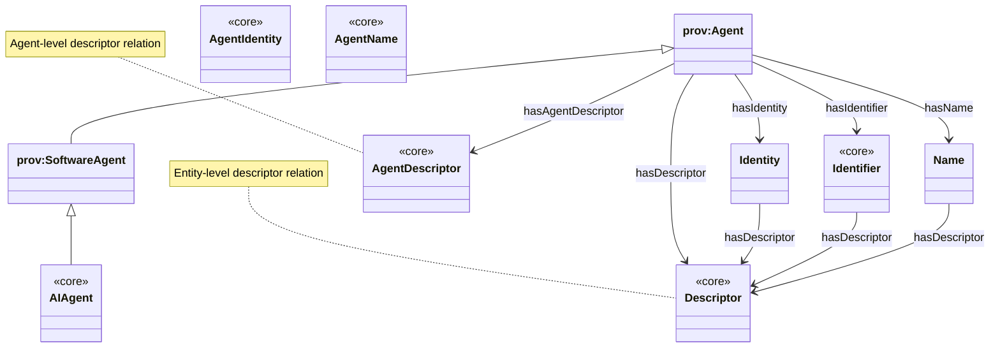
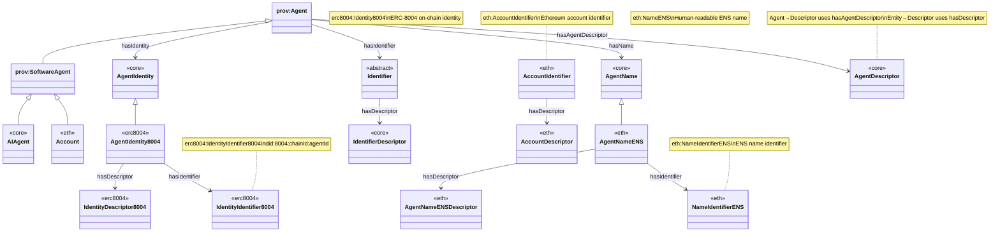

# Agent Classes and Identity Relationships

This document describes the Agent class hierarchy and how Agents relate to Identity, Identifier, and Name entities, all of which have Descriptors.

## AI Agents

In this ontology, an **AI agent** is an instance of `core:AIAgent` (a `prov:SoftwareAgent`).

### SPARQL: list all AI Agents

```sparql
PREFIX rdfs: <http://www.w3.org/2000/01/rdf-schema#>
PREFIX core: <https://agentictrust.io/ontology/core#>

SELECT DISTINCT ?agent ?agentType
WHERE {
  ?agent a ?agentType .
  ?agentType rdfs:subClassOf* core:AIAgent .
}
ORDER BY ?agentType ?agent
```

### SPARQL: AI Agents with Identity, Name, and Identifier

This returns each `core:AIAgent` along with (when present) its:
- **UAID** (`core:uaid`) and DIDs (`core:didIdentity`, `core:didAccount`)
- **ERC-8004 identity** (`core:hasIdentity` → `erc8004:AgentIdentity8004`) and its identifier (`erc8004:IdentityIdentifier8004`)
- **ENS identity** (`core:hasIdentity` → `ens:EnsIdentity`) and its identifier (`ens:EnsIdentifier`)
- **Smart account** (only for `erc8004:SmartAgent`): `erc8004:hasSmartAccount` → `eth:SmartAccount`

```sparql
PREFIX core: <https://agentictrust.io/ontology/core#>
PREFIX eth: <https://agentictrust.io/ontology/eth#>
PREFIX erc8004: <https://agentictrust.io/ontology/erc8004#>
PREFIX ens: <https://agentictrust.io/ontology/ens#>

SELECT
  ?agent
  ?uaid
  ?didIdentity
  ?didAccount
  ?identity8004
  ?identity8004Identifier
  ?ensIdentity
  ?ensIdentifier
  ?smartAccount
WHERE {
  ?agent a core:AIAgent .

  OPTIONAL { ?agent core:uaid ?uaid . }
  OPTIONAL { ?agent core:didIdentity ?didIdentity . }
  OPTIONAL { ?agent core:didAccount ?didAccount . }

  OPTIONAL {
    ?agent core:hasIdentity ?identity8004 .
    ?identity8004 a erc8004:AgentIdentity8004 .
    OPTIONAL { ?identity8004 core:hasIdentifier ?identity8004Identifier . }
  }

  OPTIONAL {
    ?agent core:hasIdentity ?ensIdentity .
    ?ensIdentity a ens:EnsIdentity .
    OPTIONAL { ?ensIdentity core:hasIdentifier ?ensIdentifier . }
  }

  OPTIONAL {
    ?agent a erc8004:SmartAgent ;
           erc8004:hasSmartAccount ?smartAccount .
  }
}
ORDER BY ?agent
```

## Agent Class Hierarchy

The AgenticTrust ontology builds on PROV-O's Agent hierarchy:

```mermaid
classDiagram
    class provAgent["prov:Agent"]
    class provPerson["prov:Person"]
    class provOrganization["prov:Organization"]
    class provSoftwareAgent["prov:SoftwareAgent"]
    class AIAgent["core:AIAgent"]
    class AIAgent8004["erc8004:AIAgent8004"]
    class SmartAgent["erc8004:SmartAgent"]
    class AIAgentHOL["hol:AIAgentHOL"]
    class AIAgentNanda["nanda:AIAgentNanda"]
    class SmartAccount["eth:SmartAccount"]
    
    provAgent <|-- provPerson
    provAgent <|-- provOrganization
    provAgent <|-- provSoftwareAgent
    provSoftwareAgent <|-- AIAgent
    AIAgent <|-- AIAgent8004
    AIAgent8004 <|-- SmartAgent
    AIAgent <|-- AIAgentHOL
    AIAgent <|-- AIAgentNanda

    SmartAgent --> SmartAccount : erc8004:hasSmartAccount
    
    note for provAgent "Base class for all agents\nInherits hasIdentifier property"
    note for provPerson "Human person agent"
    note for provOrganization "Organization agent"
    note for provSoftwareAgent "Software-based agent"
    note for AIAgent "Discoverable agent anchor node"
    note for SmartAgent "ERC-8004 agent with SmartAccount association"
```

## Agent to Identity, Identifier, and Name Relationships

Agents have relationships to three types of identity entities:

1. **Identity**: Protocol-specific identity (e.g., ERC-8004 identity)
2. **Identifier**: Stable identity anchors (AccountIdentifier, NameIdentifierENS, IdentityIdentifier8004)
3. **Name**: Human-readable names (AgentNameENS)

### Core Relationship Diagram (AgenticTrust core only)



### Complete Relationship Diagram (ERC-8004 + ENS)



## Agent Properties

### Core Agent Properties (inherited from prov:Agent)

- `core:hasIdentifier`: Links an Agent to its Identifier (inherited from `prov:Agent`, defined in `apps/ontology/ontology/core.ttl`)
  - Range: `core:Identifier`
  - Protocol-specific realizations: `AccountIdentifier`, `NameIdentifierENS`, `IdentityIdentifier8004`
- `core:hasIdentity`: Links an Agent to an AgentIdentity (e.g., `erc8004:AgentIdentity8004`)
  - Range: `core:AgentIdentity`
- `core:hasName`: Links an Agent to an AgentName (e.g., `eth:AgentNameENS`)
  - Range: `core:AgentName`

### AIAgent-Specific Properties

- `core:hasIdentity`: Links an Agent to an Identity (e.g., `erc8004:Identity8004`)
  - Range: `core:Identity`
- `eth:hasAccountIdentifier`: Links an AIAgent to its Ethereum AccountIdentifier
  - Range: `eth:AccountIdentifier`
- `core:hasName`: Links an Agent to a Name (e.g., `eth:NameENS`)
  - Range: `core:Name`
- `core:hasAgentDescriptor`: Links an Agent to its AgentDescriptor (subPropertyOf `core:hasDescriptor`)
  - Range: `core:AgentDescriptor`

### Account Properties (as SoftwareAgent)

- `core:hasIdentifier`: Links an Account to its AccountIdentifier (inherited from `prov:Agent`)
  - Range: `eth:AccountIdentifier`
- `eth:hasDID`: Links an AccountIdentifier to its DID
  - Range: `core:DID`

## Descriptor Relationships

All identity-related entities have Descriptors that provide resolved, normalized metadata:

- **Agent** → `hasDescriptor` → `AgentDescriptor`
- **Identity** (Identity8004) → `hasDescriptor` → `IdentityDescriptor8004`
- **Identifier** → `hasDescriptor` → `IdentifierDescriptor`
  - `AccountIdentifier` → `hasDescriptor` → `AccountDescriptor`
  - `NameIdentifierENS` → `hasDescriptor` → `NameDescriptorENS`

## SPARQL Queries

### Query: All Agent Types

```sparql
PREFIX prov: <http://www.w3.org/ns/prov#>
PREFIX core: <https://agentictrust.io/ontology/core#>
PREFIX eth: <https://agentictrust.io/ontology/eth#>

SELECT ?agent ?agentType
WHERE {
  ?agent a ?agentType .
  ?agentType rdfs:subClassOf* prov:Agent .
}
ORDER BY ?agentType
```

### Query: AIAgent with Identity, Identifier, and Name

```sparql
PREFIX core: <https://agentictrust.io/ontology/core#>
PREFIX eth: <https://agentictrust.io/ontology/eth#>
PREFIX erc8004: <https://agentictrust.io/ontology/erc8004#>

SELECT ?agent ?agentId ?agentName 
       ?identity ?identityIdentifier
       ?accountIdentifier ?ensName ?ensNameIdentifier
WHERE {
  ?agent a core:AIAgent ;
    core:agentId ?agentId .
  
  OPTIONAL {
    ?agent core:agentName ?agentName .
  }
  
  # ERC-8004 Identity
  OPTIONAL {
    ?agent core:hasIdentity ?identity .
    ?identity core:hasIdentifier ?identityIdentifier .
    ?identityIdentifier a erc8004:IdentityIdentifier8004 .
  }
  
  # Account Identifier
  OPTIONAL {
    ?agent core:hasIdentifier ?accountIdentifier .
    ?accountIdentifier a eth:AccountIdentifier .
  }
  
  # ENS Name
  OPTIONAL {
    ?agent core:hasName ?ensName .
    ?ensName eth:hasIdentifier ?ensNameIdentifier .
    ?ensNameIdentifier a eth:NameIdentifierENS .
  }
}
LIMIT 100
```

### Query: Agent with All Descriptors

```sparql
PREFIX core: <https://agentictrust.io/ontology/core#>
PREFIX eth: <https://agentictrust.io/ontology/eth#>
PREFIX erc8004: <https://agentictrust.io/ontology/erc8004#>

SELECT ?agent ?agentId 
       ?agentDescriptor ?identityDescriptor 
       ?accountDescriptor ?ensNameDescriptor
WHERE {
  ?agent a core:AIAgent ;
    core:agentId ?agentId .
  
  # Agent Descriptor
  OPTIONAL {
    ?agent core:hasAgentDescriptor ?agentDescriptor .
    ?agentDescriptor a core:AgentDescriptor .
  }
  
  # Identity Descriptor (via Identity8004)
  OPTIONAL {
    ?agent core:hasIdentity ?identity .
    ?identity core:hasDescriptor ?identityDescriptor .
    ?identityDescriptor a erc8004:IdentityDescriptor8004 .
  }
  
  # Account Descriptor (via AccountIdentifier)
  OPTIONAL {
    ?agent core:hasIdentifier ?accountIdentifier .
    ?accountIdentifier a eth:AccountIdentifier .
    ?accountIdentifier core:hasDescriptor ?accountDescriptor .
    ?accountDescriptor a eth:AccountDescriptor .
  }
  
  # ENS Name Descriptor (via NameENS)
  OPTIONAL {
    ?agent core:hasName ?ensName .
    ?ensName core:hasDescriptor ?ensNameDescriptor .
    ?ensNameDescriptor a eth:AgentNameENSDescriptor .
  }
}
LIMIT 50
```

### Query: Account (SoftwareAgent) with Identifier and Descriptor

```sparql
PREFIX core: <https://agentictrust.io/ontology/core#>
PREFIX eth: <https://agentictrust.io/ontology/eth#>
PREFIX prov: <http://www.w3.org/ns/prov#>

SELECT ?account ?accountAddress ?accountType
       ?accountIdentifier ?accountDescriptor ?did
WHERE {
  ?account a eth:Account ;
    eth:accountAddress ?accountAddress .
  
  OPTIONAL {
    ?account eth:accountType ?accountType .
  }
  
  # Account Identifier (inherited from prov:Agent)
  OPTIONAL {
    ?account core:hasIdentifier ?accountIdentifier .
    ?accountIdentifier a eth:AccountIdentifier .
  }
  
  # Account Descriptor
  OPTIONAL {
    ?accountIdentifier core:hasDescriptor ?accountDescriptor .
    ?accountDescriptor a eth:AccountDescriptor .
  }
  
  # DID
  OPTIONAL {
    ?accountIdentifier eth:hasDID ?did .
    ?did a core:DID .
  }
}
LIMIT 100
```

### Query: Agent Class Hierarchy (All Types)

```sparql
PREFIX prov: <http://www.w3.org/ns/prov#>
PREFIX core: <https://agentictrust.io/ontology/core#>
PREFIX eth: <https://agentictrust.io/ontology/eth#>

SELECT ?agent ?agentType (COUNT(DISTINCT ?subclass) AS ?subclassCount)
WHERE {
  ?agent a ?agentType .
  ?agentType rdfs:subClassOf* prov:Agent .
  
  OPTIONAL {
    ?agentType rdfs:subClassOf ?subclass .
    ?subclass rdfs:subClassOf* prov:Agent .
  }
}
GROUP BY ?agent ?agentType
ORDER BY ?agentType
LIMIT 200
```

### Query: SoftwareAgent Subclasses (AIAgent and Account)

```sparql
PREFIX prov: <http://www.w3.org/ns/prov#>
PREFIX core: <https://agentictrust.io/ontology/core#>
PREFIX eth: <https://agentictrust.io/ontology/eth#>

SELECT ?softwareAgent ?agentType ?identifier
WHERE {
  ?softwareAgent a prov:SoftwareAgent .
  
  {
    ?softwareAgent a core:AIAgent .
    BIND("AIAgent" AS ?agentType)
  }
  UNION
  {
    ?softwareAgent a eth:Account .
    BIND("Account" AS ?agentType)
  }
  
  # Get identifier (inherited from prov:Agent)
  OPTIONAL {
    ?softwareAgent core:hasIdentifier ?identifier .
  }
}
LIMIT 100
```

### Query: Complete Agent Identity Chain

This query shows the complete chain from Agent through Identity/Identifier/Name to their Descriptors:

```sparql
PREFIX core: <https://agentictrust.io/ontology/core#>
PREFIX eth: <https://agentictrust.io/ontology/eth#>
PREFIX erc8004: <https://agentictrust.io/ontology/erc8004#>
PREFIX prov: <http://www.w3.org/ns/prov#>

SELECT ?agent ?agentId ?agentName
       ?identity ?identityDescriptor
       ?identifier ?identifierDescriptor
       ?name ?nameDescriptor
WHERE {
  ?agent a core:AIAgent ;
    core:agentId ?agentId .
  
  OPTIONAL {
    ?agent core:agentName ?agentName .
  }
  
  # Identity chain: Agent → Identity8004 → IdentityDescriptor8004
  OPTIONAL {
    ?agent core:hasIdentity ?identity .
    ?identity core:hasDescriptor ?identityDescriptor .
    ?identityDescriptor a erc8004:IdentityDescriptor8004 .
  }
  
  # Identifier chain: Agent → Identifier → IdentifierDescriptor
  OPTIONAL {
    ?agent core:hasIdentifier ?identifier .
    ?identifier a core:Identifier .
    ?identifier core:hasDescriptor ?identifierDescriptor .
    ?identifierDescriptor a core:IdentifierDescriptor .
  }
  
  # Name chain: Agent → Name → NameDescriptor
  OPTIONAL {
    ?agent core:hasName ?name .
    ?name a eth:AgentNameENS .
    ?name core:hasDescriptor ?nameDescriptor .
    ?nameDescriptor a eth:AgentNameENSDescriptor .
  }
}
LIMIT 50
```

### Query: Agent Descriptor with Skills and Endpoints

```sparql
PREFIX core: <https://agentictrust.io/ontology/core#>

SELECT ?agent ?agentId ?agentName ?descriptor ?agentSkill ?skill ?endpoint
WHERE {
  ?agent a core:AIAgent ;
    core:agentId ?agentId ;
    core:hasAgentDescriptor ?descriptor .
  
  OPTIONAL {
    ?agent core:agentName ?agentName .
  }
  
  OPTIONAL {
    ?descriptor core:hasSkill ?agentSkill .
    OPTIONAL { ?agentSkill core:hasSkillClassification ?skill . }
  }
  
  OPTIONAL {
    ?descriptor core:hasEndpoint ?endpoint .
  }
}
LIMIT 50
```

## Summary

The Agent model provides a layered identity approach:

1. **Agent Classes**: `prov:Agent` → `prov:SoftwareAgent` → `AIAgent` / `Account`
2. **Identity Layer**: Agent → `AgentIdentity8004` → `IdentityIdentifier8004`
3. **Identifier Layer**: Agent → `Identifier` (AccountIdentifier, NameIdentifierENS, IdentityIdentifier8004)
4. **Name Layer**: Agent → `AgentNameENS` → `NameIdentifierENS`
5. **Descriptor Layer**: Entities (Identity/Identifier/Name) → `hasDescriptor` → `Descriptor` (resolved metadata); Agents additionally use `hasAgentDescriptor`

All Agents inherit `hasIdentifier` from `prov:Agent`, enabling consistent identity management across all agent types.

## UAID (HCS-14): canonical identity + routing/bindings

In Agentic Trust, we use **UAID** (HCS-14) to support two complementary styles:

- **AID-first (canonical)**: `uaid:aid:<opaque-id>[;routing…]`
- **DID-targeted (self-sovereign)**: `uaid:did:<id>[;routing…]`

### Canonical (AID-first) UAID form (UAID as an identity)

Shape:

```text
uaid:aid:<opaque-id>[;routing…]
```

What it means:

- The UAID is **born as an identity**
- It exists independently of any **DID, chain, registry, or protocol**
- DIDs, registries, and protocols are **attached later** as bindings

Resolution flow:

```text
UAID (aid)
  → lookup bindings
      → DID(s)
          → keys / accounts / endpoints
```

When you use this:

- You control agent creation
- You want maximum longevity
- You want multi-registry, multi-DID agents
- You are designing an identity system

### UAID targeting a DID (self-sovereign identifier)

HCS-14 also defines a **DID-targeted** UAID form for agents that already have (or prefer to anchor to) a self-sovereign DID. See [HCS-14: Self-Sovereign Identifiers (UAID Targeting a DID)](https://hol.org/docs/standards/hcs-14/#self-sovereign-identifiers-uaid-targeting-a-did).

Shape:

```text
uaid:{target}:{id};uid={uid};registry={registry};proto={protocol};nativeId={nativeId};domain={domain}
```

In Agentic Trust, when using DID-targeted UAIDs, we typically target the agent’s **account DID** (e.g., `did:ethr:...`) derived from the controlling `agentAccount`, then attach registry/protocol bindings as routing parameters.

#### Example UAID (DID-targeted)

```json
{
  "uaid": "uaid:did:11155111:0xaFFe96485679cffa006042FE081AF30bD15c4249;registry=erc-8004;proto=a2a;nativeId=eip155:11155111:0xaFFe96485679cffa006042FE081AF30bD15c4249;uid=did:ethr:11155111:0xaFFe96485679cffa006042FE081AF30bD15c4249;domain=agentic-trust-hcs-14-v20.8004-agent.io"
}
```

Notes:

- **UAID target** (`uaid:did:...`): the DID-targeted identity anchor (the `{target}:{id}` portion).
- **`nativeId`**: the protocol-native stable lookup anchor in the source system (here an EVM account in `eip155:<chainId>:<address>` form).
- **`uid`**: a registry-scoped label/handle (often human-meaningful; can be an ENS name, agent id, or a DID string).
- **`domain`**: a web domain binding useful for discovery/routing (e.g., where `/.well-known/...` resources live).

### Process of generating UAID within Agentic Trust

1. Generate an ERC-8004 identity and receive an `agentId`.
2. Build the ERC-8004 DID from the identity: `did:8004:<chainId>:<agentId>`.
3. Create an Agentic Trust HCS-14 canonical AID for the new agent and add `did:8004` routing/bindings to it.
4. Add the new UAID (AID-first form + any routing/bindings) to the ERC-8004 registration (NFT token URI JSON).

### Example canonical identity object (informal)

Here’s what the canonical data structure might look like **before hashing** to form an AID:

```json
{
  "registry": "agentic-trust",
  "name": "ChatAgentX",
  "version": "1.0.0",
  "protocol": ["xmpp", "http"],
  "nativeId": "did:pkh:eip155:1:0x1234...abcd",
  "skills": [
    "sendMessage",
    "receiveMessage",
    "queryStatus"
  ]
}
```

This canonical object is sorted and then the hashing/encoding rules produce the final deterministic ID string.

### How the six fields are used (AID)

Field → role in AID generation:

- `registry`: scopes the agent to a namespace/registry (e.g., an HCS-2 registry entry)
- `name`: human/organizational identity component
- `version`: ensures evolution/upgrades produce unique IDs
- `protocol`: indicates supported protocols or messaging stacks
- `nativeId`: ties to a native identifier (e.g., DID, wallet)
- `skills`: defines sorted capabilities & prevents ambiguity across builds

Together these establish a canonical identity fingerprint that is stable and repeatable.

See also: [`hashgraph-online.md`](./hashgraph-online.md).

