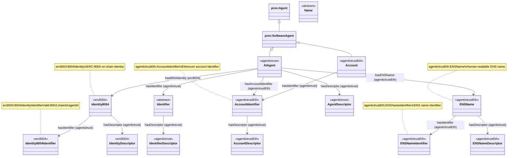

# Agent Classes and Identity Relationships

This document describes the Agent class hierarchy and how Agents relate to Identity, Identifier, and Name entities, all of which have Descriptors.

## AI Agents

In this ontology, an **AI agent** is an instance of `agentictrust:AIAgent` (a `prov:SoftwareAgent`).

### SPARQL: list all AI Agents

```sparql
PREFIX rdfs: <http://www.w3.org/2000/01/rdf-schema#>
PREFIX agentictrust: <https://www.agentictrust.io/ontology/agentictrust-core#>

SELECT DISTINCT ?agent ?agentType
WHERE {
  ?agent a ?agentType .
  ?agentType rdfs:subClassOf* agentictrust:AIAgent .
}
ORDER BY ?agentType ?agent
```

### SPARQL: AI Agents with Identity, Name, and Identifier

This returns each `agentictrust:AIAgent` along with (when present) its:
- ERC-8004 identity (`erc8004:has8004Identity`) and its identity identifier (`agentictrust:hasIdentifier`)
- ENS name (`agentictrustEth:hasENSName`) and its ENS name identifier (`agentictrustEth:hasIdentifier`)
- Account identifier (`agentictrustEth:hasAccountIdentifier`) and its DID (`agentictrustEth:hasDID`)
- Any direct identifiers attached at the `prov:Agent` level (`agentictrust:hasIdentifier`)

```sparql
PREFIX agentictrust: <https://www.agentictrust.io/ontology/agentictrust-core#>
PREFIX agentictrustEth: <https://www.agentictrust.io/ontology/agentictrust-eth#>
PREFIX erc8004: <https://www.agentictrust.io/ontology/ERC8004#>

SELECT DISTINCT
  ?agent
  ?agentId
  ?directIdentifier
  ?accountIdentifier
  ?accountDid
  ?ensName
  ?ensNameValue
  ?ensNameIdentifier
  ?identity8004
  ?identity8004Identifier
WHERE {
  ?agent a agentictrust:AIAgent .

  OPTIONAL { ?agent agentictrust:agentId ?agentId . }
  OPTIONAL { ?agent agentictrust:hasIdentifier ?directIdentifier . }

  OPTIONAL {
    ?agent agentictrustEth:hasAccountIdentifier ?accountIdentifier .
    OPTIONAL { ?accountIdentifier agentictrustEth:hasDID ?accountDid . }
  }

  OPTIONAL {
    ?agent agentictrustEth:hasENSName ?ensName .
    OPTIONAL { ?ensName agentictrustEth:ensName ?ensNameValue . }
    OPTIONAL { ?ensName agentictrustEth:hasIdentifier ?ensNameIdentifier . }
  }

  OPTIONAL {
    ?agent erc8004:has8004Identity ?identity8004 .
    OPTIONAL { ?identity8004 agentictrust:hasIdentifier ?identity8004Identifier . }
  }
}
ORDER BY ?agent
```

## Agent Class Hierarchy

The AgenticTrust ontology builds on PROV-O's Agent hierarchy:


## Agent to Identity, Identifier, and Name Relationships

Agents have relationships to three types of identity entities:

1. **Identity**: Protocol-specific identity (e.g., ERC-8004 identity)
2. **Identifier**: Stable identity anchors (AccountIdentifier, ENSNameIdentifier, 8004IdentityIdentifier)
3. **Name**: Human-readable names (ENSName)

### Complete Relationship Diagram



## Agent Properties

### Core Agent Properties (inherited from prov:Agent)

- `agentictrust:hasIdentifier`: Links an Agent to its Identifier (inherited from `prov:Agent`, defined in `agentictrust-core.owl`)
  - Range: `agentictrust:Identifier`
  - Protocol-specific realizations: `AccountIdentifier`, `ENSNameIdentifier`, `8004IdentityIdentifier`

### AIAgent-Specific Properties

- `erc8004:has8004Identity`: Links an AIAgent to its ERC-8004 identity
  - Range: `erc8004:8004Identity`
- `agentictrustEth:hasAccountIdentifier`: Links an AIAgent to its Ethereum AccountIdentifier
  - Range: `agentictrustEth:AccountIdentifier`
- `agentictrustEth:hasENSName`: Links an AIAgent to its ENS Name
  - Range: `agentictrustEth:ENSName`
- `agentictrust:hasAgentDescriptor`: Links an AIAgent to its AgentDescriptor
  - Range: `agentictrust:AgentDescriptor`

### Account Properties (as SoftwareAgent)

- `agentictrust:hasIdentifier`: Links an Account to its AccountIdentifier (inherited from `prov:Agent`)
  - Range: `agentictrustEth:AccountIdentifier`
- `agentictrustEth:hasDID`: Links an AccountIdentifier to its DID
  - Range: `agentictrust:DID`

## Descriptor Relationships

All identity-related entities have Descriptors that provide resolved, normalized metadata:

- **Agent** → `hasDescriptor` → `AgentDescriptor`
- **Identity** (8004Identity) → `hasDescriptor` → `8004IdentityDescriptor`
- **Identifier** → `hasDescriptor` → `IdentifierDescriptor`
  - `AccountIdentifier` → `hasDescriptor` → `AccountDescriptor`
  - `ENSNameIdentifier` → `hasDescriptor` → `ENSNameDescriptor`

## SPARQL Queries

### Query: All Agent Types

```sparql
PREFIX prov: <http://www.w3.org/ns/prov#>
PREFIX agentictrust: <https://www.agentictrust.io/ontology/agentictrust-core#>
PREFIX agentictrustEth: <https://www.agentictrust.io/ontology/agentictrust-eth#>

SELECT ?agent ?agentType
WHERE {
  ?agent a ?agentType .
  ?agentType rdfs:subClassOf* prov:Agent .
}
ORDER BY ?agentType
```

### Query: AIAgent with Identity, Identifier, and Name

```sparql
PREFIX agentictrust: <https://www.agentictrust.io/ontology/agentictrust-core#>
PREFIX agentictrustEth: <https://www.agentictrust.io/ontology/agentictrust-eth#>
PREFIX erc8004: <https://www.agentictrust.io/ontology/ERC8004#>

SELECT ?agent ?agentId ?agentName 
       ?identity ?identityIdentifier
       ?accountIdentifier ?ensName ?ensNameIdentifier
WHERE {
  ?agent a agentictrust:AIAgent ;
    agentictrust:agentId ?agentId .
  
  OPTIONAL {
    ?agent agentictrust:agentName ?agentName .
  }
  
  # ERC-8004 Identity
  OPTIONAL {
    ?agent erc8004:has8004Identity ?identity .
    ?identity agentictrust:hasIdentifier ?identityIdentifier .
    ?identityIdentifier a erc8004:8004IdentityIdentifier .
  }
  
  # Account Identifier
  OPTIONAL {
    ?agent agentictrust:hasIdentifier ?accountIdentifier .
    ?accountIdentifier a agentictrustEth:AccountIdentifier .
  }
  
  # ENS Name
  OPTIONAL {
    ?agent agentictrustEth:hasENSName ?ensName .
    ?ensName agentictrustEth:hasIdentifier ?ensNameIdentifier .
    ?ensNameIdentifier a agentictrustEth:ENSNameIdentifier .
  }
}
LIMIT 100
```

### Query: Agent with All Descriptors

```sparql
PREFIX agentictrust: <https://www.agentictrust.io/ontology/agentictrust-core#>
PREFIX agentictrustEth: <https://www.agentictrust.io/ontology/agentictrust-eth#>
PREFIX erc8004: <https://www.agentictrust.io/ontology/ERC8004#>

SELECT ?agent ?agentId 
       ?agentDescriptor ?identityDescriptor 
       ?accountDescriptor ?ensNameDescriptor
WHERE {
  ?agent a agentictrust:AIAgent ;
    agentictrust:agentId ?agentId .
  
  # Agent Descriptor
  OPTIONAL {
    ?agent agentictrust:hasAgentDescriptor ?agentDescriptor .
    ?agentDescriptor a agentictrust:AgentDescriptor .
  }
  
  # Identity Descriptor (via 8004Identity)
  OPTIONAL {
    ?agent erc8004:has8004Identity ?identity .
    ?identity agentictrust:hasDescriptor ?identityDescriptor .
    ?identityDescriptor a erc8004:8004IdentityDescriptor .
  }
  
  # Account Descriptor (via AccountIdentifier)
  OPTIONAL {
    ?agent agentictrust:hasIdentifier ?accountIdentifier .
    ?accountIdentifier a agentictrustEth:AccountIdentifier .
    ?accountIdentifier agentictrust:hasDescriptor ?accountDescriptor .
    ?accountDescriptor a agentictrustEth:AccountDescriptor .
  }
  
  # ENS Name Descriptor (via ENSName)
  OPTIONAL {
    ?agent agentictrustEth:hasENSName ?ensName .
    ?ensName agentictrust:hasDescriptor ?ensNameDescriptor .
    ?ensNameDescriptor a agentictrustEth:ENSNameDescriptor .
  }
}
LIMIT 50
```

### Query: Account (SoftwareAgent) with Identifier and Descriptor

```sparql
PREFIX agentictrust: <https://www.agentictrust.io/ontology/agentictrust-core#>
PREFIX agentictrustEth: <https://www.agentictrust.io/ontology/agentictrust-eth#>
PREFIX prov: <http://www.w3.org/ns/prov#>

SELECT ?account ?accountAddress ?accountType
       ?accountIdentifier ?accountDescriptor ?did
WHERE {
  ?account a agentictrustEth:Account ;
    agentictrustEth:accountAddress ?accountAddress .
  
  OPTIONAL {
    ?account agentictrustEth:accountType ?accountType .
  }
  
  # Account Identifier (inherited from prov:Agent)
  OPTIONAL {
    ?account agentictrust:hasIdentifier ?accountIdentifier .
    ?accountIdentifier a agentictrustEth:AccountIdentifier .
  }
  
  # Account Descriptor
  OPTIONAL {
    ?accountIdentifier agentictrust:hasDescriptor ?accountDescriptor .
    ?accountDescriptor a agentictrustEth:AccountDescriptor .
  }
  
  # DID
  OPTIONAL {
    ?accountIdentifier agentictrustEth:hasDID ?did .
    ?did a agentictrust:DID .
  }
}
LIMIT 100
```

### Query: Agent Class Hierarchy (All Types)

```sparql
PREFIX prov: <http://www.w3.org/ns/prov#>
PREFIX agentictrust: <https://www.agentictrust.io/ontology/agentictrust-core#>
PREFIX agentictrustEth: <https://www.agentictrust.io/ontology/agentictrust-eth#>

SELECT ?agent ?agentType (COUNT(DISTINCT ?subclass) AS ?subclassCount)
WHERE {
  ?agent a ?agentType .
  ?agentType rdfs:subClassOf* prov:Agent .
  
  OPTIONAL {
    ?agentType rdfs:subClassOf ?subclass .
    ?subclass rdfs:subClassOf* prov:Agent .
  }
}
GROUP BY ?agent ?agentType
ORDER BY ?agentType
LIMIT 200
```

### Query: SoftwareAgent Subclasses (AIAgent and Account)

```sparql
PREFIX prov: <http://www.w3.org/ns/prov#>
PREFIX agentictrust: <https://www.agentictrust.io/ontology/agentictrust-core#>
PREFIX agentictrustEth: <https://www.agentictrust.io/ontology/agentictrust-eth#>

SELECT ?softwareAgent ?agentType ?identifier
WHERE {
  ?softwareAgent a prov:SoftwareAgent .
  
  {
    ?softwareAgent a agentictrust:AIAgent .
    BIND("AIAgent" AS ?agentType)
  }
  UNION
  {
    ?softwareAgent a agentictrustEth:Account .
    BIND("Account" AS ?agentType)
  }
  
  # Get identifier (inherited from prov:Agent)
  OPTIONAL {
    ?softwareAgent agentictrust:hasIdentifier ?identifier .
  }
}
LIMIT 100
```

### Query: Complete Agent Identity Chain

This query shows the complete chain from Agent through Identity/Identifier/Name to their Descriptors:

```sparql
PREFIX agentictrust: <https://www.agentictrust.io/ontology/agentictrust-core#>
PREFIX agentictrustEth: <https://www.agentictrust.io/ontology/agentictrust-eth#>
PREFIX erc8004: <https://www.agentictrust.io/ontology/ERC8004#>
PREFIX prov: <http://www.w3.org/ns/prov#>

SELECT ?agent ?agentId ?agentName
       ?identity ?identityDescriptor
       ?identifier ?identifierDescriptor
       ?name ?nameDescriptor
WHERE {
  ?agent a agentictrust:AIAgent ;
    agentictrust:agentId ?agentId .
  
  OPTIONAL {
    ?agent agentictrust:agentName ?agentName .
  }
  
  # Identity chain: Agent → 8004Identity → 8004IdentityDescriptor
  OPTIONAL {
    ?agent erc8004:has8004Identity ?identity .
    ?identity agentictrust:hasDescriptor ?identityDescriptor .
    ?identityDescriptor a erc8004:8004IdentityDescriptor .
  }
  
  # Identifier chain: Agent → Identifier → IdentifierDescriptor
  OPTIONAL {
    ?agent agentictrust:hasIdentifier ?identifier .
    ?identifier a agentictrust:Identifier .
    ?identifier agentictrust:hasDescriptor ?identifierDescriptor .
    ?identifierDescriptor a agentictrust:IdentifierDescriptor .
  }
  
  # Name chain: Agent → Name → NameDescriptor
  OPTIONAL {
    ?agent agentictrustEth:hasENSName ?name .
    ?name a agentictrustEth:ENSName .
    ?name agentictrust:hasDescriptor ?nameDescriptor .
    ?nameDescriptor a agentictrustEth:ENSNameDescriptor .
  }
}
LIMIT 50
```

### Query: Agent Descriptor with Skills and Endpoints

```sparql
PREFIX agentictrust: <https://www.agentictrust.io/ontology/agentictrust-core#>

SELECT ?agent ?agentId ?agentName ?descriptor ?skill ?endpoint
WHERE {
  ?agent a agentictrust:AIAgent ;
    agentictrust:agentId ?agentId ;
    agentictrust:hasAgentDescriptor ?descriptor .
  
  OPTIONAL {
    ?agent agentictrust:agentName ?agentName .
  }
  
  OPTIONAL {
    ?descriptor agentictrust:hasSkill ?skill .
  }
  
  OPTIONAL {
    ?descriptor agentictrust:hasEndpoint ?endpoint .
  }
}
LIMIT 50
```

## Summary

The Agent model provides a layered identity approach:

1. **Agent Classes**: `prov:Agent` → `prov:SoftwareAgent` → `AIAgent` / `Account`
2. **Identity Layer**: Agent → `8004Identity` → `8004IdentityIdentifier`
3. **Identifier Layer**: Agent → `Identifier` (AccountIdentifier, ENSNameIdentifier, 8004IdentityIdentifier)
4. **Name Layer**: Agent → `ENSName` → `ENSNameIdentifier`
5. **Descriptor Layer**: All entities (Agent, Identity, Identifier, Name) → `Descriptor` (resolved metadata)

All Agents inherit `hasIdentifier` from `prov:Agent`, enabling consistent identity management across all agent types.

