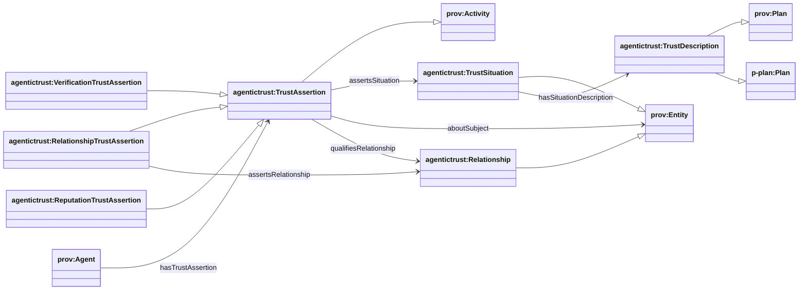
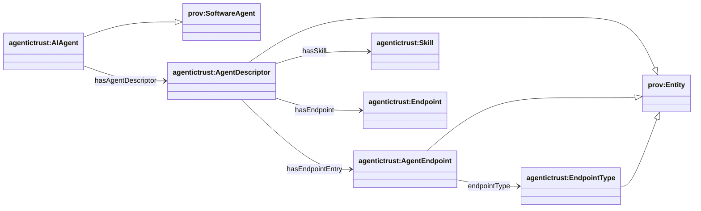

## AgenticTrust ontology overview (`agentictrust-core.owl`)

Source: `apps/badge-admin/public/ontology/agentictrust-core.owl`

AgenticTrust ontology uses **design patterns** inspired by well-known foundations:

- **PROV-O (`prov-o`)**: a W3C provenance model for describing **Agents**, **Activities**, and **Entities**, plus relations like “used”, “generated”, and timestamps. We use it to make trust events and artifacts queryable in a standard way across tools.
- **P-PLAN (`p-plan`)**: a lightweight planning/workflow vocabulary that complements PROV-O for describing **plans** and their realizations. We use it to align “descriptions/plans” with “situations/executions”.
- **DnS / DOLCE principles** (DOLCE+DnS): foundational ontology ideas that distinguish:
  - **Descriptions** (normative specifications: roles, constraints, intended outcomes)
  - **Situations** (time-scoped realizations of a description)
  - and the **information objects** generated/used by situations

We treat these as **guiding principles** for modeling trust, rather than importing a full DOLCE/DnS upper-ontology module.

### Layering diagram (principles → core → registries)

### Full diagram (generated)

- PNG: `docs/ontology/images/agentictrust.png`
- SVG: `docs/ontology/images/agentictrust.svg`

### Why a common “AgenticTrust” core matters

ERC registries and protocols encode related trust facts (identity/metadata, validation, feedback, relationships, protocol capabilities) but expose them in **different event shapes and storage locations**.

By mapping these into a shared AgenticTrust core (TrustDescription / TrustSituation / TrustAssertion, plus Skills/Intents/Tasks), we get a **normalized, cross-registry view** that the `agentictrust.io` application can use for:

- **Agent discovery**: consistent filtering/search across sources (skills, endpoints, intent/task types, validations, feedback, relationships)
- **Community development**: shared vocabulary to build “communities” around task types, skills, validators, relationship networks, and contribution/reputation signals
- **Composable analytics**: one SPARQL/graph model for ranking, clustering, and trend analysis across multiple registries

## AgenticTrust core ontology (key classes + relationships)

### Core trust model (DnS + PROV-O + P-PLAN)

- **TrustDescription**: normative “what/why” (subclass of `prov:Plan` and `p-plan:Plan`)
- **TrustSituation**: epistemic/social object (“what is being claimed to hold”) (subclass of `prov:Entity`)
- **TrustAssertion**: asserting act (“who asserted what, when”) (subclass of `prov:Activity`)
- **Relationship**: persistent relationship instance (subclass of `prov:Entity`)
- **RelationshipTrustAssertion**: constitutive assertion about a `Relationship` (subclass of `TrustAssertion`)

### Agent identity + metadata (core)

### Reading guide

- **Descriptor** (resolver-produced metadata): see [`descriptor.md`](./descriptor.md)
- **Description / Plan** (PROV-O + P-PLAN): see [`description.md`](./description.md)
- **Situation** (DnS / activities): see [`situation.md`](./situation.md)
- **Provenance** (PROV-O grounding): see [`provenance.md`](./provenance.md)
- **Skills / intents / tasks**: see [`skills-intents-tasks.md`](./skills-intents-tasks.md)
- **Discovery** (intent-driven): see [`discovery.md`](./discovery.md)
- **Trust building** (graph overlay): see the **Trust graph overlay** section in [`situation.md`](./situation.md)
- **OASF mapping** (AGNTCY): see [`oasf.md`](./oasf.md)

