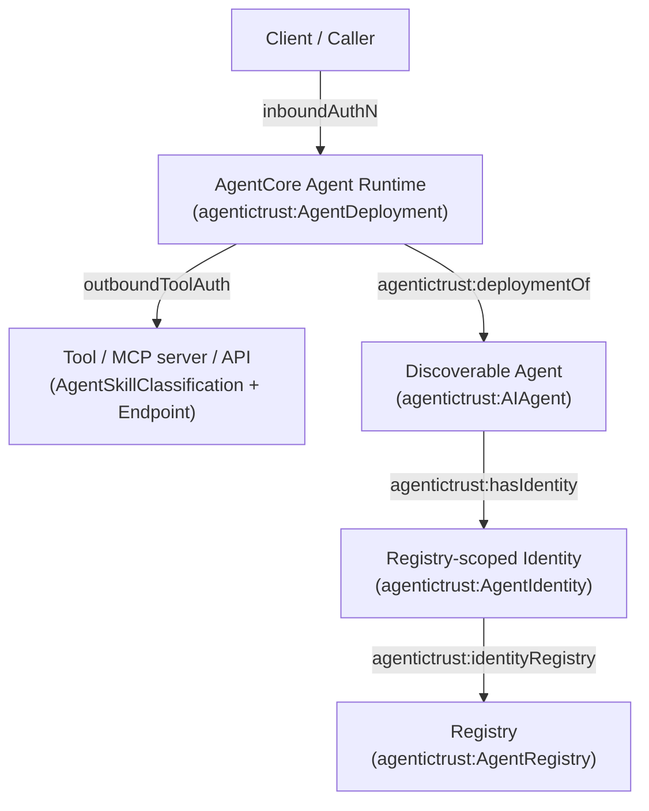

# Amazon Bedrock AgentCore mapped to AgenticTrust (deployment/endpoint-centric)

This page maps **Amazon Bedrock AgentCore** concepts to the AgenticTrust ontology, with emphasis on how AgentCore is centered on the **agent application as an endpoint-deployed runtime**.

Primary reference: [Amazon Bedrock AgentCore overview](https://docs.aws.amazon.com/bedrock-agentcore/latest/devguide/what-is-bedrock-agentcore.html)

## AgentCore framing vs AgenticTrust framing

- **AgentCore focus**: build/deploy/operate agents *securely at scale* as an application runtime + gateway + identity + policy + observability (an “agent platform”).
- **AgenticTrust focus**: represent agents, identities, registries, deployments, skills, intents, situations, and trust evidence as a **knowledge graph** grounded in PROV-O/DnS patterns.

Key alignment:

- AgentCore’s “agent” is closest to `agentictrust:AgentDeployment` (the reachable executor).
- AgenticTrust insists on a distinct **discoverable Agent** (`agentictrust:AIAgent`) as the stable trust-graph anchor.

See also: [`agent-application.md`](./agent-application.md) (Agent vs Deployment and verification primitives).

## Service mapping table (AgentCore → AgenticTrust)

From the AgentCore overview page, the core services include Runtime, Memory, Gateway, Identity, Observability, Evaluations, Policy, and hosted tools (Browser / Code Interpreter) ([Amazon Bedrock AgentCore overview](https://docs.aws.amazon.com/bedrock-agentcore/latest/devguide/what-is-bedrock-agentcore.html)).

| AgentCore service | AgentCore intent | AgenticTrust mapping (today) | Notes / gaps |
|---|---|---|---|
| Runtime | secure runtime for agents/tools, sessions, isolation | `agentictrust:AgentDeployment` + PROV Activities (`TaskExecution`, `SkillInvocation`) | session identity can be captured as Activity ids/fields; not modeled as a new Agent identity by default |
| Memory | short/long-term memory, shared stores | Model as `prov:Entity` “MemoryStore/MemorySnapshot” + Activities that `prov:used`/`prov:generated` | not a first-class class today; treat as Artifact/Descriptor-like entities if needed |
| Gateway | convert APIs/services to MCP-compatible tools, connect to MCP servers | `agentictrust:MCPProtocolDescriptor` + `AgentSkillClassification` + `JsonSchema` + `Endpoint` | Gateway creates “tool catalog” semantics; AgenticTrust represents tools as skills + schemas and keeps protocol descriptors as canonical sources |
| Identity | agent identity/access/authN management compatible w/ IdPs | `agentictrust:AgentRegistry` + `agentictrust:AgentIdentity` + `agentictrust:IdentifierDescriptor` | AgenticTrust is registry-plural and graph-native; AgentCore is service-centric |
| Observability | tracing/debug/monitoring agent workflows | PROV traces: `TaskExecution`, `SkillInvocation`, `AgentDescriptorFetch` (+ `prov:generatedAtTime`, etc.) | AgenticTrust can represent “why/what happened” as provenance graph |
| Evaluations | automated evaluation over sessions/traces | model eval results as `agentictrust:AttestedAssertion` about executions/deployments | evaluation-as-attestation is a clean fit; “quality score” is an asserted artifact |
| Policy | deterministic control, tool-call interception | represent policy as `TrustDescription` / Descriptor inputs + attest policy decisions as `AttestedAssertion` | enforcement happens outside the graph; the graph stores what policy was applied and what was allowed/denied |
| Browser / Code Interpreter | managed tool runtimes | represent as skills/tools available via descriptors; invocations as `SkillInvocation` | fits naturally as “tools” within the invocation trace |

## Deep dive 1: Agent identity (inbound identity + authentication)

AgentCore’s “Identity” service is about **secure agent identity, access, and authentication**, compatible with existing IdPs ([Amazon Bedrock AgentCore overview](https://docs.aws.amazon.com/bedrock-agentcore/latest/devguide/what-is-bedrock-agentcore.html)).

AgenticTrust perspective:

- **Inbound identity** is modeled by separating:
  - the **executor** (`AgentDeployment`) you are calling, from
  - the **discoverable agent** (`AIAgent`) it implements, and
  - the **registry-scoped identity records** (`AgentIdentity`) asserted in some `AgentRegistry`.
- Verification outputs should be represented as **evidence objects** (AttestedAssertions), not as “the agent itself”.

### What AgentCore gives you vs what AgenticTrust adds

- AgentCore: identity enforcement primitives (authN/authZ).
- AgenticTrust: a portable way to **represent** identity assertions and their provenance across registries and ecosystems (onchain, DNS, HCS topics, enterprise registries).

## Deep dive 2: Semantic tool selection + “search available tools in a specific context”

AgentCore positions itself as an agent platform where agents “take actions across tools and data with the right permissions and governance” and includes a Gateway that exposes MCP-compatible tools ([Amazon Bedrock AgentCore overview](https://docs.aws.amazon.com/bedrock-agentcore/latest/devguide/what-is-bedrock-agentcore.html)).

AgenticTrust splits “semantic tool selection” into 3 explicit graph layers:

1. **Tool inventory** (what tools exist, how to call them)
   - protocol-derived from A2A cards / MCP tool lists
   - represented via `ProtocolDescriptor` + `Endpoint` + `AgentSkillClassification` + `JsonSchema`
2. **Intent mapping** (why a tool/skill should be invoked)
   - `IntentType` + `targetsSkill` (intent → skill)
3. **Contextual execution trace** (what was invoked, under what situation/policy)
   - `TaskExecution` + `SkillInvocation` Activities with provenance links and timestamps

This is the ontology-friendly way to represent “semantic tool selection” without baking model-specific heuristics into the schema.

### AgentCore Gateway “Tool-RAG” (semantic retrieval over a tool catalog)

AgentCore’s Gateway is described as an MCP aggregation point that can turn APIs/Lambda into MCP-compatible tools and also connect to pre-existing MCP servers ([Amazon Bedrock AgentCore overview](https://docs.aws.amazon.com/bedrock-agentcore/latest/devguide/what-is-bedrock-agentcore.html)).

In practice, the pattern you described is:

Intent
  ↓
Semantic retrieval (`x_amz_bedrock_agentcore_search`)
  ↓
Small candidate tool set
  ↓
Normal MCP tool invocation

This is **Tool-RAG** (RAG over **tools**), not document RAG:

- the retrieval target is **tool metadata** (descriptions/schemas), not documents/KB passages
- the output is a **ranked shortlist of tool descriptors**, not answer text

#### How tools become “searchable”

When semantic tool selection is enabled on a Gateway, tools become searchable by embedding **natural-language tool metadata**, typically:

- description
- operation summary
- parameter descriptions
- (sometimes) tags/categories

Those embeddings are stored in a Gateway-scoped index.

Important implications:

- **Per-gateway isolation**: tools registered in Gateway A are invisible to Gateway B.
- **Reindexed on change**: adding/removing tools updates the index.
- **No LLM reasoning here**: this step is retrieval, not “skill reasoning” or chain-of-thought.

#### What `x_amz_bedrock_agentcore_search` does (and does not do)

This built-in MCP tool performs semantic retrieval over the Gateway’s tool index.

Example input:

```json
{
  "query": "send a Slack message to the security team",
  "max_results": 5
}
```

Conceptual behavior:

- query → embedding
- vector similarity search against tool metadata
- rank tools by relevance

Expected output shape (conceptual):

- tool name
- description
- input schema reference
- invocation handle

It does **not**:

- call tools
- validate permissions
- execute tool logic

It only answers:

> Which tools might be relevant for this intent, within this Gateway’s curated catalog?

One-sentence truth:

> `x_amz_bedrock_agentcore_search` searches a gateway-local, operator-defined catalog of tools that you explicitly register, using embeddings over tool metadata — nothing more, nothing less.

#### Contrast: what the Gateway *doesn’t* claim to be

In the AgentCore framing, the Gateway is an execution substrate (aggregation + governance), not:

- a capability ontology
- intent semantics reasoning
- portable agent identity mapping

Those layers sit above the Gateway in AgenticTrust (Agent/Identity/Registry, IntentType, AttestedAssertions).

#### Mapping Tool-RAG into AgenticTrust terms

AgenticTrust can represent the same pattern with explicit graph nodes:

- **Tool catalog**: `AgentSkillClassification` (+ `JsonSchema`) derived from `MCPProtocolDescriptor`
- **Semantic retrieval**: an *index/query method* over tool metadata (not a new ontology class)
  - store tool metadata as Descriptor fields/labels; use vector/full-text indexing as an implementation detail
- **Candidate tool set**: the shortlist returned by retrieval is a set of candidate `AgentSkillClassification` nodes
- **Invocation**: `SkillInvocation` Activities link to the selected skill via `agentictrust:invokesSkill`, with provenance and policy outcomes recorded as AttestedAssertions if needed

### Contrast (high-level)

- AgentCore: selection is primarily an operational runtime concern (choose tools at runtime).
- AgenticTrust: selection can be represented as:
  - **descriptions** (intent types target skills)
  - **facts** (what tools a deployment advertises)
  - **traces** (what was actually chosen and invoked)

## Deep dive 3: Task context + intent mapping

AgentCore emphasizes operating agents at scale and monitoring quality ([Amazon Bedrock AgentCore overview](https://docs.aws.amazon.com/bedrock-agentcore/latest/devguide/what-is-bedrock-agentcore.html)).

AgenticTrust makes “task context” queryable by design:

- **IntentType**: “why” (plan-like schema)
- **TaskExecution**: “how/when” (runtime activity)
- **SkillInvocation**: “what tool was called” (runtime activity)
- **Situation**: “what is happening / what trust context applies” (epistemic object)

This maps directly to “context-aware tool selection”:

- context → a Situation/Descriptor environment
- intent → `IntentType`
- tool selection → invocations over skills that satisfy the intent

See: [`intent.md`](./intent.md).

## Deep dive 4: inbound authN and outbound authZ/authN to tools

AgentCore highlights “the right permissions and governance”, an Identity service, and a Policy capability that can intercept tool calls ([Amazon Bedrock AgentCore overview](https://docs.aws.amazon.com/bedrock-agentcore/latest/devguide/what-is-bedrock-agentcore.html)).

AgenticTrust represents this as:

- **Inbound** (client → deployment):
  - represent the verifier’s conclusion as a VerificationTrustSituation + AttestedAssertion about the deployment/identity
  - keep raw evidence in `agentictrust:json` on the record nodes when needed
- **Outbound** (deployment → tool):
  - represent the tool-call as a `SkillInvocation` Activity
  - represent the authorization basis as:
    - delegation chain (`prov:actedOnBehalfOf`)
    - provider responsibility (`agentictrust:agentProvider`)
    - policy description (as a Descriptor/Plan-like entity)
  - represent allow/deny decisions as AttestedAssertions (auditable governance)

## Diagram: AgentCore endpoint-centric view vs AgenticTrust split



## Suggested alignments (documentation-first)

Based on AgentCore language, AgenticTrust is already well-positioned if we keep the following discipline:

- treat protocol tool catalogs (MCP/A2A) as **canonical sources** via `ProtocolDescriptor`
- represent selection and permissioning outcomes as **prov traces + attested assertions**
- keep identity registry pluralism (`AgentRegistry`) so enterprise/market registries can coexist with onchain/DNS/HCS patterns

## ERC-8004 agents as AgentCore Gateway tools (what must be supported)

Yes: you can *source* “tools” from ERC-8004 agent registrations and register them into an AgentCore Gateway tool catalog, so they become available for selection/invocation within that Gateway (and therefore eligible for Gateway semantic tool selection). AgentCore’s Gateway explicitly supports turning APIs/Lambda into tools and connecting to MCP servers ([Amazon Bedrock AgentCore overview](https://docs.aws.amazon.com/bedrock-agentcore/latest/devguide/what-is-bedrock-agentcore.html)).

The important point: **ERC‑8004 is discovery/registry metadata**; **AgentCore Gateway is an execution catalog**. Bridging them requires that the ERC‑8004 agents expose tool-callable interfaces that can be wrapped/represented as MCP tools.

### 1) A “tool-callable” interface (not just an agent identity)

To be pluggable as Gateway tools, an ERC‑8004 agent (or its endpoint) must expose something that can be modeled as a tool:

- **MCP server** that exposes tool definitions + invocation interface, or
- a stable **HTTP API** (OpenAPI-like) that the Gateway can wrap into tools, or
- an adapter that converts an A2A endpoint into callable tools (implementation-specific)

If a registration only provides a chat endpoint with no tool/function surface, Gateway semantic tool selection has nothing concrete to index/invoke.

### 2) Machine-readable “tool metadata” (so semantic retrieval works)

AgentCore Gateway semantic selection relies on embedding/indexing natural-language tool metadata. For ERC‑8004-sourced tools, you need, at minimum, tool-level metadata that can be extracted from registration/protocol descriptors:

- tool name
- tool description / operation summary
- parameter descriptions
- input schema (JSON Schema) and output schema (when possible)
- stable invocation handle (endpoint + operation id)

In AgenticTrust, this corresponds to:

- `AgentSkillClassification` + `JsonSchema`
- derived from `ProtocolDescriptor` metadata (MCP tool list / A2A skills → tool mapping)

### 3) Stable endpoints + versioning

Gateway catalogs behave best when tool endpoints are stable and tool schemas are versioned:

- stable `Endpoint` URL(s)
- explicit version of the tool surface (or deployment version)
- change semantics (breaking vs non-breaking)

This is also needed to make “reindexed on change” meaningful and auditable.

### 4) Inbound/outbound authentication + authorization story

To plug an ERC‑8004-sourced tool into AgentCore in a governed way, the tool must support an auth model the Gateway can enforce:

- inbound auth to the tool endpoint (API keys, OAuth, signed requests, mTLS, etc.)
- outbound identity/credentials from the calling deployment (service identity vs user delegation)
- explicit permission scope (what tool actions are allowed)

AgentCore emphasizes Identity + Policy + Gateway governance ([Amazon Bedrock AgentCore overview](https://docs.aws.amazon.com/bedrock-agentcore/latest/devguide/what-is-bedrock-agentcore.html)). From an AgenticTrust perspective, you want those decisions recorded as provenance/evidence:

- the invocation is a `SkillInvocation` activity
- allow/deny outcomes can be AttestedAssertions for auditability

### 5) Operational constraints (timeouts, quotas, safety)

To behave like “tools” in a larger governed catalog, ERC‑8004 endpoints should declare:

- timeouts and rate limits
- idempotency / retry semantics
- data handling constraints
- safety constraints (what the tool must not do)

Without these, the Gateway can still call tools, but governance/observability becomes brittle.

### 6) Practical pipeline (how you’d wire this)

A typical bridge looks like:

- ingest ERC‑8004 registration metadata → normalize to `AgentIdentity` + descriptor graph
- extract tool candidates from protocol descriptors (MCP tool list, A2A skills/domains, API endpoints)
- transform into Gateway-registered tool definitions (MCP-wrapped tools or API-wrapped tools)
- keep the Gateway catalog in sync (re-register/reindex on change)


