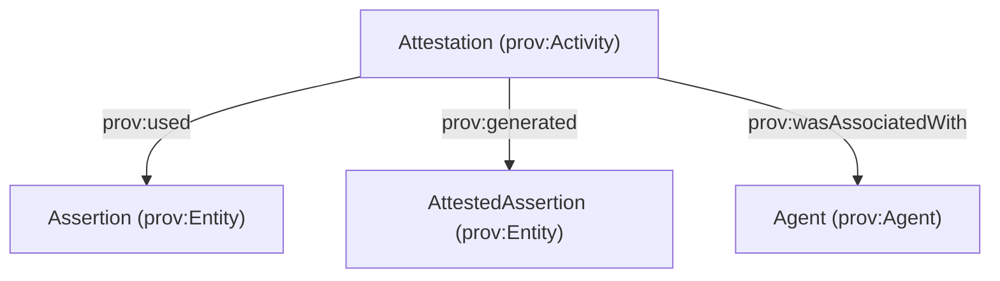

# AttestedAssertion (Assertion vs Attestation)

This page documents the **Assertion / Attestation / AttestedAssertion** pattern added to `apps/ontology/ontology/core.ttl`.

## Goal

Preserve both:

- **Epistemic neutrality of assertions** (an *Assertion* is content, not responsibility)
- **Social accountability of attestations** (an *Attestation* is an accountable act by an Agent)

## PROV-O definitions (core idea)

- **Assertion**: `prov:Entity` (no agent responsibility implied)
- **Attestation**: `prov:Activity` (agent-accountable act)
  - `prov:wasAssociatedWith` ← `prov:Agent`
  - `prov:used` → **Assertion**
  - `prov:generated` → **AttestedAssertion**
- **AttestedAssertion**: `prov:Entity` (durable output/artifact)



## Ontology classes (and inheritance)

### Assertion

- `core:Assertion` ⊑ `prov:Entity`

### Attestation

- `core:Attestation` ⊑ `core:AssertionAct` ⊑ `prov:Activity`
- Intended PROV constraints (modeled as OWL restrictions):
  - `prov:used` → `core:Assertion`
  - `prov:generated` → `core:AttestedAssertion`
  - `prov:wasAssociatedWith` → `prov:Agent`

### AttestedAssertion

- `core:AttestedAssertion` ⊑ `prov:Entity`
- **Trust assertions** are modeled as attested assertions:
  - `core:TrustAssertion` ⊑ `core:AttestedAssertion`
  - TrustAssertion specializations used in this repo:
    - `core:VerificationTrustAssertion`
    - `core:ReputationTrustAssertion`
    - `core:RelationshipTrustAssertion`
    - `core:DelegationTrustAssertion`

### Backward compatibility: AssertionRecord

- This repo removed the deprecated `core:AssertionRecord` alias. Use `core:AttestedAssertion`.

## How this integrates with existing trust graph patterns

AgenticTrust already uses:

- `core:assertsSituation` (AssertionAct → Situation)
- `core:generatedAssertionRecord` (AssertionAct → AttestedAssertion)
- `core:recordsSituation` (AttestedAssertion → Situation)

`core:Attestation` is the **accountable specialization** of `core:AssertionAct`.

## Authorization provenance: reputation assertions authorized by delegation

Sometimes you want to relate:

- an **attested assertion** (e.g., a Reputation / Feedback assertion), and
- the **delegation (authorization) assertion** that granted the attestor authority to make that assertion.

This is a **justification / authorization provenance** link, not:

- causation
- derivation of content
- identity
- mere participation

It is **authority provenance**.

### Canonical link (PROV-O): `prov:wasAuthorizedBy`

Use `prov:wasAuthorizedBy` as the canonical authorization relationship.

Conceptually:

```turtle
:FeedbackAssertion123
  prov:wasAuthorizedBy :FeedbackDelegationAssertion456 .
```

Even though many PROV examples show Activity→Agent, the semantics support authority provenance; here we are explicitly capturing an Entity→Entity authorization justification between assertion artifacts.

### AgenticTrust specialization: `core:wasAuthorizedByDelegation`

To keep query precision (and explicit Entity→Entity semantics), AgenticTrust provides:

- `core:wasAuthorizedByDelegation`
  - `rdfs:subPropertyOf prov:wasAuthorizedBy`
  - `rdfs:domain core:AttestedAssertion`
  - `rdfs:range core:DelegationTrustAssertion`

Usage:

```turtle
:FeedbackAssertion123
  core:wasAuthorizedByDelegation :FeedbackAuthDelegation456 .
```

See also: [`attested-delegation-assertion.md`](./attested-delegation-assertion.md).


## SPARQL queries

### 1) List all AttestedAssertions and the Attestations that generated them

```sparql
PREFIX prov: <http://www.w3.org/ns/prov#>
PREFIX core: <https://core.io/ontology/core#>

SELECT ?attested ?act ?agent
WHERE {
  ?attested a core:AttestedAssertion .
  OPTIONAL { ?attested core:assertionRecordOf ?act . }
  OPTIONAL { ?act prov:wasAssociatedWith ?agent . }
}
ORDER BY ?attested
LIMIT 200
```

### 2) Attestation acts, their input Assertion, and output AttestedAssertion

```sparql
PREFIX prov: <http://www.w3.org/ns/prov#>
PREFIX core: <https://core.io/ontology/core#>

SELECT ?attestation ?assertion ?attestedAssertion ?agent
WHERE {
  ?attestation a core:Attestation .
  OPTIONAL { ?attestation prov:used ?assertion . }
  OPTIONAL { ?attestation prov:generated ?attestedAssertion . }
  OPTIONAL { ?attestation prov:wasAssociatedWith ?agent . }
}
ORDER BY ?attestation
LIMIT 200
```

### 3) Trust assertions (as AttestedAssertions) and their situations

```sparql
PREFIX core: <https://core.io/ontology/core#>
PREFIX rdfs: <http://www.w3.org/2000/01/rdf-schema#>

SELECT ?trustAssertion ?trustAssertionType ?situation ?situationType
WHERE {
  ?trustAssertion a ?trustAssertionType .
  ?trustAssertionType rdfs:subClassOf* core:TrustAssertion .
  OPTIONAL {
    ?trustAssertion core:recordsSituation ?situation .
    OPTIONAL { ?situation a ?situationType . }
  }
}
ORDER BY ?trustAssertionType ?trustAssertion
LIMIT 200
```

### 4) Backward-compat check: resources typed as AssertionRecord (only if older data exists)

```sparql
PREFIX core: <https://core.io/ontology/core#>

SELECT (COUNT(?x) AS ?count)
WHERE {
  ?x a core:AssertionRecord .
}
```


