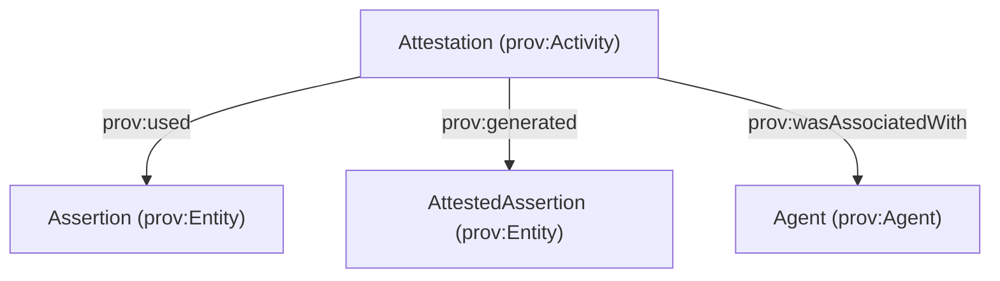

# AttestedAssertion (Assertion vs Attestation)

This page documents the **Assertion / Attestation / AttestedAssertion** pattern added to `agentictrust-core.owl`.

## Goal

Preserve both:

- **Epistemic neutrality of assertions** (an *Assertion* is content, not responsibility)
- **Social accountability of attestations** (an *Attestation* is an accountable act by an Agent)

## PROV-O definitions (core idea)

- **Assertion**: `prov:Entity` (no agent responsibility implied)
- **Attestation**: `prov:Activity` (agent-accountable act)
  - `prov:wasAssociatedWith` ← `prov:Agent`
  - `prov:used` → **Assertion**
  - `prov:generated` → **AttestedAssertion**
- **AttestedAssertion**: `prov:Entity` (durable output/artifact)



## Ontology classes (and inheritance)

### Assertion

- `agentictrust:Assertion` ⊑ `prov:Entity`

### Attestation

- `agentictrust:Attestation` ⊑ `agentictrust:AssertionAct` ⊑ `prov:Activity`
- Intended PROV constraints (modeled as OWL restrictions):
  - `prov:used` → `agentictrust:Assertion`
  - `prov:generated` → `agentictrust:AttestedAssertion`
  - `prov:wasAssociatedWith` → `prov:Agent`

### AttestedAssertion

- `agentictrust:AttestedAssertion` ⊑ `prov:Entity`
- **Trust assertions** are modeled as attested assertions:
  - `agentictrust:TrustAssertion` ⊑ `agentictrust:AttestedAssertion`

### Backward compatibility: AssertionRecord

- `agentictrust:AssertionRecord` is **deprecated** and `owl:equivalentClass` to `agentictrust:AttestedAssertion`.

## How this integrates with existing trust graph patterns

AgenticTrust already uses:

- `agentictrust:assertsSituation` (AssertionAct → Situation)
- `agentictrust:generatedAssertionRecord` (AssertionAct → AttestedAssertion)
- `agentictrust:recordsSituation` (AttestedAssertion → Situation)

`agentictrust:Attestation` is the **accountable specialization** of `agentictrust:AssertionAct`.

## SPARQL queries

### 1) List all AttestedAssertions and the Attestations that generated them

```sparql
PREFIX prov: <http://www.w3.org/ns/prov#>
PREFIX agentictrust: <https://www.agentictrust.io/ontology/agentictrust-core#>

SELECT ?attested ?act ?agent
WHERE {
  ?attested a agentictrust:AttestedAssertion .
  OPTIONAL { ?attested agentictrust:assertionRecordOf ?act . }
  OPTIONAL { ?act prov:wasAssociatedWith ?agent . }
}
ORDER BY ?attested
LIMIT 200
```

### 2) Attestation acts, their input Assertion, and output AttestedAssertion

```sparql
PREFIX prov: <http://www.w3.org/ns/prov#>
PREFIX agentictrust: <https://www.agentictrust.io/ontology/agentictrust-core#>

SELECT ?attestation ?assertion ?attestedAssertion ?agent
WHERE {
  ?attestation a agentictrust:Attestation .
  OPTIONAL { ?attestation prov:used ?assertion . }
  OPTIONAL { ?attestation prov:generated ?attestedAssertion . }
  OPTIONAL { ?attestation prov:wasAssociatedWith ?agent . }
}
ORDER BY ?attestation
LIMIT 200
```

### 3) Trust assertions (as AttestedAssertions) and their situations

```sparql
PREFIX agentictrust: <https://www.agentictrust.io/ontology/agentictrust-core#>
PREFIX rdfs: <http://www.w3.org/2000/01/rdf-schema#>

SELECT ?trustAssertion ?trustAssertionType ?situation ?situationType
WHERE {
  ?trustAssertion a ?trustAssertionType .
  ?trustAssertionType rdfs:subClassOf* agentictrust:TrustAssertion .
  OPTIONAL {
    ?trustAssertion agentictrust:recordsSituation ?situation .
    OPTIONAL { ?situation a ?situationType . }
  }
}
ORDER BY ?trustAssertionType ?trustAssertion
LIMIT 200
```

### 4) Backward-compat check: resources typed as AssertionRecord

```sparql
PREFIX agentictrust: <https://www.agentictrust.io/ontology/agentictrust-core#>

SELECT (COUNT(?x) AS ?count)
WHERE {
  ?x a agentictrust:AssertionRecord .
}
```


