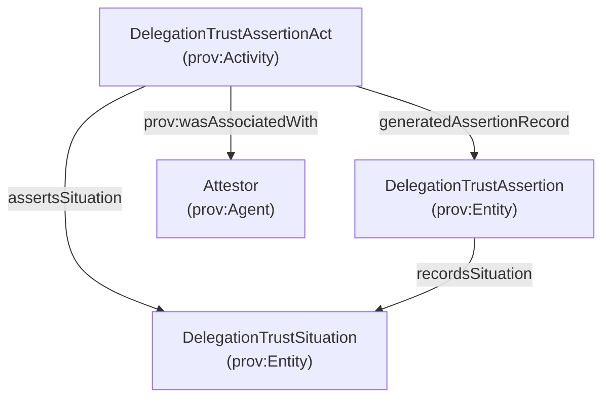
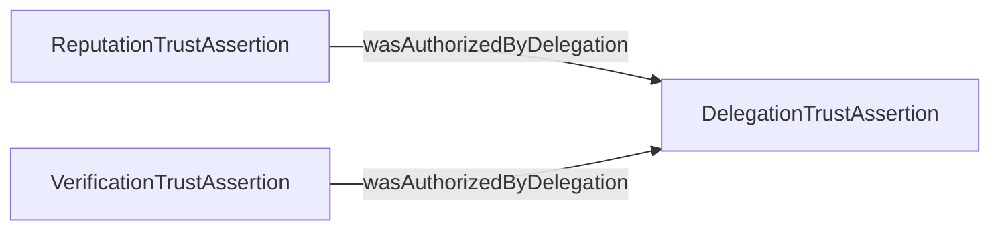

# Attested delegation assertions (permissions + caveats) and authorization provenance

This page focuses on the pattern:

- an agent **attests to a delegation** (granting permissions to another agent), producing an attested delegation assertion, and
- other trust assertions (reputation/verification) are **authorized by** that delegation assertion.

See also:

- [`delegation.md`](./delegation.md)
- [`attested-assertion.md`](./attested-assertion.md)

## Core idea (PROV-O)

Delegation is represented as a **TrustSituation** and asserted via an accountable act:

- `DelegationTrustSituation` (prov:Entity)
- `DelegationTrustAssertionAct` (prov:Activity)
- `DelegationTrustAssertion` (prov:Entity, an AttestedAssertion)

## Diagram: delegation attestation



## Authorization provenance: “feedback was authorized by delegation”

When a party submits reputation/feedback or performs a verification under delegated authority, we link:

- the dependent attested assertion (Reputation/Verification), to
- the delegation assertion that authorized it

using:

- `core:wasAuthorizedByDelegation` (subPropertyOf `prov:wasAuthorizedBy`)

### Diagram: authorization link



### Example (Turtle)

```turtle
:FeedbackAssertion123 a core:ReputationTrustAssertion ;
  core:wasAuthorizedByDelegation :FeedbackAuthDelegation456 .

:VerificationAssertion789 a core:VerificationTrustAssertion ;
  core:wasAuthorizedByDelegation :FeedbackAuthDelegation456 .

:FeedbackAuthDelegation456 a core:DelegationTrustAssertion .
```

## SPARQL: find reputation/verification assertions and the delegation that authorized them

```sparql
PREFIX core: <https://core.io/ontology/core#>

SELECT ?assertion ?assertionType ?delegation
WHERE {
  ?assertion core:wasAuthorizedByDelegation ?delegation .
  ?delegation a core:DelegationTrustAssertion .
  OPTIONAL { ?assertion a ?assertionType . }
}
ORDER BY ?assertion
LIMIT 200
```


