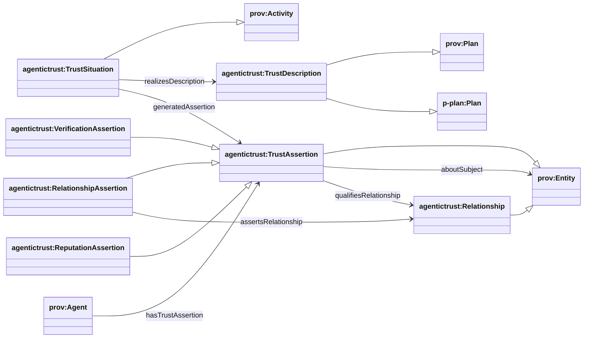
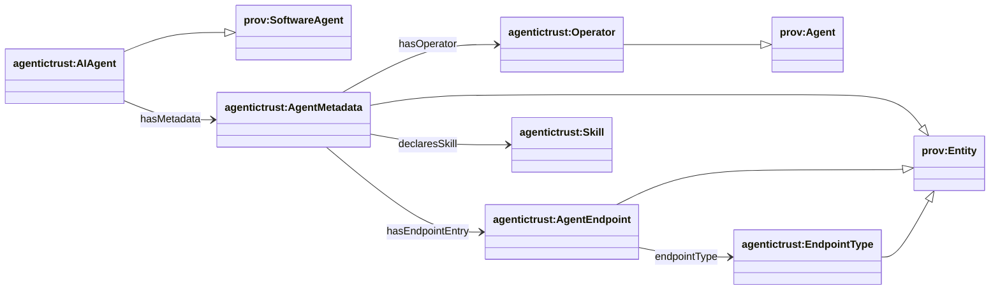

## AgenticTrust core ontology (`agentictrust.owl`)

Source: `apps/badge-admin/public/ontology/agentictrust.owl`

### Core trust model (DnS + PROV-O + P-PLAN)

- **TrustDescription**: normative “what/why” (subclass of `prov:Plan` and `p-plan:Plan`)
- **TrustSituation**: time-scoped realization (subclass of `prov:Activity`)
- **TrustAssertion**: durable claim (subclass of `prov:Entity`)
- **Relationship**: persistent relationship instance (subclass of `prov:Entity`)
- **RelationshipAssertion**: constitutive assertion about a `Relationship` (subclass of `TrustAssertion`)

### Agent identity + metadata (core)

