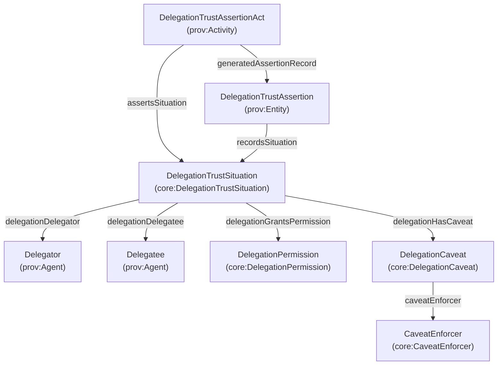

# Delegation (TrustSituation) — permissions, caveats, and accountable grants

This page documents **delegation** as a first-class trust topic: who is authorized to act on behalf of whom, with what permissions and constraints.

Delegation is modeled as a **Situation** (epistemic object), and may be asserted/attested as a **TrustAssertion**.

## Core classes

- **DelegationSituation** (`core:DelegationSituation`): delegation state/constraints as a `Situation`
- **DelegationTrustSituation** (`core:DelegationTrustSituation`): the trust-qualified delegation situation (⊑ TrustSituation and ⊑ DelegationSituation)
- **DelegationTrustAssertion** (`core:DelegationTrustAssertion`): durable attested record about delegation (⊑ TrustAssertion ⊑ AttestedAssertion)
- **DelegationTrustAssertionAct** (`core:DelegationTrustAssertionAct`): accountable act generating the delegation trust assertion

## Permissions and caveats (MetaMask-style shape)

Many delegation frameworks represent delegation as:

- delegator → delegatee
- an optional “authority” identifier (linking to a parent grant / chain)
- a set of **caveats** (constraints), often expressed as *(enforcer, terms)*
- implied or explicit **permissions** (action/resource/scope)

AgenticTrust models these pieces explicitly:

- **DelegationPermission** (`core:DelegationPermission`): action/resource/scope granted
- **DelegationCaveat** (`core:DelegationCaveat`): constraint attached to delegation
- **CaveatEnforcer** (`core:CaveatEnforcer`): identifier for the evaluator/enforcer of caveat terms

## Diagram (conceptual)



## Key properties (summary)

- `core:delegationDelegator` (DelegationSituation → prov:Agent)
- `core:delegationDelegatee` (DelegationSituation → prov:Agent)
- `core:delegationAuthorityValue` (DelegationSituation → string)
- `core:delegationExpiresAtTime` (DelegationSituation → xsd:dateTime)
- `core:delegationGrantsPermission` (DelegationSituation → DelegationPermission)
- `core:delegationHasCaveat` (DelegationSituation → DelegationCaveat)
- `core:permissionAction` / `permissionResource` / `permissionScopeJson`
- `core:caveatEnforcer` / `caveatTermsJson`

## SPARQL: list delegation grants (delegator → delegatee + permissions)

```sparql
PREFIX core: <https://core.io/ontology/core#>

SELECT DISTINCT ?delegationSituation ?delegator ?delegatee ?action ?resource ?expires
WHERE {
  ?delegationSituation a core:DelegationTrustSituation ;
    core:delegationDelegator ?delegator ;
    core:delegationDelegatee ?delegatee .

  OPTIONAL {
    ?delegationSituation core:delegationGrantsPermission ?perm .
    OPTIONAL { ?perm core:permissionAction ?action . }
    OPTIONAL { ?perm core:permissionResource ?resource . }
  }

  OPTIONAL { ?delegationSituation core:delegationExpiresAtTime ?expires . }
}
ORDER BY ?delegationSituation
LIMIT 200
```


