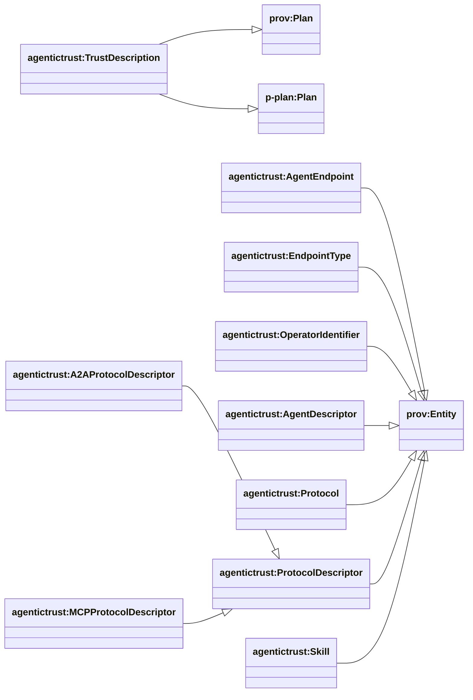
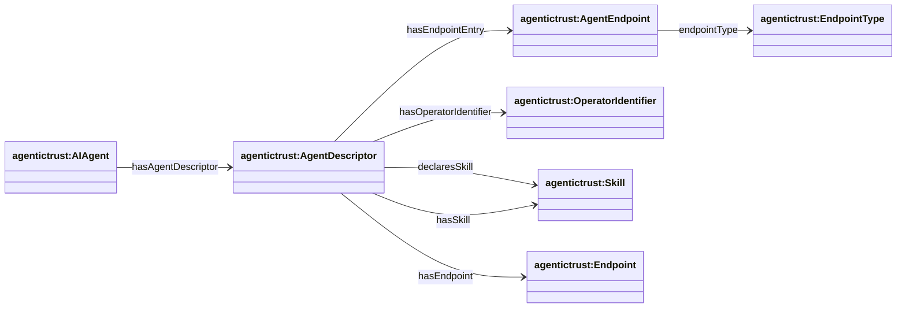
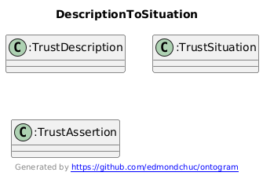
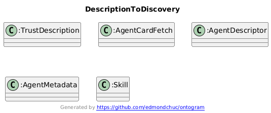
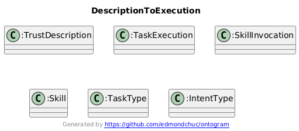

## Description layer (DnS) — TrustDescription + metadata

Ontology: `agentictrust-core.owl`

### Class hierarchy (key)



### Relationship diagram (properties)



### SPARQL Queries (demonstrating property relationships)

**Query Agent with AgentDescriptor and Endpoints:**
```sparql
PREFIX agentictrust: <https://www.agentictrust.io/ontology/agentictrust-core#>

SELECT ?agent ?agentId ?agentDescriptor ?endpoint ?endpointType
WHERE {
  ?agent a agentictrust:AIAgent ;
    agentictrust:agentId ?agentId ;
    agentictrust:hasAgentDescriptor ?agentDescriptor .
  
  OPTIONAL {
    ?agentDescriptor agentictrust:hasEndpoint ?endpoint .
  }
  OPTIONAL {
    ?agentDescriptor agentictrust:hasEndpointEntry ?endpointEntry .
    ?endpointEntry agentictrust:endpointType ?endpointType .
  }
}
ORDER BY ?agentId
```

**Query AgentDescriptor with Skills:**
```sparql
PREFIX agentictrust: <https://www.agentictrust.io/ontology/agentictrust-core#>

SELECT ?agent ?agentDescriptor ?skill ?skillLabel
WHERE {
  ?agent a agentictrust:AIAgent ;
    agentictrust:hasAgentDescriptor ?agentDescriptor .
  
  ?agentDescriptor agentictrust:hasSkill ?skill .
  
  OPTIONAL {
    ?skill rdfs:label ?skillLabel .
  }
}
```

**Query AgentDescriptor with OperatorIdentifier:**
```sparql
PREFIX agentictrust: <https://www.agentictrust.io/ontology/agentictrust-core#>

SELECT ?agent ?agentDescriptor ?operatorIdentifier ?operatorValue
WHERE {
  ?agent a agentictrust:AIAgent ;
    agentictrust:hasAgentDescriptor ?agentDescriptor .
  
  OPTIONAL {
    ?agentDescriptor agentictrust:hasOperatorIdentifier ?operatorIdentifier .
    ?operatorIdentifier agentictrust:operatorIdentifierValue ?operatorValue .
  }
}
```

### Diagrams (how Description supports other areas)

#### Description → Situation



#### Description → Discovery (agent metadata + skills)



#### Description → Execution (tasks + invocations + routing)



### TrustDescription (DnS “Description”)

- **Class**: `agentictrust:TrustDescription`
- **Meaning**: the normative “what/why” — roles, constraints, intended outcomes
- **Grounding**: subclass of `prov:Plan` and `p-plan:Plan`

### Key relation

- **TrustSituation → TrustDescription**: `agentictrust:hasSituationDescription`

### Agent discovery metadata (core)

These are core, protocol-agnostic descriptor concepts:

- **`agentictrust:AgentDescriptor`**: generic descriptor container (offchain)
- **`agentictrust:AgentEndpoint`**: endpoint entry (name/endpoint/version)
- **`agentictrust:EndpointType`**: endpoint taxonomy value
- **`agentictrust:OperatorIdentifier`**: operator identifier artifact (address/DID/CAIP-10)

### Descriptor → skills

- **`agentictrust:declaresSkill`**: `AgentDescriptor` → `Skill`

### Where ERC8004 registration fits

ERC8004 registration is a *specialized metadata bundle* defined in `ERC8004.owl`:

- `erc8004:AgentRegistration` + component metadata
- See [`erc8004.md`](./erc8004.md)


