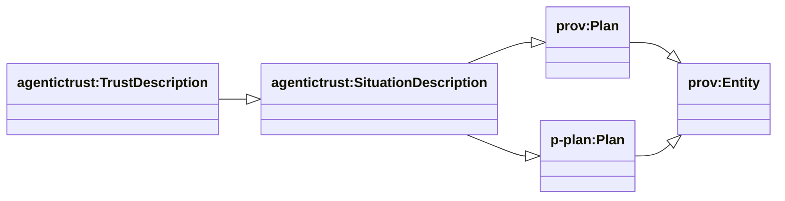
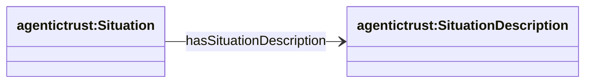
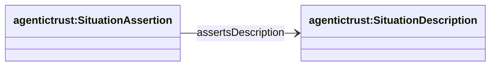
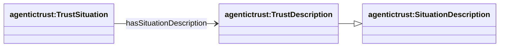

## Description layer — Plans (PROV-O + P-PLAN)

Ontology: `agentictrust-core.owl`

This page is about **Descriptions as Plans**:

- **`prov:Plan`** (PROV-O): a plan/specification (an Entity)
- **`p-plan:Plan`** (P-PLAN): a plan vocabulary that complements PROV-O
- **`agentictrust:SituationDescription`**: the PROV-native “Description” (schema/pattern for a Situation)
- **`agentictrust:TrustDescription`**: specialization of SituationDescription for trust workflows

### SituationDescription and TrustDescription hierarchy



**SPARQL: list SituationDescription subclasses**

```sparql
PREFIX rdfs: <http://www.w3.org/2000/01/rdf-schema#>
PREFIX agentictrust: <https://www.agentictrust.io/ontology/agentictrust-core#>

SELECT ?cls
WHERE {
  ?cls rdfs:subClassOf* agentictrust:SituationDescription .
}
ORDER BY ?cls
```

### Situation ↔ SituationDescription (plan applies to situation)



**SPARQL: situations with their descriptions**

```sparql
PREFIX agentictrust: <https://www.agentictrust.io/ontology/agentictrust-core#>

SELECT ?situation ?description
WHERE {
  ?situation agentictrust:hasSituationDescription ?description .
}
LIMIT 200
```

### SituationAssertion ↔ SituationDescription (assertion under a plan)



**SPARQL: assertions and the descriptions they assert under**

```sparql
PREFIX agentictrust: <https://www.agentictrust.io/ontology/agentictrust-core#>

SELECT ?assertion ?description
WHERE {
  ?assertion a agentictrust:SituationAssertion ;
    agentictrust:assertsDescription ?description .
}
LIMIT 200
```

### TrustDescription as a trust plan (specialization)



**SPARQL: TrustSituations and their TrustDescriptions**

```sparql
PREFIX agentictrust: <https://www.agentictrust.io/ontology/agentictrust-core#>

SELECT ?situation ?desc
WHERE {
  ?situation a agentictrust:TrustSituation ;
    agentictrust:hasSituationDescription ?desc .
  ?desc a agentictrust:TrustDescription .
}
LIMIT 200
```


