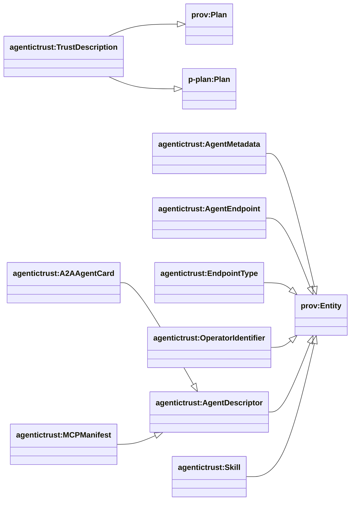
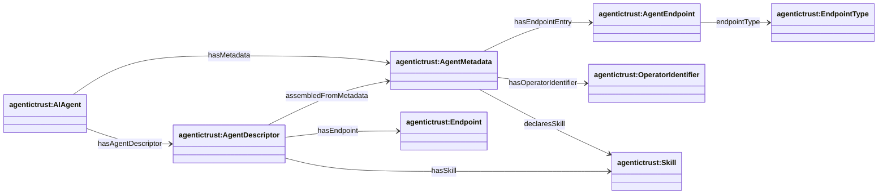

## Description layer (DnS) — TrustDescription + metadata

Ontology: `agentictrust.owl`

### Class hierarchy (key)

### Relationship diagram (properties)

### Diagrams (how Description supports other areas)

#### Description → Situation

#### Description → Discovery (agent metadata + skills)

#### Description → Execution (tasks + invocations + routing)

### TrustDescription (DnS “Description”)

- **Class**: `agentictrust:TrustDescription`
- **Meaning**: the normative “what/why” — roles, constraints, intended outcomes
- **Grounding**: subclass of `prov:Plan` and `p-plan:Plan`

### Key relation

- **TrustSituation → TrustDescription**: `agentictrust:realizesDescription`

### Agent discovery metadata (core)

These are core, protocol-agnostic metadata concepts:

- **`agentictrust:AgentMetadata`**: generic metadata container (offchain)
- **`agentictrust:AgentEndpoint`**: endpoint entry (name/endpoint/version)
- **`agentictrust:EndpointType`**: endpoint taxonomy value
- **`agentictrust:OperatorIdentifier`**: operator identifier artifact (address/DID/CAIP-10)

### Metadata → skills

- **`agentictrust:declaresSkill`**: `AgentMetadata` → `Skill`

### Where ERC8004 registration fits

ERC8004 registration is a *specialized metadata bundle* defined in `ERC8004.owl`:

- `erc8004:AgentRegistration` + component metadata
- See [`erc8004.md`](./erc8004.md)

