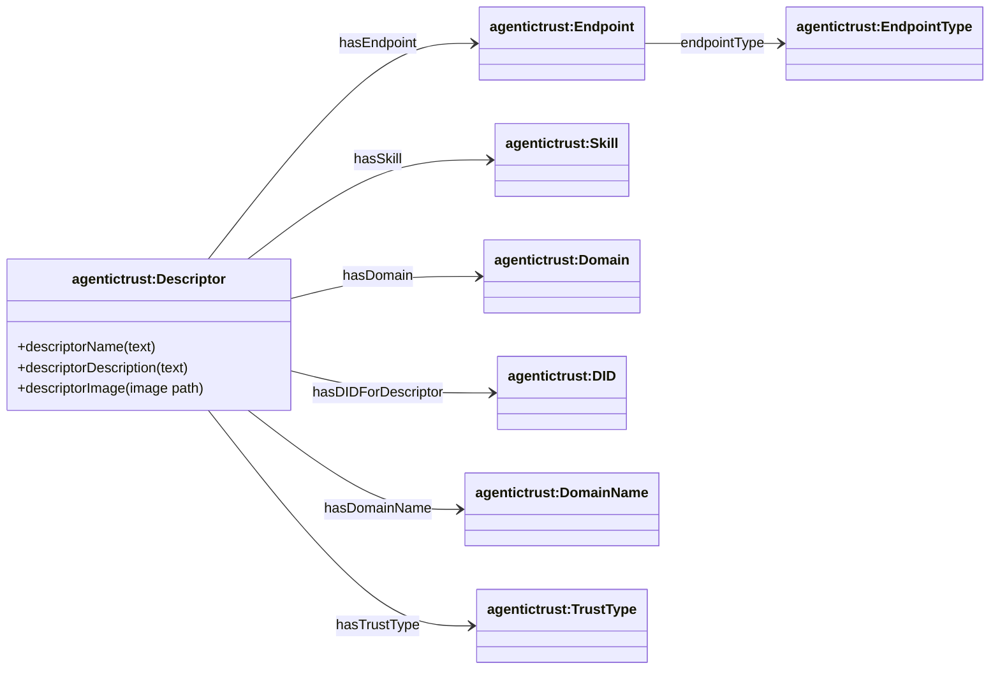
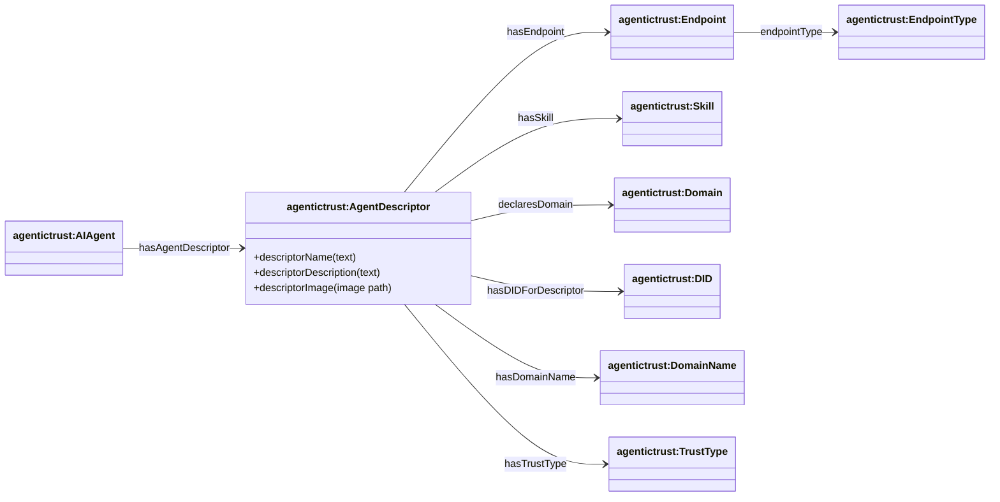
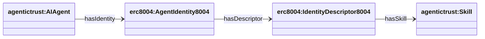

## Descriptor layer — resolver-produced metadata

Ontology: `agentictrust-core.owl`

This page is about **Descriptors**: resolver-produced Entities that aggregate and normalize metadata for discovery and interaction.

### Descriptor class hierarchy (exclude AgentDescriptor)


**SPARQL: list Descriptor subclasses**

```sparql
PREFIX rdfs: <http://www.w3.org/2000/01/rdf-schema#>
PREFIX agentictrust: <https://www.agentictrust.io/ontology/agentictrust-core#>

SELECT ?cls
WHERE {
  ?cls rdfs:subClassOf* agentictrust:Descriptor .
}
ORDER BY ?cls
```

### Descriptor relationships (Data Types)



**SPARQL: identifiers and their descriptor**

```sparql
PREFIX agentictrust: <https://www.agentictrust.io/ontology/agentictrust-core#>

SELECT ?identifier ?descriptor
WHERE {
  ?identifier a agentictrust:Identifier ;
    agentictrust:hasDescriptor ?descriptor .
}
LIMIT 200
```

### Agent → AgentDescriptor (and its data types)



**SPARQL: agent descriptor, endpoints, and skills**

```sparql
PREFIX agentictrust: <https://www.agentictrust.io/ontology/agentictrust-core#>

SELECT ?agent ?agentId ?agentDescriptor ?endpoint ?endpointType ?skill ?domain ?did ?domainName ?trustType ?name ?description ?image
WHERE {
  ?agent a agentictrust:AIAgent ;
    agentictrust:agentId ?agentId ;
    agentictrust:hasAgentDescriptor ?agentDescriptor .

  OPTIONAL {
    ?agentDescriptor agentictrust:hasEndpoint ?endpoint .
    OPTIONAL { ?endpoint agentictrust:endpointType ?endpointType . }
  }
  OPTIONAL { ?agentDescriptor agentictrust:hasSkill ?skill . }
  OPTIONAL { ?agentDescriptor agentictrust:hasDomain ?domain . }
  OPTIONAL { ?agentDescriptor agentictrust:hasDIDForDescriptor ?did . }
  OPTIONAL { ?agentDescriptor agentictrust:hasDomainName ?domainName . }
  OPTIONAL { ?agentDescriptor agentictrust:hasTrustType ?trustType . }
  OPTIONAL { ?agentDescriptor agentictrust:descriptorName ?name . }
  OPTIONAL { ?agentDescriptor agentictrust:descriptorDescription ?description . }
  OPTIONAL { ?agentDescriptor agentictrust:descriptorImage ?image . }
}
ORDER BY ?agentId
LIMIT 200
```

### Agent Identity8004 → Descriptor (8004-specific)



**SPARQL: 8004 identity and its descriptor**

```sparql
PREFIX agentictrust: <https://www.agentictrust.io/ontology/agentictrust-core#>
PREFIX erc8004: <https://www.agentictrust.io/ontology/ERC8004#>

SELECT ?agent ?identity ?descriptor ?skill
WHERE {
  ?agent a agentictrust:AIAgent ;
    agentictrust:hasIdentity ?identity .
  ?identity a erc8004:AgentIdentity8004 ;
    agentictrust:hasDescriptor ?descriptor .
  OPTIONAL { ?descriptor agentictrust:hasSkill ?skill . }
}
LIMIT 200
```

### Protocol (A2A) → ProtocolDescriptor (and how AgentDescriptor references it)


**SPARQL: A2A protocol descriptors**

```sparql
PREFIX agentictrust: <https://www.agentictrust.io/ontology/agentictrust-core#>

SELECT ?protocol ?descriptor ?serviceUrl ?protocolVersion ?preferredTransport
WHERE {
  ?protocol a agentictrust:Protocol ;
    agentictrust:hasProtocolDescriptor ?descriptor .
  ?descriptor a agentictrust:A2AProtocolDescriptor .
  OPTIONAL { ?descriptor agentictrust:serviceUrl ?serviceUrl . }
  OPTIONAL { ?descriptor agentictrust:protocolVersion ?protocolVersion . }
  OPTIONAL { ?descriptor agentictrust:preferredTransport ?preferredTransport . }
}
LIMIT 200
```


