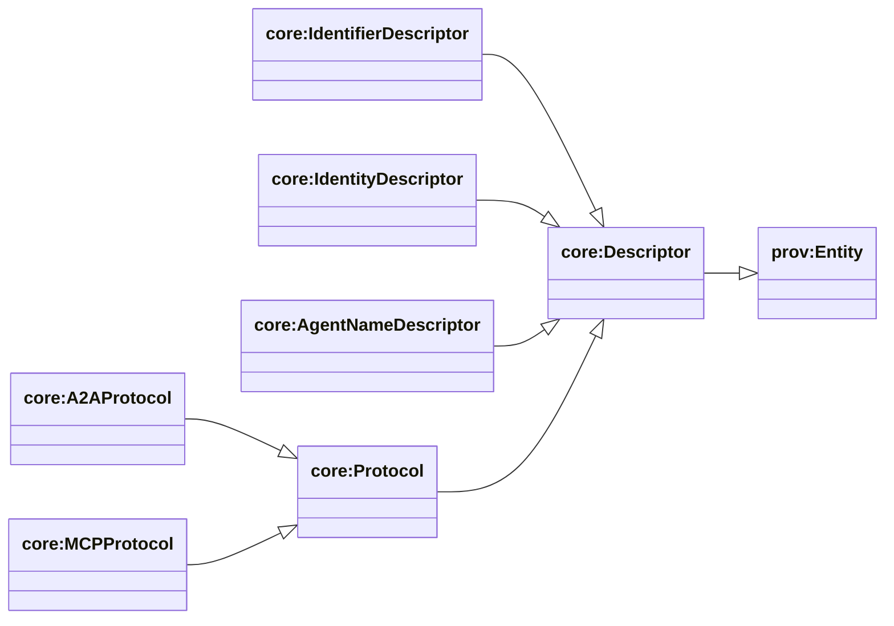
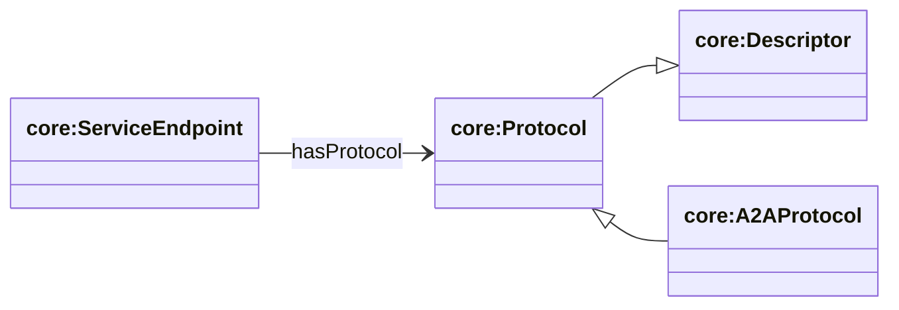

## Descriptor layer — resolver-produced metadata

Ontology: `apps/ontology/ontology/core.ttl`

This page is about **Descriptors**: resolver-produced Entities that aggregate and normalize metadata for discovery and interaction.

## Protocol-first discovery: skills and domains

In practice, an agent’s **skills** and **domains** are most reliably defined at the **protocol layer** (e.g., an A2A agent card, MCP server/tool metadata).

The `core:AgentDescriptor` may contain skills/domains for discovery queries, but those values should be treated as **derived from protocol metadata** (and other sources) rather than invented independently.

See: [`protocols-endpoints.md`](./protocols-endpoints.md).

### Descriptor class hierarchy (exclude AgentDescriptor)



**SPARQL: list Descriptor subclasses**

```sparql
PREFIX rdfs: <http://www.w3.org/2000/01/rdf-schema#>
PREFIX core: <https://agentictrust.io/ontology/core#>

SELECT ?cls
WHERE {
  ?cls rdfs:subClassOf* core:Descriptor .
}
ORDER BY ?cls
```

### Descriptor relationships (Data Types)


**SPARQL: identifiers and their descriptor**

```sparql
PREFIX core: <https://agentictrust.io/ontology/core#>

SELECT ?identifier ?descriptor
WHERE {
  ?identifier a core:Identifier ;
    core:hasDescriptor ?descriptor .
}
LIMIT 200
```

### Agent Identity8004 → Descriptor (8004-specific)


**SPARQL: 8004 identity and its descriptor**

```sparql
PREFIX core: <https://agentictrust.io/ontology/core#>
PREFIX erc8004: <https://agentictrust.io/ontology/erc8004#>

SELECT ?agent ?identity ?descriptor ?skill ?skillClass
WHERE {
  ?agent a core:AIAgent ;
    core:hasIdentity ?identity .
  ?identity a erc8004:AgentIdentity8004 ;
    core:hasDescriptor ?descriptor .
  OPTIONAL {
    ?descriptor core:hasSkill ?skill .
    OPTIONAL { ?skill core:hasSkillClassification ?skillClass . }
  }
}
LIMIT 200
```

### ServiceEndpoint → Protocol (A2A)



**SPARQL: A2A protocols + their endpoints**

```sparql
PREFIX core: <https://agentictrust.io/ontology/core#>

SELECT ?protocol ?serviceEndpoint ?serviceUrl ?protocolVersion ?preferredTransport
WHERE {
  ?serviceEndpoint a core:ServiceEndpoint ;
    core:serviceUrl ?serviceUrl ;
    core:hasProtocol ?protocol .
  ?protocol a core:A2AProtocol .
  OPTIONAL { ?protocol core:protocolVersion ?protocolVersion . }
  OPTIONAL { ?protocol core:preferredTransport ?preferredTransport . }
}
LIMIT 200
```


