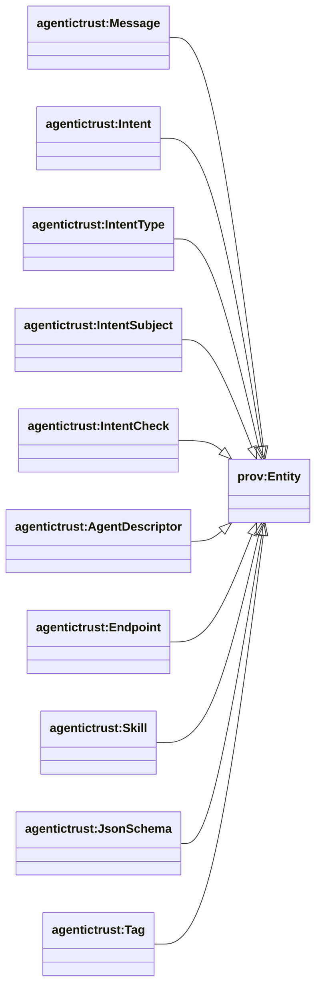
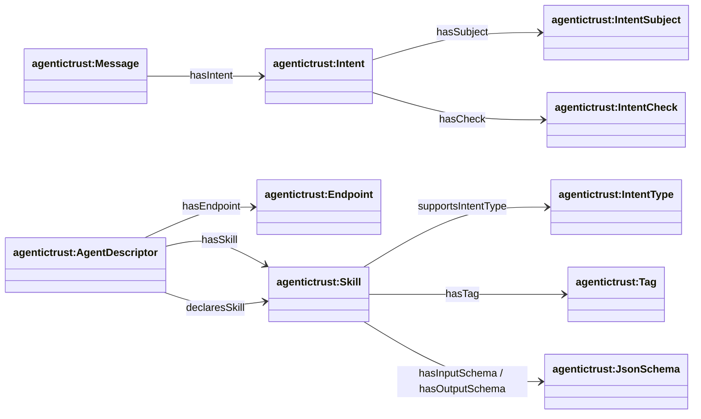
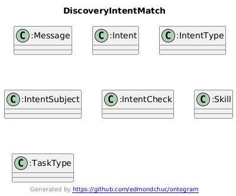
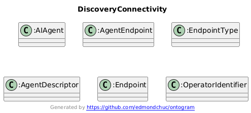
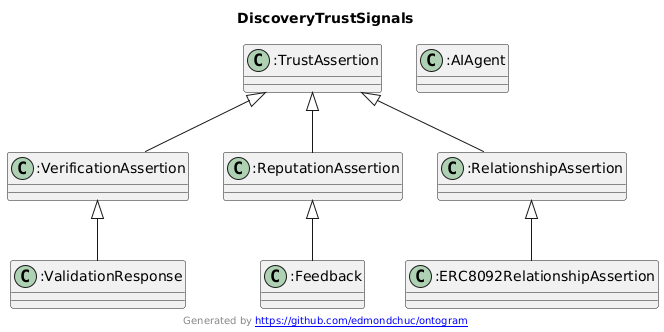

## Agent discovery (how the ontology supports it)

This page explains how `agentictrust.owl` + `ERC8004.owl` + `ERC8092.owl` support **agent discovery** in `agentictrust.io`.

At a high level:

- **Intent drives discovery** (what the consumer wants)
- Agents advertise **skills** + schemas (what they can do)
- Agents advertise **how to connect** (endpoints, protocols) and (optionally) how to **authenticate / transact**
- Trust signals (validation, feedback, relationships) provide **confidence**

### Class hierarchy (key)

### Relationship diagram (discovery flow)

### Diagrams

#### Intent-driven matching (intent → skill → task)

#### Connection & interoperability (how to talk)

#### Trust & reputation (why to trust)

---

### Intent drives discovery

Discovery starts with an **Intent** carried by a **Message**:

- `agentictrust:Message` → `agentictrust:Intent` via `agentictrust:hasIntent`

**What inside the intent can drive discovery?**

- **IntentType**: the primary routing / compatibility key
  - Skills declare compatibility with `agentictrust:supportsIntentType`
  - Intent types can map to task types via `agentictrust:mapsToTaskType` (optional routing layer)
- **IntentSubject**: what the intent is about (e.g., “this ENS”, “this agent”, “this relationship”)
  - `agentictrust:hasSubject`
- **IntentCheck**: what the consumer wants verified/checked
  - `agentictrust:hasCheck`
- (Optional) **Evidence / ExpectedResult**: further constraints useful for ranking/filters
  - `agentictrust:hasEvidence`
  - `agentictrust:hasExpectedResult`

Practical discovery behavior:

- Use `IntentType` to shortlist compatible skills.
- Use `Subject`/`Check`/`Evidence` to filter or rank candidates.
- Use schemas to validate inputs before invoking.

### Agents advertise skills (capabilities)

Skills can be discovered from both:

- **Agent descriptors**: `agentictrust:AgentDescriptor` → `agentictrust:Skill` via `agentictrust:hasSkill`
  - Protocol-specific forms include `agentictrust:A2AAgentCard` and `agentictrust:MCPManifest`.
- **Descriptor declarations**: `agentictrust:AgentDescriptor` → `agentictrust:Skill` via `agentictrust:declaresSkill`

Skills include:

- **Schemas**:
  - `agentictrust:hasInputSchema` / `agentictrust:hasOutputSchema` → `agentictrust:JsonSchema`
- **Examples**:
  - `agentictrust:hasExample` → `agentictrust:SkillExample`
- **Tags**:
  - `agentictrust:hasTag` → `agentictrust:Tag`

### Agents advertise how to connect (protocols / endpoints)

For “can I talk to this agent?”, discovery uses metadata/agent-card connectivity:

- `agentictrust:AgentDescriptor` → `agentictrust:AgentEndpoint` via `agentictrust:hasEndpointEntry`
- `agentictrust:AgentEndpoint` → `agentictrust:EndpointType` via `agentictrust:endpointType`
- `agentictrust:AgentDescriptor` → `agentictrust:Endpoint` via `agentictrust:hasEndpoint`

This lets `agentictrust.io` answer:

- Which protocol surfaces exist (A2A, MCP, ENS, etc.)?
- What URL/endpoint should be used?
- Which skills are relevant once connected?

#### Auth & transact (including x402)

Today, the ontology captures “how to talk” (endpoints) and can capture “how to pay / prove payment” via ERC-8004 offchain profile entities (e.g., `erc8004:PaymentProof`).

If you want explicit discovery-time modeling for **auth schemes** and **transaction/payment requirements** (e.g., x402):

- best pattern is to model them as **capability metadata** attached to endpoints/skills (e.g., `requiresAuthScheme`, `requiresPaymentScheme`, `acceptsPaymentProofFormat`, etc.).
- we can add these terms cleanly without treating them as `prov:Agent` objects.

### Trust & reputation signals help choose who to call

Discovery is not just “who can do it”, but also “who should I trust”.

The normalized trust model enables cross-registry ranking/filters:

- **ERC-8004 validation** (verification signals)
  - `erc8004:ValidationRequest` / `erc8004:ValidationResponse`
  - Linked via `erc8004:validationRespondsToRequest`
- **ERC-8004 feedback** (reputation signals)
  - `erc8004:Feedback` (+ optional `erc8004:FeedbackResponse`)
- **ERC-8092 relationships** (social/identity graph)
  - `erc8092:ERC8092RelationshipAssertion` (+ accounts + revocations)

Practical discovery behavior:

- Filter: “only agents validated by X”
- Rank: “prefer agents with high reputation score / recent feedback”
- Graph: “prefer agents connected to communities I’m part of”

