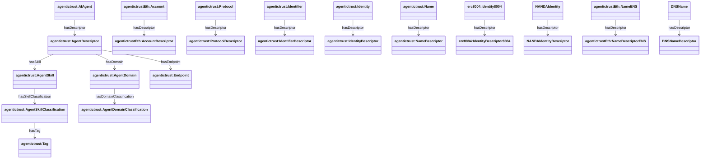

# Discovery (Overview)

This document is the **overview** of the AgenticTrust discovery model, centered on the **Descriptor pattern** and how discovery queries hang together.

Source: `apps/badge-admin/public/ontology/agentictrust-core.owl`

## The Descriptor Pattern: Foundation of Discovery

**Important Pattern**: AI Agent, Account, Protocol, and Identifier entities need to be described and discoverable. They are described via a **resolver** associated with them. The resolver processes raw metadata from various sources (on-chain registries, agent cards, protocol configurations, identifier bindings) and resolves them to **Descriptors**. These Descriptors hold normalized, aggregated information about the thing and are used in the discovery process.

### How It Works

1. **Entities Need Description**
   - `agentictrust:AIAgent` - AI agents that need to be discovered
   - `agentictrustEth:Account` - Ethereum accounts that need to be discovered
   - `agentictrust:Protocol` - Communication protocols (A2A, MCP) that need to be discovered
   - `agentictrust:Identifier` - Identifiers (AccountIdentifier, NameIdentifierENS, IdentityIdentifier8004, etc.) that need to be discovered

2. **Resolvers Process Raw Data**
   - Resolvers fetch and aggregate metadata from multiple sources (on-chain registries, IPFS, agent cards, protocol endpoints)
   - They normalize and validate the data
   - They produce Descriptors as first-class entities

3. **Descriptors Hold Discovery Information**
   - `agentictrust:AgentDescriptor` - Resolved metadata about an AI Agent (skills, endpoints, capabilities)
   - `agentictrust:ProtocolDescriptor` - Resolved metadata about a Protocol (A2A, MCP configurations)
   - `agentictrust:IdentifierDescriptor` - Resolved metadata about an Identifier (bindings, verification methods)
   - `agentictrust:IdentityDescriptor` - Resolved metadata about an Identity (core, not protocol-specific)
   - `agentictrust:NameDescriptor` - Resolved metadata about a Name (core, not protocol-specific)
   - Protocol-specific descriptors: `agentictrustEth:AccountDescriptor`, `agentictrustEth:NameDescriptorENS`, `erc8004:IdentityDescriptor8004`

4. **Descriptors Enable Discovery**
   - Descriptors contain the normalized, assembled view used for discovery, validation, and interaction
   - Discovery queries operate on Descriptors, not raw source data
   - Descriptors link to Skills, Domains, Tags, and other discovery metadata

### Relationship Pattern

```
Entity (AIAgent, Account, Protocol, Identifier)
    ↓ (resolved by resolver)
Descriptor (AgentDescriptor, ProtocolDescriptor, IdentifierDescriptor)
    ↓ (contains)
Discovery Metadata (Skills, Domains, Tags, Endpoints, Schemas)
```

### Descriptor Pattern Diagram



### SPARQL Query: Entity Discovery via Descriptor

```sparql
PREFIX agentictrust: <https://www.agentictrust.io/ontology/agentictrust-core#>
PREFIX agentictrustEth: <https://www.agentictrust.io/ontology/agentictrust-eth#>
PREFIX rdfs: <http://www.w3.org/2000/01/rdf-schema#>

SELECT ?entity ?entityType ?descriptor ?descriptorType ?skill ?domain
WHERE {
  # Entities that can be described
  {
    ?entity a agentictrust:AIAgent .
    BIND("AIAgent" AS ?entityType)
  }
  UNION
  {
    ?entity a agentictrustEth:Account .
    BIND("Account" AS ?entityType)
  }
  UNION
  {
    ?entity a agentictrust:Protocol .
    BIND("Protocol" AS ?entityType)
  }
  UNION
  {
    ?entity a agentictrust:Identifier .
    BIND("Identifier" AS ?entityType)
  }

  # Get Descriptor (resolver-produced)
  ?entity agentictrust:hasDescriptor ?descriptor .
  ?descriptor a ?descriptorType .

  # For AgentDescriptor, get discovery metadata
  OPTIONAL {
    ?descriptor a agentictrust:AgentDescriptor .
    OPTIONAL {
      ?descriptor agentictrust:hasSkill ?agentSkill .
      OPTIONAL { ?agentSkill agentictrust:hasSkillClassification ?skill . }
    }
    OPTIONAL {
      ?descriptor agentictrust:hasDomain ?agentDomain .
      OPTIONAL { ?agentDomain agentictrust:hasDomainClassification ?domain . }
    }
  }
}
LIMIT 100
```

## Where the details live now

- **Skills + Domains (SPARQL + diagrams + OASF alignment)**: `docs/ontology/skills-domains.md`
- **Intents / Tasks / routing (SPARQL)**: `docs/ontology/intent.md`
- **Execution trace / provenance**: `docs/ontology/provenance.md`
- **Situations**: `docs/ontology/situation.md`


