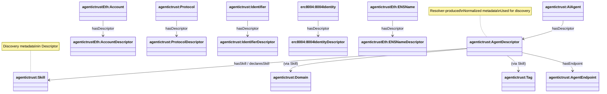

# Discovery: Skills, Domains, Intents, Tasks, and OASF Alignment

This document describes the AgenticTrust discovery model, covering skills, domains, intents, tasks, execution traces, and alignment with the Open Agentic Schema Framework (OASF).

Source: `apps/badge-admin/public/ontology/agentictrust-core.owl`

## The Descriptor Pattern: Foundation of Discovery

**Important Pattern**: AI Agent, Account, Protocol, and Identifier entities need to be described and discoverable. They are described via a **resolver** associated with them. The resolver processes raw metadata from various sources (on-chain registries, agent cards, protocol configurations, identifier bindings) and resolves them to **Descriptors**. These Descriptors hold normalized, aggregated information about the thing and are used in the discovery process.

### How It Works

1. **Entities Need Description**: 
   - `agentictrust:AIAgent` - AI agents that need to be discovered
   - `agentictrustEth:Account` - Ethereum accounts that need to be discovered
   - `agentictrust:Protocol` - Communication protocols (A2A, MCP) that need to be discovered
   - `agentictrust:Identifier` - Identifiers (AccountIdentifier, ENSNameIdentifier, etc.) that need to be discovered

2. **Resolvers Process Raw Data**:
   - Resolvers fetch and aggregate metadata from multiple sources (on-chain registries, IPFS, agent cards, protocol endpoints)
   - They normalize and validate the data
   - They produce Descriptors as first-class entities

3. **Descriptors Hold Discovery Information**:
   - `agentictrust:AgentDescriptor` - Resolved metadata about an AI Agent (skills, endpoints, capabilities)
   - `agentictrust:ProtocolDescriptor` - Resolved metadata about a Protocol (A2A, MCP configurations)
   - `agentictrust:IdentifierDescriptor` - Resolved metadata about an Identifier (bindings, verification methods)
   - Protocol-specific descriptors: `agentictrustEth:AccountDescriptor`, `agentictrustEth:ENSNameDescriptor`, `erc8004:8004IdentityDescriptor`

4. **Descriptors Enable Discovery**:
   - Descriptors contain the normalized, assembled view used for discovery, validation, and interaction
   - Discovery queries operate on Descriptors, not raw source data
   - Descriptors link to Skills, Domains, Tags, and other discovery metadata

### Relationship Pattern

```
Entity (AIAgent, Account, Protocol, Identifier)
    ↓ (resolved by resolver)
Descriptor (AgentDescriptor, ProtocolDescriptor, IdentifierDescriptor)
    ↓ (contains)
Discovery Metadata (Skills, Domains, Tags, Endpoints, Schemas)
```

### Descriptor Pattern Diagram



### Property: `hasDescriptor`

The `agentictrust:hasDescriptor` property links entities to their resolved Descriptors:

- `agentictrust:AIAgent` → `hasDescriptor` → `agentictrust:AgentDescriptor`
- `agentictrustEth:Account` → `hasDescriptor` → `agentictrustEth:AccountDescriptor`
- `agentictrust:Protocol` → `hasDescriptor` → `agentictrust:ProtocolDescriptor`
- `agentictrust:Identifier` → `hasDescriptor` → `agentictrust:IdentifierDescriptor`
- `erc8004:8004Identity` → `hasDescriptor` → `erc8004:8004IdentityDescriptor`
- `agentictrustEth:ENSName` → `hasDescriptor` → `agentictrustEth:ENSNameDescriptor`

### Why This Pattern Matters

- **Separation of Concerns**: Raw source data (on-chain, IPFS, agent cards) is separate from the normalized discovery view
- **Consistency**: All discovery operates on the same Descriptor structure regardless of source
- **Flexibility**: Resolvers can aggregate from multiple sources and apply validation/normalization
- **Performance**: Descriptors can be cached and indexed for fast discovery queries
- **Evolution**: Source formats can change without breaking discovery (resolvers adapt)

### SPARQL Query: Entity Discovery via Descriptor

This query demonstrates how to discover entities through their Descriptors:

```sparql
PREFIX agentictrust: <https://www.agentictrust.io/ontology/agentictrust-core#>
PREFIX agentictrustEth: <https://www.agentictrust.io/ontology/agentictrust-eth#>
PREFIX rdfs: <http://www.w3.org/2000/01/rdf-schema#>

SELECT ?entity ?entityType ?descriptor ?descriptorType ?skill ?domain
WHERE {
  # Entities that can be described
  {
    ?entity a agentictrust:AIAgent .
    BIND("AIAgent" AS ?entityType)
  }
  UNION
  {
    ?entity a agentictrustEth:Account .
    BIND("Account" AS ?entityType)
  }
  UNION
  {
    ?entity a agentictrust:Protocol .
    BIND("Protocol" AS ?entityType)
  }
  UNION
  {
    ?entity a agentictrust:Identifier .
    BIND("Identifier" AS ?entityType)
  }
  
  # Get Descriptor (resolver-produced)
  ?entity agentictrust:hasDescriptor ?descriptor .
  ?descriptor a ?descriptorType .
  
  # For AgentDescriptor, get discovery metadata
  OPTIONAL {
    ?descriptor a agentictrust:AgentDescriptor .
    {
      ?descriptor agentictrust:hasSkill ?skill .
    }
    UNION
    {
      ?descriptor agentictrust:declaresSkill ?skill .
    }
    
    OPTIONAL {
      ?skill agentictrust:hasDomain ?domain .
      ?domain a agentictrust:Domain .
    }
  }
}
LIMIT 100
```

## Overview

The ontology separates three key concerns:

- **Discovery**: metadata/card declarations about skills and domains
- **Routing**: intent types and task types
- **Execution trace**: skill invocations used to realize tasks/fulfill intents

**Domains** play a central role in discovery by providing categorization and grouping of skills and agents. Domains enable filtering and discovery by application area (e.g., "finance", "healthcare", "education").

## OASF Alignment

The AgenticTrust ontology aligns with the **Open Agentic Schema Framework (OASF)** ([`agntcy/oasf`](https://github.com/agntcy/oasf)), which provides a standardized schema system for agent capabilities/metadata. OASF emphasizes records annotated with **skills** and **domains**, plus extensibility via **modules**.

### OASF Goals

OASF's published goals emphasize:

- **Interoperability**: a common structure for describing agent capabilities and metadata
- **Discovery**: consistent announcement and searching via **skills** and **domains**
- **Extensibility**: modular extensions without breaking the core
- **Schema validation + versioning**: predictable evolution of the vocabulary

AgenticTrust adopts these same goals, but expressed as an OWL/RDF ontology so the `agentictrust.io` knowledge base can query across registries and protocols using a normalized graph.

### OASF Concept Mapping

- **OASF Record**
  - **Meaning in OASF**: the primary structured data object used for content representation and metadata
  - **AgenticTrust mapping**:
    - `agentictrust:AgentDescriptor` (agent-level descriptor) and `agentictrust:ProtocolDescriptor` (protocol-level descriptor; e.g., `agentictrust:A2AProtocolDescriptor`, `agentictrust:MCPProtocolDescriptor`)

- **OASF Skill**
  - **Meaning in OASF**: taxonomy-anchored skill annotation for discovery
  - **AgenticTrust mapping**:
    - `agentictrust:Skill`
    - Skill compatibility routing via `agentictrust:supportsIntentType`

- **OASF Domain**
  - **Meaning in OASF**: domain annotation for discovery / grouping
  - **AgenticTrust mapping**:
    - `agentictrust:Domain` (explicit OASF Domain class - primary mapping)
    - `agentictrust:Tag` (lightweight discovery labels - can supplement Domain)
    - `agentictrust:IntentType` (routing key - can be domain-aligned)
    - (optional) `agentictrust:TaskType` (work taxonomy - can be domain-specific)
  - **Note**: Distinct from `erc8004:IntegrationMetadata` which describes integration mechanisms, not OASF domains

- **OASF Module**
  - **Meaning in OASF**: modular extensibility mechanism (additional structured data)
  - **AgenticTrust mapping**:
    - `agentictrust:JsonSchema` as a concrete "module-like" payload describing skill I/O
    - Linked via `agentictrust:hasInputSchema` / `agentictrust:hasOutputSchema`

### OASF Domain vs. Integration Capability

**Important Distinction**: OASF Domain is different from "Agent A2A Capability" (integration mechanism).

#### OASF Domain (`agentictrust:Domain`)
- **Purpose**: Categorization and grouping for discovery
- **Examples**: "finance", "healthcare", "education", "e-commerce"
- **Usage**: Filter agents/skills by application area
- **Relationship**: `Skill → hasDomain → Domain`
- **OASF Alignment**: Direct mapping to OASF Domain concept

#### Integration Capability (`erc8004:IntegrationMetadata`)
- **Purpose**: Describes how agents integrate with external systems
- **Examples**: SDKs, tool integrations, external services, auth/payment integration hints
- **Usage**: Technical integration details (not discovery categorization)
- **Relationship**: `AgentDescriptor → hasIntegrationMetadata → IntegrationMetadata`
- **Note**: This is protocol-specific (ERC-8004) and describes integration mechanisms, not OASF domains

#### Overlap with Other Concepts

- **Tag** (`agentictrust:Tag`): Lightweight discovery labels (can overlap with Domain but more flexible)
- **IntentType** (`agentictrust:IntentType`): Routing key for intent-driven discovery (can map to domains)
- **TaskType** (`agentictrust:TaskType`): Work taxonomy (can be domain-specific)

The distinction ensures:
- **Domain**: "What area does this skill/agent serve?" (e.g., "finance")
- **Integration Capability**: "How does this agent integrate?" (e.g., "Stripe SDK", "OAuth2")

### OASF Discovery Flow

```
User Intent
    ↓
IntentType (routing key)
    ↓
TaskType (work taxonomy)
    ↓
Skill (capability match)
    ↓
AgentDescriptor (agent with skill)
    ↓
Agent (executable agent)
```

### OASF Record Structure (in AgenticTrust terms)

An OASF record maps to our ontology as:

```
AgentDescriptor (OASF Record)
  ├─ hasSkill / declaresSkill → Skill (OASF Skill)
  │   ├─ hasInputSchema → JsonSchema (OASF Module)
  │   ├─ hasOutputSchema → JsonSchema (OASF Module)
  │   ├─ hasDomain → Domain (OASF Domain - categorization)
  │   ├─ hasTag → Tag (lightweight labels)
  │   ├─ supportsIntentType → IntentType (routing)
  │   └─ enablesTaskType → TaskType (work taxonomy)
  └─ hasEndpoint → Endpoint (protocol bindings)
```

### OASF Schema Validation

OASF emphasizes schema validation and versioning:

- **Input/Output Schemas**: Each skill has JSON Schema definitions
  - `agentictrust:hasInputSchema` → `agentictrust:JsonSchema`
  - `agentictrust:hasOutputSchema` → `agentictrust:JsonSchema`
- **Versioning**: Endpoints and protocols have version information
  - `agentictrust:AgentEndpoint` has version metadata
- **Extensibility**: Modules can be added without breaking core schema
  - `agentictrust:JsonSchema` acts as module payloads

## Class Hierarchy


## Skills and Declarations

### Discovery Model

Agents advertise their capabilities through skills:

- `agentictrust:AgentDescriptor` → `agentictrust:Skill`: `agentictrust:hasSkill`
- `agentictrust:AgentDescriptor` → `agentictrust:Skill`: `agentictrust:declaresSkill`

### Skill Modeling

Skills have rich metadata for discovery and validation:

- `agentictrust:Skill` → `agentictrust:JsonSchema`
  - `agentictrust:hasInputSchema`
  - `agentictrust:hasOutputSchema`
- `agentictrust:Skill` → `agentictrust:SkillExample`: `agentictrust:hasExample`
- `agentictrust:Skill` → `agentictrust:Tag`: `agentictrust:hasTag`
- `agentictrust:Skill` → `agentictrust:Domain`: `agentictrust:hasDomain` (OASF Domain)
- `agentictrust:Skill` → `agentictrust:IntentType`: `agentictrust:supportsIntentType`


## Routing: Intents, Task Types, and Mappings

### Intent-Driven Discovery

Intent types serve as routing keys for discovery:

- `agentictrust:Skill` → `agentictrust:IntentType`: `agentictrust:supportsIntentType`
- `agentictrust:IntentType` → `agentictrust:TaskType`: `agentictrust:mapsToTaskType`
- `agentictrust:Skill` → `agentictrust:TaskType`: `agentictrust:enablesTaskType`
- `agentictrust:TaskType` → `agentictrust:Skill`: `agentictrust:implementedBySkill`


## Execution Trace (Activities)

Execution traces link intents to actual skill invocations:

- `agentictrust:Task` → `agentictrust:TaskExecution`: `agentictrust:taskRealizedBy`
- `agentictrust:TaskExecution` → `agentictrust:SkillInvocation`: `agentictrust:hasInvocation`
- `agentictrust:SkillInvocation` → `agentictrust:Skill`: `agentictrust:invokesSkill`
- `agentictrust:SkillInvocation` → `agentictrust:Message`: `agentictrust:invocationUsedMessage`
- `agentictrust:Intent` → `agentictrust:SkillInvocation`: `agentictrust:fulfilledByInvocation`

```mermaid
classDiagram
direction LR

class provActivity["prov:Activity"]
class TaskExecution["agentictrust:TaskExecution"]
class SkillInvocation["agentictrust:SkillInvocation"]
class Task["agentictrust:Task"]
class Intent["agentictrust:Intent"]
class Skill["agentictrust:Skill"]
class Message["agentictrust:Message"]

TaskExecution --|> provActivity
SkillInvocation --|> provActivity

Task --> TaskExecution : taskRealizedBy
TaskExecution --> SkillInvocation : hasInvocation
SkillInvocation --> Skill : invokesSkill
SkillInvocation --> Message : invocationUsedMessage
Intent --> SkillInvocation : fulfilledByInvocation
```



## Complete Relationship Diagram


## SPARQL Queries

### Query: AgentDescriptor with Skills

```sparql
PREFIX agentictrust: <https://www.agentictrust.io/ontology/agentictrust-core#>
PREFIX rdfs: <http://www.w3.org/2000/01/rdf-schema#>

SELECT ?agentDescriptor ?skill ?skillLabel
WHERE {
  ?agentDescriptor a agentictrust:AgentDescriptor .
  
  {
    ?agentDescriptor agentictrust:hasSkill ?skill .
  }
  UNION
  {
    ?agentDescriptor agentictrust:declaresSkill ?skill .
  }
  
  OPTIONAL {
    ?skill rdfs:label ?skillLabel .
  }
}
ORDER BY ?agentDescriptor ?skill
```

### Query: Skill with JsonSchema, Tag, Domain, and IntentType

```sparql
PREFIX agentictrust: <https://www.agentictrust.io/ontology/agentictrust-core#>
PREFIX rdfs: <http://www.w3.org/2000/01/rdf-schema#>

SELECT ?skill ?skillLabel ?inputSchema ?outputSchema ?tag ?domain ?intentType
WHERE {
  ?skill a agentictrust:Skill .
  
  OPTIONAL {
    ?skill rdfs:label ?skillLabel .
  }
  
  OPTIONAL {
    ?skill agentictrust:hasInputSchema ?inputSchema .
    ?inputSchema a agentictrust:JsonSchema .
  }
  
  OPTIONAL {
    ?skill agentictrust:hasOutputSchema ?outputSchema .
    ?outputSchema a agentictrust:JsonSchema .
  }
  
  OPTIONAL {
    ?skill agentictrust:hasTag ?tag .
    ?tag a agentictrust:Tag .
  }
  
  # OASF Domain
  OPTIONAL {
    ?skill agentictrust:hasDomain ?domain .
    ?domain a agentictrust:Domain .
  }
  
  OPTIONAL {
    ?skill agentictrust:supportsIntentType ?intentType .
    ?intentType a agentictrust:IntentType .
  }
}
LIMIT 100
```

### Query: Skill with TaskType

```sparql
PREFIX agentictrust: <https://www.agentictrust.io/ontology/agentictrust-core#>
PREFIX rdfs: <http://www.w3.org/2000/01/rdf-schema#>

SELECT ?skill ?skillLabel ?taskType ?taskTypeLabel
WHERE {
  ?skill a agentictrust:Skill .
  
  OPTIONAL {
    ?skill rdfs:label ?skillLabel .
  }
  
  OPTIONAL {
    ?skill agentictrust:enablesTaskType ?taskType .
    ?taskType a agentictrust:TaskType .
    
    OPTIONAL {
      ?taskType rdfs:label ?taskTypeLabel .
    }
  }
}
LIMIT 100
```

### Query: IntentType to TaskType Mapping

```sparql
PREFIX agentictrust: <https://www.agentictrust.io/ontology/agentictrust-core#>
PREFIX rdfs: <http://www.w3.org/2000/01/rdf-schema#>

SELECT ?intentType ?intentTypeLabel ?taskType ?taskTypeLabel
WHERE {
  ?intentType a agentictrust:IntentType .
  
  OPTIONAL {
    ?intentType rdfs:label ?intentTypeLabel .
  }
  
  OPTIONAL {
    ?intentType agentictrust:mapsToTaskType ?taskType .
    ?taskType a agentictrust:TaskType .
    
    OPTIONAL {
      ?taskType rdfs:label ?taskTypeLabel .
    }
  }
}
ORDER BY ?intentType
```

### Query: Message with Intent and SkillInvocation

```sparql
PREFIX agentictrust: <https://www.agentictrust.io/ontology/agentictrust-core#>
PREFIX prov: <http://www.w3.org/ns/prov#>

SELECT ?message ?intent ?skillInvocation ?skill
WHERE {
  ?message a agentictrust:Message .
  
  OPTIONAL {
    ?message agentictrust:hasIntent ?intent .
    ?intent a agentictrust:Intent .
    
    OPTIONAL {
      ?intent agentictrust:fulfilledByInvocation ?skillInvocation .
      ?skillInvocation a agentictrust:SkillInvocation .
      
      OPTIONAL {
        ?skillInvocation agentictrust:invokesSkill ?skill .
        ?skill a agentictrust:Skill .
      }
    }
  }
}
LIMIT 50
```

### Query: Task with TaskExecution and SkillInvocation

```sparql
PREFIX agentictrust: <https://www.agentictrust.io/ontology/agentictrust-core#>
PREFIX prov: <http://www.w3.org/ns/prov#>

SELECT ?task ?taskExecution ?skillInvocation ?skill ?message
WHERE {
  ?task a agentictrust:Task .
  
  OPTIONAL {
    ?task agentictrust:taskRealizedBy ?taskExecution .
    ?taskExecution a agentictrust:TaskExecution .
    
    OPTIONAL {
      ?taskExecution agentictrust:hasInvocation ?skillInvocation .
      ?skillInvocation a agentictrust:SkillInvocation .
      
      OPTIONAL {
        ?skillInvocation agentictrust:invokesSkill ?skill .
        ?skill a agentictrust:Skill .
      }
      
      OPTIONAL {
        ?skillInvocation agentictrust:invocationUsedMessage ?message .
        ?message a agentictrust:Message .
      }
    }
  }
}
LIMIT 50
```

### Query: Complete Skill Discovery Chain

This query shows the complete chain from AgentDescriptor through Skills to their schemas, tags, domains, and intent types:

```sparql
PREFIX agentictrust: <https://www.agentictrust.io/ontology/agentictrust-core#>
PREFIX agentictrustEth: <https://www.agentictrust.io/ontology/agentictrust-eth#>
PREFIX rdfs: <http://www.w3.org/2000/01/rdf-schema#>

SELECT ?agent ?agentId ?agentDescriptor ?skill ?skillLabel 
       ?inputSchema ?outputSchema ?tag ?domain ?intentType ?taskType
WHERE {
  ?agent a agentictrust:AIAgent ;
    agentictrust:agentId ?agentId ;
    agentictrust:hasAgentDescriptor ?agentDescriptor .
  
  ?agentDescriptor a agentictrust:AgentDescriptor .
  
  {
    ?agentDescriptor agentictrust:hasSkill ?skill .
  }
  UNION
  {
    ?agentDescriptor agentictrust:declaresSkill ?skill .
  }
  
  ?skill a agentictrust:Skill .
  
  OPTIONAL {
    ?skill rdfs:label ?skillLabel .
  }
  
  OPTIONAL {
    ?skill agentictrust:hasInputSchema ?inputSchema .
  }
  
  OPTIONAL {
    ?skill agentictrust:hasOutputSchema ?outputSchema .
  }
  
  OPTIONAL {
    ?skill agentictrust:hasTag ?tag .
  }
  
  # OASF Domain
  OPTIONAL {
    ?skill agentictrust:hasDomain ?domain .
    ?domain a agentictrust:Domain .
  }
  
  OPTIONAL {
    ?skill agentictrust:supportsIntentType ?intentType .
    
    OPTIONAL {
      ?intentType agentictrust:mapsToTaskType ?taskType .
    }
  }
}
LIMIT 100
```

### Query: OASF-Aligned Skill Discovery with Domain

This query demonstrates OASF-style discovery: find agents with skills matching a domain:

```sparql
PREFIX agentictrust: <https://www.agentictrust.io/ontology/agentictrust-core#>
PREFIX rdfs: <http://www.w3.org/2000/01/rdf-schema#>

SELECT ?agent ?agentId ?agentName ?skill ?skillLabel ?domain ?domainLabel ?intentType ?tag
WHERE {
  ?agent a agentictrust:AIAgent ;
    agentictrust:agentId ?agentId ;
    agentictrust:hasAgentDescriptor ?agentDescriptor .
  
  OPTIONAL {
    ?agent agentictrust:agentName ?agentName .
  }
  
  ?agentDescriptor a agentictrust:AgentDescriptor .
  
  {
    ?agentDescriptor agentictrust:hasSkill ?skill .
  }
  UNION
  {
    ?agentDescriptor agentictrust:declaresSkill ?skill .
  }
  
  ?skill a agentictrust:Skill .
  
  OPTIONAL {
    ?skill rdfs:label ?skillLabel .
  }
  
  # OASF Domain (categorization)
  OPTIONAL {
    ?skill agentictrust:hasDomain ?domain .
    ?domain a agentictrust:Domain .
    
    OPTIONAL {
      ?domain rdfs:label ?domainLabel .
    }
  }
  
  # OASF Domain: IntentType (routing key)
  OPTIONAL {
    ?skill agentictrust:supportsIntentType ?intentType .
    ?intentType a agentictrust:IntentType .
  }
  
  # OASF Domain: Tag (lightweight categorization)
  OPTIONAL {
    ?skill agentictrust:hasTag ?tag .
    ?tag a agentictrust:Tag .
  }
}
ORDER BY ?domain ?agent ?skill
LIMIT 100
```

### Query: OASF Module (JsonSchema) Details

This query shows OASF module information (JSON Schema) for skills:

```sparql
PREFIX agentictrust: <https://www.agentictrust.io/ontology/agentictrust-core#>
PREFIX rdfs: <http://www.w3.org/2000/01/rdf-schema#>

SELECT ?skill ?skillLabel ?inputSchema ?outputSchema
WHERE {
  ?skill a agentictrust:Skill .
  
  OPTIONAL {
    ?skill rdfs:label ?skillLabel .
  }
  
  # OASF Module: Input Schema
  OPTIONAL {
    ?skill agentictrust:hasInputSchema ?inputSchema .
    ?inputSchema a agentictrust:JsonSchema .
  }
  
  # OASF Module: Output Schema
  OPTIONAL {
    ?skill agentictrust:hasOutputSchema ?outputSchema .
    ?outputSchema a agentictrust:JsonSchema .
  }
}
LIMIT 50
```

### Query: OASF Record (AgentDescriptor) with Full Metadata

This query retrieves a complete OASF-style record with all annotations including Domain:

```sparql
PREFIX agentictrust: <https://www.agentictrust.io/ontology/agentictrust-core#>
PREFIX erc8004: <https://www.agentictrust.io/ontology/ERC8004#>
PREFIX rdfs: <http://www.w3.org/2000/01/rdf-schema#>

SELECT ?agent ?agentId ?agentName ?descriptor ?skill ?skillLabel 
       ?domain ?domainLabel ?intentType ?tag ?taskType ?endpoint ?integrationMetadata
WHERE {
  ?agent a agentictrust:AIAgent ;
    agentictrust:agentId ?agentId ;
    agentictrust:hasAgentDescriptor ?descriptor .
  
  OPTIONAL {
    ?agent agentictrust:agentName ?agentName .
  }
  
  ?descriptor a agentictrust:AgentDescriptor .
  
  # OASF Skill
  OPTIONAL {
    {
      ?descriptor agentictrust:hasSkill ?skill .
    }
    UNION
    {
      ?descriptor agentictrust:declaresSkill ?skill .
    }
    
    ?skill a agentictrust:Skill .
    
    OPTIONAL {
      ?skill rdfs:label ?skillLabel .
    }
    
    # OASF Domain (categorization)
    OPTIONAL {
      ?skill agentictrust:hasDomain ?domain .
      ?domain a agentictrust:Domain .
      
      OPTIONAL {
        ?domain rdfs:label ?domainLabel .
      }
    }
    
    # OASF Domain: IntentType (routing)
    OPTIONAL {
      ?skill agentictrust:supportsIntentType ?intentType .
    }
    
    # OASF Domain: Tag (lightweight)
    OPTIONAL {
      ?skill agentictrust:hasTag ?tag .
    }
    
    # Task Type
    OPTIONAL {
      ?skill agentictrust:enablesTaskType ?taskType .
    }
  }
  
  # Endpoint (protocol bindings)
  OPTIONAL {
    ?descriptor agentictrust:hasEndpoint ?endpoint .
    ?endpoint a agentictrust:AgentEndpoint .
  }
  
  # Integration Capability (technical integration - distinct from Domain)
  OPTIONAL {
    ?descriptor erc8004:hasIntegrationMetadata ?integrationMetadata .
    ?integrationMetadata a erc8004:IntegrationMetadata .
  }
}
LIMIT 50
```

## Domains: Central to Discovery

**Domains** (`agentictrust:Domain`) are a core component of the discovery model, providing:

1. **Categorization**: Skills and agents are organized by application domain (e.g., "finance", "healthcare", "education", "e-commerce")
2. **Filtering**: Discovery queries can filter by domain to find relevant capabilities
3. **OASF Alignment**: Direct mapping to OASF Domain concept for standardized categorization
4. **Routing**: IntentTypes can be domain-aligned for more precise routing
5. **Grouping**: Multiple skills can share a domain, enabling domain-based agent discovery

### Domain Relationships

- **Skills → Domain**: `agentictrust:Skill` → `agentictrust:hasDomain` → `agentictrust:Domain`
- **AgentDescriptors → Domain**: Via skills they declare (transitive relationship)
- **IntentTypes → Domain**: Can be aligned with domains for routing (e.g., `trust.validation` in "security" domain)

### Domain Discovery Pattern

```
User searches for: "finance" domain
    ↓
Domain: "finance"
    ↓
Skills with hasDomain → "finance"
    ↓
AgentDescriptors with hasSkill → Skills in "finance" domain
    ↓
Agents with capabilities in "finance" domain
```

### SPARQL Query: Domain-Based Discovery

```sparql
PREFIX agentictrust: <https://www.agentictrust.io/ontology/agentictrust-core#>
PREFIX rdfs: <http://www.w3.org/2000/01/rdf-schema#>

SELECT ?domain ?domainLabel ?skill ?skillId ?skillName ?agent ?agentId
WHERE {
  ?domain a agentictrust:Domain .
  
  OPTIONAL {
    ?domain rdfs:label ?domainLabel .
  }
  
  # Find skills in this domain
  ?skill a agentictrust:Skill ;
    agentictrust:hasDomain ?domain .
  
  OPTIONAL {
    ?skill agentictrust:skillId ?skillId .
  }
  
  OPTIONAL {
    ?skill agentictrust:skillName ?skillName .
  }
  
  # Find agents with skills in this domain
  OPTIONAL {
    ?agent a agentictrust:AIAgent ;
      agentictrust:agentId ?agentId ;
      agentictrust:hasAgentDescriptor ?descriptor .
    
    ?descriptor a agentictrust:AgentDescriptor ;
      agentictrust:hasSkill ?skill .
  }
}
ORDER BY ?domain ?skill ?agent
LIMIT 100
```

## Summary

The discovery model provides:

1. **Discovery Layer**: AgentDescriptor → Skills with rich metadata (schemas, tags, **domains**, intent types)
2. **Routing Layer**: IntentType → TaskType → Skill mappings for intent-driven discovery
3. **Execution Layer**: Task → TaskExecution → SkillInvocation traces
4. **OASF Alignment**: Direct mapping to OASF Records, Skills, **Domains**, and Modules

**Domains** are central to the discovery process, enabling categorization, filtering, and grouping of skills and agents by application area. All discovery is queryable via SPARQL, enabling semantic search across agent capabilities, domains, and execution traces.
