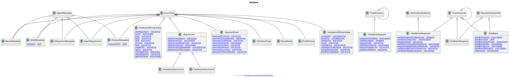
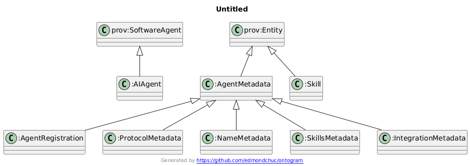
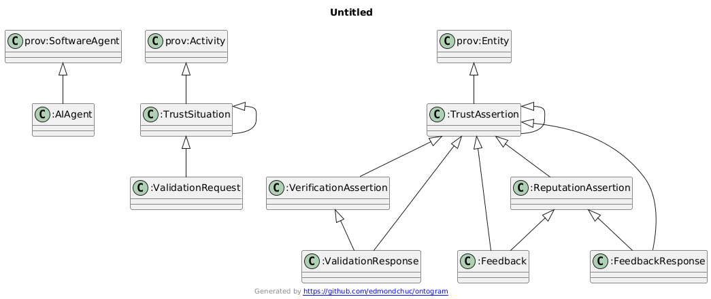
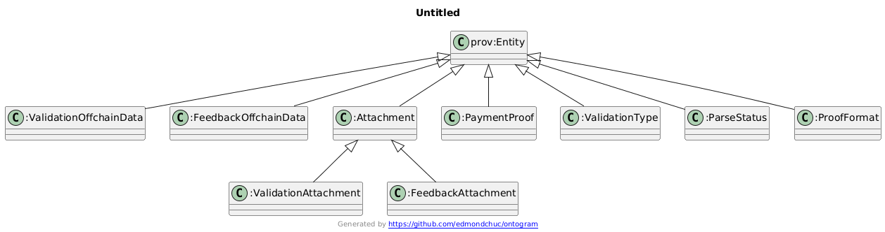
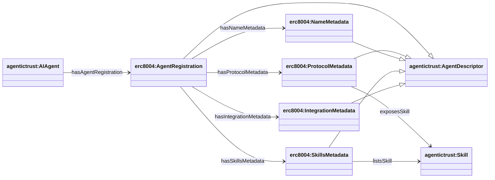
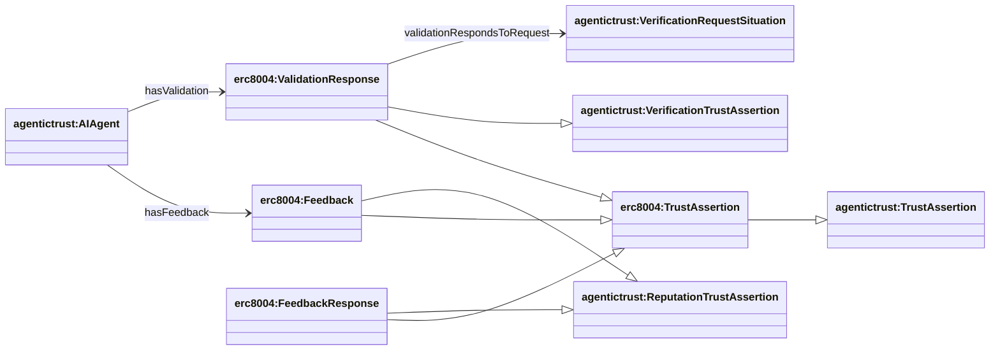
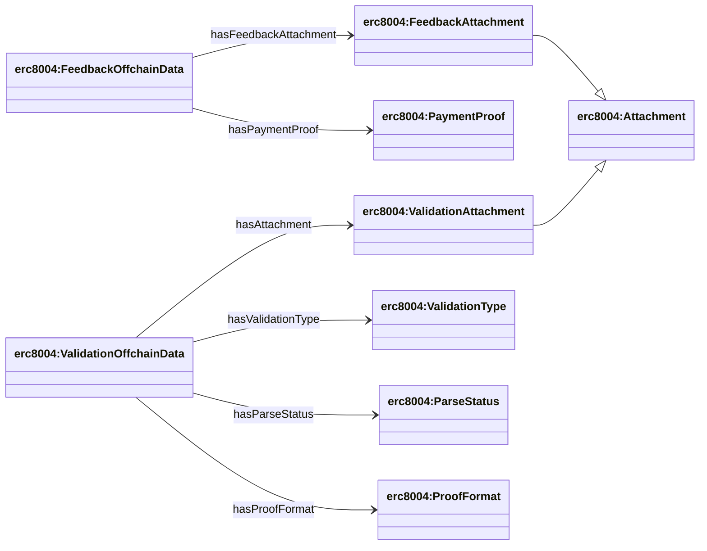

## ERC-8004 ontology (`ERC8004.owl`)

Source: `apps/badge-admin/public/ontology/ERC8004.owl`

### Full diagram (generated)

- PNG: `docs/ontology/images/ERC8004.png`
- SVG: `docs/ontology/images/ERC8004.svg`



### Section diagrams







### Registration metadata composition

`erc8004:AgentRegistration` is a metadata bundle composed of four metadata components:

- `erc8004:ProtocolMetadata`
- `erc8004:NameMetadata`
- `erc8004:SkillsMetadata`
- `erc8004:IntegrationMetadata`



### Validation and feedback as trust model specializations (assertion-side)



### Difference between Feedback and FeedbackResponse

Both `erc8004:Feedback` and `erc8004:FeedbackResponse` are `ReputationTrustAssertion` records, but they serve different roles:

**`erc8004:Feedback`**
- Initial feedback/review submitted by a client about an agent
- Created by `erc8004:FeedbackAct`, which asserts a `ReputationTrustSituation`
- Contains: score, tags, comments, rating, etc.
- Stored in `rep_feedbacks` table

**`erc8004:FeedbackResponse`**
- Response to an existing `Feedback` record
- Used for disputes, clarifications, or additional context
- Created by `erc8004:FeedbackResponseAct`
- Stored in `rep_feedback_responses` table with a `feedbackIndex` linking back to the original feedback

**Relationship:**
- Multiple `FeedbackResponse` records can exist for a single `Feedback` record
- The database tracks responses via `feedbackIndex` in the `rep_feedback_responses` table
- The original feedback record maintains a `responseCount` field

### SPARQL Queries (demonstrating property relationships)

**Query AgentRegistration with Metadata Components:**
```sparql
PREFIX agentictrust: <https://www.agentictrust.io/ontology/agentictrust-core#>
PREFIX erc8004: <https://www.agentictrust.io/ontology/ERC8004#>

SELECT ?agent ?agentId ?agentRegistration ?protocolMetadata ?nameMetadata ?skillsMetadata ?integrationMetadata
WHERE {
  ?agent a agentictrust:AIAgent ;
    agentictrust:agentId ?agentId ;
    erc8004:hasAgentRegistration ?agentRegistration .
  
  OPTIONAL {
    ?agentRegistration erc8004:hasProtocolMetadata ?protocolMetadata .
  }
  OPTIONAL {
    ?agentRegistration erc8004:hasNameMetadata ?nameMetadata .
  }
  OPTIONAL {
    ?agentRegistration erc8004:hasSkillsMetadata ?skillsMetadata .
  }
  OPTIONAL {
    ?agentRegistration erc8004:hasIntegrationMetadata ?integrationMetadata .
  }
}
```

**Query ValidationResponse with ValidationRequest:**
```sparql
PREFIX erc8004: <https://www.agentictrust.io/ontology/ERC8004#>
PREFIX agentictrust: <https://www.agentictrust.io/ontology/agentictrust-core#>

SELECT ?agent ?validationResponse ?validationRequest ?validatorAgent ?intentCheck
WHERE {
  ?agent a agentictrust:AIAgent ;
    erc8004:hasValidation ?validationResponse .
  
  ?validationResponse a erc8004:ValidationResponse .
  
  OPTIONAL {
    ?validationResponse erc8004:validationRespondsToRequest ?validationRequest .
  }
  OPTIONAL {
    ?validationResponse erc8004:validatorAgentForResponse ?validatorAgent .
  }
  OPTIONAL {
    ?validationResponse erc8004:validationTagCheck ?intentCheck .
  }
}
```

**Query Feedback with Context:**
```sparql
PREFIX erc8004: <https://www.agentictrust.io/ontology/ERC8004#>
PREFIX agentictrust: <https://www.agentictrust.io/ontology/agentictrust-core#>

SELECT ?agent ?feedback ?feedbackScore ?client ?skill ?intentType
WHERE {
  ?agent a agentictrust:AIAgent ;
    erc8004:hasFeedback ?feedback .
  
  OPTIONAL {
    ?feedback erc8004:feedbackScore ?feedbackScore .
  }
  OPTIONAL {
    ?feedback erc8004:feedbackClient ?client .
  }
  OPTIONAL {
    ?feedback erc8004:feedbackSkill ?skill .
  }
  OPTIONAL {
    ?feedback erc8004:feedbackIntentType ?intentType .
  }
}
```

**Query ProtocolMetadata with Skills:**
```sparql
PREFIX erc8004: <https://www.agentictrust.io/ontology/ERC8004#>
PREFIX agentictrust: <https://www.agentictrust.io/ontology/agentictrust-core#>

SELECT ?protocolMetadata ?skill ?skillLabel
WHERE {
  ?protocolMetadata a erc8004:ProtocolMetadata ;
    erc8004:exposesSkill ?skill .
  
  OPTIONAL {
    ?skill rdfs:label ?skillLabel .
  }
}
```

**Query SkillsMetadata with Skills:**
```sparql
PREFIX erc8004: <https://www.agentictrust.io/ontology/ERC8004#>
PREFIX agentictrust: <https://www.agentictrust.io/ontology/agentictrust-core#>

SELECT ?skillsMetadata ?skill ?skillLabel
WHERE {
  ?skillsMetadata a erc8004:SkillsMetadata ;
    erc8004:listsSkill ?skill .
  
  OPTIONAL {
    ?skill rdfs:label ?skillLabel .
  }
}
```

### Offchain profile entities (schemas, attachments, proof)



**Query ValidationOffchainData with Attachments and Types:**
```sparql
PREFIX erc8004: <https://www.agentictrust.io/ontology/ERC8004#>

SELECT ?validationOffchainData ?validationAttachment ?validationType ?parseStatus ?proofFormat
WHERE {
  ?validationOffchainData a erc8004:ValidationOffchainData .
  
  OPTIONAL {
    ?validationOffchainData erc8004:hasAttachment ?validationAttachment .
    ?validationAttachment a erc8004:ValidationAttachment .
  }
  OPTIONAL {
    ?validationOffchainData erc8004:hasValidationType ?validationType .
  }
  OPTIONAL {
    ?validationOffchainData erc8004:hasParseStatus ?parseStatus .
  }
  OPTIONAL {
    ?validationOffchainData erc8004:hasProofFormat ?proofFormat .
  }
}
```

**Query FeedbackOffchainData with Attachments and PaymentProof:**
```sparql
PREFIX erc8004: <https://www.agentictrust.io/ontology/ERC8004#>

SELECT ?feedbackOffchainData ?feedbackAttachment ?paymentProof
WHERE {
  ?feedbackOffchainData a erc8004:FeedbackOffchainData .
  
  OPTIONAL {
    ?feedbackOffchainData erc8004:hasFeedbackAttachment ?feedbackAttachment .
    ?feedbackAttachment a erc8004:FeedbackAttachment .
  }
  OPTIONAL {
    ?feedbackOffchainData erc8004:hasPaymentProof ?paymentProof .
  }
}
```


