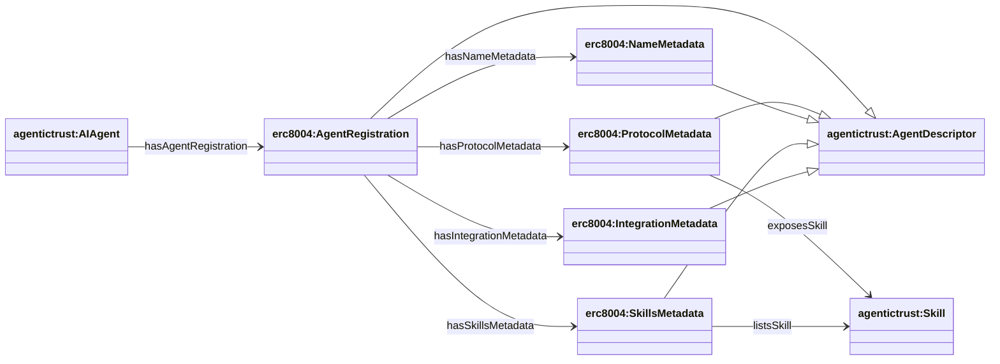
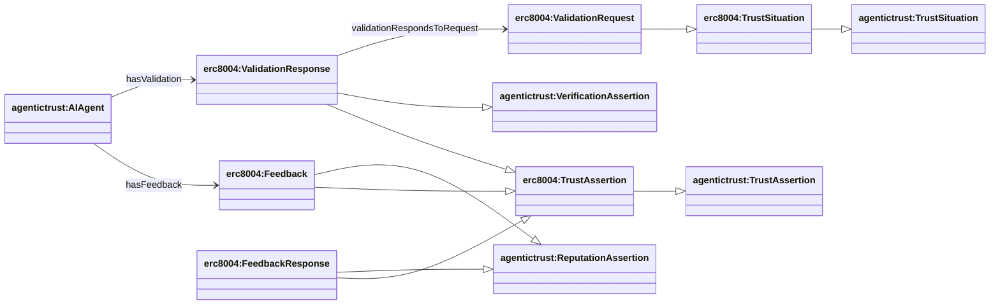
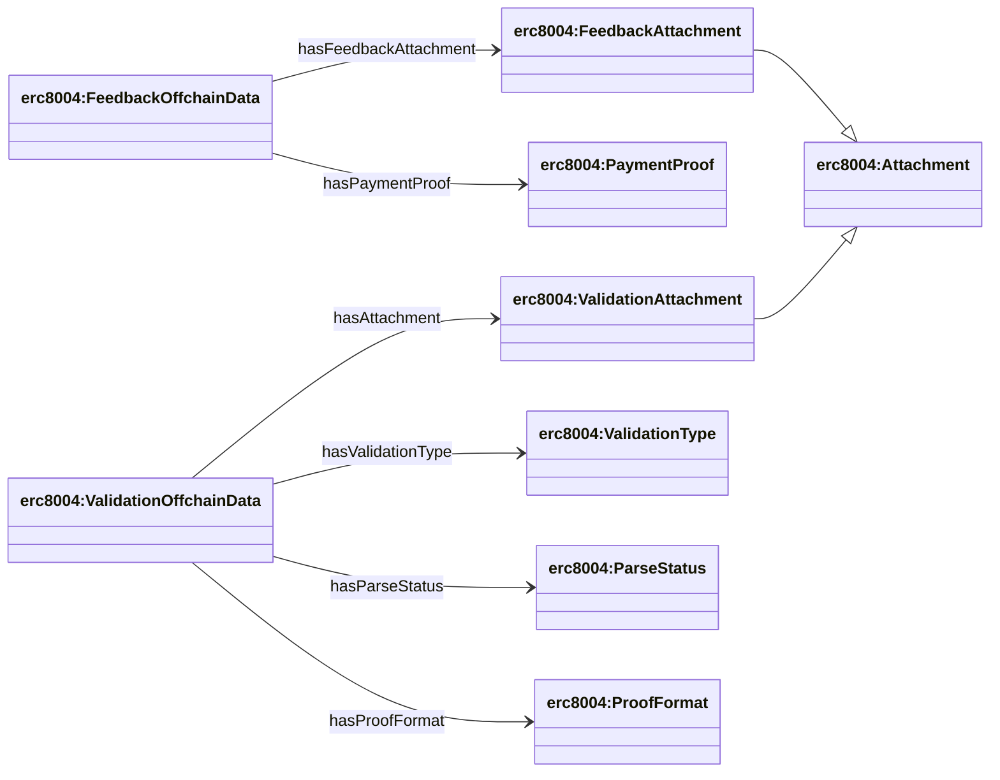

## ERC-8004 ontology (`ERC8004.owl`)

Source: `apps/badge-admin/public/ontology/ERC8004.owl`

### Full diagram (generated)

- PNG: `docs/ontology/images/ERC8004.png`
- SVG: `docs/ontology/images/ERC8004.svg`

### Section diagrams

### Registration metadata composition

`erc8004:AgentRegistration` is a metadata bundle composed of four metadata components:

- `erc8004:ProtocolMetadata`
- `erc8004:NameMetadata`
- `erc8004:SkillsMetadata`
- `erc8004:IntegrationMetadata`

### Validation and feedback as trust model specializations

### Offchain profile entities (schemas, attachments, proof)

