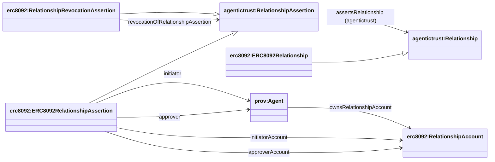

## ERC-8092 ontology (`ERC8092.owl`)

Source: `apps/badge-admin/public/ontology/ERC8092.owl`

### Full diagram (generated)

- PNG: `docs/ontology/images/ERC8092.png`
- SVG: `docs/ontology/images/ERC8092.svg`

### Relationship assertions

ERC-8092 is modeled as:

- **Relationship**: `agentictrust:Relationship` (persistent relationship instance)
- **RelationshipAssertion**: `agentictrust:RelationshipAssertion` (constitutive assertion)

ERC-8092 adds concrete subclasses and fields.

### Key identifiers (datatype properties)

- On the relationship instance:
  - `erc8092:relationshipId`
- On the relationship assertion:
  - `erc8092:relationshipAssertionId`
- On relationship accounts:
  - `erc8092:relationshipAccountId` (and alias `erc8092:accountAddress`)

