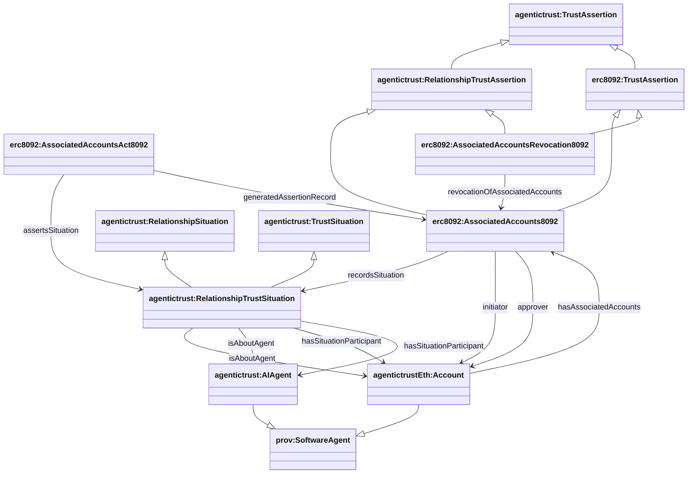

## ERC-8092 ontology (`ERC8092.owl`)

Source: `apps/badge-admin/public/ontology/ERC8092.owl`

### Full diagram (generated)

- PNG: `docs/ontology/images/ERC8092.png`
- SVG: `docs/ontology/images/ERC8092.svg`


### Section diagram


### Account association assertions (assertion-side only)

ERC-8092 is modeled as **assertion-side only** (no situation vocabulary):

- `erc8092:AssociatedAccounts8092` is the on-chain associated-accounts record (durable assertion record / Entity).
- Its associated act (`erc8092:AssociatedAccountsAct8092`) asserts a `agentictrust:RelationshipTrustSituation` via `agentictrust:assertsSituation`.
- The `RelationshipTrustSituation` **IS the relationship state** - there is no separate relationship entity. The situation itself represents the relationship between accounts.

**Inheritance hierarchy:**

ERC-8092 assertion classes inherit from both account-level and abstract relationship-level classes:

```
agentictrust:TrustAssertion (core)
  ├── agentictrust:RelationshipTrustAssertion (core - abstract)
  └── erc8092:TrustAssertion (erc8092 - account-level)
       └── erc8092:AssociatedAccounts8092 (inherits from both RelationshipTrustAssertion and erc8092:TrustAssertion)
       └── erc8092:AssociatedAccountsRevocation8092 (inherits from both RelationshipTrustAssertion and erc8092:TrustAssertion)
```

The `RelationshipTrustSituation` inherits from both:
- `agentictrust:TrustSituation` (trust-qualified situation)
- `agentictrust:RelationshipSituation` (relationship context)

This dual inheritance allows:
- **Account-level queries**: Use `erc8092:TrustAssertion` to find all account-to-account relationship assertions
- **Abstract relationship queries**: Use `RelationshipTrustAssertion` to find all relationship assertions (including ERC-8092 and future protocols)
- **ERC-8092 specific queries**: Use `AssociatedAccounts8092` for ERC-8092 specific properties and data
- **Situation queries**: Use `RelationshipTrustSituation` or `RelationshipSituation` to query relationship states

**Key design:**
- ERC-8092 defines **only assertion vocabulary** at the account level
- Situation vocabulary (`RelationshipTrustSituation`) comes from the core ontology
- `RelationshipTrustSituation` **is** the relationship state (no separate `AccountRelationship` entity)
- `Account` is a subclass of `prov:SoftwareAgent`, enabling it to participate in relationships
- Participants are linked directly to the situation via `agentictrust:isAboutAgent` and `agentictrust:hasSituationParticipant`



### Translation from Account-level to AI Agent-level

ERC-8092 operates at the **account level** (initiator/approver are `Account` entities), but the system translates these to **AI Agent-level** situations:

1. **Account initiator/approver → RelationshipTrustSituation:**
   - The `erc8092:initiator` and `erc8092:approver` properties point to `Account` entities
   - The `RelationshipTrustSituation` (created by the core ontology) **IS the relationship state** - there is no separate relationship entity
   - The situation links to participant accounts via:
     - `agentictrust:isAboutAgent` → Account (always present)
     - `agentictrust:isAboutAgent` → AIAgent (when account maps to an AI Agent)
     - `agentictrust:hasSituationParticipant` → Account and AIAgent (when mapped)

2. **Account-to-AI-Agent mapping:**
   - When an `Account` is associated with an `AIAgent` (via `agentictrustEth:hasAccountIdentifier`), the exporter automatically:
     - Adds `isAboutAgent` links from the `RelationshipTrustSituation` to the `AIAgent`
     - Adds `hasSituationParticipant` links to the `AIAgent`
   - This enables querying relationship situations by AI Agent, even though ERC-8092 only knows about accounts

3. **RelationshipTrustSituation as the relationship:**
   - The `RelationshipTrustSituation` **is** the relationship state (no separate `AccountRelationship` entity)
   - Participants are linked directly to the situation via `isAboutAgent` and `hasSituationParticipant`
   - The situation inherits from both `TrustSituation` (trust context) and `RelationshipSituation` (relationship context)
   - This creates a direct graph: Situation → Accounts → (optionally) AIAgents

### SPARQL Queries (demonstrating property relationships for agent ID 3223)

**Query 1: All relationship assertions for agent 3223 (with accounts and situation):**
```sparql
PREFIX erc8092: <https://www.agentictrust.io/ontology/ERC8092#>
PREFIX agentictrust: <https://www.agentictrust.io/ontology/agentictrust-core#>
PREFIX agentictrustEth: <https://www.agentictrust.io/ontology/agentictrust-eth#>

SELECT ?agent ?association ?situation ?initiator ?approver ?initiatorAccountId ?approverAccountId ?associationId
WHERE {
  ?agent a agentictrust:AIAgent ;
    agentictrust:agentId "3223" ;
    agentictrustEth:hasAccountIdentifier ?acctId .

  ?account agentictrustEth:hasIdentifier ?acctId .

  ?association a erc8092:AssociatedAccounts8092 ;
    erc8092:initiator|erc8092:approver ?account ;
    agentictrust:recordsSituation ?situation .

  OPTIONAL { ?association erc8092:initiator ?initiator . }
  OPTIONAL { ?association erc8092:approver ?approver . }
  OPTIONAL { ?association erc8092:initiatorAccountId ?initiatorAccountId . }
  OPTIONAL { ?association erc8092:approverAccountId ?approverAccountId . }
  OPTIONAL { ?association erc8092:associationId ?associationId . }
}
ORDER BY ?association
LIMIT 200
```

**Query 2: RelationshipTrustSituation for agent 3223 (showing all situation types and participants):**
```sparql
PREFIX agentictrust: <https://www.agentictrust.io/ontology/agentictrust-core#>
PREFIX agentictrustEth: <https://www.agentictrust.io/ontology/agentictrust-eth#>
PREFIX rdfs: <http://www.w3.org/2000/01/rdf-schema#>

SELECT ?agent ?situation ?situationType ?participant ?participantType
WHERE {
  ?agent a agentictrust:AIAgent ;
    agentictrust:agentId "3223" ;
    agentictrustEth:hasAccountIdentifier ?acctId .

  ?account agentictrustEth:hasIdentifier ?acctId .

  ?situation a ?situationType ;
    agentictrust:isAboutAgent ?account .

  ?situationType rdfs:subClassOf* agentictrust:RelationshipSituation .

  OPTIONAL {
    ?situation agentictrust:hasSituationParticipant ?participant .
    ?participant a ?participantType .
  }
}
ORDER BY ?situationType ?situation ?participant
LIMIT 200
```

**Query 3: Relationship situations for agent 3223 (most specific type only):**
```sparql
PREFIX agentictrust: <https://www.agentictrust.io/ontology/agentictrust-core#>
PREFIX agentictrustEth: <https://www.agentictrust.io/ontology/agentictrust-eth#>
PREFIX rdfs: <http://www.w3.org/2000/01/rdf-schema#>

SELECT ?agent ?situation ?situationType
WHERE {
  ?agent a agentictrust:AIAgent ;
    agentictrust:agentId "3223" ;
    agentictrustEth:hasAccountIdentifier ?acctId .

  ?account agentictrustEth:hasIdentifier ?acctId .

  ?situation a ?situationType ;
    agentictrust:isAboutAgent ?account .

  ?situationType rdfs:subClassOf* agentictrust:RelationshipSituation .
  
  # Only get the most specific type (no subclasses exist)
  FILTER NOT EXISTS {
    ?situationType rdfs:subClassOf ?moreSpecific .
    ?moreSpecific rdfs:subClassOf* agentictrust:RelationshipSituation .
  }
}
ORDER BY ?situationType ?situation
LIMIT 200
```

**Query 4: All ERC-8092 assertions and acts for agent 3223:**
```sparql
PREFIX erc8092: <https://www.agentictrust.io/ontology/ERC8092#>
PREFIX agentictrust: <https://www.agentictrust.io/ontology/agentictrust-core#>
PREFIX agentictrustEth: <https://www.agentictrust.io/ontology/agentictrust-eth#>
PREFIX rdfs: <http://www.w3.org/2000/01/rdf-schema#>

SELECT ?agent ?assertion ?assertionType ?act ?situation ?initiator ?approver
WHERE {
  ?agent a agentictrust:AIAgent ;
    agentictrust:agentId "3223" ;
    agentictrustEth:hasAccountIdentifier ?acctId .

  ?account agentictrustEth:hasIdentifier ?acctId .

  ?assertion a ?assertionType ;
    erc8092:initiator|erc8092:approver ?account .

  ?assertionType rdfs:subClassOf* erc8092:TrustAssertion .

  OPTIONAL {
    ?act agentictrust:generatedAssertionRecord ?assertion ;
      agentictrust:assertsSituation ?situation .
  }
  OPTIONAL { ?assertion erc8092:initiator ?initiator . }
  OPTIONAL { ?assertion erc8092:approver ?approver . }
}
ORDER BY ?assertionType ?assertion
LIMIT 200
```

**Query 5: Relationship revocations for agent 3223:**
```sparql
PREFIX erc8092: <https://www.agentictrust.io/ontology/ERC8092#>
PREFIX agentictrust: <https://www.agentictrust.io/ontology/agentictrust-core#>
PREFIX agentictrustEth: <https://www.agentictrust.io/ontology/agentictrust-eth#>

SELECT ?agent ?revocation ?revokedAssociation ?revocationTxHash ?revokedAt
WHERE {
  ?agent a agentictrust:AIAgent ;
    agentictrust:agentId "3223" ;
    agentictrustEth:hasAccountIdentifier ?acctId .

  ?account agentictrustEth:hasIdentifier ?acctId .

  ?revocation a erc8092:AssociatedAccountsRevocation8092 ;
    erc8092:revocationOfAssociatedAccounts ?revokedAssociation .

  ?revokedAssociation erc8092:initiator|erc8092:approver ?account .

  OPTIONAL { ?revocation erc8092:revocationTxHash ?revocationTxHash . }
  OPTIONAL { ?revocation erc8092:revokedAt ?revokedAt . }
}
ORDER BY ?revocation
LIMIT 200
```

**Query 6: Complete relationship graph for agent 3223 (assertions, acts, situations, participants):**
```sparql
PREFIX erc8092: <https://www.agentictrust.io/ontology/ERC8092#>
PREFIX agentictrust: <https://www.agentictrust.io/ontology/agentictrust-core#>
PREFIX agentictrustEth: <https://www.agentictrust.io/ontology/agentictrust-eth#>

SELECT ?agent ?association ?act ?situation ?participant ?participantType ?initiatorAccountId ?approverAccountId
WHERE {
  ?agent a agentictrust:AIAgent ;
    agentictrust:agentId "3223" ;
    agentictrustEth:hasAccountIdentifier ?acctId .

  ?account agentictrustEth:hasIdentifier ?acctId .

  ?association a erc8092:AssociatedAccounts8092 ;
    erc8092:initiator|erc8092:approver ?account ;
    agentictrust:recordsSituation ?situation .

  OPTIONAL {
    ?act agentictrust:generatedAssertionRecord ?association ;
      agentictrust:assertsSituation ?situation .
  }

  OPTIONAL {
    ?situation agentictrust:hasSituationParticipant ?participant .
    ?participant a ?participantType .
  }

  OPTIONAL { ?association erc8092:initiatorAccountId ?initiatorAccountId . }
  OPTIONAL { ?association erc8092:approverAccountId ?approverAccountId . }
}
ORDER BY ?association ?situation ?participant
LIMIT 200
```

**Query 7: All accounts associated with agent 3223 via ERC-8092:**
```sparql
PREFIX erc8092: <https://www.agentictrust.io/ontology/ERC8092#>
PREFIX agentictrust: <https://www.agentictrust.io/ontology/agentictrust-core#>
PREFIX agentictrustEth: <https://www.agentictrust.io/ontology/agentictrust-eth#>

SELECT DISTINCT ?agent ?agentAccount ?associatedAccount ?accountType ?associationId
WHERE {
  ?agent a agentictrust:AIAgent ;
    agentictrust:agentId "3223" ;
    agentictrustEth:hasAccountIdentifier ?acctId .

  ?agentAccount agentictrustEth:hasIdentifier ?acctId .

  ?association a erc8092:AssociatedAccounts8092 ;
    erc8092:initiator|erc8092:approver ?agentAccount ;
    erc8092:initiator|erc8092:approver ?associatedAccount .

  FILTER(?associatedAccount != ?agentAccount)

  ?associatedAccount a ?accountType .

  OPTIONAL { ?association erc8092:associationId ?associationId . }
}
ORDER BY ?associatedAccount
LIMIT 200
```

### Key identifiers (datatype properties)

- On the association assertion:
  - `erc8092:associationId`
  - `erc8092:relationshipAssertionId`
  - `erc8092:initiatorAccountId` / `erc8092:approverAccountId`


