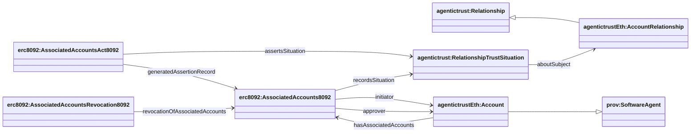

## ERC-8092 ontology (`ERC8092.owl`)

Source: `apps/badge-admin/public/ontology/ERC8092.owl`

### Full diagram (generated)

- PNG: `docs/ontology/images/ERC8092.png`
- SVG: `docs/ontology/images/ERC8092.svg`


### Section diagram


### Account association assertions (assertion-side only)

ERC-8092 is modeled as **assertion-side only**:

- `erc8092:AssociatedAccounts8092` is the on-chain associated-accounts record (durable assertion record / Entity).
- Its associated act (`erc8092:AssociatedAccountsAct8092`) asserts a `agentictrust:RelationshipTrustSituation` via `agentictrust:assertsSituation`.
- That situation points at the underlying relationship entity (core/eth): `agentictrust:aboutSubject` → `agentictrustEth:AccountRelationship`.

**Key changes:**
- `Account` is now a subclass of `prov:SoftwareAgent`, enabling it to participate in relationships
- `AccountRelationship` inherits from `agentictrust:Relationship`, inheriting participant and role properties
- Relationships link to participant Accounts via `agentictrust:hasParticipant` (from core ontology)



### SPARQL Queries (demonstrating property relationships)

**Query RelationshipAssertion with Relationship and Accounts:**
```sparql
PREFIX erc8092: <https://www.agentictrust.io/ontology/ERC8092#>
PREFIX agentictrust: <https://www.agentictrust.io/ontology/agentictrust-core#>

SELECT ?association ?situation ?initiator ?approver ?initiatorAccountId ?approverAccountId
WHERE {
  ?association a erc8092:AssociatedAccounts8092 .
  OPTIONAL { ?association agentictrust:recordsSituation ?situation . }
  OPTIONAL { ?association erc8092:initiator ?initiator . }
  OPTIONAL { ?association erc8092:approver ?approver . }
  OPTIONAL { ?association erc8092:initiatorAccountId ?initiatorAccountId . }
  OPTIONAL { ?association erc8092:approverAccountId ?approverAccountId . }
}
```

**Query AssociatedAccountsRevocation8092:**
```sparql
PREFIX erc8092: <https://www.agentictrust.io/ontology/ERC8092#>

SELECT ?revocation ?revokedAssociation ?revocationTxHash
WHERE {
  ?revocation a erc8092:AssociatedAccountsRevocation8092 .
  OPTIONAL { ?revocation erc8092:revocationOfAssociatedAccounts ?revokedAssociation . }
  OPTIONAL { ?revocation erc8092:revocationTxHash ?revocationTxHash . }
}
```

### Key identifiers (datatype properties)

- On the association assertion:
  - `erc8092:associationId`
  - `erc8092:relationshipAssertionId`
  - `erc8092:initiatorAccountId` / `erc8092:approverAccountId`


