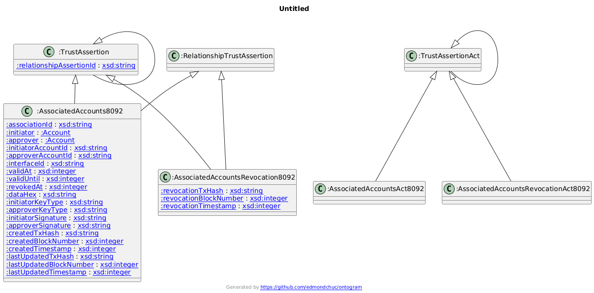
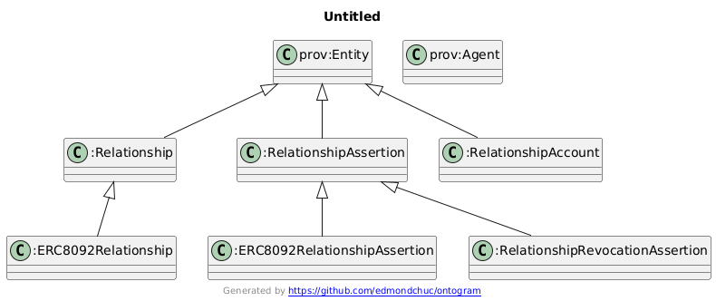
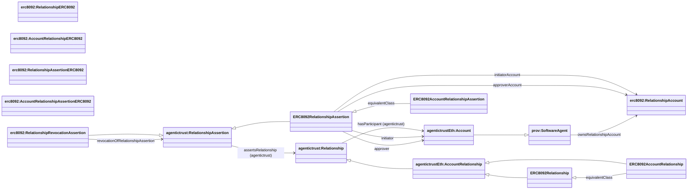

## ERC-8092 ontology (`ERC8092.owl`)

Source: `apps/badge-admin/public/ontology/ERC8092.owl`

### Full diagram (generated)

- PNG: `docs/ontology/images/ERC8092.png`
- SVG: `docs/ontology/images/ERC8092.svg`



### Section diagram



### Relationship assertions

ERC-8092 is modeled as:

- **Relationship**: `agentictrust:Relationship` (persistent relationship instance)
  - Inherited by `agentictrustEth:AccountRelationship` (account-to-account relationships)
  - Specialized as `erc8092:RelationshipERC8092` and `erc8092:AccountRelationshipERC8092` (equivalent classes)
- **RelationshipAssertion**: `agentictrust:RelationshipAssertion` (constitutive assertion)
  - Specialized as `erc8092:RelationshipAssertionERC8092` and `erc8092:AccountRelationshipAssertionERC8092` (equivalent classes)

ERC-8092 adds concrete subclasses and fields.

**Key changes:**
- `Account` is now a subclass of `prov:SoftwareAgent`, enabling it to participate in relationships
- `AccountRelationship` inherits from `agentictrust:Relationship`, inheriting participant and role properties
- Relationships link to participant Accounts via `agentictrust:hasParticipant` (from core ontology)



### SPARQL Queries (demonstrating property relationships)

**Query RelationshipAssertion with Relationship and Accounts:**
```sparql
PREFIX erc8092: <https://www.agentictrust.io/ontology/ERC8092#>
PREFIX agentictrust: <https://www.agentictrust.io/ontology/agentictrust-core#>

SELECT ?relationshipAssertion ?relationship ?initiator ?approver ?initiatorAccount ?approverAccount
WHERE {
  ?relationshipAssertion a erc8092:RelationshipAssertionERC8092 .
  
  OPTIONAL {
    ?relationshipAssertion agentictrust:assertsRelationship ?relationship .
  }
  OPTIONAL {
    ?relationshipAssertion erc8092:initiator ?initiator .
  }
  OPTIONAL {
    ?relationshipAssertion erc8092:approver ?approver .
  }
  OPTIONAL {
    ?relationshipAssertion erc8092:initiatorAccount ?initiatorAccount .
  }
  OPTIONAL {
    ?relationshipAssertion erc8092:approverAccount ?approverAccount .
  }
}
```

**Query Agent with RelationshipAccounts:**
```sparql
PREFIX erc8092: <https://www.agentictrust.io/ontology/ERC8092#>
PREFIX agentictrust: <https://www.agentictrust.io/ontology/agentictrust-core#>

SELECT ?agent ?agentId ?relationshipAccount ?relationshipAssertion
WHERE {
  ?agent a agentictrust:AIAgent ;
    agentictrust:agentId ?agentId ;
    erc8092:ownsRelationshipAccount ?relationshipAccount .
  
  OPTIONAL {
    ?relationshipAssertion erc8092:initiatorAccount ?relationshipAccount .
  }
  UNION
  OPTIONAL {
    ?relationshipAssertion erc8092:approverAccount ?relationshipAccount .
  }
}
```

**Query RelationshipRevocationAssertion:**
```sparql
PREFIX erc8092: <https://www.agentictrust.io/ontology/ERC8092#>
PREFIX agentictrust: <https://www.agentictrust.io/ontology/agentictrust-core#>

SELECT ?revocationAssertion ?revokedAssertion ?revocationTxHash
WHERE {
  ?revocationAssertion a erc8092:RelationshipRevocationAssertion .
  
  OPTIONAL {
    ?revocationAssertion erc8092:revocationOfRelationshipAssertion ?revokedAssertion .
  }
  OPTIONAL {
    ?revocationAssertion erc8092:revocationTxHash ?revocationTxHash .
  }
}
```

### Key identifiers (datatype properties)

- On the relationship instance:
  - `erc8092:relationshipId`
- On the relationship assertion:
  - `erc8092:relationshipAssertionId`
- On relationship accounts:
  - `erc8092:relationshipAccountId` (and alias `erc8092:accountAddress`)


