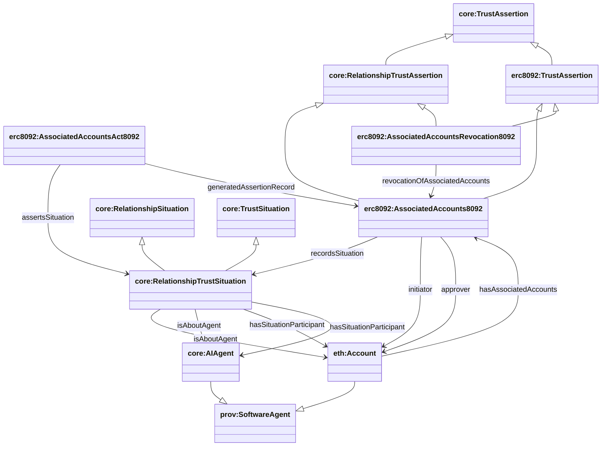

## ERC-8092 ontology (`apps/ontology/ontology/erc8092.ttl`)

Source: `apps/ontology/ontology/erc8092.ttl`

### Full diagram (generated)

- PNG: `docs/ontology/images/ERC8092.png`
- SVG: `docs/ontology/images/ERC8092.svg`


### Section diagram


### Account association assertions (assertion-side only)

ERC-8092 is modeled as **assertion-side only** (no situation vocabulary):

- `erc8092:AssociatedAccounts8092` is the on-chain associated-accounts record (durable assertion record / Entity).
- Its associated act (`erc8092:AssociatedAccountsAct8092`) asserts a `core:RelationshipTrustSituation` via `core:assertsSituation`.
- The `RelationshipTrustSituation` **IS the relationship state** - there is no separate relationship entity. The situation itself represents the relationship between accounts.

**Inheritance hierarchy:**

ERC-8092 assertion classes inherit from both account-level and abstract relationship-level classes:

```
core:TrustAssertion (core)
  ├── core:RelationshipTrustAssertion (core - abstract)
  └── erc8092:TrustAssertion (erc8092 - account-level)
       └── erc8092:AssociatedAccounts8092 (inherits from both RelationshipTrustAssertion and erc8092:TrustAssertion)
       └── erc8092:AssociatedAccountsRevocation8092 (inherits from both RelationshipTrustAssertion and erc8092:TrustAssertion)
```

The `RelationshipTrustSituation` inherits from both:
- `core:TrustSituation` (trust-qualified situation)
- `core:RelationshipSituation` (relationship context)

This dual inheritance allows:
- **Account-level queries**: Use `erc8092:TrustAssertion` to find all account-to-account relationship assertions
- **Abstract relationship queries**: Use `RelationshipTrustAssertion` to find all relationship assertions (including ERC-8092 and future protocols)
- **ERC-8092 specific queries**: Use `AssociatedAccounts8092` for ERC-8092 specific properties and data
- **Situation queries**: Use `RelationshipTrustSituation` or `RelationshipSituation` to query relationship states

**Key design:**
- ERC-8092 defines **only assertion vocabulary** at the account level
- Situation vocabulary (`RelationshipTrustSituation`) comes from the core ontology
- `RelationshipTrustSituation` **is** the relationship state (no separate `AccountRelationship` entity)
- `Account` is a subclass of `prov:SoftwareAgent`, enabling it to participate in relationships
- Participants are linked directly to the situation via `core:isAboutAgent` and `core:hasSituationParticipant`



### Translation from Account-level to AI Agent-level

ERC-8092 operates at the **account level** (initiator/approver are `Account` entities), but the system translates these to **AI Agent-level** situations:

1. **Account initiator/approver → RelationshipTrustSituation:**
   - The `erc8092:initiator` and `erc8092:approver` properties point to `Account` entities
   - The `RelationshipTrustSituation` (created by the core ontology) **IS the relationship state** - there is no separate relationship entity
   - The situation links to participant accounts via:
     - `core:isAboutAgent` → Account (always present)
     - `core:isAboutAgent` → AIAgent (when account maps to an AI Agent)
     - `core:hasSituationParticipant` → Account and AIAgent (when mapped)

2. **Account-to-AI-Agent mapping:**
   - When an `Account` is associated with an `AIAgent` (via `eth:hasAccountIdentifier`), the exporter automatically:
     - Adds `isAboutAgent` links from the `RelationshipTrustSituation` to the `AIAgent`
     - Adds `hasSituationParticipant` links to the `AIAgent`
   - This enables querying relationship situations by AI Agent, even though ERC-8092 only knows about accounts

3. **RelationshipTrustSituation as the relationship:**
   - The `RelationshipTrustSituation` **is** the relationship state (no separate `AccountRelationship` entity)
   - Participants are linked directly to the situation via `isAboutAgent` and `hasSituationParticipant`
   - The situation inherits from both `TrustSituation` (trust context) and `RelationshipSituation` (relationship context)
   - This creates a direct graph: Situation → Accounts → (optionally) AIAgents

### SPARQL Queries (current graph shape)

`apps/sync` emits ERC‑8092 associations as assertion records, and links them to accounts via:

- `eth:Account erc8092:hasAssociatedAccounts erc8092:AssociatedAccounts8092`

#### Query 1: ERC‑8092 associations for an agent (anchor by did:8004)

```sparql
PREFIX core: <https://agentictrust.io/ontology/core#>
PREFIX eth: <https://agentictrust.io/ontology/eth#>
PREFIX erc8004: <https://agentictrust.io/ontology/erc8004#>
PREFIX erc8092: <https://agentictrust.io/ontology/erc8092#>

SELECT ?agent ?did8004 ?walletAccount ?association ?initiatorAccountId ?approverAccountId
WHERE {
  VALUES ?did8004 { "did:8004:11155111:3223" } # change chainId if needed

  ?agent a core:AIAgent ;
         core:hasIdentity ?identity8004 .
  ?identity8004 a erc8004:AgentIdentity8004 ;
                core:hasIdentifier ?ident8004 ;
                erc8004:hasWalletAccount ?walletAccount .
  ?ident8004 core:protocolIdentifier ?did8004 .

  ?walletAccount a eth:Account ;
                erc8092:hasAssociatedAccounts ?association .
  ?association a erc8092:AssociatedAccounts8092 .

  OPTIONAL { ?association erc8092:initiatorAccountId ?initiatorAccountId . }
  OPTIONAL { ?association erc8092:approverAccountId ?approverAccountId . }
}
ORDER BY ?association
LIMIT 200
```

#### Query 2: ERC‑8092 associations for a wallet address

```sparql
PREFIX eth: <https://agentictrust.io/ontology/eth#>
PREFIX erc8092: <https://agentictrust.io/ontology/erc8092#>

SELECT ?walletAccount ?association ?initiatorAccountId ?approverAccountId
WHERE {
  VALUES ?walletAddress { "0x..." }
  ?walletAccount a eth:Account ;
                eth:accountAddress ?walletAddress ;
                erc8092:hasAssociatedAccounts ?association .
  ?association a erc8092:AssociatedAccounts8092 .
  OPTIONAL { ?association erc8092:initiatorAccountId ?initiatorAccountId . }
  OPTIONAL { ?association erc8092:approverAccountId ?approverAccountId . }
}
ORDER BY ?association
LIMIT 200
```

**Query 5: Relationship revocations for an agent (anchor by did:8004):**

```sparql
PREFIX core: <https://agentictrust.io/ontology/core#>
PREFIX eth: <https://agentictrust.io/ontology/eth#>
PREFIX erc8004: <https://agentictrust.io/ontology/erc8004#>
PREFIX erc8092: <https://agentictrust.io/ontology/erc8092#>

SELECT ?agent ?walletAccount ?revocation ?revokedAssociation
WHERE {
  VALUES ?did8004 { "did:8004:11155111:3223" } # change chainId if needed

  ?agent a core:AIAgent ;
         core:hasIdentity ?identity8004 .
  ?identity8004 a erc8004:AgentIdentity8004 ;
                core:hasIdentifier ?ident8004 ;
                erc8004:hasWalletAccount ?walletAccount .
  ?ident8004 core:protocolIdentifier ?did8004 .

  ?walletAccount erc8092:hasAssociatedAccounts ?revokedAssociation .
  ?revocation a erc8092:AssociatedAccountsRevocation8092 ;
             erc8092:revocationOfAssociatedAccounts ?revokedAssociation .
}
ORDER BY ?revocation
LIMIT 200
```

**Query 6: List association records reachable from an agent’s wallet account:**

```sparql
PREFIX core: <https://agentictrust.io/ontology/core#>
PREFIX erc8004: <https://agentictrust.io/ontology/erc8004#>
PREFIX erc8092: <https://agentictrust.io/ontology/erc8092#>

SELECT ?agent ?walletAccount ?association ?initiatorAccountId ?approverAccountId
WHERE {
  VALUES ?did8004 { "did:8004:11155111:3223" } # change chainId if needed

  ?agent a core:AIAgent ;
         core:hasIdentity ?identity8004 .
  ?identity8004 a erc8004:AgentIdentity8004 ;
                core:hasIdentifier ?ident8004 ;
                erc8004:hasWalletAccount ?walletAccount .
  ?ident8004 core:protocolIdentifier ?did8004 .

  ?walletAccount erc8092:hasAssociatedAccounts ?association .
  ?association a erc8092:AssociatedAccounts8092 .
  OPTIONAL { ?association erc8092:initiatorAccountId ?initiatorAccountId . }
  OPTIONAL { ?association erc8092:approverAccountId ?approverAccountId . }
}
ORDER BY ?association
LIMIT 200
```

### Key identifiers (datatype properties)

- On the association assertion:
  - `erc8092:associationId`
  - `erc8092:relationshipAssertionId`
  - `erc8092:initiatorAccountId` / `erc8092:approverAccountId`


