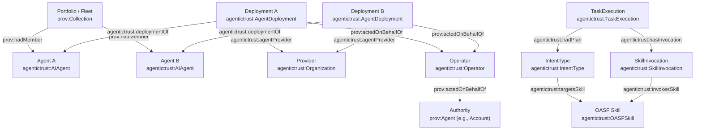

# Google Agentspace (portfolio + governance + orchestration) mapped to AgenticTrust

This page documents how to represent the **“portfolio of specialized agents”** idea (and “**govern and orchestrate a fleet of agents**”) using the AgenticTrust ontology patterns.

## Core framing

- **Portfolio / fleet**: a set of discoverable agents (trust-graph anchors) grouped for governance, routing, and reporting.
- **Orchestration**: routing intents to the right agent deployment(s) and tracing executions.
- **Governance**: accountability of who operated what deployment, delegation, and attestations over time.

## Mapping to AgenticTrust (what to use)

### Portfolio (“fleet of agents”)

Model a portfolio as a **collection** of discoverable agents:

- **Members**: `agentictrust:AIAgent` (stable anchor)
- **Container**: `prov:Collection` (or `prov:Entity` if you don’t want Collection semantics)
- **Membership**: `prov:hadMember` (collection → member)

This repo now defines `agentictrust:AgentPortfolio ⊑ prov:Collection`. See [`agent-portfolio.md`](./agent-portfolio.md).

### Governance (who is responsible / who is operating)

Use the existing “authority → operator → executable” model:

- **Authority**: typically an on-chain account agent (often `agentictrustEth:Account` + `agentictrust:AIAgent`)
- **Operator**: `agentictrust:Operator` (delegated actor)
- **Executable**: `agentictrust:AgentDeployment` (endpoint-reachable executor)
- **Deployment implements agent**: `agentictrust:deploymentOf` (Deployment → AIAgent)
- **Delegation**: `prov:actedOnBehalfOf` (delegatee → delegator) and `agentictrust:delegatedBy` (inverse convenience)
- **Provider** (org responsible for hosting): `agentictrust:agentProvider` (Deployment → Organization)

### Orchestration (routing + tracing)

Represent “orchestration” as **intent + execution**:

- **Intent schema**: `agentictrust:IntentType`
- **Skill targeted by intent**: `agentictrust:targetsSkill` (IntentType → OASF skill node)
- **Execution**: `agentictrust:TaskExecution` (prov:Activity)
- **Concrete calls**: `agentictrust:SkillInvocation` (prov:Activity)
- **Execution uses plan**: `agentictrust:hadPlan` (subPropertyOf `prov:hadPlan`)
- **Execution produces artifacts**: `agentictrust:producedArtifact`

## Diagrams

### Portfolio + governance + orchestration (conceptual)



## SPARQL patterns

### 1) List portfolios and their agents

```sparql
PREFIX prov: <http://www.w3.org/ns/prov#>
PREFIX agentictrust: <https://www.agentictrust.io/ontology/agentictrust-core#>

SELECT ?portfolio (COUNT(DISTINCT ?agent) AS ?agents)
WHERE {
  ?portfolio a prov:Collection ;
             prov:hadMember ?agent .
  ?agent a agentictrust:AIAgent .
}
GROUP BY ?portfolio
ORDER BY DESC(?agents)
LIMIT 200
```

### 2) For a given portfolio, list each agent’s deployments + provider

```sparql
PREFIX prov: <http://www.w3.org/ns/prov#>
PREFIX agentictrust: <https://www.agentictrust.io/ontology/agentictrust-core#>

SELECT DISTINCT ?agent ?deployment ?provider
WHERE {
  VALUES (?portfolio) { (<PORTFOLIO_IRI>) }
  ?portfolio a prov:Collection ;
             prov:hadMember ?agent .
  ?agent a agentictrust:AIAgent .

  OPTIONAL {
    ?deployment a agentictrust:AgentDeployment ;
                agentictrust:deploymentOf ?agent .
    OPTIONAL { ?deployment agentictrust:agentProvider ?provider . }
  }
}
ORDER BY ?agent ?deployment
LIMIT 500
```

### 3) Portfolio “coverage”: what skills are advertised across all agents (via identity → descriptor)

```sparql
PREFIX prov: <http://www.w3.org/ns/prov#>
PREFIX agentictrust: <https://www.agentictrust.io/ontology/agentictrust-core#>

SELECT DISTINCT ?skillId
WHERE {
  VALUES (?portfolio) { (<PORTFOLIO_IRI>) }
  ?portfolio a prov:Collection ;
             prov:hadMember ?agent .
  ?agent a agentictrust:AIAgent ;
         agentictrust:hasIdentity ?identity .
  ?identity agentictrust:hasDescriptor ?reg .

  ?reg agentictrust:hasSkill ?agentSkill .
  ?agentSkill agentictrust:hasSkillClassification ?skillNode .
  ?skillNode agentictrust:oasfSkillId ?skillId .
}
ORDER BY ?skillId
LIMIT 500
```

### 4) Orchestration trace: task executions and which skills were invoked

```sparql
PREFIX agentictrust: <https://www.agentictrust.io/ontology/agentictrust-core#>

SELECT DISTINCT ?exec ?intentType ?skillId
WHERE {
  ?exec a agentictrust:TaskExecution .
  OPTIONAL { ?exec agentictrust:hadPlan ?intentType . }

  OPTIONAL {
    ?exec agentictrust:hasInvocation ?inv .
    ?inv agentictrust:invokesSkill ?skillNode .
    OPTIONAL { ?skillNode agentictrust:oasfSkillId ?skillId . }
  }
}
ORDER BY DESC(?exec)
LIMIT 200
```

## Semantic routing (intent → task → dispatch → execute)

Google hasn’t published a formal protocol or ontology for “semantic routing” in Agentspace, but publicly available product narratives consistently describe a **search → synthesis → action** shape that implies semantic understanding and dispatch.

Authoritative references:

- Google Cloud product blog: [Agentspace enables the agent-driven enterprise](https://cloud.google.com/blog/products/ai-machine-learning/google-agentspace-enables-the-agent-driven-enterprise)
- Google blog feed entry: [Google Agentspace feed item](https://blog.google/feed/google-agentspace/)

### Working interpretation (non-spec)

The implicit architectural pipeline described in public materials looks like:

1) semantic retrieval  
2) intent understanding  
3) task classification  
4) workflow/agent dispatch  
5) action execution

### Mapping to AgenticTrust

AgenticTrust can represent this pattern *without* requiring Google to publish a task vocabulary:

- **Semantic retrieval**: an implementation method over Descriptor/knowledge artifacts (indexing detail; not an ontology primitive)
- **Intent understanding**: model the “why” as `agentictrust:IntentType` (a SituationDescription / plan-like schema)
- **Task classification**: map intent types to `agentictrust:TaskType` (and route via `agentictrust:mapsToTaskType`)
- **Dispatch**: execution begins as `agentictrust:TaskExecution` (prov:Activity) with concrete tool calls as `agentictrust:SkillInvocation`
- **Execution evidence**: outcomes and governance can be recorded as `agentictrust:AttestedAssertion` (auditability)

### Contrast with AgentCore “Tool-RAG”

Where AgentCore Gateway tends to form a **tool-catalog → semantic retrieval → shortlist → tool invocation** pipeline (Tool-RAG), Agentspace narratives emphasize a higher-level **task/workflow routing** layer driven by semantic enterprise search rather than iterating over a Gateway-local tool catalog.


