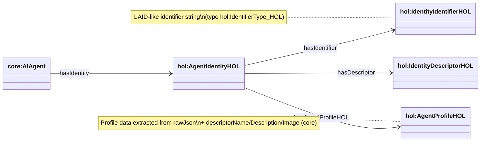

## HOL ontology (`apps/ontology/ontology/hol.ttl`)

Source ontology: `apps/ontology/ontology/hol.ttl`

This module models **HOL Universal Registry identity + profile descriptors** in the AgenticTrust graph.

It includes both:

- **Search-hit descriptors**: HOL `/api/v1/search` hits as a registry-produced descriptor (`hol:HOLAgentDescriptor`)
- **Identity/profile**: HOL identity + profile data as `hol:AgentIdentityHOL`, `hol:IdentityDescriptorHOL`, `hol:AgentProfileHOL`

### Core classes

- **`hol:AgentIdentityHOL`**: HOL agent identity (subclass of `core:AgentIdentity`)
- **`hol:IdentityIdentifierHOL`**: UAID-like identifier (subclass of `core:UniversalIdentifier`)
- **`hol:IdentityDescriptorHOL`**: identity descriptor (subclass of `core:AgentIdentityDescriptor`)
- **`hol:AgentProfileHOL`**: profile descriptor (subclass of `core:AgentIdentityDescriptor`)
- **`hol:AIAgentHOL`**: agent class specialization under `core:AIAgent`
- **`hol:HOLAgentDescriptor`**: HOL search-hit descriptor (subclass of `core:AgentDescriptor`)

### Core object properties

- **`core:hasIdentity`**: `core:AIAgent → hol:AgentIdentityHOL`
- **`core:hasIdentifier`**: `hol:AgentIdentityHOL → hol:IdentityIdentifierHOL`
- **`core:hasDescriptor`**: `hol:AgentIdentityHOL → hol:IdentityDescriptorHOL`
- **`hol:hasAgentProfileHOL`**: `hol:AgentIdentityHOL → hol:AgentProfileHOL`
- **`hol:hasHOLAgentDescriptor`**: `core:AIAgent → hol:HOLAgentDescriptor` (subPropertyOf `core:hasDescriptor`)

### Diagram (identity + descriptors)



### AgentProfileHOL fields (high-signal)

`hol:AgentProfileHOL` carries HOL-specific fields (all datatypes in `apps/ontology/ontology/hol.ttl`):

- **Identity/provenance-ish**: `hol:uaid`, `hol:originalId`, `hol:registry`
- **Profile strings**: `hol:displayName`, `hol:alias`, `hol:bio`
- **Scores + counts**: `hol:rating`, `hol:trustScore`, `hol:totalInteractions`
- **Availability**: `hol:availabilityStatus`, `hol:availabilityCheckedAt`, `hol:availabilityReason`, `hol:availabilitySource`, `hol:availabilityLatencyMs`, `hol:availabilityScore`, `hol:available`
- **Language**: `hol:detectedLanguage`, `hol:detectedLanguageCode`, `hol:detectedLanguageConfidence`
- **Adapter/protocol**: `hol:adapter`, `hol:protocol`, `hol:aiagentCreator`, `hol:aiagentModel`, `hol:communicationSupported`, `hol:routingSupported`
- **Indexing**: `hol:lastIndexed`, `hol:lastSeen`

Also, because it’s a `core:Descriptor`, it can use core descriptor relations like:

- `core:hasEndpoint` → `core:Endpoint`
- `core:hasCapability` → `core:Capability`
- `core:supportsProtocol` → `core:ProtocolType`
- `core:hasSkill` → `core:AgentSkill` → `core:hasSkillClassification` → `core:OASFSkill`

### SPARQL examples (HOL agents)

#### List HOL agents with identity + profile

```sparql
PREFIX core: <https://agentictrust.io/ontology/core#>
PREFIX hol: <https://agentictrust.io/ontology/hol#>

SELECT ?agent ?uaid ?identity ?profile ?registry ?trustScore
WHERE {
  ?agent a core:AIAgent ;
    core:hasIdentity ?identity ;
    hol:hasAgentProfileHOL ?profile .

  OPTIONAL { ?agent core:uaid ?uaid . }
  OPTIONAL { ?profile hol:registry ?registry . }
  OPTIONAL { ?profile hol:trustScore ?trustScore . }
}
ORDER BY ?uaid ?agent
LIMIT 200
```

#### AgentProfileHOL attributes for a specific registry (example: `erc-8004`)

```sparql
PREFIX core: <https://agentictrust.io/ontology/core#>
PREFIX hol: <https://agentictrust.io/ontology/hol#>

SELECT
  ?agent ?uaid ?identity ?profile ?registry ?trustScore
  ?uaid ?originalId ?displayName ?alias ?bio
  ?availabilityStatus ?availabilityCheckedAt ?availabilityReason ?availabilitySource ?availabilityLatencyMs ?availabilityScore ?available
  ?detectedLanguage ?detectedLanguageCode ?detectedLanguageConfidence
  ?adapter ?protocol ?aiagentCreator ?aiagentModel ?communicationSupported ?routingSupported
  ?imageStatus ?lastIndexed ?lastSeen
WHERE {
  ?agent a core:AIAgent ;
    core:hasIdentity ?identity ;
    hol:hasAgentProfileHOL ?profile .

  ?profile hol:registry "erc-8004" .
  BIND("erc-8004" AS ?registry)

  OPTIONAL { ?profile hol:trustScore ?trustScore . }
  OPTIONAL { ?agent core:uaid ?uaid . }
  OPTIONAL { ?profile hol:originalId ?originalId . }
  OPTIONAL { ?profile hol:displayName ?displayName . }
  OPTIONAL { ?profile hol:alias ?alias . }
  OPTIONAL { ?profile hol:bio ?bio . }

  OPTIONAL { ?profile hol:availabilityStatus ?availabilityStatus . }
  OPTIONAL { ?profile hol:availabilityCheckedAt ?availabilityCheckedAt . }
  OPTIONAL { ?profile hol:availabilityReason ?availabilityReason . }
  OPTIONAL { ?profile hol:availabilitySource ?availabilitySource . }
  OPTIONAL { ?profile hol:availabilityLatencyMs ?availabilityLatencyMs . }
  OPTIONAL { ?profile hol:availabilityScore ?availabilityScore . }
  OPTIONAL { ?profile hol:available ?available . }

  OPTIONAL { ?profile hol:detectedLanguage ?detectedLanguage . }
  OPTIONAL { ?profile hol:detectedLanguageCode ?detectedLanguageCode . }
  OPTIONAL { ?profile hol:detectedLanguageConfidence ?detectedLanguageConfidence . }

  OPTIONAL { ?profile hol:adapter ?adapter . }
  OPTIONAL { ?profile hol:protocol ?protocol . }
  OPTIONAL { ?profile hol:aiagentCreator ?aiagentCreator . }
  OPTIONAL { ?profile hol:aiagentModel ?aiagentModel . }
  OPTIONAL { ?profile hol:communicationSupported ?communicationSupported . }
  OPTIONAL { ?profile hol:routingSupported ?routingSupported . }

  OPTIONAL { ?profile hol:imageStatus ?imageStatus . }
  OPTIONAL { ?profile hol:lastIndexed ?lastIndexed . }
  OPTIONAL { ?profile hol:lastSeen ?lastSeen . }
}
ORDER BY ?uaid ?agent
LIMIT 200
```

#### Profile endpoints (safe IRIs only)

```sparql
PREFIX core: <https://agentictrust.io/ontology/core#>
PREFIX hol: <https://agentictrust.io/ontology/hol#>

SELECT ?agent ?uaid ?profile ?endpoint ?url
WHERE {
  ?agent a core:AIAgent ;
    hol:hasAgentProfileHOL ?profile .

  OPTIONAL { ?agent core:uaid ?uaid . }
  ?profile core:hasEndpoint ?endpoint .
  OPTIONAL { ?endpoint core:endpointUrl ?url . }
}
ORDER BY ?uaid ?endpoint
LIMIT 200
```

#### OASF skills declared on profiles

```sparql
PREFIX core: <https://agentictrust.io/ontology/core#>
PREFIX hol: <https://agentictrust.io/ontology/hol#>

SELECT ?agent ?uaid ?profile ?agentSkill ?skillClass ?oasfSkillId
WHERE {
  ?agent a core:AIAgent ;
    hol:hasAgentProfileHOL ?profile .

  OPTIONAL { ?agent core:uaid ?uaid . }
  ?profile core:hasSkill ?agentSkill .
  ?agentSkill core:hasSkillClassification ?skillClass .
  OPTIONAL { ?skillClass core:oasfSkillId ?oasfSkillId . }
}
ORDER BY ?uaid ?oasfSkillId
LIMIT 200
```


