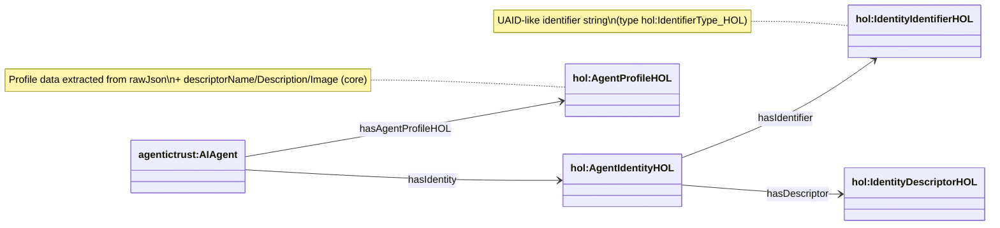

## HOL ontology (`hol.owl`)

Source ontology: `apps/badge-admin/public/ontology/hol.owl`

This module models **HOL Universal Registry identity + profile descriptors** in the AgenticTrust graph.

It is distinct from `agentictrust-hol.owl` (which models **HOL search-hit descriptors**). In practice:

- **`agentictrust-hol.owl`**: HOL `/api/v1/search` hits as a registry-produced descriptor (`agentictrust-hol:HOLAgentDescriptor`)
- **`hol.owl`**: HOL identity + profile data as `hol:AgentIdentityHOL`, `hol:IdentityDescriptorHOL`, `hol:AgentProfileHOL`

### Core classes

- **`hol:AgentIdentityHOL`**: HOL agent identity (subclass of `agentictrust:AgentIdentity`)
- **`hol:IdentityIdentifierHOL`**: UAID-like identifier (subclass of `agentictrust:UniversalIdentifier`)
- **`hol:IdentityDescriptorHOL`**: identity descriptor (subclass of `agentictrust:AgentIdentityDescriptor`)
- **`hol:AgentProfileHOL`**: profile descriptor (subclass of `agentictrust:AgentIdentityDescriptor`)

### Core object properties

- **`agentictrust:hasIdentity`**: `agentictrust:AIAgent → hol:AgentIdentityHOL`
- **`agentictrust:hasIdentifier`**: `hol:AgentIdentityHOL → hol:IdentityIdentifierHOL`
- **`agentictrust:hasDescriptor`**: `hol:AgentIdentityHOL → hol:IdentityDescriptorHOL`
- **`hol:hasAgentProfileHOL`**: `agentictrust:AIAgent → hol:AgentProfileHOL`

### Diagram (identity + descriptors)



### AgentProfileHOL fields (high-signal)

`hol:AgentProfileHOL` carries HOL-specific fields (all datatypes in `hol.owl`):

- **Identity/provenance-ish**: `hol:uaid`, `hol:originalId`, `hol:registry`
- **Profile strings**: `hol:displayName`, `hol:alias`, `hol:bio`
- **Scores + counts**: `hol:rating`, `hol:trustScore`, `hol:totalInteractions`
- **Availability**: `hol:availabilityStatus`, `hol:availabilityCheckedAt`, `hol:availabilityReason`, `hol:availabilitySource`, `hol:availabilityLatencyMs`, `hol:availabilityScore`, `hol:available`
- **Language**: `hol:detectedLanguage`, `hol:detectedLanguageCode`, `hol:detectedLanguageConfidence`
- **Adapter/protocol**: `hol:adapter`, `hol:protocol`, `hol:aiagentCreator`, `hol:aiagentModel`, `hol:communicationSupported`, `hol:routingSupported`
- **Indexing**: `hol:lastIndexed`, `hol:lastSeen`

Also, because it’s a `agentictrust:Descriptor`, it can use core descriptor relations like:

- `agentictrust:hasEndpoint` → `agentictrust:Endpoint`
- `agentictrust:hasCapability` → `agentictrust:Capability`
- `agentictrust:supportsProtocol` → `agentictrust:ProtocolType`
- `agentictrust:hasSkill` → `agentictrust:AgentSkill` → `agentictrust:hasSkillClassification` → `agentictrust:OASFSkill`

### SPARQL examples (HOL agents)

#### List HOL agents with identity + profile

```sparql
PREFIX agentictrust: <https://www.agentictrust.io/ontology/agentictrust-core#>
PREFIX hol: <https://www.agentictrust.io/ontology/hol#>

SELECT ?agent ?agentId ?identity ?profile ?registry ?trustScore
WHERE {
  ?agent a agentictrust:AIAgent ;
    agentictrust:agentId ?agentId ;
    agentictrust:hasIdentity ?identity ;
    hol:hasAgentProfileHOL ?profile .

  OPTIONAL { ?profile hol:registry ?registry . }
  OPTIONAL { ?profile hol:trustScore ?trustScore . }
}
ORDER BY ?agentId
LIMIT 200
```

#### Profile endpoints (safe IRIs only)

```sparql
PREFIX agentictrust: <https://www.agentictrust.io/ontology/agentictrust-core#>
PREFIX hol: <https://www.agentictrust.io/ontology/hol#>

SELECT ?agentId ?profile ?endpoint ?url
WHERE {
  ?agent a agentictrust:AIAgent ;
    agentictrust:agentId ?agentId ;
    hol:hasAgentProfileHOL ?profile .

  ?profile agentictrust:hasEndpoint ?endpoint .
  OPTIONAL { ?endpoint agentictrust:endpointUrl ?url . }
}
ORDER BY ?agentId ?endpoint
LIMIT 200
```

#### OASF skills declared on profiles

```sparql
PREFIX agentictrust: <https://www.agentictrust.io/ontology/agentictrust-core#>
PREFIX hol: <https://www.agentictrust.io/ontology/hol#>

SELECT ?agentId ?profile ?agentSkill ?skillClass ?oasfSkillId
WHERE {
  ?agent a agentictrust:AIAgent ;
    agentictrust:agentId ?agentId ;
    hol:hasAgentProfileHOL ?profile .

  ?profile agentictrust:hasSkill ?agentSkill .
  ?agentSkill agentictrust:hasSkillClassification ?skillClass .
  OPTIONAL { ?skillClass agentictrust:oasfSkillId ?oasfSkillId . }
}
ORDER BY ?agentId ?oasfSkillId
LIMIT 200
```


