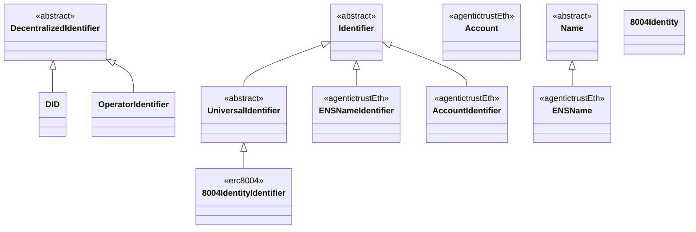

# Agent Identifiers and Identity Relationships

This document describes the complete agent identity model: how agents relate to identifiers (Account, ENSName, 8004Identity), identifiers to DIDs, and how Descriptors provide resolved metadata views.

## Overview

The AgenticTrust ontology uses a layered identity model that separates:
- **Agents** (the software agent entities)
- **Identifiers** (stable identity anchors: Account, ENSName, 8004IdentityIdentifier)
- **Names** (human-readable names: ENSName)
- **DIDs** (decentralized identifiers for each identifier)
- **Descriptors** (resolver-produced, normalized metadata views)

### Core Identity Path

```
Agent
  ├─ hasIdentifier → Identifier (agentictrustEth:AccountIdentifier, agentictrustEth:ENSNameIdentifier, erc8004:8004IdentityIdentifier)
  │   └─ hasDID → DID
  ├─ erc8004:has8004Identity → erc8004:8004Identity
  │   ├─ hasIdentifier → erc8004:8004IdentityIdentifier
  │   └─ hasDescriptor → erc8004:8004IdentityDescriptor
  ├─ agentictrustEth:hasENSName → agentictrustEth:ENSName
  │   ├─ hasIdentifier → agentictrustEth:ENSNameIdentifier (via agentictrustEth:hasIdentifier)
  │   └─ hasDescriptor → agentictrustEth:ENSNameDescriptor
  ├─ agentictrustEth:hasAccountIdentifier → agentictrustEth:AccountIdentifier
  │   ├─ agentictrustEth:hasAccount → agentictrustEth:Account
  │   └─ agentictrustEth:hasDID → agentictrust:DID
  └─ hasAgentDescriptor → AgentDescriptor
      └─ hasDescriptor → AgentDescriptor
```

## Class Hierarchy

### Core Identifier Classes



## Complete Agent-to-Identifier Relationships

```mermaid
classDiagram
    class AIAgent {
    }
    class Identifier {
        identifierType
    }
    class 8004IdentityIdentifier {
        <<erc8004>>
    }
    class AccountIdentifier {
        <<agentictrustEth>>
    }
    class ENSNameIdentifier {
        <<agentictrustEth>>
    }
    class Account {
        <<agentictrustEth>>
    }
    class ENSName {
        <<agentictrustEth>>
    }
    class 8004Identity {
    }
    class DID {
        didMethod
        identifies
    }
    class IdentifierType {
        <<enumeration>>
    }
    
    AIAgent -->|hasIdentifier| Identifier
    AIAgent -->|has8004Identity| 8004Identity
    AIAgent -->|hasENSName| ENSName
    AIAgent -->|hasAccountIdentifier| AccountIdentifier
    AIAgent -->|hasIdentifier| 8004IdentityIdentifier
    AIAgent -->|hasIdentifier| ENSNameIdentifier
    AIAgent -->|hasIdentifier| AccountIdentifier
    
    8004Identity -->|hasIdentifier| 8004IdentityIdentifier
    ENSName -->|hasIdentifier| ENSNameIdentifier
    AccountIdentifier -->|hasAccount| Account
    
    Identifier -->|hasDID| DID
    Identifier -->|identifierType| IdentifierType
    
    note for Identifier "identifierType values:\n- erc8004:IdentifierType_8004\n- agentictrustEth:IdentifierType_account\n- agentictrustEth:IdentifierType_ens"
    note for DID "identifies points to\nIdentifier, not Agent"
    note right of 8004Identity "erc8004:has8004Identity"
    note right of ENSName "agentictrustEth:hasENSName"
    note right of AccountIdentifier "agentictrustEth:hasAccountIdentifier\nagentictrustEth:hasAccount"
```

## Descriptor Relationships

Descriptors are resolver-produced, normalized metadata views:

```mermaid
classDiagram
    class AIAgent {
    }
    class Identifier {
    }
    class 8004Identity {
    }
    class ENSName {
        <<agentictrustEth>>
    }
    class Account {
        <<agentictrustEth>>
    }
    class Descriptor {
        <<abstract>>
    }
    class AgentDescriptor {
    }
    class IdentifierDescriptor {
        <<abstract>>
    }
    class 8004IdentityDescriptor {
    }
    class ENSNameDescriptor {
    }
    class AccountDescriptor {
    }
    
    AIAgent -->|hasAgentDescriptor| AgentDescriptor
    AIAgent -->|hasDescriptor| AgentDescriptor
    Identifier -->|hasDescriptor| IdentifierDescriptor
    8004Identity -->|hasDescriptor| 8004IdentityDescriptor
    ENSName -->|hasDescriptor| ENSNameDescriptor
    Account -->|hasDescriptor| AccountDescriptor
    
    note for 8004IdentityDescriptor "erc8004:8004IdentityDescriptor"
    note for ENSNameDescriptor "agentictrustEth:ENSNameDescriptor"
    note for AccountDescriptor "agentictrustEth:AccountDescriptor"
    note right of AIAgent "agentictrust:hasAgentDescriptor\nagentictrust:hasDescriptor"
    
    Descriptor <|-- AgentDescriptor
    Descriptor <|-- IdentifierDescriptor
    IdentifierDescriptor <|-- 8004IdentityDescriptor
    IdentifierDescriptor <|-- ENSNameDescriptor
    IdentifierDescriptor <|-- AccountDescriptor
```

## Identifier Types

### 1. 8004IdentityIdentifier (agentictrust-core.owl)

**Purpose**: ERC-8004 agent identity identifier representing the agent's on-chain identity in the ERC-8004 registry.

**DID Format**: `did:8004:chainId:agentId`

**Properties**:
- `identifierType`: `IdentifierType_8004`
- `hasDID`: Links to `did:8004:...` DID

**Access Pattern**:
- Direct: `Agent → hasIdentifier → 8004IdentityIdentifier`
- Via 8004Identity: `Agent → has8004Identity → 8004Identity → hasIdentifier → 8004IdentityIdentifier`

**Example**:
```turtle
<https://www.agentictrust.io/id/agent/did%3A8004%3A84532%3A1>
  a agentictrust:AIAgent ;
  erc8004:has8004Identity <https://www.agentictrust.io/id/8004-identity/84532/1/did%3A8004%3A84532%3A1> ;
  agentictrust:hasIdentifier <https://www.agentictrust.io/id/identifier/8004/did%3A8004%3A84532%3A1> .

<https://www.agentictrust.io/id/8004-identity/84532/1/did%3A8004%3A84532%3A1>
  a erc8004:8004Identity ;
  agentictrust:hasIdentifier <https://www.agentictrust.io/id/identifier/8004/did%3A8004%3A84532%3A1> .

<https://www.agentictrust.io/id/identifier/8004/did%3A8004%3A84532%3A1>
  a erc8004:8004IdentityIdentifier,
    agentictrust:UniversalIdentifier,
    agentictrust:Identifier,
    prov:Entity ;
  agentictrust:identifierType erc8004:IdentifierType_8004 ;
  agentictrust:hasDID <https://www.agentictrust.io/id/did/did%3A8004%3A84532%3A1> .
```

### 2. ENSNameIdentifier (agentictrust-eth.owl)

**Purpose**: ENS (Ethereum Name Service) name identifier. Represents a human-readable ENS name (e.g., `agent.eth`) that resolves to an Ethereum address.

**Validation**: Must end with `.eth` and pass ENS name validation regex.

**DID Format**: `did:ens:chainId:name.eth`

**Properties**:
- `identifierType`: `agentictrustEth:IdentifierType_ens`
- `hasDID`: Links to `did:ens:...` DID
- `rdfs:label`: The ENS name (e.g., `agent.eth`)

**Access Pattern**:
- Direct: `Agent → hasIdentifier → agentictrustEth:ENSNameIdentifier`
- Via ENSName: `Agent → agentictrustEth:hasENSName → agentictrustEth:ENSName → agentictrustEth:hasIdentifier → agentictrustEth:ENSNameIdentifier`

**Example**:
```turtle
<https://www.agentictrust.io/id/agent/did%3A8004%3A84532%3A1811>
  a agentictrust:AIAgent ;
  agentictrustEth:hasENSName <https://www.agentictrust.io/id/ens-name/84532/levi.agnt.eth> ;
  agentictrust:hasIdentifier <https://www.agentictrust.io/id/identifier/ens/levi.agnt.eth> .

<https://www.agentictrust.io/id/ens-name/84532/levi.agnt.eth>
  a agentictrustEth:ENSName, agentictrust:Name, prov:Entity ;
  agentictrustEth:ensName "levi.agnt.eth" ;
  agentictrustEth:ensChainId 84532 ;
  agentictrustEth:hasIdentifier <https://www.agentictrust.io/id/identifier/ens/levi.agnt.eth> .

<https://www.agentictrust.io/id/identifier/ens/levi.agnt.eth>
  a agentictrustEth:ENSNameIdentifier,
    agentictrust:Identifier,
    prov:Entity ;
  agentictrust:identifierType agentictrustEth:IdentifierType_ens ;
  agentictrust:hasDID <https://www.agentictrust.io/id/did/did%3Aens%3A84532%3Alevi.agnt.eth> ;
  rdfs:label "levi.agnt.eth" .
```

### 3. AccountIdentifier (agentictrust-eth.owl)

**Purpose**: Identifier for an Ethereum Account, linking to the Account entity and its DID.

**Properties**:
- `identifierType`: `agentictrustEth:IdentifierType_account`
- `agentictrustEth:hasAccount`: Links to `agentictrustEth:Account` entity
- `agentictrustEth:hasDID`: Links to DID (via `agentictrustEth:hasDID`)

**Access Pattern**:
- Direct: `Agent → agentictrust:hasIdentifier → agentictrustEth:AccountIdentifier`
- Via hasAccountIdentifier: `Agent → agentictrustEth:hasAccountIdentifier → agentictrustEth:AccountIdentifier → agentictrustEth:hasAccount → agentictrustEth:Account`

**Example**:
```turtle
<https://www.agentictrust.io/id/agent/did%3A8004%3A84532%3A1811>
  a agentictrust:AIAgent ;
  agentictrust:hasIdentifier <https://www.agentictrust.io/id/account-identifier/84532/0x1234...> ;
  agentictrustEth:hasAccountIdentifier <https://www.agentictrust.io/id/account-identifier/84532/0x1234...> .

<https://www.agentictrust.io/id/account-identifier/84532/0x1234...>
  a agentictrustEth:AccountIdentifier,
    agentictrust:Identifier,
    prov:Entity ;
  agentictrust:identifierType agentictrustEth:IdentifierType_account ;
  agentictrustEth:hasAccount <https://www.agentictrust.io/id/account/84532/0x1234...> ;
  agentictrustEth:hasDID <https://www.agentictrust.io/id/did/did%3Aethr%3A84532%3A0x1234...> .

<https://www.agentictrust.io/id/account/84532/0x1234...>
  a agentictrustEth:Account, prov:Entity ;
  agentictrustEth:accountChainId 84532 ;
  agentictrustEth:accountAddress "0x1234..." ;
  agentictrustEth:accountType "SmartAccount" ;
  agentictrustEth:hasIdentifier <https://www.agentictrust.io/id/account-identifier/84532/0x1234...> .
```

### 4. Account (agentictrust-eth.owl)

**Purpose**: Ethereum account entity (EOA or Smart Account) identified by chainId and address. Represents the actual account on-chain.

**Properties**:
- `accountChainId`: EVM chain ID (e.g., 1 for mainnet, 11155111 for Sepolia)
- `accountAddress`: Ethereum account address (0x-prefixed hex string, 42 characters)
- `accountType`: `"EOA"` or `"SmartAccount"`
- `hasIdentifier`: Links to `AccountIdentifier`
- `hasEOAOwner`: Links to EOA owner (for Smart Accounts)
- `signingAuthority`: Links to signing authority account

**Note**: `Account` is NOT a subclass of `Identifier`; it's a separate entity linked via `AccountIdentifier`.

### 5. DID (Decentralized Identifier) (agentictrust-core.owl)

**Purpose**: Decentralized Identifier following W3C DID specification. Linked to identifiers via `hasDID` property.

**Properties**:
- `didMethod`: DID method (e.g., `did:8004`, `did:ens`, `did:ethr`)
- `resolvesToDocument`: Links to DID Document
- `identifies`: Links to the entity it identifies (Identifier, not Agent)

**DID Methods**:
- `did:8004`: ERC-8004 identity DID
- `did:ens`: ENS name DID
- `did:ethr`: Ethereum-based DID
- `did:web`: Web-based DID
- `did:pkh`: Public Key Hash DID

## Identifier Type Enumeration

The `IdentifierType` class provides three enumeration values:

1. **`IdentifierType_8004`**: ERC-8004 identity identifier type
2. **`IdentifierType_account`**: Ethereum account identifier type
3. **`IdentifierType_ens`**: ENS name identifier type

## Web2 and Web3 Identifier Realizations

### Web3: Ethereum Account

The `Account` class in `agentictrust-eth.owl` realizes the `Identifier` concept for Ethereum-based agents:

- **DID Method**: `did:ethr`
- **Signing Authority**: EOA (ECDSA signatures)
- **Validation**: On-chain signature verification
- **Chain ID**: Blockchain chain ID (e.g., 1 for mainnet, 11155111 for Sepolia)

### Web2: Future Extensions

The `Identifier` class is designed to support Web2 identifier types (Domain, Email, OAuth, API Key, Service Endpoint) as subclasses. These would follow the same pattern:

- Domain identifiers: `did:web` method
- Email identifiers: `did:email` method
- OAuth identifiers: Provider-specific DIDs
- API Key identifiers: Service-specific DIDs
- Service Endpoint identifiers: `did:web` or service-specific DIDs

The Web2 mapping would follow the same design principles as the Ethereum Account mapping: Web2 identifiers would subclass `Identifier`, have associated DIDs, and link to their respective entities (Domain, Email, etc.) via identifier classes.

## Descriptors

Descriptors are resolver-produced, normalized metadata views that aggregate all metadata associated with an entity.

### AgentDescriptor

**Purpose**: Agent-level descriptor containing resolver-produced, protocol-agnostic declaration of an agent's identity, capabilities, and constraints.

**Properties**:
- `hasEndpoint`: Agent communication endpoints
- `hasSkill`: Agent skills/tools
- `rdfs:label`: Agent name
- `dcterms:description`: Agent description
- Various metadata properties (image, website, etc.)

**Access**: `Agent → hasAgentDescriptor → AgentDescriptor` (or `Agent → hasDescriptor → AgentDescriptor`)

### IdentifierDescriptor

**Purpose**: Base class for identifier descriptors.

### ProtocolDescriptor

**Purpose**: Protocol-level descriptor (e.g., A2A, MCP) describing protocol-specific configuration and bindings.

**Note**: `ProtocolDescriptor` is distinct from `AgentDescriptor` and belongs to a `Protocol`, not an `Agent`.

## SPARQL Queries

### Get All Identifiers for an Agent

```sparql
PREFIX agentictrust: <https://www.agentictrust.io/ontology/agentictrust-core#>
PREFIX agentictrustEth: <https://www.agentictrust.io/ontology/agentictrust-eth#>
PREFIX rdfs: <http://www.w3.org/2000/01/rdf-schema#>

SELECT ?agent ?agentId ?identifier ?identifierType ?identifierValue ?did
WHERE {
  ?agent a agentictrust:AIAgent ;
    agentictrust:agentId ?agentId .
  
  {
    # Direct identifiers via hasIdentifier (AccountIdentifier, ENSNameIdentifier, 8004IdentityIdentifier)
    ?agent agentictrust:hasIdentifier ?identifier .
  }
  UNION
  {
    # Identifiers via 8004Identity
    ?agent erc8004:has8004Identity ?identity .
    ?identity agentictrust:hasIdentifier ?identifier .
  }
  
  ?identifier a ?identifierType .
  
  # Extract identifier value based on type
  OPTIONAL {
    # For ENSNameIdentifier, get the label (the ENS name)
    ?identifier a agentictrustEth:ENSNameIdentifier ;
      rdfs:label ?identifierValue .
  }
  OPTIONAL {
    # For AccountIdentifier, get the account address
    ?identifier agentictrustEth:hasAccount ?account .
    ?account agentictrustEth:accountAddress ?identifierValue .
  }
  OPTIONAL {
    # For 8004IdentityIdentifier, get the DID string
    ?identifier agentictrust:hasDID ?didNode .
    BIND(STR(?didNode) AS ?identifierValue)
  }
  
  # Optional: get DID if it exists
  OPTIONAL {
    ?identifier agentictrust:hasDID ?did .
  }
}
ORDER BY ?agentId ?identifierType
```

### Get Agent with Account, ENSName, and 8004Identity

```sparql
PREFIX agentictrust: <https://www.agentictrust.io/ontology/agentictrust-core#>
PREFIX agentictrustEth: <https://www.agentictrust.io/ontology/agentictrust-eth#>
PREFIX rdfs: <http://www.w3.org/2000/01/rdf-schema#>

SELECT ?agent ?agentId ?account ?accountAddress ?ensName ?ensNameValue ?identity ?identityIdentifier
WHERE {
  ?agent a agentictrust:AIAgent ;
    agentictrust:agentId ?agentId .
  
  # Account
  OPTIONAL {
    ?agent agentictrustEth:hasAccountIdentifier ?accountIdentifier .
    ?accountIdentifier agentictrustEth:hasAccount ?account .
    ?account agentictrustEth:accountAddress ?accountAddress .
  }
  
  # ENSName
  OPTIONAL {
    ?agent agentictrustEth:hasENSName ?ensName .
    ?ensName a agentictrustEth:ENSName ;
      agentictrustEth:ensName ?ensNameValue .
  }
  
  # 8004Identity
  OPTIONAL {
    ?agent erc8004:has8004Identity ?identity .
    ?identity agentictrust:hasIdentifier ?identityIdentifier .
    ?identityIdentifier a erc8004:8004IdentityIdentifier .
  }
}
```

### Get Agent with Descriptors

```sparql
PREFIX agentictrust: <https://www.agentictrust.io/ontology/agentictrust-core#>
PREFIX agentictrustEth: <https://www.agentictrust.io/ontology/agentictrust-eth#>
PREFIX rdfs: <http://www.w3.org/2000/01/rdf-schema#>

SELECT ?agent ?agentId ?agentDescriptor ?accountIdentifier ?accountDescriptor ?ensName ?ensNameDescriptor ?identity ?identityDescriptor
WHERE {
  ?agent a agentictrust:AIAgent ;
    agentictrust:agentId ?agentId .
  
  # AgentDescriptor
  OPTIONAL {
    ?agent agentictrust:hasAgentDescriptor ?agentDescriptor .
  }
  
  # AccountDescriptor
  OPTIONAL {
    ?agent agentictrustEth:hasAccountIdentifier ?accountIdentifier .
    ?accountIdentifier agentictrust:hasDescriptor ?accountDescriptor .
    ?accountDescriptor a agentictrustEth:AccountDescriptor .
  }
  
  # ENSNameDescriptor
  OPTIONAL {
    ?agent agentictrustEth:hasENSName ?ensName .
    ?ensName agentictrust:hasDescriptor ?ensNameDescriptor .
    ?ensNameDescriptor a agentictrustEth:ENSNameDescriptor .
  }
  
  # 8004IdentityDescriptor
  OPTIONAL {
    ?agent erc8004:has8004Identity ?identity .
    ?identity agentictrust:hasDescriptor ?identityDescriptor .
    ?identityDescriptor a erc8004:8004IdentityDescriptor .
  }
}
```

### Get Identifier Type Counts

```sparql
PREFIX agentictrust: <https://www.agentictrust.io/ontology/agentictrust-core#>

SELECT ?identifierType (COUNT(DISTINCT ?identifier) AS ?count)
WHERE {
  ?agent a agentictrust:AIAgent ;
    agentictrust:hasIdentifier ?identifier .
  ?identifier agentictrust:identifierType ?identifierType .
}
GROUP BY ?identifierType
ORDER BY DESC(?count)
```

## Design Principles

1. **Protocol-Agnostic Core**: The `Identifier` class in `agentictrust-core.owl` is abstract and protocol-agnostic.

2. **Protocol-Specific Realizations**: Protocol-specific identifier types (e.g., `AccountIdentifier` in `agentictrust-eth.owl`) subclass the core `Identifier`.

3. **DID Separation**: DIDs are separate entities linked to identifiers, not directly to agents. This allows multiple identifiers per agent, each with its own DID.

4. **Type Enumeration**: The `identifierType` property provides a simple way to filter and query identifiers by type.

5. **No Direct Agent-DID Link**: Agents never link directly to DIDs. All DID access goes through the identifier relationship: `Agent → hasIdentifier → Identifier → hasDID → DID`.

6. **Descriptor Pattern**: All entities (Agent, Identifier, 8004Identity, Account, ENSName) can have Descriptors that provide normalized, resolver-produced metadata views.

7. **Separation of Identity Layers**: 
   - `Account` is an entity (the actual on-chain account)
   - `AccountIdentifier` is an identifier (the identity anchor)
   - `ENSName` is an entity (the name resource)
   - `ENSNameIdentifier` is an identifier (the identity anchor)
   - `8004Identity` is an entity (the ERC-8004 identity)
   - `8004IdentityIdentifier` is an identifier (the identity anchor)

## Related Documentation

- [`agentictrust-overview.md`](./agentictrust-overview.md): Overview of the AgenticTrust ontology
- [`sparql-queries.md`](./sparql-queries.md): Additional SPARQL queries for agent data
- [`description.md`](./description.md): Descriptor pattern and metadata assembly
