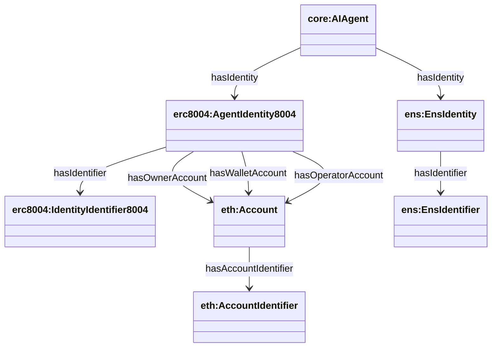

# Agent Identifiers (current model)

This document describes how identifiers are represented in the **current** Agentic Trust knowledge graph as emitted by `apps/sync` and defined in `apps/ontology/ontology/*`.

## Key points

- **No legacy fields**: agents do **not** use `core:agentId`, `core:didIdentity`, or `core:didAccount`.
- **DID strings live on identifier nodes** as `core:protocolIdentifier` (a datatype property on `core:UniversalIdentifier`).
- **ENS is modeled as an Identity** (`ens:EnsIdentity`) with an identifier (`ens:EnsIdentifier`), not as a “Name” object.

## Identifier types you’ll see

- **ERC‑8004 identity identifier**: `erc8004:IdentityIdentifier8004`
  - `core:protocolIdentifier "did:8004:<chainId>:<id>"`
- **Ethereum account identifier**: `eth:AccountIdentifier`
  - `core:protocolIdentifier "did:ethr:<chainId>:<address>"`
- **ENS identity identifier**: `ens:EnsIdentifier`
  - `core:protocolIdentifier "did:ens:<name>"`

## Relationship shape



## SPARQL: one row per agent (DID8004 + DID account + DID ens)

```sparql
PREFIX xsd: <http://www.w3.org/2001/XMLSchema#>
PREFIX core: <https://agentictrust.io/ontology/core#>
PREFIX eth: <https://agentictrust.io/ontology/eth#>
PREFIX erc8004: <https://agentictrust.io/ontology/erc8004#>
PREFIX ens: <https://agentictrust.io/ontology/ens#>

SELECT
  ?agent
  (SAMPLE(?uaid) AS ?uaid)
  (SAMPLE(?did8004) AS ?did8004)
  (SAMPLE(?didAccount) AS ?didAccount)
  (SAMPLE(?didEns) AS ?didEns)
WHERE {
  ?agent a core:AIAgent .
  OPTIONAL { ?agent core:uaid ?uaid . }

  OPTIONAL {
    ?agent core:hasIdentity ?identity8004 .
    ?identity8004 a erc8004:AgentIdentity8004 ;
                  core:hasIdentifier ?ident8004 .
    ?ident8004 core:protocolIdentifier ?did8004 .
  }

  # Prefer SmartAgent smart account DID, else wallet account DID
  OPTIONAL {
    ?agent a erc8004:SmartAgent ;
           erc8004:hasAgentAccount ?smartAccount .
    ?smartAccount eth:hasAccountIdentifier ?saIdent .
    ?saIdent core:protocolIdentifier ?didAccount .
  }
  OPTIONAL {
    FILTER(!BOUND(?didAccount))
    ?agent core:hasIdentity ?identity8004b .
    ?identity8004b a erc8004:AgentIdentity8004 ;
                   erc8004:hasWalletAccount ?wa .
    ?wa eth:hasAccountIdentifier ?waIdent .
    ?waIdent core:protocolIdentifier ?didAccount .
  }

  OPTIONAL {
    ?agent core:hasIdentity ?identityEns .
    ?identityEns a ens:EnsIdentity ;
                 core:hasIdentifier ?ensIdent .
    ?ensIdent core:protocolIdentifier ?didEns .
  }
}
GROUP BY ?agent
ORDER BY DESC(
  xsd:integer(REPLACE(STR(SAMPLE(?did8004)), "^did:8004:[0-9]+:", ""))
)
LIMIT 500
```

## SPARQL: list all accounts (address + chainId + DID)

```sparql
PREFIX core: <https://agentictrust.io/ontology/core#>
PREFIX eth: <https://agentictrust.io/ontology/eth#>

SELECT ?account ?chainId ?address (SAMPLE(?didEthr) AS ?didEthr)
WHERE {
  ?account a eth:Account ;
          eth:accountChainId ?chainId ;
          eth:accountAddress ?address .
  OPTIONAL {
    ?account eth:hasAccountIdentifier ?ident .
    ?ident core:protocolIdentifier ?didEthr .
  }
}
GROUP BY ?account ?chainId ?address
ORDER BY ?chainId ?address
LIMIT 2000
```

