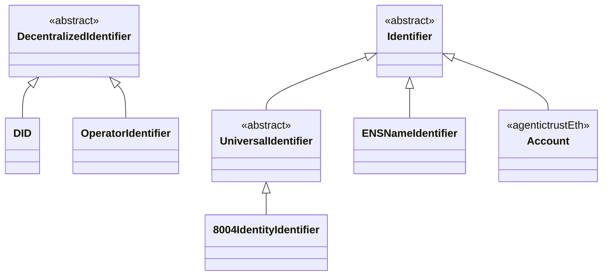

# Agent Identifiers

This document describes the agent-to-identifier relationship model and all identifier types across the AgenticTrust ontologies.

## Overview

Agents are identified through a layered identity model:
- **Agent** → `hasIdentifier` → **Identifier** → `hasDID` → **DID**

This design ensures protocol-agnostic identity access while supporting protocol-specific realizations (Ethereum accounts, ENS names, etc.).

## Class Hierarchy

### Core Identifier Classes



## Identifier Types

### 1. UniversalIdentifier (agentictrust-core.owl)

**Purpose**: A stable, protocol-agnostic agent identifier that may wrap a base DID or be derived deterministically. Covers HCS-14's UAID/AID while fitting into the core identity layer.

**Subclasses**:
- `8004IdentityIdentifier`: ERC-8004 agent identity identifier (`did:8004:chainId:agentId`)

**Properties**:
- `identifierForAgent`: Links to the agent it identifies
- `wrapsDID`: Links to a base DID it wraps (HCS-14 UAID)
- `derivedFromCanonicalID`: Links to canonical identifier artifact
- `resolvesToDocument`: Links to DID Document
- `supportsProtocol`: Links to ProtocolType individuals
- `hasDID`: Links to associated DID

### 2. 8004IdentityIdentifier (agentictrust-core.owl)

**Purpose**: ERC-8004 agent identity identifier representing the agent's on-chain identity in the ERC-8004 registry.

**DID Format**: `did:8004:chainId:agentId`

**Properties**:
- `identifierType`: `IdentifierType_8004`
- `hasDID`: Links to `did:8004:...` DID

**Example**:
```turtle
<https://www.agentictrust.io/id/identifier/8004/did%3A8004%3A84532%3A1>
  a agentictrust:8004IdentityIdentifier,
    agentictrust:UniversalIdentifier,
    agentictrust:Identifier,
    prov:Entity ;
  agentictrust:identifierType agentictrust:IdentifierType_8004 ;
  agentictrust:hasDID <https://www.agentictrust.io/id/did/did%3A8004%3A84532%3A1> .
```

### 3. ENSNameIdentifier (agentictrust-core.owl)

**Purpose**: ENS (Ethereum Name Service) name identifier. Represents a human-readable ENS name (e.g., `agent.eth`) that resolves to an Ethereum address.

**Validation**: Must end with `.eth` and pass ENS name validation regex.

**DID Format**: `did:ens:chainId:name.eth`

**Properties**:
- `identifierType`: `IdentifierType_ens`
- `hasDID`: Links to `did:ens:...` DID
- `rdfs:label`: The ENS name (e.g., `agent.eth`)

**Example**:
```turtle
<https://www.agentictrust.io/id/identifier/ens/agent.eth>
  a agentictrust:ENSNameIdentifier,
    agentictrust:Identifier,
    prov:Entity ;
  agentictrust:identifierType agentictrust:IdentifierType_ens ;
  agentictrust:hasDID <https://www.agentictrust.io/id/did/did%3Aens%3A11155111%3Aagent.eth> ;
  rdfs:label "agent.eth" .
```

### 4. Account (agentictrust-eth.owl)

**Purpose**: Ethereum account (EOA or Smart Account) identified by chainId and address. Realizes `agentictrust:Identifier` for Ethereum-based agents.

**Properties**:
- `identifierType`: `IdentifierType_account`
- `accountChainId`: EVM chain ID (e.g., 1 for mainnet, 11155111 for Sepolia)
- `accountAddress`: Ethereum account address (0x-prefixed hex string, 42 characters)
- `accountType`: `"EOA"` or `"SmartAccount"`
- `hasDID`: Links to DID (via `agentictrustEth:hasDID`)
- `hasEOAOwner`: Links to EOA owner (for Smart Accounts)
- `signingAuthority`: Links to signing authority account

**Example**:
```turtle
<https://www.agentictrust.io/id/account/11155111/0x1234...>
  a agentictrustEth:Account,
    agentictrust:Identifier,
    prov:Entity ;
  agentictrust:identifierType agentictrust:IdentifierType_account ;
  agentictrustEth:accountChainId 11155111 ;
  agentictrustEth:accountAddress "0x1234..." ;
  agentictrustEth:accountType "SmartAccount" .
```

### 5. DID (Decentralized Identifier) (agentictrust-core.owl)

**Purpose**: Decentralized Identifier following W3C DID specification. Linked to identifiers via `hasDID` property.

**Properties**:
- `didMethod`: DID method (e.g., `did:8004`, `did:ens`, `did:ethr`)
- `resolvesToDocument`: Links to DID Document
- `identifies`: Links to the entity it identifies (Identifier, not Agent)

**DID Methods**:
- `did:8004`: ERC-8004 identity DID
- `did:ens`: ENS name DID
- `did:ethr`: Ethereum-based DID
- `did:web`: Web-based DID
- `did:pkh`: Public Key Hash DID

## Property Relationships

```mermaid
classDiagram
    class AIAgent {
    }
    class Identifier {
        identifierType
    }
    class DID {
        didMethod
        identifies
    }
    class IdentifierType {
        <<enumeration>>
    }
    
    AIAgent -->|hasIdentifier| Identifier
    Identifier -->|hasDID| DID
    Identifier -->|identifierType| IdentifierType
    
    note for Identifier "identifierType values:\n- IdentifierType_8004\n- IdentifierType_account\n- IdentifierType_ens"
    note for DID "identifies points to\nIdentifier, not Agent"
```

## Identifier Type Enumeration

The `IdentifierType` class provides three enumeration values:

1. **`IdentifierType_8004`**: ERC-8004 identity identifier type
2. **`IdentifierType_account`**: Ethereum account identifier type
3. **`IdentifierType_ens`**: ENS name identifier type

## Agent-to-Identifier Path

The complete path from Agent to DID:

```
Agent
  └─ hasIdentifier → Identifier
       ├─ identifierType → IdentifierType (8004 | account | ens)
       └─ hasDID → DID
            ├─ didMethod → DIDMethod
            ├─ resolvesToDocument → DIDDocument
            └─ identifies → Identifier (back reference)
```

## SPARQL Queries

### Get All Identifiers for an Agent

```sparql
PREFIX agentictrust: <https://www.agentictrust.io/ontology/agentictrust-core#>
PREFIX agentictrustEth: <https://www.agentictrust.io/ontology/agentictrust-eth#>
PREFIX rdfs: <http://www.w3.org/2000/01/rdf-schema#>

SELECT ?agent ?agentId ?identifier ?identifierType ?identifierLabel
WHERE {
  ?agent a agentictrust:AIAgent ;
    agentictrust:agentId ?agentId ;
    agentictrust:hasIdentifier ?identifier .
  ?identifier a agentictrust:Identifier ;
    agentictrust:identifierType ?identifierType .
  OPTIONAL { ?identifier rdfs:label ?identifierLabel . }
}
ORDER BY ?agentId ?identifierType
```

### Get Agent with 8004 Identity Identifier and DID

```sparql
PREFIX agentictrust: <https://www.agentictrust.io/ontology/agentictrust-core#>

SELECT ?agent ?agentId ?identifier ?did
WHERE {
  ?agent a agentictrust:AIAgent ;
    agentictrust:agentId ?agentId ;
    agentictrust:hasIdentifier ?identifier .
  ?identifier a agentictrust:8004IdentityIdentifier ;
    agentictrust:hasDID ?did .
}
```

### Get Agent with ENS Name Identifier

```sparql
PREFIX agentictrust: <https://www.agentictrust.io/ontology/agentictrust-core#>
PREFIX rdfs: <http://www.w3.org/2000/01/rdf-schema#>

SELECT ?agent ?agentId ?identifier ?ensName ?did
WHERE {
  ?agent a agentictrust:AIAgent ;
    agentictrust:agentId ?agentId ;
    agentictrust:hasIdentifier ?identifier .
  ?identifier a agentictrust:ENSNameIdentifier ;
    rdfs:label ?ensName ;
    agentictrust:hasDID ?did .
}
```

### Get Agent with Account Identifier

```sparql
PREFIX agentictrust: <https://www.agentictrust.io/ontology/agentictrust-core#>
PREFIX agentictrustEth: <https://www.agentictrust.io/ontology/agentictrust-eth#>

SELECT ?agent ?agentId ?identifier ?accountAddress ?accountType ?chainId
WHERE {
  ?agent a agentictrust:AIAgent ;
    agentictrust:agentId ?agentId ;
    agentictrust:hasIdentifier ?identifier .
  ?identifier a agentictrustEth:Account ;
    agentictrustEth:accountAddress ?accountAddress ;
    agentictrustEth:accountType ?accountType ;
    agentictrustEth:accountChainId ?chainId .
}
```

### Get All Identifier Types

```sparql
PREFIX agentictrust: <https://www.agentictrust.io/ontology/agentictrust-core#>
PREFIX agentictrustEth: <https://www.agentictrust.io/ontology/agentictrust-eth#>
PREFIX rdfs: <http://www.w3.org/2000/01/rdf-schema#>

SELECT ?identifierType ?label ?comment
WHERE {
  ?identifierType a agentictrust:IdentifierType .
  OPTIONAL { ?identifierType rdfs:label ?label . }
  OPTIONAL { ?identifierType rdfs:comment ?comment . }
}
ORDER BY ?identifierType
```

### Get Agent with All Identifiers and DIDs

```sparql
PREFIX agentictrust: <https://www.agentictrust.io/ontology/agentictrust-core#>
PREFIX rdfs: <http://www.w3.org/2000/01/rdf-schema#>

SELECT ?agent ?agentId ?identifier ?identifierType ?did ?didMethod
WHERE {
  ?agent a agentictrust:AIAgent ;
    agentictrust:agentId ?agentId ;
    agentictrust:hasIdentifier ?identifier .
  ?identifier agentictrust:identifierType ?identifierType ;
    agentictrust:hasDID ?did .
  OPTIONAL { ?did agentictrust:didMethod ?didMethod . }
}
ORDER BY ?agentId ?identifierType
```

## Design Principles

1. **Protocol-Agnostic Core**: The `Identifier` class in `agentictrust-core.owl` is abstract and protocol-agnostic.

2. **Protocol-Specific Realizations**: Protocol-specific identifier types (e.g., `Account` in `agentictrust-eth.owl`) subclass the core `Identifier`.

3. **DID Separation**: DIDs are separate entities linked to identifiers, not directly to agents. This allows multiple identifiers per agent, each with its own DID.

4. **Type Enumeration**: The `identifierType` property provides a simple way to filter and query identifiers by type.

5. **No Direct Agent-DID Link**: Agents never link directly to DIDs. All DID access goes through the identifier relationship: `Agent → hasIdentifier → Identifier → hasDID → DID`.

## Related Documentation

- [`identifier-mapping.md`](./identifier-mapping.md): How Identifier maps to Web2 and Web3 identity systems
- [`agentictrust-overview.md`](./agentictrust-overview.md): Overview of the AgenticTrust ontology
- [`sparql-queries.md`](./sparql-queries.md): Additional SPARQL queries for agent data

