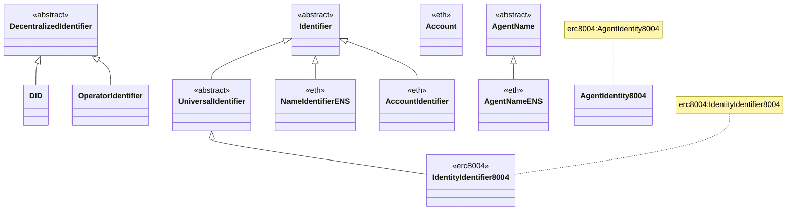
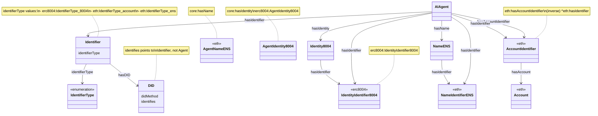
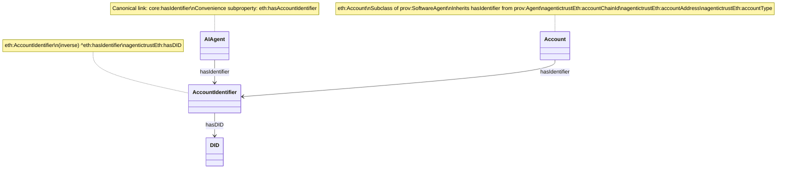
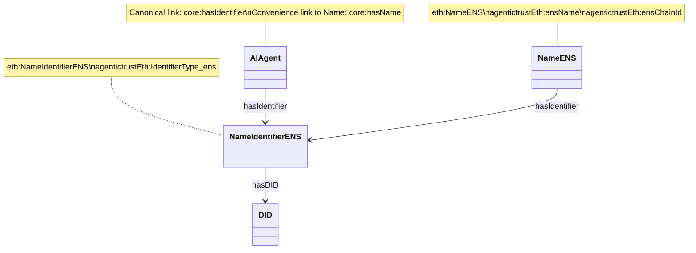
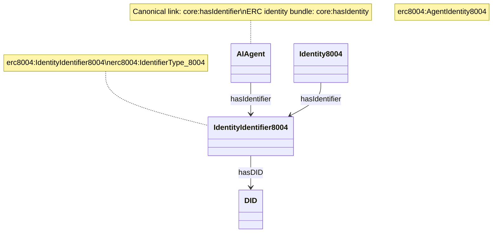
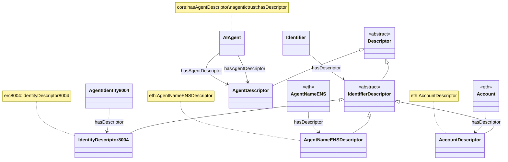

# Agent Identifiers and Identity Relationships

This document describes the complete agent identity model: how agents relate to identifiers (Account, AgentNameENS, AgentIdentity8004), identifiers to DIDs, and how Descriptors provide resolved metadata views.

See also: [`agent-identity.md`](./agent-identity.md) (Agent identity vs Identifier).

## Overview

The AgenticTrust ontology uses a layered identity model that separates:
- **Agents** (the software agent entities)
- **Identifiers** (stable identity anchors: Account, NameIdentifierENS, IdentityIdentifier8004)
- **Names** (human-readable names: AgentNameENS)
- **DIDs** (decentralized identifiers for each identifier)
- **Descriptors** (resolver-produced, normalized metadata views)

### Core Identity Path

```
Agent (prov:Agent)
  ├─ hasIdentifier → Identifier (eth:AccountIdentifier, eth:NameIdentifierENS, erc8004:IdentityIdentifier8004)
  │   └─ hasDID → DID
  ├─ core:hasIdentity → erc8004:AgentIdentity8004
  │   ├─ hasIdentifier → erc8004:IdentityIdentifier8004
  │   └─ hasDescriptor → erc8004:IdentityDescriptor8004
  ├─ core:hasName → eth:AgentNameENS
  │   ├─ hasIdentifier → eth:NameIdentifierENS
  │   └─ hasDescriptor → eth:AgentNameENSDescriptor
  ├─ eth:hasAccountIdentifier → eth:AccountIdentifier
  │   └─ eth:hasDID → core:DID
  └─ hasAgentDescriptor → AgentDescriptor
      └─ hasDescriptor → AgentDescriptor

Account (eth:Account, subclass of prov:SoftwareAgent)
  ├─ hasIdentifier → AccountIdentifier (inherited from prov:Agent)
  │   └─ hasDID → DID
  └─ accountAddress, accountChainId, accountType
```

**Note**: `hasIdentifier` is now defined at the `prov:Agent` level in `apps/ontology/ontology/core.ttl`, so all Agent subclasses (including `AIAgent` and `Account` as `SoftwareAgent`) inherit this property.

## Class Hierarchy

### Core Identifier Classes



## Complete Agent-to-Identifier Relationships



## Focused diagrams (Account, NameENS, Identity8004)

### Agent ↔ AccountIdentifier ↔ Account (eth)



### Agent ↔ NameIdentifierENS ↔ NameENS (+ DID) (eth)



### Agent ↔ IdentityIdentifier8004 ↔ Identity8004 (+ DID) (erc8004)



## SPARQL script (Account, NameENS, Identity8004 → Agent)

The complete script is in: `docs/ontology/sparql/identifiers-account-ens-8004.sparql`

### Agent → AccountIdentifier → Account (+ DID)

```sparql
PREFIX core: <https://core.io/ontology/core#>
PREFIX eth: <https://core.io/ontology/eth#>

SELECT ?agent ?agentId ?accountIdentifier ?account ?chainId ?address ?accountType ?did
WHERE {
  ?agent a core:AIAgent .
  OPTIONAL { ?agent core:agentId ?agentId . }

  ?agent core:hasIdentifier ?accountIdentifier .
  ?accountIdentifier a eth:AccountIdentifier .
  OPTIONAL { ?accountIdentifier core:hasDID ?did . }

  ?account core:hasIdentifier ?accountIdentifier .
  OPTIONAL { ?account eth:accountChainId ?chainId . }
  OPTIONAL { ?account eth:accountAddress ?address . }
  OPTIONAL { ?account eth:accountType ?accountType . }
}
ORDER BY ?agentId
```

### Agent → NameIdentifierENS → NameENS (+ DID)

```sparql
PREFIX core: <https://core.io/ontology/core#>
PREFIX eth: <https://core.io/ontology/eth#>
PREFIX rdfs: <http://www.w3.org/2000/01/rdf-schema#>

SELECT ?agent ?agentId ?ensName ?ensNameValue ?ensIdentifier ?did
WHERE {
  ?agent a core:AIAgent .
  OPTIONAL { ?agent core:agentId ?agentId . }

  ?agent core:hasIdentifier ?ensIdentifier .
  ?ensIdentifier a eth:NameIdentifierENS .
  OPTIONAL { ?ensIdentifier rdfs:label ?ensNameValue . }
  OPTIONAL { ?ensIdentifier core:hasDID ?did . }

  OPTIONAL {
    ?ensName a eth:AgentNameENS ;
      eth:hasIdentifier ?ensIdentifier .
    OPTIONAL { ?ensName eth:ensName ?ensNameValue . }
  }
}
ORDER BY ?agentId
```

### Agent → IdentityIdentifier8004 → Identity8004 (+ DID)

```sparql
PREFIX core: <https://core.io/ontology/core#>
PREFIX erc8004: <https://core.io/ontology/erc8004#>

SELECT ?agent ?agentId ?identity8004 ?identityIdentifier ?did
WHERE {
  ?agent a core:AIAgent .
  OPTIONAL { ?agent core:agentId ?agentId . }

  ?agent core:hasIdentifier ?identityIdentifier .
  ?identityIdentifier a erc8004:IdentityIdentifier8004 .
  OPTIONAL { ?identityIdentifier core:hasDID ?did . }

  OPTIONAL {
    ?identity8004 a erc8004:AgentIdentity8004 ;
      core:hasIdentifier ?identityIdentifier .
  }
}
ORDER BY ?agentId
```

### One row per agent (Account + ENS + Identity8004)

```sparql
PREFIX core: <https://core.io/ontology/core#>
PREFIX eth: <https://core.io/ontology/eth#>
PREFIX erc8004: <https://core.io/ontology/erc8004#>

SELECT ?agent ?agentId
  ?accountIdentifier ?account ?chainId ?address
  ?ensName ?ensNameValue ?ensIdentifier
  ?identity8004 ?identityIdentifier
WHERE {
  ?agent a core:AIAgent .
  OPTIONAL { ?agent core:agentId ?agentId . }

  OPTIONAL {
    ?agent eth:hasAccountIdentifier ?accountIdentifier .
    ?account core:hasIdentifier ?accountIdentifier .
    OPTIONAL { ?account eth:accountChainId ?chainId . }
    OPTIONAL { ?account eth:accountAddress ?address . }
  }

  OPTIONAL {
    ?agent core:hasName ?ensName .
    OPTIONAL { ?ensName eth:ensName ?ensNameValue . }
    OPTIONAL { ?ensName eth:hasIdentifier ?ensIdentifier . }
  }

  OPTIONAL {
    ?agent core:hasIdentity ?identity8004 .
    OPTIONAL { ?identity8004 core:hasIdentifier ?identityIdentifier . }
  }
}
ORDER BY ?agentId
```

## Descriptor Relationships

Descriptors are resolver-produced, normalized metadata views:



## Identifier Types

### 1. IdentityIdentifier8004 (apps/ontology/ontology/erc8004.ttl)

**Purpose**: ERC-8004 agent identity identifier representing the agent's on-chain identity in the ERC-8004 registry.

**DID Format**: `did:8004:chainId:agentId`

**Properties**:
- `identifierType`: `IdentifierType_8004`
- `hasDID`: Links to `did:8004:...` DID

**Access Pattern**:
- Direct: `Agent → hasIdentifier → IdentityIdentifier8004`
- Via AgentIdentity8004: `Agent → hasIdentity → AgentIdentity8004 → hasIdentifier → IdentityIdentifier8004`

**Example**:
```turtle
<https://www.core.io/id/agent/did%3A8004%3A84532%3A1>
  a core:AIAgent ;
  core:hasIdentity <https://www.core.io/id/8004-identity/84532/1/did%3A8004%3A84532%3A1> ;
  core:hasIdentifier <https://www.core.io/id/identifier/8004/did%3A8004%3A84532%3A1> .

<https://www.core.io/id/8004-identity/84532/1/did%3A8004%3A84532%3A1>
  a erc8004:AgentIdentity8004 ;
  core:hasIdentifier <https://www.core.io/id/identifier/8004/did%3A8004%3A84532%3A1> .

<https://www.core.io/id/identifier/8004/did%3A8004%3A84532%3A1>
  a erc8004:IdentityIdentifier8004,
    core:UniversalIdentifier,
    core:Identifier,
    prov:Entity ;
  core:identifierType erc8004:IdentifierType_8004 ;
  core:hasDID <https://www.core.io/id/did/did%3A8004%3A84532%3A1> .
```

### 2. NameIdentifierENS (apps/ontology/ontology/eth.ttl)

**Purpose**: ENS (Ethereum Name Service) name identifier. Represents a human-readable ENS name (e.g., `agent.eth`) that resolves to an Ethereum address.

**Validation**: Must end with `.eth` and pass ENS name validation regex.

**DID Format**: `did:ens:chainId:name.eth`

**Properties**:
- `identifierType`: `eth:IdentifierType_ens`
- `hasDID`: Links to `did:ens:...` DID
- `rdfs:label`: The ENS name (e.g., `agent.eth`)

**Access Pattern**:
- Direct: `Agent → hasIdentifier → eth:NameIdentifierENS`
- Via AgentNameENS: `Agent → hasName → eth:AgentNameENS → eth:hasIdentifier → eth:NameIdentifierENS`

**Example**:
```turtle
<https://www.core.io/id/agent/did%3A8004%3A84532%3A1811>
  a core:AIAgent ;
  core:hasName <https://www.core.io/id/ens-name/84532/levi.agnt.eth> ;
  core:hasIdentifier <https://www.core.io/id/identifier/ens/levi.agnt.eth> .

<https://www.core.io/id/ens-name/84532/levi.agnt.eth>
  a eth:AgentNameENS, core:AgentName, prov:Entity ;
  eth:ensName "levi.agnt.eth" ;
  eth:ensChainId 84532 ;
  eth:hasIdentifier <https://www.core.io/id/identifier/ens/levi.agnt.eth> .

<https://www.core.io/id/identifier/ens/levi.agnt.eth>
  a eth:NameIdentifierENS,
    core:Identifier,
    prov:Entity ;
  core:identifierType eth:IdentifierType_ens ;
  core:hasDID <https://www.core.io/id/did/did%3Aens%3A84532%3Alevi.agnt.eth> ;
  rdfs:label "levi.agnt.eth" .
```

### 3. AccountIdentifier (apps/ontology/ontology/eth.ttl)

**Purpose**: Identifier for an Ethereum Account, linking to the Account entity and its DID.

**Properties**:
- `identifierType`: `eth:IdentifierType_account`
- `eth:hasDID`: Links to DID (via `eth:hasDID`)

**Access Pattern**:
- Direct: `Agent → core:hasIdentifier → eth:AccountIdentifier` (inherited from prov:Agent)
- Via hasAccountIdentifier: `Agent → eth:hasAccountIdentifier → eth:AccountIdentifier` and `Account → core:hasIdentifier → eth:AccountIdentifier` (inherited from prov:Agent; inverse in SPARQL: `AccountIdentifier → ^core:hasIdentifier → Account`)

**Example**:
```turtle
<https://www.core.io/id/agent/did%3A8004%3A84532%3A1811>
  a core:AIAgent ;
  core:hasIdentifier <https://www.core.io/id/account-identifier/84532/0x1234...> ;
  eth:hasAccountIdentifier <https://www.core.io/id/account-identifier/84532/0x1234...> .

<https://www.core.io/id/account-identifier/84532/0x1234...>
  a eth:AccountIdentifier,
    core:Identifier,
    prov:Entity ;
  core:identifierType eth:IdentifierType_account ;
  eth:hasDID <https://www.core.io/id/did/did%3Aethr%3A84532%3A0x1234...> .

<https://www.core.io/id/account/84532/0x1234...>
  a eth:Account, prov:Entity ;
  eth:accountChainId 84532 ;
  eth:accountAddress "0x1234..." ;
  eth:accountType "SmartAccount" ;
  core:hasIdentifier <https://www.core.io/id/account-identifier/84532/0x1234...> .
```

### 4. Account (apps/ontology/ontology/eth.ttl)

**Purpose**: Ethereum account entity (EOA or Smart Account) identified by chainId and address. Represents the actual account on-chain.

**Properties**:
- `accountChainId`: EVM chain ID (e.g., 1 for mainnet, 11155111 for Sepolia)
- `accountAddress`: Ethereum account address (0x-prefixed hex string, 42 characters)
- `accountType`: `"EOA"` or `"SmartAccount"`
- `hasIdentifier`: Links to `AccountIdentifier` (inherited from `prov:Agent`, defined in `apps/ontology/ontology/core.ttl`)
- `hasEOAOwner`: Links to EOA owner (for Smart Accounts)
- `signingAuthority`: Links to signing authority account

**Note**: `Account` is a subclass of `prov:SoftwareAgent` (not just `prov:Entity`), enabling it to participate in relationships as an Agent and inherit `hasIdentifier` from `prov:Agent`. It's NOT a subclass of `Identifier`; it's a separate entity linked via `AccountIdentifier`.

### 5. DID (Decentralized Identifier) (apps/ontology/ontology/core.ttl)

**Purpose**: Decentralized Identifier following W3C DID specification. Linked to identifiers via `hasDID` property.

**Properties**:
- `didMethod`: DID method (e.g., `did:8004`, `did:ens`, `did:ethr`)
- `resolvesToDocument`: Links to DID Document
- `identifies`: Links to the entity it identifies (Identifier, not Agent)

**DID Methods**:
- `did:8004`: ERC-8004 identity DID
- `did:ens`: ENS name DID
- `did:ethr`: Ethereum-based DID
- `did:web`: Web-based DID
- `did:pkh`: Public Key Hash DID

## Identifier Type Enumeration

The `IdentifierType` class provides three enumeration values:

1. **`IdentifierType_8004`**: ERC-8004 identity identifier type
2. **`IdentifierType_account`**: Ethereum account identifier type
3. **`IdentifierType_ens`**: ENS name identifier type

## Web2 and Web3 Identifier Realizations

### Web3: Ethereum Account

The `Account` class in `apps/ontology/ontology/eth.ttl` realizes the `Identifier` concept for Ethereum-based agents:

- **DID Method**: `did:ethr`
- **Signing Authority**: EOA (ECDSA signatures)
- **Validation**: On-chain signature verification
- **Chain ID**: Blockchain chain ID (e.g., 1 for mainnet, 11155111 for Sepolia)

### Web2: Future Extensions

The `Identifier` class is designed to support Web2 identifier types (Domain, Email, OAuth, API Key, Service Endpoint) as subclasses. These would follow the same pattern:

- Domain identifiers: `did:web` method
- Email identifiers: `did:email` method
- OAuth identifiers: Provider-specific DIDs
- API Key identifiers: Service-specific DIDs
- Service Endpoint identifiers: `did:web` or service-specific DIDs

The Web2 mapping would follow the same design principles as the Ethereum Account mapping: Web2 identifiers would subclass `Identifier`, have associated DIDs, and link to their respective entities (Domain, Email, etc.) via identifier classes.

## Descriptors

Descriptors are resolver-produced, normalized metadata views that aggregate all metadata associated with an entity.

### AgentDescriptor

**Purpose**: Agent-level descriptor containing resolver-produced, protocol-agnostic declaration of an agent's identity, capabilities, and constraints.

**Properties**:
- `hasEndpoint`: Agent communication endpoints
- `hasSkill`: Agent skills/tools
- `rdfs:label`: Agent name
- `dcterms:description`: Agent description
- Various metadata properties (image, website, etc.)

**Access**: `Agent → hasAgentDescriptor → AgentDescriptor` (or `Agent → hasDescriptor → AgentDescriptor`)

### IdentifierDescriptor

**Purpose**: Base class for identifier descriptors.

### ProtocolDescriptor

**Purpose**: Protocol-level descriptor (e.g., A2A, MCP) describing protocol-specific configuration and bindings.

**Note**: `ProtocolDescriptor` is distinct from `AgentDescriptor` and belongs to a `Protocol`, not an `Agent`.

## SPARQL Queries

### Get All Identifiers for an Agent

```sparql
PREFIX core: <https://core.io/ontology/core#>
PREFIX eth: <https://core.io/ontology/eth#>
PREFIX rdfs: <http://www.w3.org/2000/01/rdf-schema#>

SELECT ?agent ?agentId ?identifier ?identifierType ?identifierValue ?did
WHERE {
  ?agent a core:AIAgent ;
    core:agentId ?agentId .
  
  {
    # Direct identifiers via hasIdentifier (AccountIdentifier, NameIdentifierENS, IdentityIdentifier8004)
    ?agent core:hasIdentifier ?identifier .
  }
  UNION
  {
    # Identifiers via Identity8004
    ?agent core:hasIdentity ?identity .
    ?identity core:hasIdentifier ?identifier .
  }
  
  ?identifier a ?identifierType .
  
  # Extract identifier value based on type
  OPTIONAL {
    # For NameIdentifierENS, get the label (the ENS name)
    ?identifier a eth:NameIdentifierENS ;
      rdfs:label ?identifierValue .
  }
  OPTIONAL {
    # For AccountIdentifier, get the account address
    ?account core:hasIdentifier ?identifier .
    ?account eth:accountAddress ?identifierValue .
  }
  OPTIONAL {
    # For IdentityIdentifier8004, get the DID string
    ?identifier core:hasDID ?didNode .
    BIND(STR(?didNode) AS ?identifierValue)
  }
  
  # Optional: get DID if it exists
  OPTIONAL {
    ?identifier core:hasDID ?did .
  }
}
ORDER BY ?agentId ?identifierType
```

### Get Agent with Account, NameENS, and Identity8004

```sparql
PREFIX core: <https://core.io/ontology/core#>
PREFIX eth: <https://core.io/ontology/eth#>
PREFIX rdfs: <http://www.w3.org/2000/01/rdf-schema#>

SELECT ?agent ?agentId ?account ?accountAddress ?ensName ?ensNameValue ?identity ?identityIdentifier
WHERE {
  ?agent a core:AIAgent ;
    core:agentId ?agentId .
  
  # Account
  OPTIONAL {
    ?agent eth:hasAccountIdentifier ?accountIdentifier .
    ?account core:hasIdentifier ?accountIdentifier .
    ?account eth:accountAddress ?accountAddress .
  }
  
  # NameENS
  OPTIONAL {
    ?agent core:hasName ?ensName .
    ?ensName a eth:AgentNameENS ;
      eth:ensName ?ensNameValue .
  }
  
  # Identity8004
  OPTIONAL {
    ?agent core:hasIdentity ?identity .
    ?identity core:hasIdentifier ?identityIdentifier .
    ?identityIdentifier a erc8004:IdentityIdentifier8004 .
  }
}
```

### Get Agent with Descriptors

```sparql
PREFIX core: <https://core.io/ontology/core#>
PREFIX eth: <https://core.io/ontology/eth#>
PREFIX rdfs: <http://www.w3.org/2000/01/rdf-schema#>

SELECT ?agent ?agentId ?agentDescriptor ?accountIdentifier ?accountDescriptor ?ensName ?ensNameDescriptor ?identity ?identityDescriptor
WHERE {
  ?agent a core:AIAgent ;
    core:agentId ?agentId .
  
  # AgentDescriptor
  OPTIONAL {
    ?agent core:hasAgentDescriptor ?agentDescriptor .
  }
  
  # AccountDescriptor
  OPTIONAL {
    ?agent eth:hasAccountIdentifier ?accountIdentifier .
    ?accountIdentifier core:hasDescriptor ?accountDescriptor .
    ?accountDescriptor a eth:AccountDescriptor .
  }
  
  # NameDescriptorENS
  OPTIONAL {
    ?agent core:hasName ?ensName .
    ?ensName core:hasDescriptor ?ensNameDescriptor .
    ?ensNameDescriptor a eth:AgentNameENSDescriptor .
  }
  
  # IdentityDescriptor8004
  OPTIONAL {
    ?agent core:hasIdentity ?identity .
    ?identity core:hasDescriptor ?identityDescriptor .
    ?identityDescriptor a erc8004:IdentityDescriptor8004 .
  }
}
```

### Get Identifier Type Counts

```sparql
PREFIX core: <https://core.io/ontology/core#>

SELECT ?identifierType (COUNT(DISTINCT ?identifier) AS ?count)
WHERE {
  ?agent a core:AIAgent ;
    core:hasIdentifier ?identifier .
  ?identifier core:identifierType ?identifierType .
}
GROUP BY ?identifierType
ORDER BY DESC(?count)
```

## Design Principles

1. **Protocol-Agnostic Core**: The `Identifier` class in `apps/ontology/ontology/core.ttl` is abstract and protocol-agnostic.

2. **Protocol-Specific Realizations**: Protocol-specific identifier types (e.g., `AccountIdentifier` in `apps/ontology/ontology/eth.ttl`) subclass the core `Identifier`.

3. **DID Separation**: DIDs are separate entities linked to identifiers, not directly to agents. This allows multiple identifiers per agent, each with its own DID.

4. **Type Enumeration**: The `identifierType` property provides a simple way to filter and query identifiers by type.

5. **No Direct Agent-DID Link**: Agents never link directly to DIDs. All DID access goes through the identifier relationship: `Agent → hasIdentifier → Identifier → hasDID → DID`.

6. **Descriptor Pattern**: All entities (Agent, Identifier, Identity8004, Account, NameENS) can have Descriptors that provide normalized, resolver-produced metadata views.

7. **Separation of Identity Layers**: 
   - `Account` is an entity (the actual on-chain account)
   - `AccountIdentifier` is an identifier (the identity anchor)
   - `AgentNameENS` is an entity (the name resource)
   - `NameIdentifierENS` is an identifier (the identity anchor)
   - `AgentIdentity8004` is an entity (the ERC-8004 identity)
   - `IdentityIdentifier8004` is an identifier (the identity anchor)

## Related Documentation

- [`core-overview.md`](./core-overview.md): Overview of the AgenticTrust ontology
- [`sparql-queries.md`](./sparql-queries.md): Additional SPARQL queries for agent data
- [`descriptor.md`](./descriptor.md): Descriptor pattern and metadata assembly
