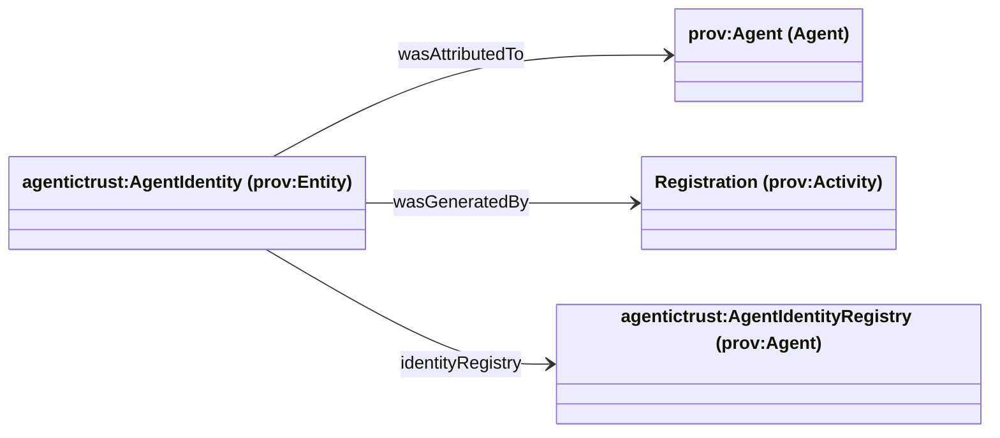

# Identity vs Identifier

This page clarifies a core distinction used throughout the AgenticTrust ontology: **Identity** (the thing) vs **Identifier** (the reference).

## Identity

- A **conceptual thing**
- **Social / legal / epistemic**
- Has properties, roles, trust, reputation, and history
- Exists even if not referenced

**“The Agent as a thing in the world.”**

## Identifier

- A **symbolic reference**
- A string / URI / name
- Used to refer to an identity
- Can change, be aliased, or be replaced

**“The label we use to point at the Agent.”**

## Identity as a `prov:Entity` (registry-scoped identity)

Yes — **Identity can be a `prov:Entity`** that describes an agent’s identity as asserted within a specific **Agent Identity Registry**.

This is preferred when you want:

- registry-scoped identity
- multiple coexisting identities
- no hard ontological collapse of “agent = identity”

### Core distinction (key pattern)

1) **The Agent** (what exists / acts)

```turtle
:Agent_A
  a prov:Agent .
```

This is the actor: AI agent, org agent, smart-account agent, etc.

2) **The Identity** (what is said about the agent)

```turtle
:Identity_ERC8004_4550
  a prov:Entity ;
  a agentictrust:AgentIdentity ;
  prov:wasAttributedTo :Agent_A ;
  prov:wasGeneratedBy :ERC8004_Registration ;
  prov:identifier "erc8004:agent:4550" ;
  agentictrust:identityRegistry :ERC8004_Registry .
```

This identity is:

- contextual
- registry-bound
- asserted
- epistemic

Not the agent itself — a representation of the agent in a system.

### Why Identity should be an Entity

Because identity information:

| Property | Reason |
| --- | --- |
| Is created | Registration happens |
| Can change | Updates, revocations |
| Can be versioned | New assertions |
| Can be invalidated | Deregistration |
| Can conflict | Multiple registries |
| Is contextual | Registry-specific |

All of that screams **`prov:Entity`**, not `prov:Agent`.

### Registry context (critical)

Instead of baking registry logic into the agent, model it explicitly:

```turtle
:ERC8004_Registry
  a prov:Agent ;
  a agentictrust:AgentIdentityRegistry .
```

Then:

```turtle
:Identity_ERC8004_4550
  prov:wasAttributedTo :Agent_A ;
  prov:wasGeneratedBy :ERC8004_Registration ;
  prov:wasAssociatedWith :ERC8004_Registry .
```

Now you have:

- registry-scoped truth
- auditability
- clean separation of concerns

### Multiple identities, same agent

This works naturally:

```turtle
:Identity_ERC8004_4550
  a prov:Entity ;
  prov:wasAttributedTo :Agent_A ;
  prov:identifier "erc8004:agent:4550" .

:Identity_HOL_0xabc
  a prov:Entity ;
  prov:wasAttributedTo :Agent_A ;
  prov:identifier "uaid:did:ethr:0xabc;hol" .
```

No contradictions. No need for `owl:sameAs`. No global identity collapse.

### Relationship to DID and UAID (layering)

Think in layers:

| Layer | What it is |
| --- | --- |
| DID | Identifier scheme |
| UAID | Routing / resolution identifier |
| Identity Entity | Claimed representation in a registry |
| Agent | Actor that exists and acts |

Example:

```turtle
:Identity_HOL
  prov:identifier "uaid:did:ethr:0xabc;hol" ;
  agentictrust:usesDID "did:ethr:0xabc" .
```

The DID anchors cryptography; the identity entity anchors registry meaning.

### What Identity is not

- Not the Agent
- Not a global identifier
- Not a metaphysical “self”

It is:

**An asserted, registry-scoped description of an agent’s identity.**

## Diagram: Agent vs Identity (registry-scoped)



Mermaid note: edge labels avoid CURIEs like `prov:wasAttributedTo` (Mermaid parser limitation). The intended properties are:

- `wasAttributedTo` → `prov:wasAttributedTo` (or `agentictrust:identityOf`)
- `wasGeneratedBy` → `prov:wasGeneratedBy`
- `identityRegistry` → `agentictrust:identityRegistry` (subPropertyOf `prov:wasAssociatedWith`)

## Optional refinements (recommended)

These convenience terms keep PROV-O clean while giving you domain semantics:

```turtle
agentictrust:AgentIdentity rdfs:subClassOf prov:Entity .
agentictrust:AgentIdentityRegistry rdfs:subClassOf prov:Agent .

agentictrust:identityOf
  rdfs:domain agentictrust:AgentIdentity ;
  rdfs:range prov:Agent .

agentictrust:identityRegistry
  rdfs:domain agentictrust:AgentIdentity ;
  rdfs:range agentictrust:AgentIdentityRegistry .
```

## SPARQL queries

### List all AgentIdentity entities

```sparql
PREFIX prov: <http://www.w3.org/ns/prov#>
PREFIX agentictrust: <https://www.agentictrust.io/ontology/agentictrust-core#>

SELECT ?identity
WHERE {
  ?identity a agentictrust:AgentIdentity .
}
ORDER BY ?identity
LIMIT 200
```

### Agent → identities (with provenance + registry)

```sparql
PREFIX prov: <http://www.w3.org/ns/prov#>
PREFIX agentictrust: <https://www.agentictrust.io/ontology/agentictrust-core#>

SELECT DISTINCT
  ?agent
  ?identity
  ?registry
  ?registrationAct
  ?identifier
WHERE {
  ?agent a prov:Agent .

  OPTIONAL { ?agent agentictrust:hasIdentity ?identity . }
  OPTIONAL { ?identity agentictrust:identityOf ?agent . }
  OPTIONAL { ?identity prov:wasAttributedTo ?agent . }

  OPTIONAL { ?identity agentictrust:identityRegistry ?registry . }
  OPTIONAL { ?identity prov:wasAssociatedWith ?registry . }

  OPTIONAL { ?identity prov:wasGeneratedBy ?registrationAct . }
  OPTIONAL { ?identity prov:identifier ?identifier . }
}
ORDER BY ?agent ?identity
LIMIT 200
```

### Agents with multiple identities (no identity collapse)

```sparql
PREFIX prov: <http://www.w3.org/ns/prov#>
PREFIX agentictrust: <https://www.agentictrust.io/ontology/agentictrust-core#>

SELECT ?agent (COUNT(DISTINCT ?identity) AS ?identityCount)
WHERE {
  ?agent a prov:Agent ;
    agentictrust:hasIdentity ?identity .
  ?identity a agentictrust:AgentIdentity .
}
GROUP BY ?agent
HAVING (COUNT(DISTINCT ?identity) > 1)
ORDER BY DESC(?identityCount) ?agent
LIMIT 200
```

### Identity → DID (cryptographic anchor)

```sparql
PREFIX agentictrust: <https://www.agentictrust.io/ontology/agentictrust-core#>

SELECT ?identity ?did
WHERE {
  ?identity a agentictrust:AgentIdentity ;
    agentictrust:usesDID ?did .
}
ORDER BY ?identity
LIMIT 200
```

### List all AgentIdentityRegistry instances

```sparql
PREFIX prov: <http://www.w3.org/ns/prov#>
PREFIX agentictrust: <https://www.agentictrust.io/ontology/agentictrust-core#>

SELECT ?registry ?type
WHERE {
  ?registry a agentictrust:AgentIdentityRegistry .
  OPTIONAL { ?registry a ?type . }
}
ORDER BY ?registry ?type
LIMIT 200
```

## Where this shows up in the ontology

- **Agents** (`prov:Agent`) are the *things* we reason about and attach trust assertions to.
- **Identifiers** (`agentictrust:Identifier`) are the *references* we attach to agents and other identity-bearing entities for lookup, linking, and interoperability.
- **DIDs** (`agentictrust:DID`) are a particular identifier family with resolution rules.

See also:

- [`identifiers.md`](./identifiers.md)
- [`agent.md`](./agent.md)
- [`descriptor.md`](./descriptor.md)


