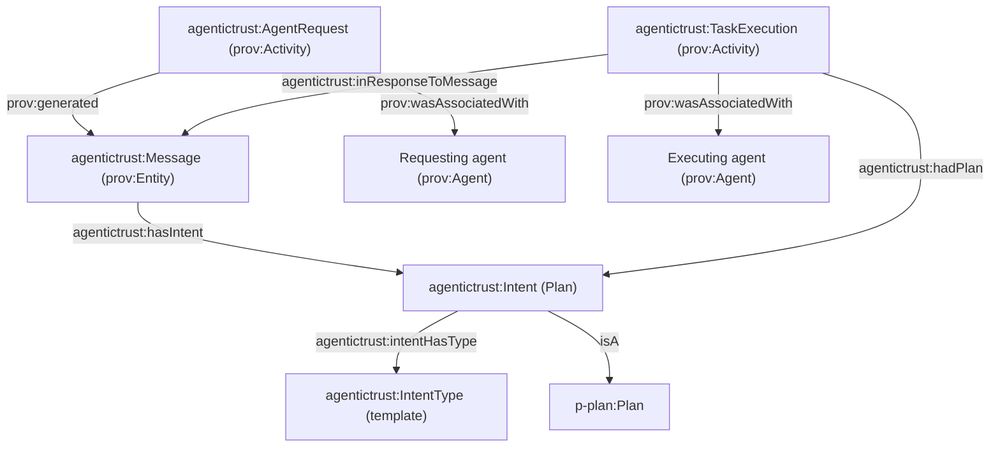
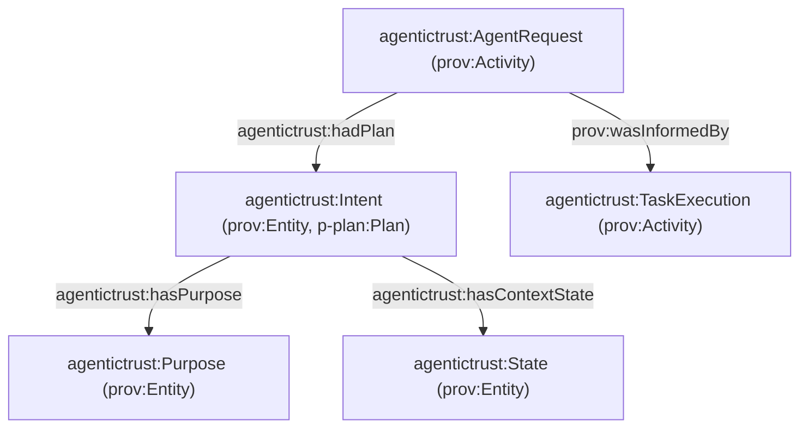
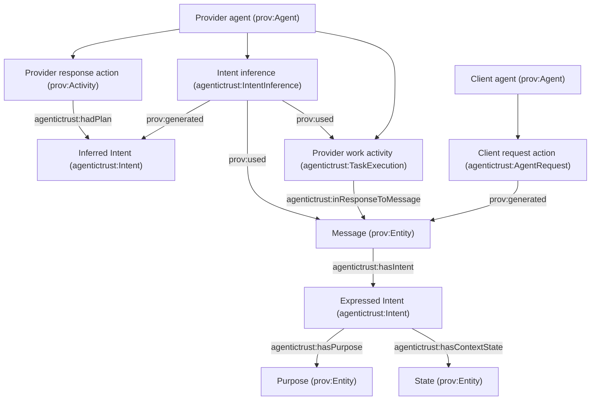
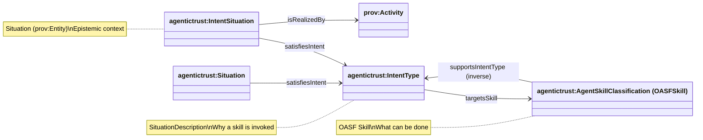

# Intent Model: IntentType and IntentSituation

This document describes the IntentType ontology that wraps OASF skills without redefining them, stays compatible with DOLCE-DnS, and plugs naturally into PROV-O / P-PLAN / A2A / MCP.

Source: `apps/badge-admin/public/ontology/agentictrust-core.owl`

## Design Principles

### Intent explains why a skill is invoked, not how it is executed

The core design principle is:

**Intent ≠ Skill**: Intent is about purpose or goal. Skills are capabilities.

**Intent ≠ Task**: Tasks are executions (`agentictrust:TaskExecution` ⊑ `prov:Activity`). Intent is epistemic and contextual.

**IntentType is durable, IntentSituation is ephemeral**:

- `agentictrust:IntentType` is a stable taxonomy/schema (a SituationDescription)
- `agentictrust:IntentSituation` is the concrete, time-scoped epistemic context at request time

## Agent-to-agent request flows (what happened vs what is happening)

This section grounds two complementary views:

- **PROV-O view (what happened)**: a requesting agent performs a request Activity that results in a task Activity executed by another agent.
- **Behavioristic / DnS-aligned view (what is happening / will happen)**: purpose + state frame the intent, and actions are taken toward a goal under context.

### Flow A: PROV-O “what happened” (agent-to-agent request)

Key idea: the request is an Activity by the requesting agent; the remote task is an Activity by the executing agent. The request carries an `Intent` plan, whose template is an `IntentType`.



Notes:

- The request/response coupling can also be expressed with `prov:wasInformedBy` between Activities; `agentictrust:inResponseToMessage` anchors the triggering Message artifact.
- Roles can be qualified using PROV/P-PLAN (e.g., `prov:qualifiedAssociation` with `prov:hadPlan` and `prov:hadRole`), and AgenticTrust already models `agentictrust:Role` as a `p-plan:Role`.

### Flow B: behavioristic view (purpose + state → intent → action → activity)

This view adds two epistemic objects used in orchestration and semantic routing:

- **Purpose**: “direction toward an outcome” (goal framing)
- **State**: “context / preconditions / situation framing”



Interpretation:

- Purpose/State do not “execute”; they are descriptive inputs that guide routing and selection.
- The executing Activity is still modeled in PROV as an Activity with provenance and accountability.

### Flow B (expanded): inferred intent on the provider side

The second diagram becomes clearer if we separate:

- **expressed intent**: what the client *sends* (the request plan)
- **inferred intent**: what the provider *derives* (interpretation used to choose an action/workflow)

This avoids conflating “what the client asked” with “what the provider believes the client wants”.


> Note: save the provided image as `docs/ontology/images/agent-to-agent-intent-inference.png` to render it here.



Notes:

- We keep **both** intents as `agentictrust:Intent` because both are plans/epistemic artifacts; the distinction is provenance:
  - expressed intent is carried by the inbound message
  - inferred intent is generated by an `IntentInference` activity
- The provider’s “response action” can be another `AgentRequest` (handoff) or a `SkillInvocation`/`TaskExecution` depending on how the provider fulfills the request.

### Do Not Duplicate OASF

OASF already defines what can be done (Skills). The IntentType ontology wraps OASF skills without redefining them:

- **OASF**: Defines Skills (capabilities)
- **IntentType**: Defines why skills are invoked (purpose/goal)
- **No subclassing of OASF skills**: Only referencing them
- **No reinterpretation of OASF semantics**: OASF remains exactly as-is

### DOLCE-DnS Alignment

This maps perfectly to DOLCE-DnS (Descriptions & Situations):

- **Skill → Description**: What can be done (OASF)
- **IntentType → Description**: Why it's being done (higher-level, goal-oriented)
- **Task → Activity**: Execution (PROV-O)
- **IntentSituation → Situation**: Concrete realization of intent
- **Intent Satisfaction → Situation**: DnS satisfaction pattern

## Core Ontology Classes

### IntentType

```owl
agentictrust:IntentType a owl:Class ;
  rdfs:label "IntentType" ;
  rdfs:comment "A description of why an agent capability is being invoked. Intent explains why a skill is invoked, not how it is executed. Taxonomy value used to scope discovery and select compatible skills." ;
  rdfs:subClassOf agentictrust:SituationDescription .
```

**Meaning**: A description of why an agent capability is being invoked.

**Examples**:
- `ValidateCapabilityIntent`
- `RequestDelegationIntent`
- `RetrieveDataIntent`

### IntentSituation

```owl
agentictrust:IntentSituation a owl:Class ;
  rdfs:label "IntentSituation" ;
  rdfs:comment "A concrete epistemic situation in which an agent expresses or acts under a given intent. Modeled as a Situation (prov:Entity) and realized by Activities via agentictrust:isRealizedBy." ;
  rdfs:subClassOf agentictrust:Situation .
```

**Meaning**: A concrete situation in which an agent expresses or acts under a given intent.

**Useful for**:
- Logging intents
- Validating intent fulfillment
- Reasoning over outcomes vs goals

## Key Object Properties

### Intent → Skill Binding

```owl
agentictrust:targetsSkill a owl:ObjectProperty ;
  rdfs:label "targetsSkill" ;
  rdfs:comment "Links an IntentType to an OASF Skill that can satisfy this intent. This intent can be satisfied by invoking this skill. Allows many intents to target the same skill, and one intent to target many skills. Keeps OASF skills untouched - only references them." ;
  rdfs:domain agentictrust:IntentType ;
  rdfs:range agentictrust:AgentSkillClassification .
```

**Meaning**: This intent can be satisfied by invoking this OASF skill.

### Intent → TaskType (routing pivot)

In AgenticTrust orchestration, `TaskType` is the semantic pivot between epistemic intent and executable actions:

- `agentictrust:mapsToTaskType` (IntentType → TaskType)
- skills/tools can then be related to task types using `agentictrust:enablesTaskType` (Skill → TaskType) and `agentictrust:implementedBySkill` (TaskType → Skill)

### Where IntentType fits

Think of it as:

- **IntentType**: the *template / taxonomy value* (durable, shared meaning)
- **Intent**: the *plan instance* carried in a message for a specific request (can include parameters, expected results, purpose/state)
- **TaskExecution**: the *remote activity* executed by the other agent to satisfy the request

**Benefits**:
- Keeps OASF untouched
- Allows many intents → same skill
- Allows one intent → many skills

### Intent → Activity (Runtime)

```owl
agentictrust:isRealizedBy a owl:ObjectProperty ;
  rdfs:label "isRealizedBy" ;
  rdfs:comment "Links an IntentSituation to a PROV Activity that realizes it. The intent was realized through this concrete activity." ;
  rdfs:domain agentictrust:IntentSituation ;
  rdfs:range prov:Activity .
```

**Meaning**: The intent was realized through this concrete activity.

### Intent → Situation (DnS Satisfaction)

```owl
agentictrust:satisfiesIntent a owl:ObjectProperty ;
  rdfs:label "satisfiesIntent" ;
  rdfs:comment "Links a Situation to an IntentType that it fulfills (satisfaction pattern)." ;
  rdfs:domain agentictrust:Situation ;
  rdfs:range agentictrust:IntentType .
```

**Meaning**: This situation fulfills the intent.

## How OASF Fits (No Collision)

OASF remains exactly as-is:

```
OASF:
  Domain → Skill

IntentType Layer:
  IntentType → targetsSkill → oasf:Skill
```

- **No subclassing of OASF skills**
- **No reinterpretation of OASF semantics**
- **Only referencing them**

## Relationship Diagram



## Concrete Example

### OASF Skill (Existing)

```turtle
oasf:validation_attestation a oasf:Skill ;
  rdfs:label "Validation / Attestation" .
```

### IntentType (New)

```turtle
agentictrust:ValidateAgentCapabilityIntent a agentictrust:IntentType ;
  rdfs:label "Validate Agent Capability" ;
  agentictrust:targetsSkill oasf:validation_attestation .
```

### IntentSituation (Runtime)

```turtle
:IntentSituation123 a agentictrust:IntentSituation ;
  agentictrust:satisfiesIntent agentictrust:ValidateAgentCapabilityIntent ;
  prov:wasAssociatedWith :RequestingAgent ;
  prov:generatedAtTime "2025-03-01T10:00:00Z"^^xsd:dateTime .
```

### Activity that Realizes It

```turtle
:ValidationActivity456 a prov:Activity ;
  prov:wasAssociatedWith :ValidatorAgent .

:IntentSituation123 agentictrust:isRealizedBy :ValidationActivity456 .
```

## Why This Works

### Clean Separation of Concerns

| Concept | Ontology |
|---------|----------|
| Capability | OASF Skill |
| Purpose | IntentType |
| Execution | prov:Activity |
| Outcome | Situation / Validation |

### Handles Multi-Skill Intents

**Example**: "Establish trusted partnership"

```turtle
agentictrust:EstablishAllianceIntent a agentictrust:IntentType ;
  agentictrust:targetsSkill oasf:identity_verification ,
                            oasf:association_management .
```

### Handles Same Skill, Different Intent

**Same skill**: `get_data`

**Different intents**:
- `RetrievePublicDataIntent`
- `AuditComplianceIntent`
- `TrainModelIntent`

All point to the same OASF skill, but differ in meaning and policy.

## SPARQL Queries

### Query: IntentType with Targeted Skills

```sparql
PREFIX agentictrust: <https://www.agentictrust.io/ontology/agentictrust-core#>
PREFIX rdfs: <http://www.w3.org/2000/01/rdf-schema#>

SELECT ?intentType ?intentTypeLabel ?skill ?skillLabel
WHERE {
  ?intentType a agentictrust:IntentType .
  
  OPTIONAL {
    ?intentType rdfs:label ?intentTypeLabel .
  }
  
  OPTIONAL {
    ?intentType agentictrust:targetsSkill ?skill .
    ?skill a agentictrust:AgentSkillClassification .
    
    OPTIONAL {
      ?skill rdfs:label ?skillLabel .
    }
  }
}
ORDER BY ?intentType
```

### Query: IntentSituation with Realization

```sparql
PREFIX agentictrust: <https://www.agentictrust.io/ontology/agentictrust-core#>
PREFIX prov: <http://www.w3.org/ns/prov#>
PREFIX rdfs: <http://www.w3.org/2000/01/rdf-schema#>

SELECT ?intentSituation ?intentType ?intentTypeLabel ?activity
WHERE {
  ?intentSituation a agentictrust:IntentSituation .
  
  OPTIONAL {
    ?intentSituation agentictrust:satisfiesIntent ?intentType .
    ?intentType a agentictrust:IntentType .
    
    OPTIONAL {
      ?intentType rdfs:label ?intentTypeLabel .
    }
  }
  
  OPTIONAL {
    ?intentSituation agentictrust:isRealizedBy ?activity .
    ?activity a prov:Activity .
  }
}
LIMIT 50
```

### Query: Situation Satisfying Intent

```sparql
PREFIX agentictrust: <https://www.agentictrust.io/ontology/agentictrust-core#>
PREFIX dolce: <http://www.loa-cnr.it/ontologies/DOLCE-Lite.owl#>
PREFIX rdfs: <http://www.w3.org/2000/01/rdf-schema#>

SELECT ?situation ?intentType ?intentTypeLabel
WHERE {
  ?situation a agentictrust:Situation .
  
  OPTIONAL {
    ?situation agentictrust:satisfiesIntent ?intentType .
    ?intentType a agentictrust:IntentType .
    
    OPTIONAL {
      ?intentType rdfs:label ?intentTypeLabel .
    }
  }
}
LIMIT 50
```

### Query: Multi-Skill Intent

```sparql
PREFIX agentictrust: <https://www.agentictrust.io/ontology/agentictrust-core#>
PREFIX rdfs: <http://www.w3.org/2000/01/rdf-schema#>

SELECT ?intentType ?intentTypeLabel (COUNT(?skill) AS ?skillCount) (GROUP_CONCAT(?skillLabel; separator=", ") AS ?skillLabels)
WHERE {
  ?intentType a agentictrust:IntentType ;
    agentictrust:targetsSkill ?skill .
  
  OPTIONAL {
    ?intentType rdfs:label ?intentTypeLabel .
  }
  
  OPTIONAL {
    ?skill rdfs:label ?skillLabel .
  }
}
GROUP BY ?intentType ?intentTypeLabel
HAVING (?skillCount > 1)
ORDER BY ?skillCount DESC
```

### Query: Verification Situation Satisfying Intent

```sparql
PREFIX agentictrust: <https://www.agentictrust.io/ontology/agentictrust-core#>
PREFIX erc8004: <https://www.agentictrust.io/ontology/ERC8004#>
PREFIX rdfs: <http://www.w3.org/2000/01/rdf-schema#>

SELECT ?verificationSituation ?intentType ?intentTypeLabel ?agentId
WHERE {
  ?verificationSituation a agentictrust:VerificationTrustSituation, erc8004:ValidationRequest .
  
  OPTIONAL {
    ?verificationSituation agentictrust:satisfiesIntent ?intentType .
    ?intentType a agentictrust:IntentType .
    
    OPTIONAL {
      ?intentType rdfs:label ?intentTypeLabel .
    }
  }
  
  OPTIONAL {
    ?verificationSituation erc8004:requestingAgentId ?agentId .
  }
}
LIMIT 50
```

### Query: Reputation Situation Satisfying Intent

```sparql
PREFIX agentictrust: <https://www.agentictrust.io/ontology/agentictrust-core#>
PREFIX erc8004: <https://www.agentictrust.io/ontology/ERC8004#>
PREFIX rdfs: <http://www.w3.org/2000/01/rdf-schema#>

SELECT ?reputationSituation ?intentType ?intentTypeLabel ?assertion
WHERE {
  ?reputationSituation a agentictrust:ReputationTrustSituation .
  
  OPTIONAL {
    ?reputationSituation agentictrust:satisfiesIntent ?intentType .
    ?intentType a agentictrust:IntentType .
    
    OPTIONAL {
      ?intentType rdfs:label ?intentTypeLabel .
    }
  }
  
  OPTIONAL {
    ?assertion agentictrust:generatedSituation ?reputationSituation .
    ?assertion a erc8004:Feedback .
  }
}
LIMIT 50
```

### Query: Relationship Situation Satisfying Intent

```sparql
PREFIX agentictrust: <https://www.agentictrust.io/ontology/agentictrust-core#>
PREFIX erc8092: <https://www.agentictrust.io/ontology/ERC8092#>
PREFIX rdfs: <http://www.w3.org/2000/01/rdf-schema#>

SELECT ?relationshipSituation ?intentType ?intentTypeLabel ?relationship
WHERE {
  ?relationshipSituation a agentictrust:RelationshipSituation .
  
  OPTIONAL {
    ?relationshipSituation agentictrust:satisfiesIntent ?intentType .
    ?intentType a agentictrust:IntentType .
    
    OPTIONAL {
      ?intentType rdfs:label ?intentTypeLabel .
    }
  }
  
  OPTIONAL {
    ?relationshipSituation agentictrust:aboutSubject ?relationship .
    ?relationship a agentictrust:Relationship, erc8092:AccountRelationshipERC8092 .
  }
}
LIMIT 50
```

### Query: IntentType to Skill via targetsSkill

```sparql
PREFIX agentictrust: <https://www.agentictrust.io/ontology/agentictrust-core#>
PREFIX rdfs: <http://www.w3.org/2000/01/rdf-schema#>

SELECT ?intentType ?intentTypeLabel ?skill ?skillId ?skillName
WHERE {
  ?intentType a agentictrust:IntentType ;
    agentictrust:targetsSkill ?skill .
  
  OPTIONAL {
    ?intentType rdfs:label ?intentTypeLabel .
  }
  
  ?skill a agentictrust:AgentSkillClassification .
  
  OPTIONAL {
    ?skill agentictrust:skillId ?skillId .
  }
  
  OPTIONAL {
    ?skill agentictrust:skillName ?skillName .
  }
}
LIMIT 100
```

### Query: Complete Intent Flow: Situation → IntentType → Skill

```sparql
PREFIX agentictrust: <https://www.agentictrust.io/ontology/agentictrust-core#>
PREFIX dolce: <http://www.loa-cnr.it/ontologies/DOLCE-Lite.owl#>
PREFIX rdfs: <http://www.w3.org/2000/01/rdf-schema#>

SELECT ?situation ?situationType ?intentType ?intentTypeLabel ?skill ?skillId
WHERE {
  ?situation a agentictrust:Situation ;
    agentictrust:satisfiesIntent ?intentType .
  
  OPTIONAL {
    ?situation a ?situationType .
    FILTER(?situationType IN (
      agentictrust:VerificationTrustSituation,
      agentictrust:ReputationTrustSituation,
      agentictrust:RelationshipSituation
    ))
  }
  
  ?intentType a agentictrust:IntentType ;
    agentictrust:targetsSkill ?skill .
  
  OPTIONAL {
    ?intentType rdfs:label ?intentTypeLabel .
  }
  
  ?skill a agentictrust:AgentSkillClassification .
  
  OPTIONAL {
    ?skill agentictrust:skillId ?skillId .
  }
}
LIMIT 100
```

## Summary

The IntentType ontology provides:

1. **Clean separation**: Intent (why) vs Skill (what) vs Task (how)
2. **OASF compatibility**: Wraps OASF skills without redefining them
3. **DOLCE-DnS alignment**: IntentType → Description, IntentSituation → Situation
4. **Flexibility**: Many intents → same skill, one intent → many skills
5. **Runtime tracking**: IntentSituation links to concrete activities
6. **Satisfaction reasoning**: Situation → IntentType fulfillment

This design keeps OASF untouched while adding a powerful intent layer for purpose-driven discovery and execution.

See also:

- [`agent-orchestration.md`](./agent-orchestration.md): orchestration patterns (intent → task → action) and industry tool-selection concepts
- [`protocols-endpoints.md`](./protocols-endpoints.md): why skills/tools are primarily protocol-derived (A2A/MCP)

