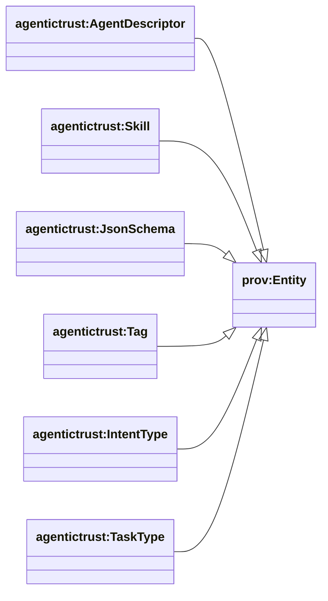
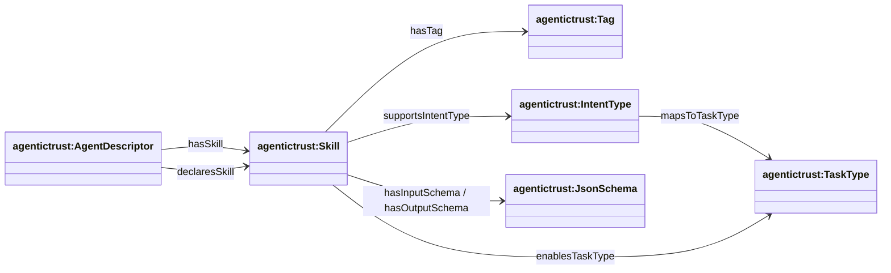

## OASF mapping (skills + discovery)

This page maps the AgenticTrust ontology to the **Open Agentic Schema Framework (OASF)** and explains how our skills/discovery model mirrors OASF’s goals.

Reference: the OASF repository ([`agntcy/oasf`](https://github.com/agntcy/oasf)) describes OASF as a standardized schema system for agent capabilities/metadata and highlights records annotated with **skills** and **domains**, plus extensibility via **modules**.

### Class hierarchy (AgenticTrust side)



### Relationship diagram (skills “record” shape for discovery)



### Why this matters (aligned goals)

OASF’s published goals emphasize:

- **Interoperability**: a common structure for describing agent capabilities and metadata
- **Discovery**: consistent announcement and searching via **skills** and **domains**
- **Extensibility**: modular extensions without breaking the core
- **Schema validation + versioning**: predictable evolution of the vocabulary

AgenticTrust adopts these same goals, but expressed as an OWL/RDF ontology so the `agentictrust.io` knowledge base can query across registries and protocols using a normalized graph.

### Diagram: OASF → AgenticTrust mapping


### Concept mapping (OASF → AgenticTrust)

- **OASF Record**
  - **Meaning in OASF**: the primary structured data object used for content representation and metadata
  - **AgenticTrust mapping**:
    - `agentictrust:AgentDescriptor` (agent-level descriptor) and `agentictrust:ProtocolDescriptor` (protocol-level descriptor; e.g., `agentictrust:A2AProtocolDescriptor`, `agentictrust:MCPProtocolDescriptor`)

- **OASF Skill**
  - **Meaning in OASF**: taxonomy-anchored skill annotation for discovery
  - **AgenticTrust mapping**:
    - `agentictrust:Skill`
    - Skill compatibility routing via `agentictrust:supportsIntentType`

- **OASF Domain**
  - **Meaning in OASF**: domain annotation for discovery / grouping
  - **AgenticTrust mapping** (two useful lenses):
    - `agentictrust:Tag` (lightweight discovery labels on skills)
    - `agentictrust:IntentType` (routing key used by intent-driven discovery)
    - (optional) `agentictrust:TaskType` (work taxonomy behind intent types)

- **OASF Module**
  - **Meaning in OASF**: modular extensibility mechanism (additional structured data)
  - **AgenticTrust mapping**:
    - `agentictrust:JsonSchema` as a concrete “module-like” payload describing skill I/O
    - Linked via `agentictrust:hasInputSchema` / `agentictrust:hasOutputSchema`

### How our ontology “reflects OASF” in discovery

The core discovery loop is directly compatible with OASF’s “records annotated with skills/domains” idea:

- **Intent drives discovery**:
  - `agentictrust:IntentType` is the primary routing key
- **Agents advertise skills**:
  - `AgentCard → Skill` (`agentictrust:hasSkill`)
  - `AgentDescriptor → Skill` (`agentictrust:declaresSkill`)
- **Skills advertise their I/O contract** (schema validation):
  - `Skill → JsonSchema` (`agentictrust:hasInputSchema` / `agentictrust:hasOutputSchema`)
- **Skills advertise domains/taxonomy**:
  - `Skill → Tag` (`agentictrust:hasTag`)
  - `Skill → IntentType` (`agentictrust:supportsIntentType`)

### Where AGNTCY / OASF can plug in next

If you want an even tighter alignment, we can:

- Introduce explicit `agentictrust:Domain` and map OASF domains 1:1 (instead of using Tag/IntentType as the domain lenses)
- Import or mirror the OASF skills taxonomy as individuals under `agentictrust:Tag`/`agentictrust:IntentType` (or a new `agentictrust:SkillCategory`)
- Model "modules" more explicitly as `agentictrust:Module` entities attached to metadata/agent cards

## How OASF Works

### OASF Information Model

OASF (Open Agentic Schema Framework) provides a standardized schema system for describing agent capabilities and metadata. The framework is built around a core information model:

#### Core Components

1. **Records**: The primary structured data objects
   - Contain metadata and content
   - Annotated with skills and domains
   - Extensible via modules

2. **Skills**: Taxonomy-anchored capability annotations
   - Used for discovery and routing
   - Linked to intent types and task types
   - Have input/output schemas

3. **Domains**: Categorization and grouping mechanism
   - Used for discovery filtering
   - Can be represented as Tags or IntentTypes in AgenticTrust

4. **Modules**: Extensible structured data
   - Additional metadata beyond core schema
   - Schema-validated via JSON Schema
   - Versioned and evolvable

### OASF Discovery Flow

```
User Intent
    ↓
IntentType (routing key)
    ↓
TaskType (work taxonomy)
    ↓
Skill (capability match)
    ↓
AgentDescriptor (agent with skill)
    ↓
Agent (executable agent)
```

### OASF Record Structure (in AgenticTrust terms)

An OASF record maps to our ontology as:

```
AgentDescriptor (OASF Record)
  ├─ hasSkill / declaresSkill → Skill (OASF Skill)
  │   ├─ hasInputSchema → JsonSchema (OASF Module)
  │   ├─ hasOutputSchema → JsonSchema (OASF Module)
  │   ├─ hasTag → Tag (OASF Domain - lightweight)
  │   ├─ supportsIntentType → IntentType (OASF Domain - routing)
  │   └─ enablesTaskType → TaskType (work taxonomy)
  └─ hasEndpoint → Endpoint (protocol bindings)
```

### OASF Schema Validation

OASF emphasizes schema validation and versioning:

- **Input/Output Schemas**: Each skill has JSON Schema definitions
  - `agentictrust:hasInputSchema` → `agentictrust:JsonSchema`
  - `agentictrust:hasOutputSchema` → `agentictrust:JsonSchema`
- **Versioning**: Endpoints and protocols have version information
  - `agentictrust:AgentEndpoint` has version metadata
- **Extensibility**: Modules can be added without breaking core schema
  - `agentictrust:JsonSchema` acts as module payloads

### OASF Interoperability Goals

OASF's interoperability goals align with AgenticTrust:

1. **Common Structure**: Both use structured descriptors (OASF Records → AgentDescriptor)
2. **Discovery**: Both support skill/domain-based discovery
3. **Schema Validation**: Both use JSON Schema for I/O validation
4. **Extensibility**: Both support modular extensions
5. **Versioning**: Both support schema evolution

### SPARQL Query: OASF-Aligned Skill Discovery

This query demonstrates OASF-style discovery: find agents with skills matching an intent type:

```sparql
PREFIX agentictrust: <https://www.agentictrust.io/ontology/agentictrust-core#>
PREFIX rdfs: <http://www.w3.org/2000/01/rdf-schema#>

SELECT ?agent ?agentId ?agentName ?skill ?skillLabel ?intentType ?intentTypeLabel ?tag
WHERE {
  ?agent a agentictrust:AIAgent ;
    agentictrust:agentId ?agentId ;
    agentictrust:hasAgentDescriptor ?agentDescriptor .
  
  OPTIONAL {
    ?agent agentictrust:agentName ?agentName .
  }
  
  ?agentDescriptor a agentictrust:AgentDescriptor .
  
  {
    ?agentDescriptor agentictrust:hasSkill ?skill .
  }
  UNION
  {
    ?agentDescriptor agentictrust:declaresSkill ?skill .
  }
  
  ?skill a agentictrust:Skill .
  
  OPTIONAL {
    ?skill rdfs:label ?skillLabel .
  }
  
  # OASF Domain: IntentType (routing key)
  OPTIONAL {
    ?skill agentictrust:supportsIntentType ?intentType .
    ?intentType a agentictrust:IntentType .
    
    OPTIONAL {
      ?intentType rdfs:label ?intentTypeLabel .
    }
  }
  
  # OASF Domain: Tag (lightweight categorization)
  OPTIONAL {
    ?skill agentictrust:hasTag ?tag .
    ?tag a agentictrust:Tag .
  }
}
ORDER BY ?agent ?skill
LIMIT 100
```

### SPARQL Query: OASF Module (JsonSchema) Details

This query shows OASF module information (JSON Schema) for skills:

```sparql
PREFIX agentictrust: <https://www.agentictrust.io/ontology/agentictrust-core#>
PREFIX rdfs: <http://www.w3.org/2000/01/rdf-schema#>

SELECT ?skill ?skillLabel ?inputSchema ?outputSchema
WHERE {
  ?skill a agentictrust:Skill .
  
  OPTIONAL {
    ?skill rdfs:label ?skillLabel .
  }
  
  # OASF Module: Input Schema
  OPTIONAL {
    ?skill agentictrust:hasInputSchema ?inputSchema .
    ?inputSchema a agentictrust:JsonSchema .
  }
  
  # OASF Module: Output Schema
  OPTIONAL {
    ?skill agentictrust:hasOutputSchema ?outputSchema .
    ?outputSchema a agentictrust:JsonSchema .
  }
}
LIMIT 50
```

### SPARQL Query: OASF Record (AgentDescriptor) with Full Metadata

This query retrieves a complete OASF-style record with all annotations:

```sparql
PREFIX agentictrust: <https://www.agentictrust.io/ontology/agentictrust-core#>
PREFIX rdfs: <http://www.w3.org/2000/01/rdf-schema#>

SELECT ?agent ?agentId ?agentName ?descriptor ?skill ?skillLabel 
       ?intentType ?tag ?taskType ?endpoint
WHERE {
  ?agent a agentictrust:AIAgent ;
    agentictrust:agentId ?agentId ;
    agentictrust:hasAgentDescriptor ?descriptor .
  
  OPTIONAL {
    ?agent agentictrust:agentName ?agentName .
  }
  
  ?descriptor a agentictrust:AgentDescriptor .
  
  # OASF Skill
  OPTIONAL {
    {
      ?descriptor agentictrust:hasSkill ?skill .
    }
    UNION
    {
      ?descriptor agentictrust:declaresSkill ?skill .
    }
    
    ?skill a agentictrust:Skill .
    
    OPTIONAL {
      ?skill rdfs:label ?skillLabel .
    }
    
    # OASF Domain: IntentType
    OPTIONAL {
      ?skill agentictrust:supportsIntentType ?intentType .
    }
    
    # OASF Domain: Tag
    OPTIONAL {
      ?skill agentictrust:hasTag ?tag .
    }
    
    # Task Type
    OPTIONAL {
      ?skill agentictrust:enablesTaskType ?taskType .
    }
  }
  
  # Endpoint (protocol bindings)
  OPTIONAL {
    ?descriptor agentictrust:hasEndpoint ?endpoint .
    ?endpoint a agentictrust:AgentEndpoint .
  }
}
LIMIT 50
```


