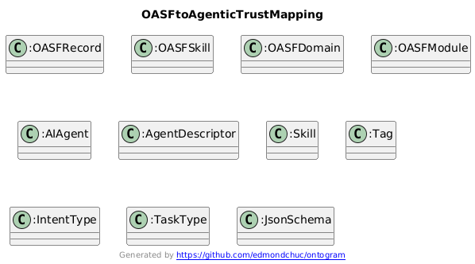

## OASF mapping (skills + discovery)

This page maps the AgenticTrust ontology to the **Open Agentic Schema Framework (OASF)** and explains how our skills/discovery model mirrors OASF’s goals.

Reference: the OASF repository ([`agntcy/oasf`](https://github.com/agntcy/oasf)) describes OASF as a standardized schema system for agent capabilities/metadata and highlights records annotated with **skills** and **domains**, plus extensibility via **modules**.

### Why this matters (aligned goals)

OASF’s published goals emphasize:

- **Interoperability**: a common structure for describing agent capabilities and metadata
- **Discovery**: consistent announcement and searching via **skills** and **domains**
- **Extensibility**: modular extensions without breaking the core
- **Schema validation + versioning**: predictable evolution of the vocabulary

AgenticTrust adopts these same goals, but expressed as an OWL/RDF ontology so the `agentictrust.io` knowledge base can query across registries and protocols using a normalized graph.

### Diagram: OASF → AgenticTrust mapping

### Concept mapping (OASF → AgenticTrust)

- **OASF Record**
  - **Meaning in OASF**: the primary structured data object used for content representation and metadata
  - **AgenticTrust mapping**:
    - `agentictrust:AgentMetadata` (offchain metadata “record”)
    - `agentictrust:AgentDescriptor` (protocol capability “record”; e.g., `agentictrust:A2AAgentCard`, `agentictrust:MCPManifest`)

- **OASF Skill**
  - **Meaning in OASF**: taxonomy-anchored skill annotation for discovery
  - **AgenticTrust mapping**:
    - `agentictrust:Skill`
    - Skill compatibility routing via `agentictrust:supportsIntentType`

- **OASF Domain**
  - **Meaning in OASF**: domain annotation for discovery / grouping
  - **AgenticTrust mapping** (two useful lenses):
    - `agentictrust:Tag` (lightweight discovery labels on skills)
    - `agentictrust:IntentType` (routing key used by intent-driven discovery)
    - (optional) `agentictrust:TaskType` (work taxonomy behind intent types)

- **OASF Module**
  - **Meaning in OASF**: modular extensibility mechanism (additional structured data)
  - **AgenticTrust mapping**:
    - `agentictrust:JsonSchema` as a concrete “module-like” payload describing skill I/O
    - Linked via `agentictrust:hasInputSchema` / `agentictrust:hasOutputSchema`

### How our ontology “reflects OASF” in discovery

The core discovery loop is directly compatible with OASF’s “records annotated with skills/domains” idea:

- **Intent drives discovery**:
  - `agentictrust:IntentType` is the primary routing key
- **Agents advertise skills**:
  - `AgentCard → Skill` (`agentictrust:hasSkill`)
  - `AgentMetadata → Skill` (`agentictrust:declaresSkill`)
- **Skills advertise their I/O contract** (schema validation):
  - `Skill → JsonSchema` (`agentictrust:hasInputSchema` / `agentictrust:hasOutputSchema`)
- **Skills advertise domains/taxonomy**:
  - `Skill → Tag` (`agentictrust:hasTag`)
  - `Skill → IntentType` (`agentictrust:supportsIntentType`)

### Where AGNTCY / OASF can plug in next

If you want an even tighter alignment, we can:

- Introduce explicit `agentictrust:Domain` and map OASF domains 1:1 (instead of using Tag/IntentType as the domain lenses)
- Import or mirror the OASF skills taxonomy as individuals under `agentictrust:Tag`/`agentictrust:IntentType` (or a new `agentictrust:SkillCategory`)
- Model “modules” more explicitly as `agentictrust:Module` entities attached to metadata/agent cards

