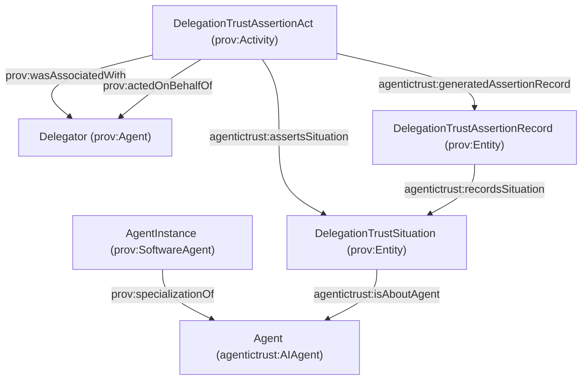
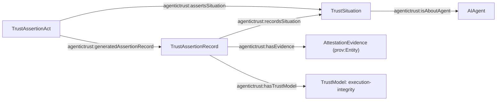

# OpenID Connect for Agents (OIDC-A) and AgenticTrust ontology mapping

## What is OIDC-A?

**OpenID Connect for Agents (OIDC-A)** is a proposal to extend OpenID Connect (OIDC) so that **LLM-based agents** can be represented, authenticated, and authorized using familiar OAuth2/OIDC machinery. It emphasizes:

- **Agent identity claims** (type, model, provider, instance identity)
- **Delegation chains** (who delegated what authority to whom, and why)
- **Attestation** (evidence about integrity/origin; e.g., TEE quotes, zk proofs)
- **Capability-based authorization** (fine-grained permissions based on agent attributes)

## How AgenticTrust splits “agent” concepts (ephemeral vs durable)

AgenticTrust intentionally separates:

- **Ephemeral agent instance** (OIDC-A: `agent_instance_id`): the runtime/session/execution identity.
- **Durable AI agent application**: the stable software-agent identity that is deployed at protocol endpoints and versioned.

In ontology terms:

- **Agent application**: `agentictrust:AIAgentApplication` (subclass of `agentictrust:AIAgent`, `prov:SoftwareAgent`)
- **Agent instance**: `agentictrust:AgentInstance` (subclass of `prov:SoftwareAgent`) linked to its durable application via `prov:specializationOf`

See also: [`agent-application.md`](./agent-application.md).

## Agent identity is registry-scoped

OIDC-A identity claims often refer to an identity anchored in some authority. AgenticTrust models **AgentIdentity as a prov:Entity in the context of registries**, and links it to the Agent via:

- `agentictrust:hasIdentity` (Agent → AgentIdentity)
- `agentictrust:identityRegistry` (AgentIdentity → AgentIdentityRegistry)

See also: [`identity.md`](./identity.md).

## Primary references (links)

- **OIDC-A proposal (GitHub)**: `https://github.com/subramanya1997/oidc-a`
- **arXiv paper**: `https://arxiv.org/pdf/2509.25974`
- **OpenID Foundation paper**: `https://openid.net/wp-content/uploads/2025/10/Identity-Management-for-Agentic-AI.pdf`

## Vocabulary comparison: OIDC-A vs AgenticTrust

OIDC-A is a **protocol + claim vocabulary**; AgenticTrust is a **knowledge/ontology model** meant to represent agents, identities, descriptors, and trust evidence (verification, reputation, relationships) as a graph.

### Quick mapping table (suggested)

| OIDC-A concept / claim | Meaning | AgenticTrust representation (today) | Suggested alignment |
|---|---|---|---|
| `agent_type` | class/category of agent | `agentictrust:AIAgent` + optional tags | Use `agentictrust:hasAgentTypeTag` (Agent → Tag) and/or descriptor taxonomy (`agentictrust:metadataAgentCategory`) |
| `agent_model` | base model family | Not a first-class field | Add `agentictrust:modelId` (datatype) on a descriptor, or model as a `prov:Entity` “Model” and link with `agentictrust:usesModel` |
| `agent_version` | model/version identifier | Not a first-class field | Add `agentictrust:modelVersion` on descriptor; optionally link to a `SoftwareRelease` entity |
| `agent_provider` | org that provides/hosts agent | Provider modeled as `agentictrust:Organization` | Use `agentictrust:agentProvider` (Application → Organization) and/or `agentictrust:agentProviderValue` (descriptor string) |
| `agent_instance_id` / instance | runtime instance identity | AgenticTrust generally models durable agents, not ephemeral instances | Introduce `agentictrust:AgentInstance` (subclass of `prov:SoftwareAgent`) and link to the durable `AIAgent` via `prov:specializationOf` |
| `agent_capabilities` | declared capabilities | Protocol-first: skills/domains mostly live on protocol descriptor; also OASF | Treat capabilities as **skills** (OASF ids) on protocol descriptors; define a mapping layer from capability ids → OASF skill ids |
| `agent_attestation` | integrity evidence / attestation token | Trust-model taxonomy exists; RDF exporter maps trust models | Represent attestation evidence as an `agentictrust:TrustAssertionRecord` with `agentictrust:trustModel = execution-integrity` and link to an evidence entity/URI |
| `attestation_formats_supported` | supported attestation formats | Not a first-class field | Add to protocol descriptor metadata (`agentictrust:attestationFormatValue`), or a controlled-vocab node list |
| `delegator_sub` | delegator identity | AgenticTrust can model accounts/identifiers; assertions already use `agentictrust:assertedBy` patterns | Model delegator as a `prov:Agent` (Account or Person). Link delegation act via `prov:wasAssociatedWith` + `prov:actedOnBehalfOf` |
| `delegation_chain[]` | chain of delegation steps | Not first-class; we do model situations + assertion acts + records | Introduce a `agentictrust:DelegationSituation` + `agentictrust:DelegationAssertionAct` + `agentictrust:DelegationRecord` pattern, aligned with existing TrustAssertion pattern |
| `delegation_purpose` | why delegated | DnS pattern: IntentType / SituationDescription | Represent as `agentictrust:satisfiesIntent` on the delegation situation; optionally store raw JSON |
| `agent_attestation_endpoint` | endpoint to validate evidence | Endpoints/protocol descriptors exist | Add endpoint type for “attestation verification”; link to a protocol/service endpoint node |
| `agent_capabilities_endpoint` | endpoint to discover capabilities | Protocol descriptors exist | Treat this as a protocol endpoint; map discovered capabilities into protocol descriptor skills/domains |

## Suggested modeling updates (ontology-level)

Based on OIDC-A language, the following additions tend to fit AgenticTrust patterns well:

1. **Agent instance vs agent (durable identity)**
   - Add `agentictrust:AgentInstance` and connect to the durable `agentictrust:AIAgentApplication` using `prov:specializationOf`.

2. **Delegation as a first-class trust process**
   - `agentictrust:DelegationTrustSituation` ⊑ `agentictrust:TrustSituation` (prov:Entity)
   - `agentictrust:DelegationTrustAssertionAct` ⊑ `agentictrust:TrustAssertionAct` (prov:Activity)
   - `agentictrust:DelegationTrustAssertionRecord` ⊑ `agentictrust:TrustAssertion` (prov:Entity)
   - Reuse PROV:
     - `prov:actedOnBehalfOf` (delegatee → delegator; PROV-native)
     - `agentictrust:delegatedBy` (delegator → delegatee; convenience inverse)

3. **Attestation evidence as evidence objects**
   - Create `agentictrust:AttestationEvidence` (prov:Entity) and link it from assertion records.
   - Reuse the existing trust model taxonomy: map attestation to **execution-integrity**.

4. **Capability vocabulary alignment**
   - Prefer mapping OIDC-A capabilities onto **OASF** (skills/domains), stored on protocol descriptors (A2A/MCP).
   - Add a lightweight mapping table/document: “capability id → OASF skill id”, especially if implementers use vendor-prefixed ids.

## Diagrams

### Delegation chain as trust situations + assertion acts



### SPARQL: delegation situations and their delegation links

```sparql
PREFIX prov: <http://www.w3.org/ns/prov#>
PREFIX agentictrust: <https://www.agentictrust.io/ontology/agentictrust-core#>

SELECT ?situation ?assertionAct ?assertionRecord ?delegatee ?delegator
WHERE {
  ?situation a agentictrust:DelegationTrustSituation .
  OPTIONAL {
    ?assertionAct a agentictrust:DelegationTrustAssertionAct ;
      agentictrust:assertsSituation ?situation ;
      agentictrust:generatedAssertionRecord ?assertionRecord .
  }
  # Delegation links (either direction)
  OPTIONAL { ?delegatee prov:actedOnBehalfOf ?delegator . }
  OPTIONAL { ?delegator agentictrust:delegatedBy ?delegatee . }
}
LIMIT 200
```

### Attestation as execution-integrity trust evidence



## Practical guidance for AgenticTrust implementers

- Treat OIDC-A claims as **inputs** to build graph nodes:
  - token claims → descriptor facts (who/what the agent is)
  - delegation_chain → delegation situations + assertion records
  - agent_attestation → execution-integrity evidence + verification assertions
- Keep the raw token/attestation JSON available on the record node (`agentictrust:json`) for auditability.

